# Compose 体系构建流程分析

## 传统 View 体系 setContent 
虽然`Compose`和传统 View 是两套体系，但在 Android 上仍然需要从传统 View 作为容器开始构造 `Compose` 体系。使用`Compose`的第一步就是调用Activity的`setContent`方法，所以我们从它入手开始分析，了解整体的结构。

### Activity.setContent 流程
`setContent`方法是`ComponentActivity`的扩展方法，流程如下：
```kotlin
public fun ComponentActivity.setContent(
    parent: CompositionContext? = null,
    content: @Composable () -> Unit
) {
    // 1. 先从 android.R.id.content 中获取当前的 ComposeView

    val existingComposeView = window.decorView
        .findViewById<ViewGroup>(android.R.id.content)
        .getChildAt(0) as? ComposeView

    if (existingComposeView != null) with(existingComposeView) {

        // 2.1 如果存在，就只设置 ParentCompositionContext，和 Compose content（也就是 Composable 函数）

        setParentCompositionContext(parent)
        setContent(content)
    } else ComposeView(this).apply {

        // 2.2.1 如果不存在，就先创建一个新的 ComposeView，并设置 ParentCompositionContext 和 Composable 函数

        setParentCompositionContext(parent)
        setContent(content)
        
        // 给 DecorView 设置 ViewTreeLifecycleOwner、ViewModelStoreOwner 等，和 Compose 关系不大
        setOwners()

        // 2.2.2 设置 ContentView，这个和传统的View使用方式一样，只是这里传入的 view 的类型是 ComposeView

        setContentView(this, DefaultActivityContentLayoutParams)
    }
}
```
核心就是创建 `ComposeView`，并且设置到 Activity 的 DecorView 体系中，这和传统 View 一样，需要关注的是调用了 `ComposeView` 的 `setContent` 方法，这个方法传入了我们编写的`@Composable`函数，所以它就是用来设置`Compose`的 UI 内容的。

`ComposeView`是一个自定义ViewGroup，它的继承关系如下：
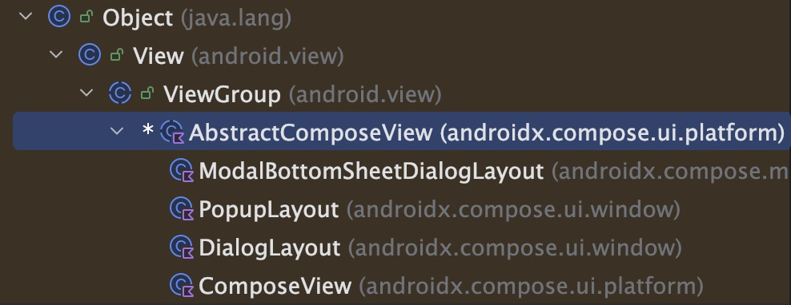

### ComposeView.setContent
接着看`ComposeView`的`setContent`方法中做了什么：
```kotlin
// ComposeView.kt

private val content = mutableStateOf<(@Composable () -> Unit)?>(null)

fun setContent(content: @Composable () -> Unit) {

    // 设置标记位，表示应该在 onOnAttachedToWindow 时创建 Composition
    shouldCreateCompositionOnAttachedToWindow = true

    // 保存 @Composable 函数
    this.content.value = content
    if (isAttachedToWindow) {
        createComposition() // 实际就是调用 ensureCompositionCreated()
    }
}
```
因为调用 ComposeView 的 `setContent` 是在 `onCreate`，所以这里还不会调用到`ensureCompositionCreated()`，继续看父类中`onAttachedToWindow()`时机：
```kotlin
// AbstractComposeView.kt

override fun onAttachedToWindow() {
    super.onAttachedToWindow()

    previousAttachedWindowToken = windowToken

    if (shouldCreateCompositionOnAttachedToWindow) {
        ensureCompositionCreated()
    }
}

private fun ensureCompositionCreated() {
    if (composition == null) { // 首次调用为 null，所以会继续执行内部逻辑
        try {
            creatingComposition = true
            // 核心代码位置（实际传入的就是 Recomposer ）
            composition = setContent(resolveParentCompositionContext()) {
                // 执行 @Composable 函数
                Content()
            }
        } finally {
            creatingComposition = false
        }
    }
}
```
`ensureCompositionCreated()`内调用的 `setContent` 是`AbstractComposeView`类的扩展函数：
```kotlin
internal fun AbstractComposeView.setContent(
    parent: CompositionContext, // 传入的是 Recomposer
    content: @Composable () -> Unit,
): Composition {
    // 感知Compose中的State值的变化，通过Recomposer触发重组，来刷新页面。
    GlobalSnapshotManager.ensureStarted()

    // 添加 AndroidComposeView 作为 ComposeView 的子级
    val composeView =
        if (childCount > 0) {
            getChildAt(0) as? AndroidComposeView
        } else {
            removeAllViews()
            null
        }
            ?: AndroidComposeView(context, parent.effectCoroutineContext).also {
                addView(it.view, DefaultLayoutParams)
            }
    // 执行 doSetContent 方法
    return doSetContent(composeView, parent, content)
}

private fun doSetContent(
    owner: AndroidComposeView,
    parent: CompositionContext,
    content: @Composable () -> Unit,
): Composition {
    // ...

    // 创建 Composition，传入了 UiApplier 和 Recomposer
    val original = Composition(UiApplier(owner.root), parent)
    // 创建 WrappedComposition
    val wrapped = owner.view.getTag(R.id.wrapped_composition_tag)
        as? WrappedComposition
        ?: WrappedComposition(owner, original).also {
            owner.view.setTag(R.id.wrapped_composition_tag, it)
        }
    // 调用 WrappedComposition 的 setContent 方法
    wrapped.setContent(content)

    if (owner.coroutineContext != parent.effectCoroutineContext) {
        owner.coroutineContext = parent.effectCoroutineContext
    }

    return wrapped
}
```
这里的核心就是创建了`AndroidComposeView`、`Composition（UiApplier， Recomposer）`和`WrappedComposition`，调用 `WrappedComposition` 的 `setContent` 方法

## 进入 Compose 体系 setContent
从 `WrappedComposition` 开始就进入 `Compose` 的流程

### WrappedComposition.setContent
`WrappedComposition` 的主要功能还是调用 `CompositionImpl.setContent` ，只不过会添加一些调试功能、提供上下文的`CompositionLocal。`

```kotlin
private class WrappedComposition(val owner: AndroidComposeView, val original: Composition) :
    Composition, LifecycleEventObserver, CompositionServices {

    private var disposed = false
    private var addedToLifecycle: Lifecycle? = null
    private var lastContent: @Composable () -> Unit = {}

    override fun setContent(content: @Composable () -> Unit) {
        owner.setOnViewTreeOwnersAvailable {
            if (!disposed) {
                val lifecycle = it.lifecycleOwner.lifecycle
                lastContent = content
                if (addedToLifecycle == null) {
                    addedToLifecycle = lifecycle
                    lifecycle.addObserver(this)
                } else if (lifecycle.currentState.isAtLeast(Lifecycle.State.CREATED)) {

                    // ‼️核心：调用 Composition 的 setContent 方法，设置 Composable 内容

                    original.setContent {

                        // 1. 创建 MutableSet<CompositionData> （用于开发工具和调试器）
                        val inspectionTable =
                            owner.getTag(R.id.inspection_slot_table_set)
                                as? MutableSet<CompositionData>
                                ?: (owner.parent as? View)?.getTag(R.id.inspection_slot_table_set)
                                    as? MutableSet<CompositionData>
                        if (inspectionTable != null) {
                            
                            // 2. 添加当前 currentComposer 的 compositionData 到 MutableSet<CompositionData> 中
                            inspectionTable.add(currentComposer.compositionData)
                            currentComposer.collectParameterInformation() // 调试信息相关
                        }

                        // 3. 处理无障碍服务的边界更新事件循环、处理内容捕获的边界更新事件循环
                        LaunchedEffect(owner) { owner.boundsUpdatesAccessibilityEventLoop() }
                        LaunchedEffect(owner) { owner.boundsUpdatesContentCaptureEventLoop() }

                        // 4. 提供上下文的 CompositionLocal，比如 LocalContext
                        CompositionLocalProvider(LocalInspectionTables provides inspectionTable) {
                            ProvideAndroidCompositionLocals(owner, content)
                        }
                    }
                }
            }
        }
    }

    // ...

}
```

### CompositionImpl
`WrappedComposition`中调用了`CompositionImpl.setContent`方法，这里才是实际的`Compose`的重点流程
```kotlin
internal class CompositionImpl(
    private val parent: CompositionContext,
    private val applier: Applier<*>,
    recomposeContext: CoroutineContext? = null
) : ControlledComposition, ReusableComposition, RecomposeScopeOwner, CompositionServices {

    // SlotTable 用于存储重组所需的组合信息
    internal val slotTable = SlotTable().also {
        if (parent.collectingCallByInformation) it.collectCalledByInformation()
        if (parent.collectingSourceInformation) it.collectSourceInformation()
    }

    // 持有 ComposerImpl 对象
    private val composer: ComposerImpl =
        ComposerImpl(
            applier = applier,
            parentContext = parent,
            slotTable = slotTable,
            abandonSet = abandonSet,
            changes = changes,
            lateChanges = lateChanges,
            composition = this
        ).also {
            parent.registerComposer(it)
        }

    // ‼️ 执行 setContent 方法
    override fun setContent(content: @Composable () -> Unit) {
        composeInitial(content)
    }

    private fun composeInitial(content: @Composable () -> Unit) {
        checkPrecondition(!disposed) { "The composition is disposed" }
        this.composable = content
        // 重点是调用 Recomposer 的 composeInitial 方法
        parent.composeInitial(this, composable)
    }

    // Recomposer 会调用这个 composeContent 方法
    override fun composeContent(content: @Composable () -> Unit) {
        guardChanges {
            synchronized(lock) {
                drainPendingModificationsForCompositionLocked()
                guardInvalidationsLocked { invalidations ->
                    val observer = observer()
                    if (observer != null) {
                        @Suppress("UNCHECKED_CAST")
                        observer.onBeginComposition(
                            this,
                            invalidations.asMap() as Map<RecomposeScope, Set<Any>?>
                        )
                    }
                    composer.composeContent(invalidations, content)
                    observer?.onEndComposition(this)
                }
            }
        }
    }
}
```

### Recomposer（也就是CompositionContext）

```kotlin
class Recomposer(
    effectCoroutineContext: CoroutineContext
) : CompositionContext() {

    internal override fun composeInitial(
        composition: ControlledComposition, // 传入的是 CompositionImpl 对象
        content: @Composable () -> Unit
    ) {

        // 1. 记录组合是否已经在进行中，用于区分首次组合和重新组合
        val composerWasComposing = composition.isComposing

        / 2. 核心组合执行
        try {
            // 创建一个可变快照环境
            composing(composition, null) {
                // 实际执行 @Composable 函数：创建组合树结构、执行所有 @Composable 函数、建立状态依赖关系、处理副作用
                composition.composeContent(content)
            }
        } catch (e: Exception) {
            processCompositionError(e, composition, recoverable = true)
            return
        }

        // 3. 如果是首次组合，通知快照系统对象已初始化，确保后续的状态变更能够被正确追踪
        if (!composerWasComposing) {
            Snapshot.notifyObjectsInitialized()
        }

        // 4. 将新创建的组合添加到 Recomposer 的已知组合列表中，让 Recomposer 能够追踪和管理所有组合
        synchronized(stateLock) {
            if (_state.value > State.ShuttingDown) {
                if (composition !in knownCompositions) {
                    addKnownCompositionLocked(composition)
                }
            }
        }

        // 5. 处理 movableContentOf 相关的内容，这是 Compose 优化重用的重要机制
        try {
            performInitialMovableContentInserts(composition)
        } catch (e: Exception) {
            processCompositionError(e, composition, recoverable = true)
            return
        }

        // 6. 应用组合产生的变更，将虚拟的组合树变更应用到实际的 UI 树
        try {
            composition.applyChanges() // 应用组合过程中产生的所有变更
            composition.applyLateChanges() // 处理延迟应用的变更
        } catch (e: Exception) {
            processCompositionError(e)
            return
        }

        // 7. 再次通知快照系统，确保所有在 applyChanges 阶段创建的对象也被正确初始化
        if (!composerWasComposing) {
            Snapshot.notifyObjectsInitialized()
        }
    }
}
```


## ComposerImpl 执行 @Composable 函数
最终调用到 `ComposerImpl` 执行组合流程
```kotlin
internal class ComposerImpl(...) : Composer {

    internal fun composeContent(
        invalidationsRequested: ScopeMap<RecomposeScopeImpl, Any>,
        content: @Composable () -> Unit
    ) {
        doCompose(invalidationsRequested, content)
    }

    private fun doCompose(
        invalidationsRequested: ScopeMap<RecomposeScopeImpl, Any>,
        content: (@Composable () -> Unit)?
    ) {
        runtimeCheck(!isComposing) { "Reentrant composition is not supported" }
        trace("Compose:recompose") {
            // 1. 初始化阶段，设置当前快照 ID 为 compositionToken
            compositionToken = currentSnapshot().id
            providerUpdates = null

            // 2. 处理请求的失效作用域
            // 遍历请求的失效作用域
            invalidationsRequested.map.forEach { scope, instances ->
                scope as RecomposeScopeImpl
                val location = scope.anchor?.location ?: return@forEach
                // 添加到 invalidations 中
                invalidations.add(
                    Invalidation(
                        scope,
                        location,
                        instances.takeUnless { it === ScopeInvalidated }
                    )
                )
            }
            invalidations.sortWith(InvalidationLocationAscending)
            nodeIndex = 0

            // 3. 组合执行阶段
            var complete = false
            isComposing = true // 设置组合状态为进行中
            try {
                startRoot() // 开始根组合

                // 4. 内容处理逻辑
                val savedContent = nextSlot()
                if (savedContent !== content && content != null) {
                    // 如果传入的新内容与保存的内容不同，则更新插槽值
                    updateValue(content as Any?)
                }

                // 5. 实际组合执行（忽略派生状态重计算）
                observeDerivedStateRecalculations(derivedStateObserver) {
                    if (content != null) {
                        startGroup(invocationKey, invocation)

                        // 执行 @Composable 函数
                        invokeComposable(this, content)
                        endGroup()
                    } else ... // 省略非正常流程
                }
                endRoot() // 结束根组合
                complete = true
            } finally {
                // 6. 清理阶段
                isComposing = false // 重置组合状态
                invalidations.clear() // 清空失效作用域列表
                if (!complete) abortRoot() // 如果未完成，中止组合
                createFreshInsertTable() // 创建新的插入表
            }
        }
    }
}
```

## Compose 体系构建总结
`setContent`流程图如下：
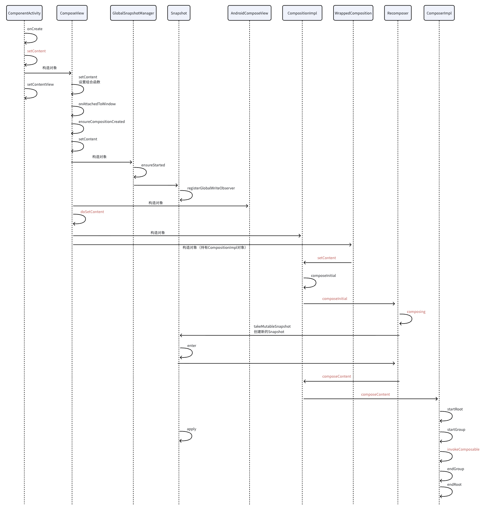

构建的结构图如下：
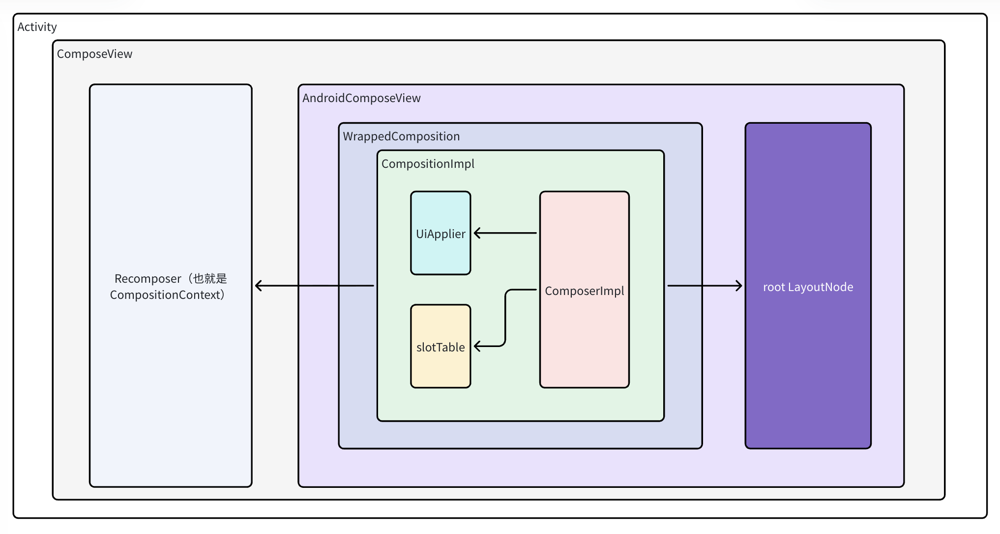

# @Composable 函数代码转换
`@Composable`函数会被 Kotlin 的编译器插件转换，增加`$composer`、`$changed`参数，并且插入一些代码，和 Kotlin 协程中对 `suspend` 函数的处理类似。

我们编写一个实际的原始代码：
```kotlin
@Composable
fun MyTimer() {
    var count by remember { mutableStateOf(0) }
    Button(onClick = { count++ }) { Text("Count:  $count") }
}
```

查看反编译后的Java代码如下：
```
@FunctionKeyMeta(
    key = -469404227,
    startOffset = 3246,
    endOffset = 3384
)
@Composable
@ComposableTarget(
    applier = "androidx.compose.ui.UiComposable"
)
public final void MyTimer(@Nullable Composer $composer, int $changed) {
    // 每个Composable函数都会创建一个"restart group"，
    $composer = $composer.startRestartGroup(-469404227);
    
    if (($changed & 1) == 0 && $composer.getSkipping()) {
        $composer.skipToGroupEnd();
    } else {
        
        // 1. ------- remember { mutableStateOf(0) } 流程 -------------------------
        
        int $i$f$remember = 0;

        // remember 是内联函数，所以这里会看到它内部的代码放在了这里

        // remember 方法会先调用 composer.rememberedValue() 获取缓存值
        Object it$iv$iv = $composer.rememberedValue();

        Object var10000;

        // 缓存的状态不存在，则要创建
        if (it$iv$iv == Composer.Companion.getEmpty()) {

            // 调用 mutableStateOf 方法
            Object value$iv$iv = SnapshotStateKt.mutableStateOf$default(0, (SnapshotMutationPolicy)null, 2, (Object)null);

            // remember 方法会调用 updateRememberedValue 设置缓存值
            $composer.updateRememberedValue(value$iv$iv);
            var10000 = value$iv$iv;
        } else {

            // 缓存存在则直接赋值
            var10000 = it$iv$iv;
        }

        // 1. end -----------------------------------------------------------------


        // 2. ------- 赋值给 count -------------------------------------------------
        Object var13 = var10000;

        // 状态赋值给 MutableState
        final MutableState count$delegate = (MutableState)var13;

        // 2. end -----------------------------------------------------------------

        // 3. ------- 更新值的函数 会保存到 SlotTable 的 Group 中 ---------------------

        // 所以会调用 composer.startReplaceGroup
        $composer.startReplaceGroup(478463400);

        $i$f$remember = $composer.changed(count$delegate);
        Object it$iv = $composer.rememberedValue();
        if (!$i$f$remember && it$iv != Composer.Companion.getEmpty()) {
            var10000 = it$iv;
        } else {
            // 这个是 { count++ } 生成的函数，这里就不贴它对应的代码了
            Object value$iv = MainActivity::MyTimer$lambda$9$lambda$8;
            $composer.updateRememberedValue(value$iv);
            var10000 = value$iv;
        }

        Function0 $composer$iv = (Function0)var10000;

        // 结束 restart group
        $composer.endReplaceGroup();

        // 3. end ------------------------------------------------------------------

        // 4. 调用 Button ----------------------------------------------------------
        ButtonKt.Button($composer$iv, (Modifier)null, false, (Shape)null, (ButtonColors)null, (ButtonElevation)null, (BorderStroke)null, (PaddingValues)null, (MutableInteractionSource)null, (Function3)
        
        // rememberComposableLambda 就是将传给 Button 的 lambda 通过 remember 保存到 SlotTable 的 Group 中

        ComposableLambdaKt.rememberComposableLambda(1026782637, true, new Function3() {
            @FunctionKeyMeta(
               key = 1026782637,
               startOffset = 3352,
               endOffset = 3378
            )
            @Composable
            @ComposableTarget(
               applier = "androidx.compose.ui.UiComposable"
            )
            public final void invoke(RowScope $this$Button, Composer $composer, int $changed) {

                if (($changed & 81) == 16 && $composer.getSkipping()) {
                    $composer.skipToGroupEnd();
                } else {
                    // 5. 调用 Text --------------------------------------------------
                    TextKt.Text--4IGK_g("Count:  " + MainActivity.MyTimer$lambda$6(count$delegate), ..., $composer, 0, 0, 131070);
                }

            }

            // 
            public Object invoke(Object p1, Object p2, Object p3) {
                this.invoke((RowScope)p1, (Composer)p2, ((Number)p3).intValue());
                return Unit.INSTANCE;
            }
        }, $composer, 54), $composer, 805306368, 510);
        
    }

    // 6. ----------------------------------------------------------------------------
    // 结束 restart group ，返回当前对应的 RecomposeScopeImpl
    ScopeUpdateScope var22 = $composer.endRestartGroup();
    if (var22 != null) {
        // 给当前 RecomposeScopeImpl 设置持有 MyTimer 函数，当状态变化时 Compose 运行时会调用这个函数，只重组 MyTimer
        var22.updateScope(MainActivity::MyTimer$lambda$10);
    }

}

private static final Unit MyTimer$lambda$10(MainActivity $tmp0_rcvr, int $$changed, Composer $composer, int $force) {
      // 调用 MyTimer 函数
      $tmp0_rcvr.MyTimer($composer, RecomposeScopeImplKt.updateChangedFlags($$changed | 1));
      return Unit.INSTANCE;
   }
```

`@Composable` 函数都会直接或间接地调用 `Layout` 方法，用于创建最终用于布局绘制的`LayoutNode`：
```kotlin
@UiComposable
@Composable
inline fun Layout(
    content: @Composable @UiComposable () -> Unit,
    modifier: Modifier = Modifier,
    measurePolicy: MeasurePolicy
) {
    val compositeKeyHash = currentCompositeKeyHash
    val localMap = currentComposer.currentCompositionLocalMap
    val materialized = currentComposer.materialize(modifier)
    ReusableComposeNode<ComposeUiNode, Applier<Any>>(
        factory = ComposeUiNode.Constructor, // 用于创建 LayoutNode
        update = {
            // 更新 Node 节点内容，存储到相应的 Operation
            set(measurePolicy, SetMeasurePolicy)
            set(localMap, SetResolvedCompositionLocals)
            @OptIn(ExperimentalComposeUiApi::class)
            set(compositeKeyHash, SetCompositeKeyHash)
            set(materialized, SetModifier)
        },
        content = content
    )
}

@Composable
inline fun <T : Any?, reified E : Applier<*>> ReusableComposeNode(
    noinline factory: () -> T,
    update: @DisallowComposableCalls Updater<T>.() -> Unit,
    content: @Composable () -> Unit
) {
    if (currentComposer.applier !is E) invalidApplier()
    currentComposer.startReusableNode()
    if (currentComposer.inserting) {
        currentComposer.createNode(factory)
    } else {
        currentComposer.useNode()
    }
    Updater<T>(currentComposer).update()
    content()
    currentComposer.endNode()
}   
```
我们可以看到`Composer`、`Snapshot`、`rember`、`Group`、`RecomposeScope`、`Node`等代码，但目前还不知道它们具体在干什么，那么下面我们再逐步了解`Compose`中的一些底层概念。

# 底层核心概念
前面的源码流程分析，只是了解了`Compose`在 Android 中的体系结构，但比如`@Composable`函数如何执行实际的布局绘制、修改状态执行重组等具体的工作方式还不清楚，我们先了解一些相关概念，再继续分析。

## GapBuffer算法
假如我们在开发一个文本编辑器，用户不断在光标处插入/删除字符：

* 如果使用数组，在数组中间插入一个字符，需要把后面所有字符向后移动，删除一个字符需要后面所有字符向前移动，时间复杂度都为O(n)。
* `Gap Buffer`的做法是在内存中分配一个比实际内容稍大的连续数组，数组中间留出一段**连续的空隙（gap）**，这个 gap 就是“光标当前位置”，光标在哪，gap 就移动到哪。
  * 插入时，直接把新字符写入 gap 的开头位置，gap 缩小 1 个位置，时间复杂度：O(1)（只是写入一个字符 + 移动 gap 指针）
  * 删除时，直接让 gap 开头或结尾的范围变大，时间复杂度：O(1)（只是移动 gap 指针）
  * 移动光标：需要把 gap 移动到新位置 → 这时要移动数组内容 → O(n)（但在实际编辑中，光标移动通常是局部的，平均成本很低）

`Compose`在`SlotTable`中使用这一数据结构是因为 UI 的结构通常变化较少，大多数情况只是更新数据，使用 `GapBuffer` 利于提升效率。

> 大概了解即可，主要目标还是理解工作流程，而不是这个算法细节。

## SlotTable 和 Group
由于`Compose`是函数声明式 UI 框架，所以`Compose` 不像传统 Android View 那样直接维护一个 View 树，而是在 `Composition`对象中的`SlotTable` 内维护当前的 UI 声明数据状态，`Composable`函数执行过程产生的各种数据都会存入 `SlotTable`，不会随着函数的出栈而消失。

> 前面源码中看到的`Group`、`remenber`、`RecomposeScope`、`Node`其实都会存储到 `SlotTable` 中。

现在就先来具体了解一下 `SlotTable`，它包含 `groups` 和 `slots` 两个数组：
```kotlin
internal class SlotTable : CompositionData, Iterable<CompositionGroup> {

    // 为每个 group 储存了5个元素，相当于是 group 的头信息
    var groups = IntArray(0)

    // 存储每个 group 内的一些具体数据
    var slots = Array<Any?>(0) { null }

    // ...
}
```
> `groups` 和 `slots` 的使用方式就是基于 GapBuffer 算法，所以长度会比实际使用的多，多出的部分就是gap范围；当容量不足时，它们会扩容。


在 `@Composable` 函数实际生成的代码中，我们可以看到有 `startRestartGroup`，`startReplaceGroup`这些代码。实际上，每当调用一个 `@Composable`函数（`remember`函数也是一个`@Composable`函数），就会在`SlotTable`中增加一个 `Group`，在 `groups` 数组中会记录 Group 的 header 信息（5个连续的int）：

1. `Key`：是 Group 在 `SlotTable`中的标识，生成的源码中就可以看到调用Group相关的函数会传入一些奇怪的数字，它们就是key
2. `Group info`：Int 的 Bit 中存储 Group 的描述信息，比如是否是一个 `Node`，可以通过位掩码来获取。具体在下面介绍。
3. `Parent anchor`：parent group 在 `groups` 中的 index 位置
4. `Size`：此 Group 的总大小（当前 Group 和所有后代 Group 的总数量，也就是 1 + 后代Group数量）
5. `Data anchor`：包含的 `slot` 数据在 `slots` 中的起始 index 位置

`Group info`的具体含义：
|位|含义|
|---|---|
|0-25|`node count`：当前 Group 直接包含的 LayoutNode 数量，假设一个二叉树[A(2)[B(1), C(2)[D(1), F(1)[G(1)]]]]，虽然C有2个子节点都是LayoutNode，但对于A来说会将C整体上视为一个LayoutNode，所以A直接包含的LayoutNode数量为A和B，所以是2个|
|26|`Contains Mark`：表示这个 Group 的子树中是否有 Mark_Mask 设置的 Group，用于优化子树遍历，避免递归检查每个子 Group|
|27|`Mark`：一个临时标记位，常用于内部算法如遍历或调试（例如标记已访问的 Group）|
|28|`Aux`：表示 Group 是否有辅助数据，比如 `remember` 的值、`CompositionLocal` 值。也就是标记是否有额外 `slots` 数据，用于快速定位/跳过|
|29|`Object Key`：表示 key 是否是对象类型（非 int key，如字符串或复合 key）。如果设置，key 实际会存放在 slots 的某个位置（通过 shift 偏移计算）。|
|30|`Node Bit`：是否是 node group（是否有 LayoutNode）|


我们可以在断点调试的时候调用`SlotTable.toDebugString()`打印当前的Group结构，和Group对应的Slot数据：
```
androidx.compose.runtime.SlotTable@b6c104b
Group(0) key=100, nodes=1, size=56, slots=[0: {}]
 Group(1) key=1000, nodes=1, size=55, slots=[1: a.c.r.ι.Co]
  Group(2) key=200, nodes=1, size=54 objectKey=κ(key=prov
   Group(3) key=-2000640158, nodes=1, size=53, slots=[3: a.c.r.Reco, a.c.r.ι.Co, a.c.u.plat, λ2<kotlinx, a.c.u.plat, a.c.r.Reme, a.c.u.plat, λ2<kotlinx, a.c.u.plat, a.c.r.Reme, a.c.r.ι.Co]
    Group(4) key=-1350970552, nodes=1, size=52, slots=[14: a.c.r.Reco]
     Group(5) key=201, nodes=1, size=51 objectKey=κ(key=prov, slots=[16: StaticValu]
      Group(6) key=202, nodes=1, size=50 objectKey=κ(key=comp aux={a.c.r.Sta
       Group(7) key=-1193460702, nodes=1, size=49, slots=[19: a.c.r.Reco, a.c.r.ι.Co]
        Group(8) key=1396852028, nodes=1, size=48, slots=[21: a.c.r.Reco, a.c.u.plat, a.c.r.ι.Co, σ(value={1, λ1<android, a.c.u.plat, a.c.u.plat, a.c.u.plat, λ1<a.c.r.D, kotlin.Uni, a.c.r.Reme, a.c.u.res., {1.0 310mc, a.c.u.plat, com.exampl, λ1<a.c.r.D, a.c.u.res., a.c.r.Reme, a.c.u.res., a.c.u.plat, com.exampl, λ1<a.c.r.D, a.c.u.res., a.c.r.Reme, a.c.r.ι.Co]
         Group(9) key=-1390796515, nodes=1, size=47, slots=[46: a.c.r.Reco]
          Group(10) key=201, nodes=1, size=46 objectKey=κ(key=prov
           Group(11) key=204, nodes=0, size=1 objectKey=κ(key=prov, slots=[49: {a.c.r.Sta, {a.c.r.Sta]
           Group(12) key=202, nodes=1, size=44 objectKey=κ(key=comp aux={a.c.r.Sta
            Group(13) key=1471621628, nodes=1, size=43, slots=[53: a.c.r.Reco, a.c.r.ι.Co]
             Group(14) key=874662829, nodes=1, size=42, slots=[55: a.c.r.Reco, a.c.u.plat, a.c.u.plat, a.c.r.ι.Co]
              Group(15) key=-1390796515, nodes=1, size=41, slots=[59: a.c.r.Reco]
               Group(16) key=201, nodes=1, size=40 objectKey=κ(key=prov
                Group(17) key=204, nodes=0, size=1 objectKey=κ(key=prov, slots=[62: {a.c.r.Sta, {a.c.r.Sta]
                Group(18) key=202, nodes=1, size=38 objectKey=κ(key=comp aux={a.c.r.Sta
                 Group(19) key=-656146368, nodes=1, size=37, slots=[66: a.c.r.Reco, a.c.r.ι.Co]
                  Group(20) key=420213850, nodes=1, size=36, slots=[68: a.c.r.Reco, a.c.u.plat]
                   Group(21) key=150107752, nodes=1, size=35
                    Group(22) key=1613159636, nodes=1, size=34, slots=[70: a.c.r.Reco, a.c.r.ι.Co]
                     Group(23) key=-469404227, nodes=1, size=33, slots=[72: a.c.r.Reco, σ(value=0), com.exampl, a.c.r.ι.Co]
                      Group(24) key=650121315, nodes=1, size=32, slots=[76: a.c.r.Reco, a.c.r.ι.Co, a.c.r.ι.Co]
                       Group(25) key=-127, nodes=0, size=1
                       Group(26) key=-239156623, nodes=0, size=1, slots=[79: a.c.founda]
                       Group(27) key=-239150048, nodes=0, size=1, slots=[80: SnapshotSt, a.c.founda, λ2<kotlinx, a.c.founda, a.c.r.Reme, a.c.animat, a.c.animat, 0.0, a.c.materi, null, λ2<kotlinx, 0.0.dp, a.c.r.Reme]
                       Group(28) key=-1390796515, nodes=1, size=28, slots=[93: a.c.r.Reco]
                        Group(29) key=201, nodes=1, size=27 objectKey=κ(key=prov
                         Group(30) key=204, nodes=0, size=1 objectKey=κ(key=prov, slots=[96: {a.c.r.Sta, {a.c.r.Dyn]
                         Group(31) key=202, nodes=1, size=25 objectKey=κ(key=comp aux={a.c.r.Sta
                          Group(32) key=1279702876, nodes=1, size=24, slots=[100: a.c.r.Reco, a.c.r.ι.Co]
                           Group(33) key=-1280632857, nodes=0, size=1
                           Group(34) key=439770924, nodes=0, size=1
                           Group(35) key=125, nodes=1, size=21 node=LayoutNode, slots=[103: BoxMeasure, {a.c.r.Sta, 510303475, [AppendedS]
                            Group(36) key=956488494, nodes=1, size=20, slots=[107: a.c.r.Reco, a.c.r.ι.Co, a.c.r.ι.Co]
                             Group(37) key=-716124955, nodes=1, size=19, slots=[110: a.c.r.Reco, -429496729, TextStyle(]
                              Group(38) key=-1390796515, nodes=1, size=18, slots=[113: a.c.r.Reco]
                               Group(39) key=201, nodes=1, size=17 objectKey=κ(key=prov
                                Group(40) key=204, nodes=0, size=1 objectKey=κ(key=prov, slots=[116: {a.c.r.Sta, {a.c.r.Dyn]
                                Group(41) key=202, nodes=1, size=15 objectKey=κ(key=comp aux={a.c.r.Sta
                                 Group(42) key=1327513942, nodes=1, size=14, slots=[120: a.c.r.Reco, a.c.r.ι.Co]
                                  Group(43) key=-849030798, nodes=0, size=1, slots=[122: RowMeasure]
                                  Group(44) key=439770924, nodes=0, size=1
                                  Group(45) key=125, nodes=1, size=11 node=LayoutNode, slots=[124: RowMeasure, {a.c.r.Sta, 1442381540, [a.c.found]
                                   Group(46) key=1026782637, nodes=1, size=10, slots=[128: a.c.r.Reco, a.c.r.ι.Co]
                                    Group(47) key=-2055108902, nodes=1, size=9, slots=[130: a.c.r.Reco, Count:  0]
                                     Group(48) key=-127, nodes=0, size=1
                                     Group(49) key=-1827892941, nodes=0, size=2
                                      Group(50) key=-1827892168, nodes=0, size=1
                                     Group(51) key=-1186827822, nodes=1, size=5, slots=[132: a.c.r.Reco, TextStyle(]
                                      Group(52) key=-1588686502, nodes=0, size=1
                                      Group(53) key=-1587866335, nodes=0, size=1
                                      Group(54) key=439770924, nodes=0, size=1
                                      Group(55) key=125, nodes=0, size=1 node=LayoutNode, slots=[135: a.c.founda, {a.c.r.Sta, [GraphicsL, -174133299]
```
> 这里有 55 个 Group，只需要 55 x 5 = 275 的长度，但此时断点查看 groups 长度为320，也就是前面说过的 gapBuffer 算法的原因。

每个 Group 的 Slots 数据打印时，看起来都是简写和符号，在源码中可以看到会把 slots 中的对象类型，按照下面规则简写：
```kotlin
private fun String.summarize(size: Int) = this
    .replace("androidx.", "a.")
    .replace("compose.", "c.")
    .replace("runtime.", "r.")
    .replace("internal.", "ι.")
    .replace("ui.", "u.")
    .replace("Modifier", "μ")
    .replace("material.", "m.")
    .replace("Function", "λ")
    .replace("OpaqueKey", "κ")
    .replace("MutableState", "σ")
    .let {
        it.substring(0, min(size, it.length))
    }
```

这里我们具体看看 `groups` 数组的部分内容，一部分是我们写的 `MyTimer()` 函数中涉及到的 `LayoutNode`，还有就是 `MyTimer()` 本身对应的 Group、`Button` 对应的 Group ：
```
... 省略

// 115 开始就是 MyTimer() 对应的 Group

115: -469404227  （Group 的 key）
116: 1           （Group info：根据掩码，可以知道 node count 为1，其他都为 false，比如当前并不是 node group）
117: 22          （Parent anchor：Parent anchor：父级 group 的在 groups 中的 index 位置）
118: 33          （Size：当前Group和后代Grouo的总数量为 33）
119: 72          （Data anchor：slot数据在 slots 树组中从 index = 72 开始）

// 120 开始就是传给 Button() 函数对应的 Group

120: 650121315
121: 1
122: 23
123: 32
124: 76           （Button 对应的 slot 在 76 开始）

... 省略

175: LayoutNode Group（1. Button 中 Box 产生的 LayoutNode）
...

225: LayoutNode Group（2. Button 中 Row 产生的 LayoutNode，是 1 的子级）
...

275: LayoutNode Group（3. 文字对应的 LayoutNode，是 2 的子级）

```

此时可以打断点查看 slots 数组，Group(23)、Group(24) 对应的部分
```
... 省略前面的
// Group(23) 也就是 MyTimer() 对应的 slot

72: androidx.compose.runtime.RecomposeScopeImpl@fa119c9
73: ParcelableSnapshotMutableState@d15edac
74: MainActivity$$ExternalSyntheticLambda2@7e968ce
75: androidx.compose.runtime.internal.ComposableLambdaImpl@9a493ef

// Group(24) 也就是 Button() 对应的 slot
76: androidx.compose.runtime.RecomposeScopeImpl@4e7f28
77: androidx.compose.runtime.internal.ComposableLambdaImpl@434ab36
78: androidx.compose.runtime.internal.ComposableLambdaImpl@85b8a37 
... 省略后面的
```
* `72`：RecomposeScope 对象，因为`MyTimer()`本身并不依赖 State，所以它内部的`block`为空，因为不需要重组调用
* `73`：count 这个 State 对象
* `74`：{ count++ } 函数对象
* `75`：传给 Button 的 content lambda 函数，会被生成的一个 `ComposableLambdaImpl` 的 invoke 函数调用，这里存储的就是这个对象

* `76`：RecomposeScope 对象，持有的 `block` 就是 Button() 函数本身转换后（添加 composer、changed 参数）对应的函数对象，用于重组调用
* `77`：Button 内部传给 Surface 的 content lambda 函数 对应的函数对象
* `78`：Button 中 Surface 函数本身生成的函数对象

> 由于 Button 内部有 Surface、Row 多层 Group，所以 Text 相关的数据在后面的 Group 和 Slot 才会看到。

根据以上分析，可知 `SlotTable` 结构如下：
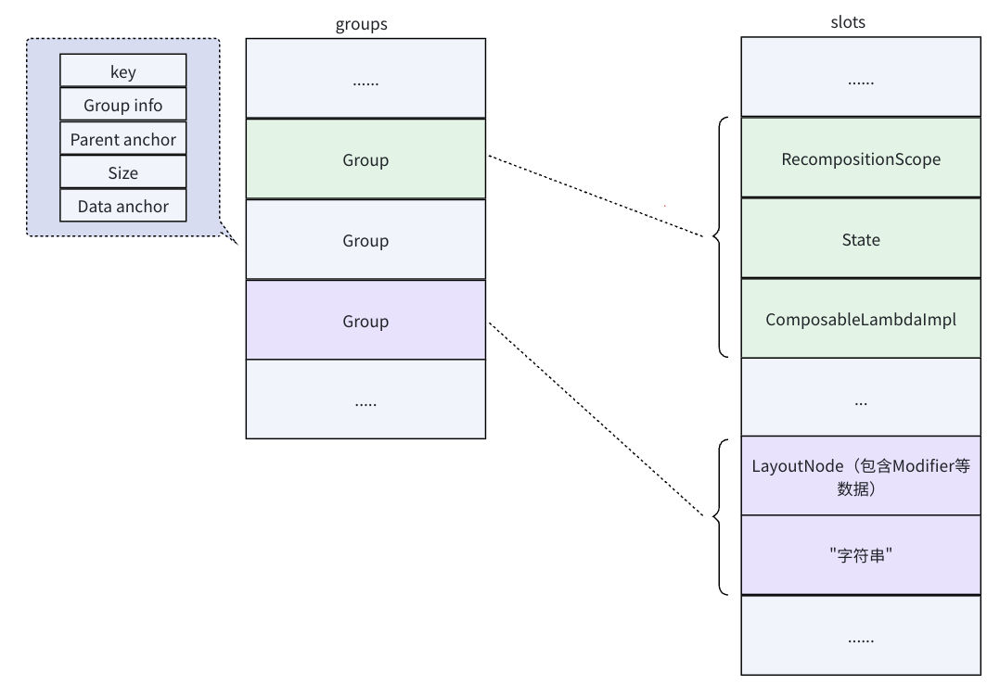


### Group 代码流程
根据前面的源码流程，得知 `Group` 的操作流程如下：
```
// 大致调用层级（简化版）
doCompose()
  → startRoot()
      → startGroup             // key 为 rootKey == 100，是最外层的 Group
          ------ 开始执行 Composable 函数 -------
          → startRestartGroup / startReplaceableGroup   // 可重启/可替换组
              → startReusableNode， createNode / useNode // 创建/复用/更新 Node
              → endNode
          → endReplaceableGroup / endRestartGroup
          ------ 结束执行 Composable 函数 -------
      → endGroup
  → endRoot()
```

#### startRoot
重点就是调用 `startGroup`，最终会调用通过`SlotTable`创建的`SlotWriter`调用`startGroup`来创建 Group，实际上就是在 `SlotTable` 的 groups、slots 中写入数据。

> `SlotWriter.startGroup` 方法中会调用 `SlotWriter.insertGroup` 方法，它用于在写入 groups、slots 之前，执行 GapBuffer 的算法，移动 gap。


#### startRestartGroup
创建一个可以重新执行的 Group，也就是可以重组的 `Group`，所以会包含 `RecomposeScope` 对象。
```kotlin
override fun startRestartGroup(key: Int): Composer {
    startReplaceGroup(key) // 1
    addRecomposeScope()    // 2
    return this
}
```
1. 内部会调用 `SlotWrite.startGroup`
2. 创建 `RecomposeScopeImpl`，通过 `SlotWriter` 写入到 `slots` 数组中

> **一般一个 `@Composable` 函数内如果有读取 State，就会创建 RestartGroup，用于重组**

#### startReplaceGroup
创建 Group，没什么特殊的，就是写入 `groups` 和 `slots`。大多数控制流构造（如 if 语句）所创建的 Group 就是可替换的 Group，这种 Group 只能插入、移除或替换，不能移动。因为这种场景，改动就需要直接替换掉。

伪代码如下：
```kotlin
@Composable
fun ReplaceableGroupTest(condition: Boolean, $composer: Composer?, $changed: Int) {
    if (condition) {
        $composer.startReplaceableGroup(1536105624)
        Text("11111")
        $composer.endReplaceableGroup()
    } else {
        $composer.startReplaceableGroup(1536153302)
        Text("22222")
        $composer.endReplaceableGroup()
    }
}
```

#### startMovableGroup
位置会变，但是同一个 Group，比如设置了 key、或者 LazyList 场景。可以通过 Key 判断是否是移动而非销毁重建，提升重组的性能

### 忽略具体的操作算法
目标在于理解 Compose 的工作原理，像 `start*Group` 调用的 `ComposerImpl.start` 内涉及对于 Slottable 的操作和 diff 算法，就不做具体分析。

`SlotTable` 的具体操作细节，可以参考这个文章：https://juejin.cn/post/7268297948639051831


## ChangeList、FixupList 和 Operation
在 `ComposerImpl` 中持有 `changes` 和 `insertFixups`，分别是 `ChangeList`、`FixupList` 类型：
```kotlin
private var changes: ChangeList
private var insertFixups = FixupList()
```
`ChangeList`和`FixupList`内部持有 `operations`：
```
ChangeList
  └── operations（核心）

FixupList
  ├── operations
  └── pendingOperations
```

`operations`存储的就是各种 `Operation` 和相应的参数，例如添加 `MoveNode` 这个 operation：
```kotlin
fun pushMoveNode(to: Int, from: Int, count: Int) {
    operations.push(MoveNode) {
        setInt(MoveNode.To, to)
        setInt(MoveNode.From, from)
        setInt(MoveNode.Count, count)
    }
}
```

`Operation`就代表了UI、数据相关的各种操作。每个 Operation 的 execute 方法接收三个关键参数：
```kotlin
protected abstract fun OperationArgContainer.execute(
    applier: Applier<*>,      // 用于操作 LayoutNode 树
    slots: SlotWriter,         // 用于操作 SlotTable
    rememberManager: RememberManager,  // 用于生命周期管理
    errorContext: OperationErrorContext?,
)
```

### ChangeList

首先来看`ChangeList`，以`remember`场景为例：我们知道在`Composable`函数中可能会调用`remember`方法，它内部会判断如果存储的类型是`RememberObserver`，就会调用`ChangeList.pushRemember()`方法，记录一个 `Remember` 操作，这个操作被执行的时候，会调用`RememberManager`来持有`RememberObserver`对象。
```kotlin
fun pushRemember(value: RememberObserver) {
    operations.push(Remember) {
        setObject(Remember.Value, value)
    }
}

object Remember : Operation(objects = 1) {
    // ...

    override fun OperationArgContainer.execute(
        applier: Applier<*>,
        slots: SlotWriter,
        rememberManager: RememberManager
    ) {
        rememberManager.remembering(getObject(Value))
    }
}
```
同时这个`RememberObserver`对象会被`remember`方法存储在 `slots` 中，当前所属的`Group`移除时就会遍历 `slots` 中类型为`RememberObserver` 的对象，调用它的`onForgotten()`生命周期方法。

> 我们常见的`LaunchedEffect`的协程为什么可以自动取消，就是利用了这个方式。

再比如重组时，会调用`Composer.changed`判断数据是否变化，这里就会调用`Composer.update`方法，从而执行`ChangeList`的`pushUpdateValue`方法：
```
fun pushUpdateValue(value: Any?, groupSlotIndex: Int) {
    operations.push(UpdateValue) {
        setObject(UpdateValue.Value, value)
        setInt(UpdateValue.GroupSlotIndex, groupSlotIndex)
    }
}

object UpdateValue : Operation(ints = 1, objects = 1) {
    // ...

    override fun OperationArgContainer.execute(
        applier: Applier<*>,
        slots: SlotWriter,
        rememberManager: RememberManager
    ) {
        val value = getObject(Value)
        val groupSlotIndex = getInt(GroupSlotIndex)
        if (value is RememberObserverHolder) {
            rememberManager.remembering(value.wrapped)
        }
        // ⚠️核心：slots.set 设置新的值
        when (val previous = slots.set(groupSlotIndex, value)) {
            // 原本的数据被移除，这里会调用它的生命周期回调
            is RememberObserverHolder -> {
                val endRelativeOrder = slots.slotsSize - slots.slotIndexOfGroupSlotIndex(
                    slots.currentGroup,
                    groupSlotIndex
                )
                
                rememberManager.forgetting(previous.wrapped, endRelativeOrder, -1, -1)
            }
            is RecomposeScopeImpl -> previous.release()
        }
    }
}
```
添加的`UpdateValue`操作，被执行时就会更新值，和执行生命周期相关代码。


### FixupList
在前面的`Layout`方法中，如果是新建的情况会调用`Composer.createNode`方法，这里就会调用`FixupList`记录 `InsertNodeFixup` 和 `PostInsertNodeFixup` 操作：
```kotlin
// ComposerImpl

fun createAndInsertNode(
    factory: () -> Any?,
    insertIndex: Int,
    groupAnchor: Anchor
) {
    operations.push(InsertNodeFixup) {
        setObject(InsertNodeFixup.Factory, factory)
        setInt(InsertNodeFixup.InsertIndex, insertIndex)
        setObject(InsertNodeFixup.GroupAnchor, groupAnchor)
    }

    // PostInsertNodeFixup 暂时放在 pendingOperations 中，之后统一放到 operations 的末尾，原因在下面分析
    pendingOperations.push(PostInsertNodeFixup) {
        setInt(PostInsertNodeFixup.InsertIndex, insertIndex)
        setObject(PostInsertNodeFixup.GroupAnchor, groupAnchor)
    }
}
```

`InsertNodeFixup`代码如下：
```kotlin
    object InsertNodeFixup : Operation(ints = 1, objects = 2) {
        // ...

        override fun OperationArgContainer.execute(
            applier: Applier<*>,
            slots: SlotWriter,
            rememberManager: RememberManager
        ) {
            // 创建 Node
            val node = getObject(Factory).invoke()
            val groupAnchor = getObject(GroupAnchor)
            val insertIndex = getInt(InsertIndex)

            val nodeApplier = @Suppress("UNCHECKED_CAST") (applier as Applier<Any?>)
            // 把 node 存储到 slots 中
            slots.updateNode(groupAnchor, node)
            nodeApplier.insertTopDown(insertIndex, node)
            nodeApplier.down(node)
        }
    }
```
`InsertNodeFixup`操作的核心就是创建 Node 并存储到 `SlotTable` 的 slots 数组中。

`PostInsertNodeFixup`操作的作用则是把刚刚创建的 UI 节点，插到正确的层级、正确的下标位置。
```kotlin
object PostInsertNodeFixup : Operation(ints = 1, objects = 1) {
    // ...

    override fun OperationArgContainer.execute(
        applier: Applier<*>,
        slots: SlotWriter,
        rememberManager: RememberManager
    ) {
        val groupAnchor = getObject(GroupAnchor)
        val insertIndex = getInt(InsertIndex)
        // 渲染树往上退一层（回到父容器）
        applier.up()
        val nodeApplier = @Suppress("UNCHECKED_CAST") (applier as Applier<Any?>)
        val nodeToInsert = slots.node(groupAnchor)
        // ⚠️ 核心：把节点插入到父容器的正确位置
        nodeApplier.insertBottomUp(insertIndex, nodeToInsert)
    }
}
```
因为 `Compose` 是子节点先创建，父节点后创建，所以无法在创建子节点的时候就插入到父节点，那么就需要`PostInsertNodeFixup`操作在创建完节点后再执行。`PostInsertNodeFixup`会放在所有的`InsertNodeFixup`操作之后，这就是前面看到先把它们放到`pendingOperations`中的原因。


并且`Layout`方法中，`ReusableComposeNode`方法会执行 `update`，调用`FixupList`的`updateNode`方法：
```kotlin
// FixupList

fun <V, T> updateNode(value: V, block: T.(V) -> Unit) {
    // 添加 UpdateNode 操作
    operations.push(UpdateNode) {
        setObject(UpdateNode.Value, value)
        setObject(UpdateNode.Block, @Suppress("UNCHECKED_CAST") (block as Any?.(Any?) -> Unit))
    }
}
```

然后在 `ComposerImpl.endRoot() -- endGroup() -- end() -- recordInsert()`中，会把 `FixupList` 对象存储到 `ChangeList` 中：
```kotlin
private fun recordInsert(anchor: Anchor) {
    if (insertFixups.isEmpty()) {
        changeListWriter.insertSlots(anchor, insertTable)
    } else {
        // insertFixups 不为空，会执行这里
        changeListWriter.insertSlots(anchor, insertTable, insertFixups)
        insertFixups = FixupList()
    }
}
```

### 总结
设计 `ChangeList` + `FixupList` + `Operation`，就是为了解决自下而上创建的层级问题（父节点未就绪），以及批量操作渲染树，提升性能。

**这些 `Operation` 会在首次组合和重组时，由`composition.applyChanges()`触发执行**


## UiApplier 和 LayoutNode
前面的源码分析中，我们知道`ComposeView`中创建的`Composition`会持有`UiApplier`，`UiApplier`又会持有`AndroidComposeView`提供的 `root LayoutNode`。
```
// AndroidComposeView

override val root = LayoutNode().also {
    it.measurePolicy = RootMeasurePolicy
    it.density = density
    // Composed modifiers cannot be added here directly
    it.modifier = Modifier
        .then(semanticsModifier)
        .then(rotaryInputModifier)
        .then(keyInputModifier)
        .then(focusOwner.modifier)
        .then(dragAndDropModifierOnDragListener.modifier)
}
```

`UiApplier`用于操控 LayoutNode，不过`UiApplier` 本身除了切换 `current node`，其他操作基本都是转调`LayoutNode`：
```kotlin
internal class UiApplier(
    root: LayoutNode
) : AbstractApplier<LayoutNode>(root) {

    override fun insertTopDown(index: Int, instance: LayoutNode) {
        
    }

    override fun insertBottomUp(index: Int, instance: LayoutNode) {
        current.insertAt(index, instance)
    }

    override fun remove(index: Int, count: Int) {
        current.removeAt(index, count)
    }

    override fun move(from: Int, to: Int, count: Int) {
        current.move(from, to, count)
    }

    override fun onClear() {
        root.removeAll()
    }

    override fun onEndChanges() {
        super.onEndChanges()
        root.owner?.onEndApplyChanges()
    }
}
```

### LayoutNode
`LayoutNode` 是 Compose UI 树中的实际节点，负责测量、布局、绘制、输入事件等的执行（更严谨的说是持有的 `Modifier` 提供的各个 `Modifier.Node` 负责）。实际执行了 `Layout`的 Group 才会有对应的 LayoutNode，而包装的 Composable 函数产生的 Group 并没有对应的 LayoutNode，这就像 Flutter 中 StatefulWidget 并没有对应的 RenderObject 一样。

`LayoutNode`中有这几个主要的字段：
```kotlin
// 实际参与布局绘制的子级
internal val _children: MutableVector<LayoutNode>

// 父级
internal val parent: LayoutNode?

// Modifier 数据
private var _modifier: Modifier = Modifier

// 创建并管理该 LayoutNode 的 Modifier.Node 链
internal val nodes = NodeChain(this)

// 例如 LazyColumn 等懒加载场景使用，屏幕外不需要绘制的 child layoutNode 放到这里
internal val foldedChildren: List<LayoutNode> 

// 用于布局，如果是 Text 之类的非容器组件，则使用 EmptyMeasurePolicy
override var measurePolicy: MeasurePolicy
```

`LayoutNode`结构图如下：
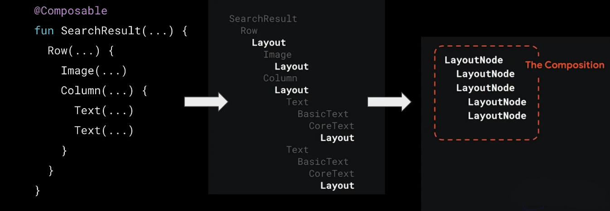

## Modifier
我们在使用 Compose 的时候，会发现一般都有 `Modifier` 类型的参数，其实就是因为 `Compose` 将组合的思想贯彻到底，`LayoutNode` 是 Compose UI 树里的核心节点（类似 View），但它本身更像一个**调度中心 + 状态容器**，而不是具体干活的人。具体的测量、布局、绘制、事件处理等功能都交给 `LayoutNode` 上挂着的一条 `Modifier.Node` 链式结构来执行。

Modifier 链里的每个独立行为（如 clickable、padding、background、drawBehind 等）都会对应一个 `Modifier.Node` 类型。以 `Modifier.padding` 为例：

```kotlin
@Stable
fun Modifier.padding(all: Dp) = this then PaddingElement(
    start = all,
    top = all,
    end = all,
    bottom = all,
    rtlAware = true,
    inspectorInfo = {
        name = "padding"
        value = all
    }
)

// then 的实现方法，会构造 CombinedModifier
infix fun then(other: Modifier): Modifier =
    if (other === Modifier) this else CombinedModifier(this, other)

// CombinedModifier 就是一个递归嵌套数据结构
class CombinedModifier(
    internal val outer: Modifier,
    internal val inner: Modifier
) : Modifier {
    // ...
}
```
我们可以看到，Modifier 链式调用，实际就是不断调用 `then` 中缀操作符，将各个 `ModifierNodeElement` 形成一个嵌套递归的数据链。

每个 `Modifier.Element`（`ModifierNodeElement`的父类） 的 `create()` 方法都会构造一个 `Modifier.Node` 实例，比如 `PaddingElement` 提供的就是 `PaddingNode` 实例：
```kotlin
private class PaddingElement(
    var start: Dp = 0.dp,
    var top: Dp = 0.dp,
    var end: Dp = 0.dp,
    var bottom: Dp = 0.dp,
    var rtlAware: Boolean,
    val inspectorInfo: InspectorInfo.() -> Unit
) : ModifierNodeElement<PaddingNode>() {

    override fun create(): PaddingNode {
        return PaddingNode(start, top, end, bottom, rtlAware)
    }

    override fun update(node: PaddingNode) {
        node.start = start
        node.top = top
        node.end = end
        node.bottom = bottom
        node.rtlAware = rtlAware
    }

    // ...
}
```
此时可以看出来，创建 `Modifier` 并不会马上创建出 `Modifier.Node` 实例，其实这是因为我们可以将 `Modifier` 复用到多个 `LayoutNode` 中，假如 `Modifer` 直接创建了 `Modifier.Node` 实例，各个 `LayoutNode` 使用同一个 `Modifier.Node` 实例，而 `Modifier.Node` 实例有自己的状态，比如自身的生命周期（`onAttach`、`onDetach`）和持有的 `CoroutineScope` 生命周期等。也就是说在运行时各个 `LayoutNode` 应该通过 `Modifier` 构造出自己的 `Modifier.Node` 实例，达到状态独立的目的。 

### Modifier.Node

`Modifier.Node`的源码重点字段如下：
```kotlin
interface Modifier {

    abstract class Node : DelegatableNode {

        // 持有的协程作用域
        val coroutineScope: CoroutineScope
        
        // Node 链的前一个 Node
        internal var parent: Node? = null

        // Node 链的后一个 Node
        internal var child: Node? = null

        // ...
    }
}
```

`LayoutNode` 没有直接管理 `Modifier.Node`，而是由 `NodeChain` 负责：
```kotlin
internal class NodeChain(val layoutNode: LayoutNode) {

    // 最内层的 NodeCoordinator，直接连接 LayoutNode，负责访问子级 layoutNode，执行 measurePolicy
    internal val innerCoordinator = InnerNodeCoordinator(layoutNode)

    // 外层 NodeCoordinator，在 syncCoordinators() 时会设置为最外层的 Node 对应的那个 NodeCoordinator 实例
    internal var outerCoordinator: NodeCoordinator = innerCoordinator
        private set
    internal val tail: Modifier.Node = innerCoordinator.tail
    internal var head: Modifier.Node = tail
        private set

    // ...
}
```

然后再看 `Modifier.Node` 的构造流程如下：
```
UiApplier
  →  insertBottomUp
    
    LayoutNode
      →  insertAt
      →  attach
      →  applyModifier

        NodeChain
          →  updateFrom （✅ 1. 这里会考虑 Diff 可能复用，但我们这里流程只考虑创建新的）
          →  createAndInsertNodeAsChild（✅ 2. 构造 Node，并形成链表结构）
          →  syncCoordinators() （✅ 3. 为每个 Node 设置 NodeCoordinator）
```
`Modifier.Node` 最终都是由 `LayoutNode` 中的 `NodeChain` 来创建和管理。

核心总结：
1. 更新 `Modefier` 数据，如果当前已经存在，则会使用 Diff 算法，可以复用则可能调用 `Modifier.Node.update()`方法
2. 创建新的 `Modifier.Node` 实例，并且设置 `Node.parent`、`Node.child`，形成链表
3. 给每个 `Modifier.Node` 实例构造并设置 `NodeCoordinator`，如果是 `LayoutModifierNode` 类型，就设置 `LayoutModifierNodeCoordinator` 实例，并且 `LayoutModifierNodeCoordinator` 之间会通过 `wrappedBy`、`wrapped` 形成链表结构；但如果是其他 `Modifier.Node` 类型（比如 `ClickableNode`、`FocusTargetNode`），就直接设置为前一个 `LayoutModifierNode` 的 `NodeCoordinator`（前面没有则是 `innerCoordinator`）。

总结说就是，布局相关的 Node 对应的 `LayoutModifierNodeCoordinator` 之间会形成链表，其他 Node 则直接设置为前一个布局相关的 Node
的 `LayoutModifierNodeCoordinator`，没有则使用 `innerCoordinator`。

> 只有 LayoutModifierNode 有专门 Coordinator：LayoutModifierNodeCoordinator，因为其他 Modifier.Node 不需要参与布局协议的协调，所以通过更轻量的方式实现。


`LayoutModifierNodeCoordinator` 源码如下：
```kotlin
internal class LayoutModifierNodeCoordinator(
    layoutNode: LayoutNode, // 当前 LayoutNode
    measureNode: LayoutModifierNode, // 
) : NodeCoordinator(layoutNode) {
  // ...
}

internal abstract class NodeCoordinator(
    override val layoutNode: LayoutNode,
) :
    LookaheadCapablePlaceable(),
    Measurable,
    LayoutCoordinates,
    OwnerScope {

    abstract val tail: Modifier.Node

    internal var wrapped: NodeCoordinator? = null
    internal var wrappedBy: NodeCoordinator? = null
    
    // ...
}
```

根据以上流程分析，总结流程图如下：
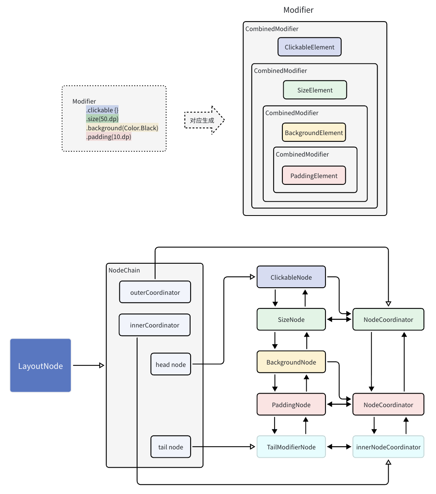


## Snapshot
根据前面的分析，已经了解 Compose 的整体结构了，但关于修改状态触发重组刷新UI的流程还没有了解，下面开始分析。

### Snapshot 快照系统
`Snapshot` 并非 Compose Runtime 的原创概念，它是一个 MVCC（Multiversion Concurrency Control，多版本并发控制）系统的实现，MVCC常用于数据库的事务机制，其模型与 Git 分支系统也有点类似，所以可以类比数据库事务和 Git 分支来理解快照机制。

#### Snapshot 的基本使用
Compose 实现的 `Snapshot` 并没有和 Compose 本身耦合，它是可以和 `State` 一起独立使用的，我们先看看它的使用方式：
```kotlin
// 定义 Car 类，持有 State
class Car {
    var name: MutableState<String> = mutableStateOf("")
}

val car = Car()
car.name.value = "奔驰"

// 此时创建 snapshot，对于这个 snapshot，car.name 为 “奔驰”
val snapshot = Snapshot.takeSnapshot()

// 然后修改 name 为 ”特斯拉“
car.name.value = "特斯拉"

println("第一次打印 全局快照：${car.name.value}")  // 输出: 特斯拉
snapshot.enter {
    println("第二次打印 新建快照：${car.name.value}")  // 输出: 奔驰
}
println("第三次打印 全局快照：${car.name.value}")  // 输出: 特斯拉
```
核心点如下：
1. `Snapshot.takeSnapshot` 基于当前快照（全局快照 `GlobalSnapshot` ）创建新的快照
2. `snapshot.enter` 在指定快照中读取状态，虽然全局快照已经修改，但创建的子级快照仍然为原本的状态数据

上面是仅读取的情况，我们再看一下使用 `takeMutableSnapshot` 创建可修改的快照：
```
val car = Car()
car.name.value = "奔驰"
val snapshot = Snapshot.takeMutableSnapshot()

println("第一次打印：${car.name.value}")  // 输出: 奔驰
snapshot.enter {
    // 在新快照中修改数据
    car.name.value  = "特斯拉"
    println("第二次打印：${car.name.value}")  // 输出: 特斯拉
}
println("第三次打印：${car.name.value}")  // 输出: 奔驰

// 调用 apply 提交
snapshot.apply()

println("第4次打印：${car.name.value}")  // 输出: 特斯拉
```
1. `takeMutableSnapshot`创建的是 `MutableSnapshot` 类型，可以调用 `apply()` 应用修改
2. `apply()` 之后，子级快照的修改会合并到主线快照也就是全局快照中，所以最后读取的数据就是修改的数据

#### 快照监听
创建 `Snapshot` 时可以传入 `readObserver` 和 `writeObserver` 来设置状态读写监听：
```kotlin
val car = Car()

val readObserver: (Any) -> Unit = { state ->
    println("读取状态：$state")
}

val writeObserver: (Any) -> Unit = { state ->
    println("写入状态：$state")
}

val snapshot = Snapshot.takeMutableSnapshot(readObserver, writeObserver)

snapshot.enter {
    car.name.value = "特斯拉" // 触发 writeObserver 回调
    println("第二次打印：${car.name.value}") // 触发 readObserver 回调
}
```
这样在 `snapshot.enter` 的范围内读写状态都会回调。

#### 快照树和全局快照
快照是可以嵌套的，而顶层是默认存在的 `GlobalSnapshot` 全局快照
```kotlin
val car = Car()
car.name.value = "奔驰"

val outerSnapshot = Snapshot.takeMutableSnapshot()
outerSnapshot.enter {
    car.name.value = "特斯拉"

    val innerSnapshot = Snapshot.takeMutableSnapshot()
    innerSnapshot.enter {
        car.name.value = "比亚迪"
    }
    // 当前为 "特斯拉"
    innerSnapshot.apply()
    // 当前为 "比亚迪"
}
// 当前为 "奔驰"
outerSnapshot.apply()
// 当前为 "比亚迪"
```
`Snapshot` 是有嵌套关系的，而顶层就是全局快照。

我们这里只是简单的添加了两个存在父子关系的快照，如果我们在一个快照内创建多个子快照，所有快照就可以形成树的结构：
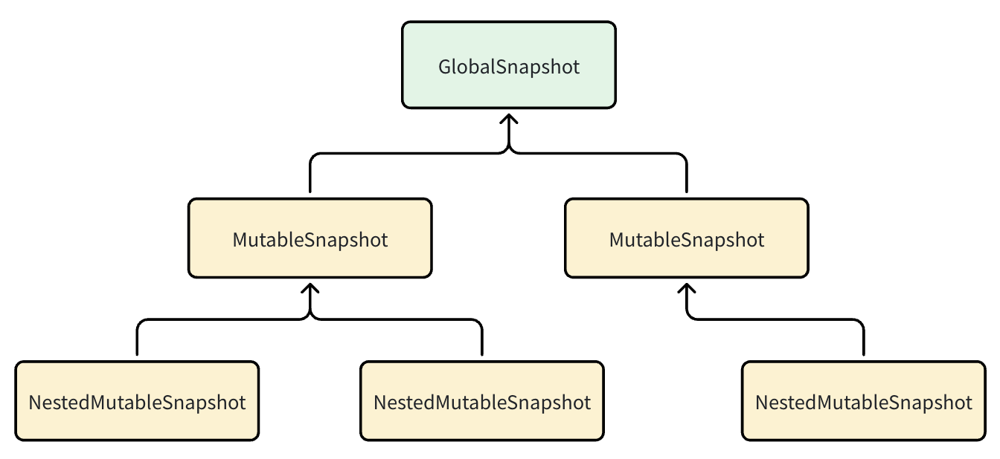

> 由于全局快照不是通过 `takeMutableSnapshot` 调用创建的，所以不能直接设置读写观察器。`Snapshot`提供了`Snapshot.registerGlobalWriteObserver()`，用于在给全局快照设置写入观察器，另外还有 `Snapshot.registerApplyObserver()` 用于设置执行 `apply` 的监听。


#### 快照冲突
假如基于同一个快照的两个分支快照，修改了同一个数据：
```kotlin
val car = Car()
car.name.value = "奔驰"

val snapshot1 = Snapshot.takeMutableSnapshot()
snapshot1.enter {
    car.name.value = "特斯拉"
}

val snapshot2 = Snapshot.takeMutableSnapshot()
snapshot2.enter {
    car.name.value = "比亚迪"
}

val result1 = snapshot1.apply() // 结果为成功
val result2 = snapshot2.apply() // 结果为失败

// 最终为 “特斯拉”
```
`apply()`方法会返回 `SnapshotApplyResult` 类型，在调用 `mutableStateOf()` 方法时，可以传入 `SnapshotMutationPolicy` 类型参数用来控制产生冲突时的合并策略。

因为默认的合并策略实现就是只有没有冲突时的写入成功，有冲突的都会失败，所以我们这里的情况就只有第一次 `apply()` 成功。我们也可以自行实现一些特殊策略。


## State
对 `Snapshot` 系统有一些基本认知后，我们再回到 `State`。使用 `mutableStateOf()` 创建 State 时，得到的是 MutableState/StateObject 实现类 `SnapshotMutableStateImpl` 的实例：
```kotlin
// SnapshotState.kt
internal open class SnapshotMutableStateImpl<T>(
    value: T,  // 初始值
    override val policy: SnapshotMutationPolicy<T>,  // 冲突策略
) : StateObjectImpl(), SnapshotMutableState<T> {  // 继承StateObjectImpl

    override var value: T
        get() = next.readable(this).value  // 1. 读取：从 StateStateRecord 链表中读取合适的版本
        set(value) = next.withCurrent {
            if (!policy.equivalent(it.value, value)) {
                // 2. 写入：创建新的 StateStateRecord，插入到链表头部
                next.overwritable(this, it) { this.value = value }
            }
        }

    private var next: StateStateRecord<T> = StateStateRecord(value).also {
        if (Snapshot.isInSnapshot) {
            // 在快照中创建 State，就会执行到这里
            it.next = StateStateRecord(value).also { next ->
                // 3. 如果在快照中创建 State，初始设置 snapshotId 为 PreexistingSnapshotId
                // 因为初始值不属于任何快照，所以这里特殊设置
                next.snapshotId = Snapshot.PreexistingSnapshotId
            }
        }
    }

    // 第一个 StateRecord 就是 next
    override val firstStateRecord: StateRecord
        get() = next
}
```

这里看到有 `StateStateRecord` 这个类型，其实 `State` 中的数据，实际就是存到 `StateRecord` 中的，它的定义如下：
```
private class StateStateRecord<T>(myValue: T) : StateRecord() {
    override fun assign(value: StateRecord) {
        this.value = (value as StateStateRecord<T>).value
    }

    // 创建实例
    override fun create(): StateRecord = StateStateRecord(value)

    var value: T = myValue
}

// 父类 StateRecord
abstract class StateRecord {
    // 创建当前 StateRecord 的快照 ID
    internal var snapshotId: Int = currentSnapshot().id

    // 引用下一个 StateRecord，形成链表
    internal var next: StateRecord? = null

    // ... 省略已经被 StateStateRecord 实现的 assign 和 create 抽象方法
}
```

`mutableStateOf`得到的`SnapshotMutableStateImpl`，修改 `value` 会调用 `overwritable`，方法代码如下：
```kotlin
internal inline fun <T : StateRecord, R> T.overwritable(
    state: StateObject,
    candidate: T,
    block: T.() -> R
): R {
    var snapshot: Snapshot = snapshotInitializer
    return sync { // 进入同步代码块
        snapshot = Snapshot.current // 获取当前快照
        // 获取记录（根据直接修改队首Record，或者新建Record）并执行修改
        this.overwritableRecord(state, snapshot, candidate).block()
    }.also {
        // 通知 WriteObserver 观察者 
        notifyWrite(snapshot, state)
    }
}
```

`overwritableRecord`
```kotlin
internal fun <T : StateRecord> T.overwritableRecord(
    state: StateObject,
    snapshot: Snapshot,
    candidate: T
): T {
    if (snapshot.readOnly) {
        // 如果是只读快照，借用 recordModified 方法抛出异常
        snapshot.recordModified(state)
    }
    val id = snapshot.id

    // 当前头部的 Record 就是当前 Snapshot 创建的，就不用新建 Record， 直接修改它就行   
    if (candidate.snapshotId == id) return candidate

    // 创建新的 StateRecord ，并设为链表的头部
    val newData = sync { newOverwritableRecordLocked(state) }
    newData.snapshotId = id

    // 不是初始的 Record，也就是产生修改，则 snapshot 要记录变化的 State
    if (candidate.snapshotId != Snapshot.PreexistingSnapshotId) snapshot.recordModified(state)

    return newData
}

// 把发生变化的 State 记录到 Set 集合中
override fun recordModified(state: StateObject) {
    (modified ?: mutableScatterSetOf<StateObject>().also { modified = it }).add(state)
}
```

现在接连看了多个源码，先总结以下重点信息：
1. 读取数据时，会从 `StateRecord` 链表中读取小于当前 Snapshot Id 中的最大值的那一个（读取的具体源码省略了）。比如在当前快照使用过程中，又有其他快照创建，新的快照的 ID 会比当前快照 ID 大， `StateRecord` 的快照 ID 比当前快照 ID 大的就是较新的快照修改创建的，对于当前快照不能使用，需要忽略它（这也就是快照之间达到数据隔离的方式）
2. 写入数据时，如果头部 `StateRecord` 属于当前快照，则直接修改它，否则创建新的 `StateRecord` 作为新的头部
3. 初始的 `StateRecord` 的 ID 为 `PreexistingSnapshotId`，因为初始值是全局共有，不属于任何快照，任何快照都认为它可见、可读
4. `StateRecord` 是实际存储数据的容器，它会标记 `Snapshot ID`，并且 `StateRecord` 之间会形成链表，最新的放在头部

### State 和 Snapshot 的工作流程
根据以上源码分析，我们以实际例子来看看 `State` 和 `Snapshot` 如何配合工作。

1. 创建一个初始 `State`
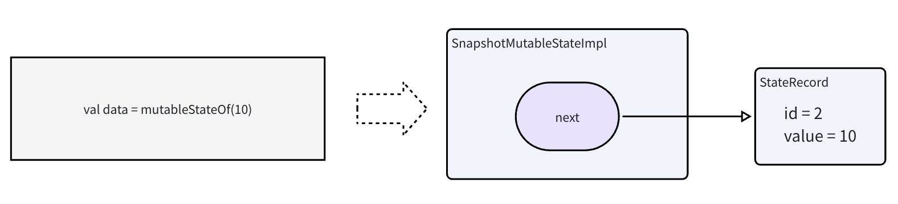

`GlobalSnapshot`的初始ID为 `Snapshot.PreexistingSnapshotId + 1 = 2`，所以这个 `StateRecord` 的 ID 为 2


2. 创建一个快照，修改状态
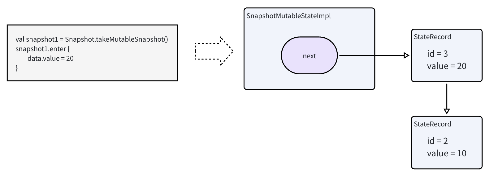

新建快照，ID 为当前 `GlobalSnapshot` 的 ID + 1，所以新建的 `StateRecord` 的 ID 为 3，并且会作链表头部。

3. 再创建一个快照，修改状态
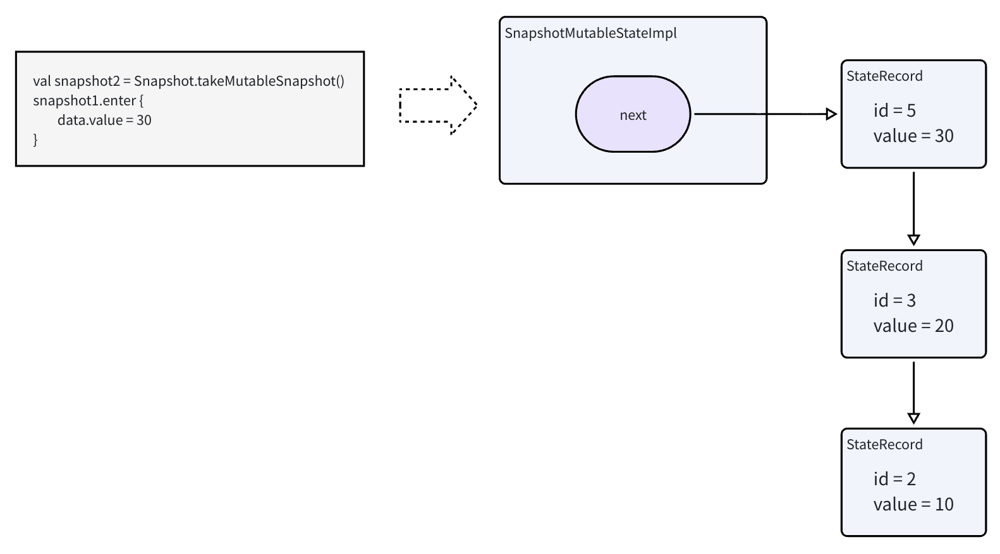

> 创建快照之后，`GlobalSnapshot` 的 ID 会自动 + 1，所以之后再创建快照，会基于新的`GlobalSnapshot` 的 ID 加 1，所以 ID 为 5。目的是为了让子快照中访问不到全局快照后续的状态变化，并且为了让 GlobalSnapshot 看不到子快照的状态变化，会将子快照加入 invalid


4. 使用第一个快照读取
```
snapshot1.enter {
    val current = data.value // 得到 20
}
```
读取时，根据当前 Snapshot ID 找到 ≤ 该 ID 的最新 Record，对于 `snapshot1` 来说，就会获取到 20。


> `Snapshot` 并没有持有属于它的全部 `State`，而是 `State` 的 `StateRecord` 记录了 `Snapshot` 的 ID；`Snapshot` 只会记录修改过的 `State`，当修改一个 `State` 时，`State` 中会增加一个 `StateRecord`，并且会把这个 `State` 记录到 `Snapshot.modified` （一个 Set 对象）中，这样在 `apply()` 时就知道哪些 `State` 被修改过，从而通知对应的 `Observer`，触发重组。


## 重组刷新

### 修改 State 触发重组的调用链
`Compose` 在开始会调用 `GlobalSnapshotManager.ensureStarted()` 方法：
```kotlin
internal fun AbstractComposeView.setContent(
    parent: CompositionContext,
    content: @Composable () -> Unit
): Composition {
    // ✅ 重点：调用 ensureStarted()
    GlobalSnapshotManager.ensureStarted()
    // ... 省略部分代码
    return doSetContent(composeView, parent, content)
}
```

`GlobalSnapshotManager.ensureStarted()` 的工作就是注册全局写入观察者，收到回调就调用`Snapshot.sendApplyNotifications()`
```
internal object GlobalSnapshotManager {
    private val started = AtomicBoolean(false)
    private val sent = AtomicBoolean(false)

    fun ensureStarted() {
        if (started.compareAndSet(false, true)) {
            val channel = Channel<Unit>(1)
            CoroutineScope(AndroidUiDispatcher.Main).launch {
                channel.consumeEach {
                    sent.set(false)
                    // ✅ 收到 GlobalWrite 消息，通知变化，调用 applyObservers
                    Snapshot.sendApplyNotifications()
                }
            }
            // 注册 GlobalSnapshot 的写入观察者
            Snapshot.registerGlobalWriteObserver {
                if (sent.compareAndSet(false, true)) {
                    // ✅ 写入时，发送消息到 channel
                    channel.trySend(Unit)
                }
            }
        }
    }
}
```
`Snapshot.sendApplyNotifications()` 方法的关键就是触发 `applyObserver` 回调，通过 `Snapshot.registerApplyObserver` 就会注册这个回调。也就是说，在全局快照修改 State，就会触发 `Snapshot.registerApplyObserver` 的回调，下面接着看在哪里设置了这个回调。

在创建 `Recomposer` 时，`View.createLifecycleAwareWindowRecomposer` 方法内会在 `ON_CREATE` 生命周期的时候，调用 `recomposer.runRecomposeAndApplyChanges()`方法：
```kotlin
    suspend fun runRecomposeAndApplyChanges() = recompositionRunner { parentFrameClock ->
        // ...

        while (shouldKeepRecomposing) {
            // ✅ 1. 挂起等待
            awaitWorkAvailable()

            // Don't await a new frame if we don't have frame-scoped work
            if (!recordComposerModifications()) continue

            parentFrameClock.withFrameNanos { frameTime ->
                // ...
                trace("Recomposer:recompose") {
                    // ✅ 将修改的 state 记录到 snapshotInvalidations ，和 Composition 的。pendingModifications 中
                    recordComposerModifications()
                    // ... toRecompose 内存储的就是需要刷新的 compostion
                    while (toRecompose.isNotEmpty() || toInsert.isNotEmpty()) {
                        try {
                            toRecompose.fastForEach { composition ->
                               // ✅ 2. 执行重组
                                performRecompose(composition, modifiedValues)?.let {
                                    toApply += it
                                }
                                alreadyComposed.add(composition)
                            }
                        }

                        // ...
                    }
                    // ...
                    synchronized(stateLock) {
                        deriveStateLocked()
                    }
                }
            }

            // ...
        }
    }
```
这里的重点就是调用 `recompositionRunner` 方法，传入的代码块就是死循环挂起函数等待唤醒，唤醒后就执行重组。

这个 `awaitWorkAvailable()` 挂起函数中，`hasSchedulingWork` 在有数据刷新时为 true，没有数据刷新时就会把协程的 `Continuation` 赋值给 `workContinuation`，等待其他地方唤醒。
```kotlin
// hasSchedulingWork 在 snapshotInvalidations、compositionInvalidations 等存在需要刷新的数据时，就为 true
private val hasSchedulingWork: Boolean
    get() = synchronized(stateLock) {
        snapshotInvalidations.isNotEmpty() ||
            compositionInvalidations.isNotEmpty() ||
            hasBroadcastFrameClockAwaitersLocked
    }

private suspend fun awaitWorkAvailable() {
    if (!hasSchedulingWork) {
        suspendCancellableCoroutine<Unit> { co ->
            synchronized(stateLock) {
                if (hasSchedulingWork) {
                    // 如果有刷新，就返回 co，直接唤醒，执行后续流程
                    co
                } else {
                    // 如果没有刷新，则赋值给 workContinuation，然后返回 null，等待唤醒
                    workContinuation = co
                    null
                }
            }?.resume(Unit) // 有刷新就直接调用 resume，为 null 就跳过了，等待其他地方调用 resume
        }
    }
}
```

而调用 `workContinuation.resume()` 的地方其实就在 `recompositionRunner` 方法中，这里使用`Snapshot.registerApplyObserver`注册了`ApplyObserver`：
```kotlin
    private suspend fun recompositionRunner(
        block: suspend CoroutineScope.(parentFrameClock: MonotonicFrameClock) -> Unit
    ) {
        val parentFrameClock = coroutineContext.monotonicFrameClock
        withContext(broadcastFrameClock) {
            // ✅ 注册 ApplyObserver
            val unregisterApplyObserver = Snapshot.registerApplyObserver { changed, _ ->
                synchronized(stateLock) {
                    if (_state.value >= State.Idle) {
                        val snapshotInvalidations = snapshotInvalidations
                        changed.fastForEach {
                            // ... 

                            // ✅ 发生变化的 State，保存到 snapshotInvalidations 中
                            snapshotInvalidations.add(it)
                        }
                        // ✅ 返回 workContinuation
                        deriveStateLocked()
                    } else null
                }?.resume(Unit) // ✅ 调用 workContinuation 的 resume
            }

            // -------------------- 下面代码只会在 Compose 环境初始化时执行一次 -------------------
            addRunning(recomposerInfo)

            try {
                
                synchronized(stateLock) {
                    knownCompositions
                }.fastForEach { it.invalidateAll() }

                coroutineScope {
                    // ✅ 执行 runRecomposeAndApplyChanges() 传入的代码块，也就是死循环等待唤醒执行重组
                    block(parentFrameClock)
                }
            } finally {
                // ...
            }
        }
    }
```
`recompositionRunner` 的代码分为两块：
1. 一部分是`Snapshot.registerApplyObserver`注册的回调，每次修改 State 数据都会执行，用于唤醒 `awaitWorkAvailable()` 方法，继续执行死循环中的 `performRecompose` 重组方法。
2. 另一部分就是初始化时执行一次的代码，比如刷新全部 Composition、执行 `runRecomposeAndApplyChanges()` 传入的死循环代码块。


### 重组的具体工作流程
从 `performRecompose` 方法开始执行重组：
```kotlin
// Recomposer

private fun performRecompose(
    composition: ControlledComposition,
    modifiedValues: MutableScatterSet<Any>?
): ControlledComposition? {
    // ...

    return if (
        // composing 就是在新建的快照中执行代码块
        composing(composition, modifiedValues) {
            // ...
            ✅ 核心就是在执行这里
            composition.recompose()
        }
    ) composition else null
}
```

`composition.recompose()` 的重点就是执行`composer.recompose`
```
// CompositionImpl

override fun recompose(): Boolean = synchronized(lock) {
    drainPendingModificationsForCompositionLocked()
    guardChanges {
        guardInvalidationsLocked { invalidations ->
            // ...
            // ✅
            composer.recompose(invalidations).also { shouldDrain ->
                // ...
            }
        }
    }
}
```
这里拿到的 `invalidations` 就是 `runRecomposeAndApplyChanges()` 中调用 `recordComposerModifications()`，然后调用 `composition.recordModificationsOf` 记录的发生修改的 State 和对应的 RecomposeScope。


然后调用 `Composer.recompose`：
```
// ComposerImpl

internal fun recompose(
    invalidationsRequested: ScopeMap<RecomposeScopeImpl, Any>,
): Boolean {
    // 重组时，invalidationsRequested 就是发生修改的 state 和 RecomposeScope
    if (
        invalidationsRequested.size > 0 ||
        invalidations.isNotEmpty() ||
        forciblyRecompose
    ) {
        // ✅ 这里注意，重组情况传入 @Composable 函数为 null
        doCompose(invalidationsRequested, null)
        return changes.isNotEmpty()
    }
    return false
}
```
重点就是调用 `doCompose`，最开始介绍的源码流程会传入我们写的 `@Composable` 函数，不过**重组的情况传入的是 null**。

```kotlin
private fun doCompose(
        invalidationsRequested: ScopeMap<RecomposeScopeImpl, Any>,
        content: (@Composable () -> Unit)?
    ) {
        trace("Compose:recompose") {
            compositionToken = currentSnapshot().id
            providerUpdates = null

            // ✅ 将修改数据 State 和对应的 RecomposeScope 保存到 invalidations 中
            invalidationsRequested.map.forEach { scope, instances ->
                scope as RecomposeScopeImpl
                val location = scope.anchor?.location ?: return@forEach
                invalidations.add(
                    Invalidation(
                        scope,
                        location,
                        instances.takeUnless { it === ScopeInvalidated }
                    )
                )
            }
            invalidations.sortWith(InvalidationLocationAscending)
            nodeIndex = 0
            var complete = false
            isComposing = true
            try {
                startRoot()

                // ...

                observeDerivedStateRecalculations(derivedStateObserver) {
                    if (content != null) {
                        // ...
                    } else if (
                        // ...
                    ) {
                        // ...
                    } else {
                        // ✅ 重组的情况执行这里
                        skipCurrentGroup()
                    }
                }
                endRoot()
                complete = true
            } finally {
                // ...
            }
        }
    }
```
重组时执行 `doCompose`，仍然会执行 `startRoot()` 之类的方法，不过这些方法内部会自动判断新建还是复用。而重组的特殊点就是执行 `skipCurrentGroup()`。

```kotlin
@ComposeCompilerApi
override fun skipCurrentGroup() {
    if (invalidations.isEmpty()) {
        skipGroup() // ❌ 重组不走这里
    } else {
        // ...
        updateCompoundKeyWhenWeEnterGroup(key, rGroupIndex, dataKey, aux)
        startReaderGroup(reader.isNode, null)

        // ✅ 重组会执行这里
        recomposeToGroupEnd()
        reader.endGroup()
        updateCompoundKeyWhenWeExitGroup(key, rGroupIndex, dataKey, aux)
    }
}
```

`recomposeToGroupEnd()` 方法内就会调用所有需要刷新的 `RecomposeScopeImpl` 的 `compose` 方法：
```kotlin
fun compose(composer: Composer) {
    val block = block
    val observer = observer
    if (observer != null && block != null) {
        observer.onBeginScopeComposition(this)
        try {
            // ✅ 
            block(composer, 1)
        } finally {
            observer.onEndScopeComposition(this)
        }
        return
    }
    block?.invoke(composer, 1) ?: error("Invalid restart scope")
}
```
此时就会再次执行 `RecomposeScopeImpl` 中引用的组合函数。再次执行的情况，`startRestartGroup` 等方法内部会区分新建和复用的场景，数据变化则让最终 `Layout` 的数据（比如 `Modifier`）变化，从而刷新UI。（UI绘制流程另外分析）

总结流程如下图：
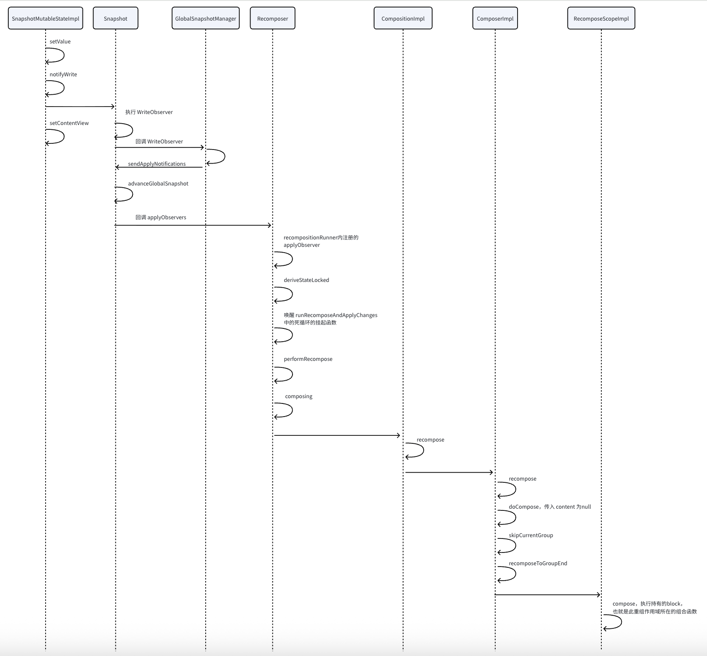

#### 相同调用栈直接修改数据
前面分析的重组流程，是点击按钮，回调之后修改数据，也就是修改数据和执行组合函数不在一个调用栈，这种情况就会使用全局快照。假如我们直接在组合函数中同步执行修改 State，那么触发重组的流程会有略微的区别。

比如这个例子就是直接在当前调用栈修改 State：
```kotlin
    fun MyTimer(aaa: Boolean) {
        var count by remember { mutableStateOf(0) }
        
        // 直接修改
        if (count == 0) {
            count++
        }

        MyTest("Count:  $count")
    }
```

对于这种情况，我们分析一下源码。在首次组合会调用`Recomposer`的`composeInitial`方法，简化后的代码如下：
```kotlin
class Recomposer {
    
    internal override fun composeInitial(
        composition: ControlledComposition,
        content: @Composable () -> Unit
    ) {
        // ...
        // ✅
        composing(composition, null) {
            composition.composeContent(content)
        }
        
        // ...
        composition.applyChanges()
        composition.applyLateChanges()
    }

    private inline fun <T> composing(
        composition: ControlledComposition,
        modifiedValues: MutableScatterSet<Any>?,
        block: () -> T
    ): T {
        val snapshot = Snapshot.takeMutableSnapshot(
            readObserverOf(composition), writeObserverOf(composition, modifiedValues)
        )
        try {
            // ✅ 在创建的快照中执行
            return snapshot.enter(block)
        } finally {
            applyAndCheck(snapshot)
        }
    }
}
```
`composing`方法会创建一个 `Snapshot`，并且设置`readObserver`和`writeObserver`，在这个`Snapshot`内执行组合函数。

`readObserver`就是`composition.recordReadOf`方法：
```kotlin
// CompositionImpl

    override fun recordReadOf(value: Any) {
        if (!areChildrenComposing) {
            composer.currentRecomposeScope?.let {
                // 在 Composable 函数中执行读取 state 的代码，会在 startRestartGroup 后，
                // 这里就是这个 Group 的 RecomposeScope
                it.used = true

                // 把 RecomposeScope 读取的 state 记录下来
                val alreadyRead = it.recordRead(value)
                if (!alreadyRead) {
                    if (value is StateObjectImpl) {
                        value.recordReadIn(ReaderKind.Composition)
                    }

                    // 把 RecomposeScope 和 state 记录到 Composition 中
                    observations.add(value, it)

                    // 省略 derived state 的情况
                }
            }
        }
    }
```

而 `writeObserver` 就是 `composition.recordWriteOf`方法，它会调用 `invalidateScopeOfLocked` 方法：
```
private fun invalidateScopeOfLocked(value: Any) {
    // 从读取回调记录的数据中找到读取这个 state 的 RecomposeScope
    observations.forEachScopeOf(value) { scope ->
        // 执行 RecomposeScope 的 invalidateForResult 方法
        if (scope.invalidateForResult(value) == InvalidationResult.IMMINENT) {
            // If we process this during recordWriteOf, ignore it when recording modifications
            observationsProcessed.add(value, scope)
        }
    }
}
```
所以这种情况，创建的 Snapshot 设置了读写 State 的监听，读写时会调用 `composition` 的方法，执行 `RecomposeScope` 的刷新。然后就会调用到 `Recomposer` 的 `invalidate` 方法，它也会从 `deriveStateLocked()` 方法中获取 `workContinuation` ，从而唤醒 `awaitWorkAvailable()` 执行重组，后续流程就和全局快照的一样了。


## 智能重组
`@Composable` 函数在编译后，会增加 `$composer` 和 `$changed` 参数，`$changed` 为参数提供额外的信息，用于跳过不必要的重组，提升性能。

`$changed` 是 Int 类型，**最低位用来表示是否强制重组**，其余每三位保存一个参数的信息，所以一个 $changed 可以保存 10 个参数的信息。如果参数的数量大于 10，就会增加 $changed1、$changed2 ...。

每个参数使用了 3 位来保存信息，其中低两位用来表示参数是否变化，最高位表示当前参数是否**稳定(Stable)**。
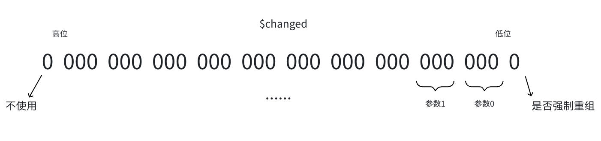

3个比特位在 Compose 的编译器插件源码中有定义：
```kotlin
enum class ParamState(val bits: Int) {
	Uncertain(0b000), // 不确定相对上一次重组是否变化
	Same(0b001), // 相对上一次重组没有变化
	Different(0b010), // 相对上一次重组发生变化
	Static(0b011), // 静态常量，不会发生变化
    Unknow(0b100), // 不稳定数据
}
```

### 稳定类型/不稳定类型
`Compose` 将类型分为 **稳定** 和 **不稳定**，稳定类型包括不可变类型和可变但变化可被 Compose 追踪的类型，不稳定类型就是 Compose 不知道它是否变化的类型。

Compose 根据参数的稳定性来决定是否可以跳过重组：
* 稳定参数：如果组合函数的稳定类型参数没有改变，就跳过重组
* 不稳定参数：始终重组

#### 自动被认定为稳定的类型
1. 基本类型与不可变类型

* Kotlin 基本类型：Int, Long, Float, Double, Boolean, Char
* String
* 枚举
* 不可变的数据类
```kotlin
data class User(val id: Int, val name: String)
```

2. Compose 内置可观察类型
* `State<T>` / `MutableState<T>`（mutableStateOf）
* `SnapshotStateList<T>` / mutableStateListOf
* `SnapshotStateMap<K, V>` / mutableStateMapOf
* `DerivedState<T>`（derivedStateOf）

3. 函数类型/lambda：函数对象本质是引用类型，更新就是整体替换为新的函数对象，可以通过 == 比较引用得知变化。

#### 手动标记稳定类型：@Stable / @Immutable
1. `@Immutable`：不可变
编译器可做优化，直接引用比较
```kotlin
@Immutable
data class Point(val x: Float, val y: Float)
```
如果不加`@Immutable`，只是普通稳定类型，比较是否变化时，必须用 equals() 对比所有属性，使用`@Immutable`后，就不需要比较内容，直接比较引用。

2. `@Stable`：可变但可追踪
可以变化但必须通知 `Compose`，通常内部用 `MutableState` 管理状态
```kotlin
@Stable
class LoginState {
    var isLoading by mutableStateOf(false) // 可追踪
    var errorMessage: String? = null // 不通知（需手动保证不影响UI）
}
```

> 实测发现编译器插件处理 `@Immutable` 和 `@Stable` 生成的代码没区别

### 实例验证
以一些实际的例子看看智能重组的规则

#### 不稳定类型参数
```kotlin
// 不稳定类型
class Bar(var text: String)

@Composable
fun Foo(bar: Bar) {
    Text(bar.text)
}
```

这种情况，反编译后的简化伪代码如下：
```kotlin
@Composable
fun Foo(bar: Bar, $composer: Composer, $changed: int) {
    $composer = $composer.startRestartGroup(864049327)

    Text(bar.text)

    val var10000: ScopeUpdateScope  = $composer.endRestartGroup()
    if (var10000 != null) {
        var10000.updateScope {$bar, $$changed, $composer, $force ->
            Foo($bar, $composer, RecomposeScopeImpl.updateChangedFlags($$changed | 1))
        }
    }
}
```
因为参数是**不稳定类型**，这种情况只要被调用，都会重组


#### 稳定类型
```
// 只有 val 属性，自动作为稳定类型。也可以使用 @Stable 标记
data class Bar(val text: String)

@Composable
fun Foo(bar: Bar) {
    Text(bar.text)
}
```

反编译伪代码如下：
```kotlin
@Composable
fun Foo(bar: Bar, $composer: Composer, $changed: int) {
    $composer = $composer.startRestartGroup(864049327)

    var $dirty = $changed
    if (($changed and 14) == 0) {
       $dirty = $changed or if ($composer.changed(bar) 4 else 2)
    }

    if (($dirty and 11) == 2 && $composer.skipping) {
       $composer.skipToGroupEnd()
    } else {
       Text(bar.text)
    }

    val var10000: ScopeUpdateScope  = $composer.endRestartGroup()
    if (var10000 != null) {
        var10000.updateScope {$bar, $$changed, $composer, $force ->
            Foo($bar, $composer, RecomposeScopeImpl.updateChangedFlags($$changed | 1))
        }
    }
}
```
第一个 if 语句：`14` 的二进制就是 `1110`，最后1位表示是否强制重组，所以对于 `bar` 参数来说就是和 `111` 做与运算后是否为0，只有`Uncertain(0b000)`的情况符合。满足这种情况时，如果 bar 发生变化，就和 4 也就是 `0100` 做或运算，没有发生变化就和 2 也就是 `0010` 做或运算，去掉最后一位强制标记，其实就是 `Different(0b010)` 和 `Same(0b001)`。

第二个 if 语句：`11` 的二进制是 `1011`，或运算后为 2 也就是 `0010` 的情况，$changed 只有 `0110` `0010` 满足，忽略强制标记位，其实就是 `Static(0b011)` 和 `Same(0b001)`。满足这两种情况并且处于可以 skip 的状态，就会跳过重组。

总的来说就是：
1. 如果 `$changed` 是 `Uncertain(0b000)`，就会根据参数是否变化，设为`Different(0b010)` 或者 `Same(0b001)`
2. 再最终判断是 `Static(0b011)` 或 `Same(0b001)` 就可以跳过重组

#### 编译器会设置 $changed
`$changed` 由调用方传入，而编译器插件会根据具体情况设置不同的标记。

比如这个情况：
```kotlin
@Composable
fun MyApp() {
    Foo(Bar("Hello Compose"))
}
```
反编译的伪代码如下：
```kotlin
@Composable
fun MyApp($composer: Composer?, $changed: Int) {
    if ($changed == 0 && $composer.skipping) {
        $composer.skipToGroupEnd()
    } else {
        Foo(Bar("Hello Compose"), $composer, 0)
    }
    // ...
}
```
编译器设置的 `$changed` 为 0，也就是`Uncertain(0b000)`，这样就需要 Foo 内部根据参数是否变化来决定能否跳过重组。显然这里代码的写法，传入数据不会变化，所以肯定会跳过重组。


再比如这个情况：
```kotlin
@Composable
fun Foo(bar: String) {
    Text(bar)
}

@Composable
fun MyApp() {
    // 传入常量
    Foo("Hello Compose")
}
```
此时反编译的伪代码如下：
```kotlin
@Composable
fun MyApp($composer: Composer?, $changed: Int) {
    if ($changed == 0 && $composer.skipping) {
        $composer.skipToGroupEnd()
    } else {
        Foo("Hello Compose", $composer, 6)
    }
    // ...
}
```
因为是编译器设置的 `$changed` 为 6，忽略强制标记位之后，也就是 `Static(0b011)`，会跳过重组。


> 验证的时候发现如果 Composabl 函数是一个成员方法，它内部如果又调用了其他成员方法，即使参数都是稳定类型，也无法跳过重组，除非成员方法所在的类也是 Stable 类型。因为调用另一个成员方法时隐式使用了 this 参数，而当前类不是稳定类型，就无法 skip 重组。假如成员函数没有调用其他成员函数，虽然也有隐式 this 参数，但没有使用它，所以可以 skip。总之，这些规则需要查看编译器插件源码才知道，但可以直接通过性能检测重组和跳过的情况，不太需要硬记。（官方建议 @Composable 函数都应该写成【顶级函数】）

> Compose 编译器插件源码：https://github.com/androidx/androidx/tree/androidx-main/compose

#### 智能重组作用域
这个例子中，两个参数各自影响一个组合函数，直觉来说，应该是只有 `contact` 参数变化时，重组 `ContactDetails`，不影响 `Avatar`，同理 `avatarUrl` 参数也如此。
```kotlin
@Composable
fun ContactRow(contact: Contact, avatarUrl: String) {
    ContactDetails(contact)
    Avatar(avatarUrl)
}
```
然后我们查看反编译的伪代码：
```kotlin
@Composable
fun ContactRow(contact: Contact, avatarUrl: String, $composer: Composer, $changed: Int) {
    $composer = $composer.startRestartGroup(2095578313)
    val $dirty = $changed
    if (($changed and 14) == 0) {
        $dirty = $changed or if ($composer.changed(contact) 4 else 2)
    }

    if ((changed and 112) == 0) {
        $dirty = $dirty or if (composer.changed(avatarUrl)) 32 else 16
    }

    if (($dirty and 91) == 18 && $composer.skipping) {
        $composer.skipToGroupEnd()
    } else {
        ContactDetails(contact, $composer, 14 and $dirty)
        Avatar(avatarUrl, composer, 14 and ($dirty shr 3))
    }

    // ...
}
```
调用者传给 `ContactRow` 的 `$changed` 由外部的实际参数情况决定，但因为是两个参数，所以 `$changed` 中会有6个比特位和最低位的强制标记位需要考虑。

第一个 `if` 语句，和之前一样，判断第一个参数对应的状态标记是否是 `Uncertain(0b000)`，是的话就根据参数是否变化，设为`Different(0b010)` 或者 `Same(0b001)`

第二个 `if` 语句，和 `1110000` 做与运算其实就是得到第二个参数的状态标记，如果为 0，也就是 `Uncertain(0b000)`的情况，一样是设为`Different(0b010)` 或者 `Same(0b001)`，只不过第二个参数比第一个参数的标记高 3 个位，所以是 32 和 16。
 
第三个 `if` 语句，91 就是 `1011011`，18 就是 `10010`，分开来看第一个参数的状态标记和 `101` 与运算需要得到 `001`，一样是 `Static(0b011)` 和 `Same(0b001)` 两种情况，第二个参数也是这样。

可以发现，需要两个参数都不变才会跳过整体的重组。那似乎就没有达到我们理想的分别判断参数不变时各自跳过重组的做法。但其实，`ContactDetails` 和 `Avatar` 函数内也有自己的 skip 判断，所以仍然可以智能跳过重组。

总结一下：**skip 是以一个重组作用域为单位。一个组合函数中同一个重组作用域调用多个组合函数，就算因为个别参数无法整体跳过，子级内部也有自己的skip逻辑可以处理。有多重保障，可以尽量减少重组**


> 智能重组的规则细节较多，而且也算有点黑盒，但不用刻意去记，了解大致的规则即可。实际开发中可以使用 Compose 的静态分析工具，得知是否是稳定，以及调试查看重组和 skip 的情况，也可以查看编译后的代码，或者查看编译器插件的源码。https://developer.android.google.cn/develop/ui/compose/performance/stability/diagnose
