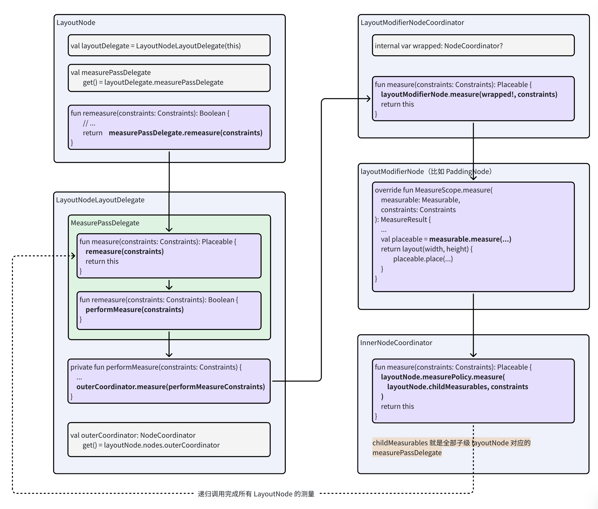
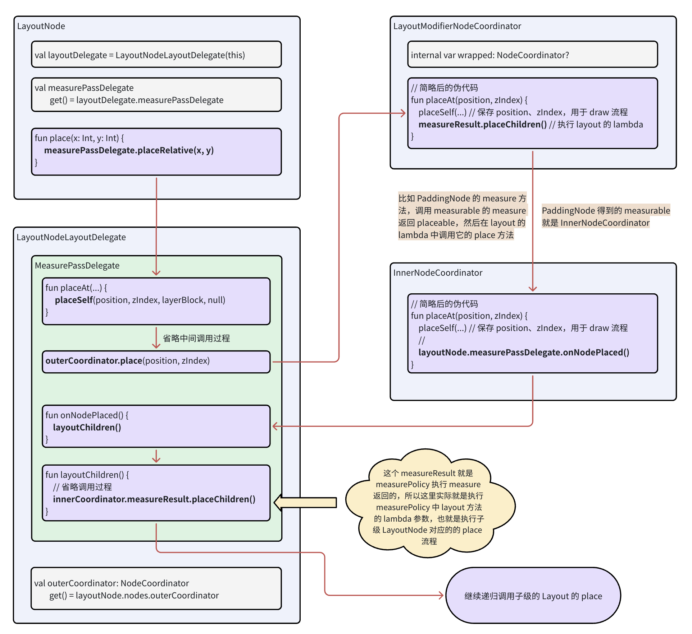

# 测量布局流程
## 引言
执行自定义布局，我们会用到 Compose 提供的一个基础方法 `Layout`：
```kotlin
@Composable
inline fun Layout(
    content: @Composable @UiComposable () -> Unit,
    modifier: Modifier = Modifier,
    measurePolicy: MeasurePolicy
) {
    // ...
}
```
这个方法在源码分析中已经看到过，所有实际执行布局绘制的组件内部都会用到它，`measurePolicy` 和 `modifier` 都会存储在当前创建的 `LayoutNode` 上。


我们先看一个自定义 `MyColumn` 的例子：
```kotlin
@Composable
fun MyColumn(
    modifier: Modifier = Modifier,
    content: @Composable () -> Unit
) {
    // 执行 Layout 方法，最后一个参数就是 MeasurePolicy 函数式接口，执行测量和布局行为
    Layout(
         modifier = modifier,
         content = content
    ) { measurables, constraints ->
        // ✅ 1. 测量每个子级并得到 Placeable 对象
        val placeables = measurables.map { measurable ->
            measurable.measure(constraints)
        }
        // ✅ 2. 计算自己的宽高，并通过 layout 设置

        // Column 的高度是所有项目所测得高度之和
        val height = placeables.sumOf { it.height }
        // Column 的宽度则为内部所含最宽项目的宽度
        val width = placeables.maxOf { it.width }
        // 报告所需的尺寸
        layout (width, height) {
            // 通过跟踪 y 坐标放置每个项目
            var y = 0
            // ✅ 3. 摆放子级
            placeables.forEach { placeable ->
                placeable.placeRelative(x = 0, y = y)
                // 按照所放置项目的高度增加 y 坐标值
                y += placeable.height
            }
        }
    }
}
```
这就是 Compose 布局的三个阶段，是一个模板化的流程，从当前 Node 开始执行：
1. 深度遍历子节点，测量它们的尺寸
2. 得到所有子节点尺寸，确定当前节点的尺寸
3. 将子节点摆放到适当的位置

上面的模板代码，出现了 `MeasurePolicy`、`Placeable` 等概念，下面来进一步了解它们。


## MeasurePolicy、Measurable、Placeable、MeasureScope
`MeasurePolicy` 的核心方法，就是以 `MeasureScope` 为 receiver 的 `measure` 方法：
```kotlin
fun interface MeasurePolicy {
    
    fun MeasureScope.measure(
        measurables: List<Measurable>,
        constraints: Constraints
    ): MeasureResult

    // ...
}
```
这个方法的参数介绍如下：
* `measurables`：代表每个子级 `LayoutNode` 对应的可测量对象，用于对子级执行测量
* `constraints`：父级对当前 `LayoutNode` 的尺寸约束

`Measurable` 的定义如下：
```kotlin
interface Measurable : IntrinsicMeasurable {
    
    fun measure(constraints: Constraints): Placeable
}
```
我们在调用子级的 `Measurable.measure` 方法时，可以根据情况创建具体尺寸的 Constraints，此方法会返回一个 `Placeable` 对象。`Placeable` 是 `LayoutNode` 对外提供用来摆放它的接口，我们可以调用 `Placeable.place` 的一系列方法摆放子级。


`measure` 的 receiver是 `MeasureScope`，所以在 `measure` 方法中可以调用 `MeasureScope` 的 `layout` 方法用于返回 `MeasureResult`(包含宽高等信息，以及摆放子级的 lambda)。

## 调用链路
在源码分析中，我们介绍过 `LayoutNode` 持有的 `NodeChain` 中包含了参与测量布局的 `Modifier.Node` 对应的若干 `NodeCoordinator` `InnerNodeCoordinator` 形成的链。

`LayoutNode` 的测量布局流程由它持有的 `LayoutNodeLayoutDelegate` 负责，下面介绍具体流程。

### 测量流程
首先看一下测量流程的调用过程，从 `AndroidComposeView.onMeasure` 开始：
```
AndroidComposeView.onMeasure
  ⬇️
... 省略调用过程
  ⬇️
LayoutNode.remeasure(constraints)
  ⬇️
LayoutNodeLayoutDelegate.measurePassDelegate.remeasure(constraints)
  ⬇️
  -- performMeasure(constraints)
  -- performMeasureBlock: outerCoordinator.measure(constraints)
  ⬇️
LayoutModifierNode.measure(measurable, constraints)
  ⬇️
... measure 内会递归调用ModifierNode链的后续 measurable.measure(constraints)、LayoutModifierNode.measure(measurable, constraints)
  ⬇️ 最后执行到 InnerNodeCoordinator 的 measurePolicy
InnerNodeCoordinator.measure(constraints)
```

以下面这个代码为例：
```kotlin
Layout(
    modifier = Modifier.padding(10.dp),
    content = content
) { measurables, constraints ->
    // 测量每个项目并将其转换为 Placeable
    val placeables = measurables.map { measurable ->
        measurable.measure(constraints)
    }
    
    layout(width, height) {
        placeables.forEach { placeable ->
            placeable.placeRelative(x = ..., y = ...)
        }
    }
}
```
`LayoutNode` 内会形成 `PaddingNode` 对应的 `LayoutModifierNodeCoordinator` 和 `InnerNodeCoordinator` 两个节点，先从 `PaddingNode` 的 `LayoutModifierNodeCoordinator` 开始执行，执行到 `PaddingNode` 的 `measure` 方法：

```kotlin
private class PaddingNode(
    // ...
) : LayoutModifierNode, Modifier.Node() {

    override fun MeasureScope.measure(
        measurable: Measurable,
        constraints: Constraints
    ): MeasureResult {
        // ...
        // 因为有padding，所以宽高减小后，才传给下一步深度遍历执行测量
        val placeable = measurable.measure(constraints.offset(-horizontal, -vertical))

        // ...
        return layout(width, height) {
            // ...
            placeable.place(start.roundToPx(), top.roundToPx())
        }
    }
}
```
这里接收的 `measurable` 其实就是下一个 `NodeCoordinator`，也就是 `InnerNodeCoordinator`，那么就会继续执行 `measurePolcy`。也就是说 `measurePolcy` 中拿到的宽高约束已经被 `PaddingNode` 先修改过了。

> `LayoutModifierNodeCoordinator`、`InnerNodeCoordinator` 和`LayoutNodeLayoutDelegate.measurePassDelegate` 都实现了 `Measurable` 接口。

测量流程图如下：



### 布局流程
测量之后，会调用 `layout` 方法传入宽高，返回一个包含宽高和执行 `place` 的 lambda 的 `MeasureResult` 对象。这个 `MeasureResult` 对象会被 `NodeCoordinator` 持有，在测量时宽高信息就可以被父级使用用于计算，而在布局时会用到它内部的宽高信息和以及执行 `place` 的代码块，这个代码块会在布局时才执行。

布局的调用过程如下：
```
AndroidComposeView.onLayout
  ⬇️
... 省略调用过程
  ⬇️
LayoutNode.place
  ⬇️
LayoutNodeLayoutDelegate.MeasurePassDelegate.placeRelative （Placeable 扩展方法）
  ⬇️
... 省略部分过程
  ⬇️
LayoutNodeLayoutDelegate.MeasurePassDelegate.placeOuterCoordinator
  -- placeOuterCoordinatorBlock: 执行 outerCoordinator.place
  ⬇️
... 省略部分过程
LayoutModifierNodeCoordinator.placeAt （比如 PaddingNode 对应的）
  -- onAfterPlaceAt()
  -- measureResult.placeChildren(): 执行 PaddingNode measure 方法中调用 layout 传入的 lambda
  -- 执行下一个 measurable.measure(...) 返回的 placeable 的 place 方法
  ⬇️
InnerNodeCoordinator.placeAt
  -- placeSelf: 更新 position 位置信息
  -- onAfterPlaceAt(): 触发子级执行 place
  ⬇️
LayoutNodeLayoutDelegate.MeasurePassDelegate.onNodePlaced
  -- layoutChildren
  -- layoutChildrenBlock
  ⬇️
  
InnerCoordinator.measureResult.placeChildren: 这里就是调用在 layout 传入的 lambda，就会执行子级 place
  ⬇️
... 省略部分过程
  ⬇️
递归调用子级的 LayoutNodeLayoutDelegate.MeasurePassDelegate.placeOuterCoordinator
... 完成所有 LayoutNode 对应的 place 流程。
```
measure 时把包含了调用 `place` 的 lambda 的 `measureResult` 保存在了 `NodeCoordinator` 中。执行布局流程时，从 root LayoutNode 开始，`place` 就会到执行 `outerCoordinator` 持有的 `measureResult` 的 lambda，如果是 `LayoutModifierNodeCoordinator`，它就会执行下一个 `NodeCoordinator` 的 `place`，完成当前LayoutNode 的 Modifer.Node 的执行，然后继续执行到 `InnerCoordinator`，这里就会递归执行所有子级 LayoutNode 的 `place` 流程。


仍然以测量流程中的代码为例，布局流程如下：



## 固有特性测量 (Intrinsic Measurement)
在 View 体系中，如果父级是 wrap_content，多个子级其中一个是 match_parent，就需要执行两次测量才能顺利完成测量。而在 Compose 中不允许两次测量，这种循环依赖的场景就会导致父级和 match_parent 的子级都撑满了父级的父级高度。

比如这个例子，`VerticalDivider` 会让 Row 撑满 Row 的父级高度。
```kotlin
Row {
    Text(text = "text1")
    VerticalDivider(
        color = Color.Black,
        modifier = Modifier.fillMaxHeight().width(1.dp)
    )
}
```

这种情况，使用 `IntrinsicSize` 就可以正常布局：
```kotlin
// ✅ 使用 IntrinsicSize
Row(modifier = Modifier.height(IntrinsicSize.Min)) {
    Text(text = "text1")
    VerticalDivider(
        color = Color.Black,
        modifier = Modifier.fillMaxHeight().width(1.dp)
    )
}
```

虽然 `Compose` 禁止常规的两次测量，但增加了 `Intrinsic Measurement` 流程，相当于 Compose 在实际测量之前

使用 `IntrinsicSize` 的节点，LayoutNode 会持有 `IntrinsicHeightNode / IntrinsicWidthNode` 在测量时会先测量一次子级，得到子级的返回值，而这个返回值最终由 `MeasurePolicy` 的 minIntrinsicHeight 之类的方法来实现。

前面介绍 `MeasurePolicy` 时，只分析了 measure 方法，其实它还有和 `IntrinsicSize` 相关的几个方法：
```kotlin
fun interface MeasurePolicy {

    fun MeasureScope.measure(
        measurables: List<Measurable>,
        constraints: Constraints
    ): MeasureResult

    fun IntrinsicMeasureScope.minIntrinsicWidth(
        measurables: List<IntrinsicMeasurable>,
        height: Int
    ): Int {
        // ...
    }

    // 在给定宽度下，内容完全显示所需的最小高度
    fun IntrinsicMeasureScope.minIntrinsicHeight(
        measurables: List<IntrinsicMeasurable>,
        width: Int
    ): Int {
        // ...
    }

    fun IntrinsicMeasureScope.maxIntrinsicWidth(
        measurables: List<IntrinsicMeasurable>,
        height: Int
    ): Int {
        // ...
    }

    // 在给定宽度下，内容自然舒展所需的最大高度
    fun IntrinsicMeasureScope.maxIntrinsicHeight(
        measurables: List<IntrinsicMeasurable>,
        width: Int
    ): Int {
        val mapped = measurables.fastMap {
            DefaultIntrinsicMeasurable(it, IntrinsicMinMax.Max, IntrinsicWidthHeight.Height)
        }
        val constraints = Constraints(maxWidth = width)
        val layoutReceiver = IntrinsicsMeasureScope(this, layoutDirection)
        val layoutResult = layoutReceiver.measure(mapped, constraints)
        return layoutResult.height
    }
}
```
以高度的纬度为例：
* `minIntrinsicHeight`：子项在特定宽度下，能够显示其内容所需的最小高度。这通常对应内容被“压缩”到极限的状态。**相当于“最低合理需求”**
* `maxIntrinsicHeight`：子项在特定宽度下，能够完整、不截断地显示其内容所需的最大高度。这通常对应内容“舒展”的理想状态。**相当于“最高理想需求”**

很多普通组件里，这两个值可能一样；但对某些可伸缩、可换行、或依赖子项测量策略的布局来说，它们可能不同。

> `MeasurePolicy` 和 `LayoutModifierNode` 都有 Intrinsic 的默认实现，如果有特殊逻辑就需要在这两个地方去重写

# 绘制流程
绘制流程调用链路如下：
```
// 绘制流程
AndroidComposeView.dispatchDraw
  ⬇️
root LayoutNode.draw(canvas, null)
  ⬇️
InnerNodeCoordinator.draw
  -- drawContainedDrawModifiers
  -- performDraw  // 遍历绘制子级
  ⬇️
子级 LayoutNode.draw
  ⬇️
LayoutModifierNodeCoordinator.draw
  ⬇️
GraphicsLayerOwnerLayer.drawLayer
  -- updateDisplayList()
  ⬇️
GraphicsLayer.record
  -- recordInternal
  ⬇️
GraphicsLayerImpl.record  // 比如 GraphicsLayerV29 实现类
  ⬇️
CanvasHolder.drawInto
  ⬇️
GraphicsLayer.clipDrawBlock
  -- recordLambda
  -- drawBlock  // 
  ⬇️
LayoutModifierNodeCoordinator.drawBlock
  -- drawContainedDrawModifiers
  -- performDraw  // 调用 ModifierNode 链的下一个 NodeCoordinator 执行 draw
  -- draw
  -- drawContainedDrawModifiers  // 筛选类型为 `Nodes.Draw` 的 Node
  ⬇️
... 省略中间过程
  ⬇️
DrawModifierNode.draw // 例如执行到 Modifier.background 对应的 BackgroundNode 的绘制流程
```

> measure 流程大多数情况会调用 `placeable.place` 这类没有 layer 的方法，有些情况则会调用 `placeable.placeRelativeWithLayer` 这种创建独立的 layer，例如需要单独控制子元素的透明度、旋转等情况。root LayoutNode 对应的 RootMeasurePolicy 就使用了 `placeable.placeRelativeWithLayer` 创建 layer，至少需要一个 root layer 来绘制。

# 自定义布局
自定义布局的方式：
1. `Layout()`：自定义 `MeasurePolicy`
2. `Modifier.layout`：修改单个组件的测量/放置
3. `SubcomposeLayout`：如果子内容的组合（composition）依赖于父布局的测量结果，可以使用这个方式

> BoxWithConstraints 就是 SubcomposeLayout 的封装

```kotllin
// 根据主内容宽度，动态在后面放一个角标的例子
@Composable
fun BadgeBox(
    modifier: Modifier = Modifier,
    badge: @Composable () -> Unit,
    content: @Composable () -> Unit
) {
    SubcomposeLayout(modifier) { constraints ->
        // 1. 先测量主内容
        val mainPlaceable = subcompose("content", content).first().measure(constraints)

        // 2. 再根据主内容尺寸，测量角标（可以用主内容的宽高做逻辑）
        val badgePlaceable = subcompose("badge", badge).first().measure(
            // 给角标宽松约束
            constraints.copy(minWidth = 0, minHeight = 0)
        )

        // 3. 总尺寸 = 主内容宽度 + 角标宽度
        layout(
            width = mainPlaceable.width + badgePlaceable.width,
            height = mainPlaceable.height
        ) {
            // 放置主内容
            mainPlaceable.place(0, 0)

            // 放置角标：贴在主内容右上位置
            badgePlaceable.place(
                x = mainPlaceable.width,
                y = 0
            )
        }
    }
}
```

# ParentData
`ParentData` 是子组件告诉父布局的额外布局信息，由子级通过 `ParentDataModifierNode` 类型的`Modifier.Node` 存放，父级在测量/布局时通过 `Measurable.parentData` 读取。感觉功能类似 View 体系中父级从子级的 Layoutparam 中获取参数的情况。

比如 `Modifier.layoutId` 和 `Row` 中使用的 `Modifier.weight`、`Modifier.align` 都是使用 `ParentData` 机制实现。

> 比如 `measurable.layoutId`就是从当前 layoutNode 中的 Modifier.Node 列表中找到 `ParentDataModifierNode` 类型的那个，从中取出 `layoutId`。根据源码和实际测试，会遍历得到第一个 ParentData，**所以如果 Modifier 设置了多个 `ParentDataModifierNode`，只有第一个生效。想要多个数据，就只能自己定义一个数据结构，`Row` 就是自定义的数据结构。**

# Modifier composed
Modifier 可以链式调用组合，但是无法添加状态。Modifier 的 `composed`，提供了 @Composable 环境，可以使用 `remember`、`LocalXXX.current`、`LaunchedEffect` 等功能。
```
private fun Modifier.notificationDot(): Modifier =
    composed {
        // 这里是 @Composable 环境

        val tertiaryColor = MaterialTheme.colorScheme.tertiary
        
        drawWithContent {
            drawContent()
            drawCircle(
                tertiaryColor,
                radius = 5.dp.toPx(),
                // This is based on the dimensions of the NavigationBar's "indicator pill";
                // however, its parameters are private, so we must depend on them implicitly
                // (NavigationBarTokens.ActiveIndicatorWidth = 64.dp)
                center = center + Offset(
                    64.dp.toPx() * .45f,
                    32.dp.toPx() * -.45f - 6.dp.toPx(),
                ),
            )
        }
    }
```

# 自定义绘制
1. `Modifier.drawBehind`：在组件内容的后面自定义绘制图形，它的内部就是先调用我们写的绘制代码，再调用 `drawContent()` 绘制内容
2. `Modifier.drawWithContent`：完全自定义绘制，可以调用 `drawContent()` 绘制子级内容，然后在调用它的前后任意自定义绘制
3. `Modifier.drawWithCache`：和 `drawWithContent` 类似，但传入的代码块会被缓存，从而避免 Paint 等对象频繁创建，除非尺寸等情况变化才会失效
4. `Canvase`： 基于 `Modifier.drawBehind` 实现的绘制组件
