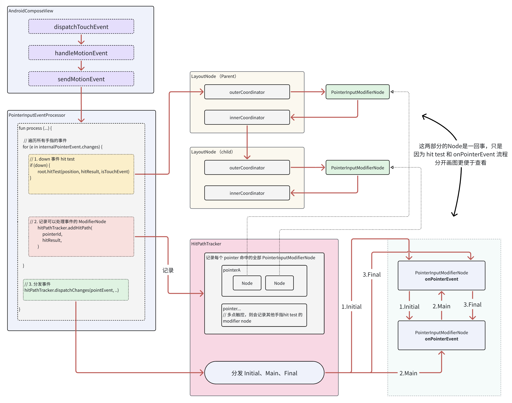

# 源码分析

## AndroidComposeView
事件从 View 体系开始，所以从 `AndroidComposeView` 的 `dispatchTouchEvent` 开始看：
```kotlin
// AndroidComposeView

    override fun dispatchTouchEvent(motionEvent: MotionEvent): Boolean {
        // ...
        
        // 核心流程
        val processResult = handleMotionEvent(motionEvent)

        if (processResult.anyMovementConsumed) {
            parent.requestDisallowInterceptTouchEvent(true)
        }

        return processResult.dispatchedToAPointerInputModifier
    }

    private fun handleMotionEvent(motionEvent: MotionEvent): ProcessResult {
        removeCallbacks(resendMotionEventRunnable)
        try {
            recalculateWindowPosition(motionEvent)
            forceUseMatrixCache = true
            measureAndLayout(sendPointerUpdate = false)
            val result = trace("AndroidOwner:onTouch") {

                // ... 省略鼠标事件处理

                sendMotionEvent(motionEvent)
            }
            return result
        } finally {
            forceUseMatrixCache = false
        }
    }

    private fun sendMotionEvent(motionEvent: MotionEvent): ProcessResult {
        
        // ✅ 1. 把 Android 的 MotionEvent 转化为 PointerInputEvent
        val pointerInputEvent =
            motionEventAdapter.convertToPointerInputEvent(motionEvent, this)
        return if (pointerInputEvent != null) {
            
            // ...

            // ✅ 2. 将事件交给 pointerInputEventProcessor 处理
            val result = pointerInputEventProcessor.process(
                pointerInputEvent,
                this,
                isInBounds(motionEvent)
            )
            val action = motionEvent.actionMasked
            if ((action == ACTION_DOWN || action == ACTION_POINTER_DOWN) &&
                !result.dispatchedToAPointerInputModifier
            ) {
                // ✅ 3. 当手指按下但没有任何 Composable 处理时，强制结束该指针的事件流，重置内部状态。
                motionEventAdapter.endStream(motionEvent.getPointerId(motionEvent.actionIndex))
            }
            result
        } else {
            // ✅ 4. ACTION_CANCEL 的情况
            pointerInputEventProcessor.processCancel()
            ProcessResult(
                dispatchedToAPointerInputModifier = false,
                anyMovementConsumed = false
            )
        }
    }
```
`AndroidComposeView` 中主要就是把事件交给 `pointerInputEventProcessor` 来处理。

> 这里可以了解一下，`motionEventAdapter.convertToPointerInputEvent` 中会存储 positionOnScreen 屏幕坐标，和 position 本地坐标。positionOnScreen 始终不变（作为原始输入基准），而 position 在每一层 LayoutNode都会被转换，是“当前节点视角”的坐标。

## PointerInputEventProcessor
```kotlin
internal class PointerInputEventProcessor(val root: LayoutNode) {

    private val hitPathTracker = HitPathTracker(root.coordinates)
    private val pointerInputChangeEventProducer = PointerInputChangeEventProducer()
    private val hitResult = HitTestResult()

    fun process(
        pointerEvent: PointerInputEvent,
        positionCalculator: PositionCalculator,
        isInBounds: Boolean = true
    ): ProcessResult {
        
        try {

            // ✅ 转换为 InternalPointerEvent 类型，包含 PointerInputChange 对象（携带前一次事件的状态，描述变化）
            val internalPointerEvent =
                pointerInputChangeEventProducer.produce(pointerEvent, positionCalculator)


            // 如果有手指按住或者鼠标按钮按下，则不是 hover
            var isHover = true
            for (i in 0 until internalPointerEvent.changes.size()) {
                val pointerInputChange = internalPointerEvent.changes.valueAt(i)
                if (pointerInputChange.pressed || pointerInputChange.previousPressed) {
                    isHover = false
                    break
                }
            }

            // ✅ 对发生 down（或 hover）事件执行 hit test 并向 hitPathTracker 添加新的命中路径
            for (i in 0 until internalPointerEvent.changes.size()) {
                val pointerInputChange = internalPointerEvent.changes.valueAt(i)
                if (isHover || pointerInputChange.changedToDownIgnoreConsumed()) {
                    val isTouchEvent = pointerInputChange.type == PointerType.Touch
                    // ✅ 执行 hitTest，hitResult 会被写入
                    // hitResult 是 List<Modifier.Node> 类型
                    root.hitTest(pointerInputChange.position, hitResult, isTouchEvent)
                    if (hitResult.isNotEmpty()) {
                        // ✅ 被消费，就会放到 hitPathTracker 中
                        hitPathTracker.addHitPath(
                            pointerId = pointerInputChange.id,
                            pointerInputNodes = hitResult,
                            // 如果是 down，hitPathTracker 会修剪其追踪的数据以移除不再有效的 pointerId/change
                            prunePointerIdsAndChangesNotInNodesList =
                            pointerInputChange.changedToDownIgnoreConsumed()
                        )
                        hitResult.clear()
                    }
                }
            }

            hitPathTracker.removeDetachedPointerInputNodes()

            // ✅ 分发事件 到具体的 Modifier.Node 的 onPointerEvent 方法
            val dispatchedToSomething =
                hitPathTracker.dispatchChanges(internalPointerEvent, isInBounds)

            // 是否手指移动并且被消费
            val anyMovementConsumed = ...

            return ProcessResult(dispatchedToSomething, anyMovementConsumed)
        } finally {
            isProcessing = false
        }
    }

}
```
这里的主要流程就是：
1. 转换事件类型
2. down 事件调用 `LayoutNode.hitTest`，然后调用 `hitPathTracker.addHitPath` 记录 hitResult 中的 `List<Modifier.Node>`
3. 所有事件，都调用 `hitPathTracker.dispatchChanges` 分发

## Hit Test
对每个 `down` 事件都会调用 `hitTest`：

```kotlin
// LayoutNode

    internal fun hitTest(
        pointerPosition: Offset,
        hitTestResult: HitTestResult,
        isTouchEvent: Boolean = false,
        isInLayer: Boolean = true
    ) {
        // ✅ 1. 将父级的 pointerPosition 转换为当前 LayoutNode 的 position（实际就是减去 layout 时设置的 position）
        val positionInWrapped = outerCoordinator.fromParentPosition(pointerPosition)

        // ✅ 2. 交给 ModifierNode 链的最外层开始执行
        outerCoordinator.hitTest(
            NodeCoordinator.PointerInputSource,
            positionInWrapped,
            hitTestResult,
            isTouchEvent,
            isInLayer
        )
    }
```

继续看：
```
// NodeCoordinator

    fun hitTest(
        hitTestSource: HitTestSource,
        pointerPosition: Offset,
        hitTestResult: HitTestResult,
        isTouchEvent: Boolean,
        isInLayer: Boolean
    ) {
        // ✅ 找到第一个 PointerInputModifierNode 类型的 Modifier.Node
        val head = head(hitTestSource.entityType())
        if (!withinLayerBounds(pointerPosition)) {
            // ✅ 分支 1：Layer 裁剪区域之外“最小触摸目标”容错——当指针落在当前布局的裁剪区域之外但仍落在该布局的最小触摸范围内时，仍把它当作一次有效命中（或候选命中），并根据距离优先级决定是否记录为更好的命中。
            // ...
        } else if (head == null) {
            // ✅ 分支 2：当前没有处理事件的 Modifier.Node，交给下一个 NodeCoordinate 处理，直到 InnerNodeCoordinator 调用
            // 子级 LayoutNode.hitTest
            hitTestChild(hitTestSource, pointerPosition, hitTestResult, isTouchEvent, isInLayer)
        } else if (isPointerInBounds(pointerPosition)) {
            // ✅ 分支 3: 命中边界内，主要流程
            head.hit(
                hitTestSource,
                pointerPosition,
                hitTestResult,
                isTouchEvent,
                isInLayer
            )
        } else {
            // ✅ 分支4: 在裁剪范围内，但在组件范围外
            // ...
        }
    }
```
总结来说，就先找一下 `PointerInputModifierNode` 类型的 `Modifier.Node`，然后根据情况执行以下分支：
1. **触摸点不在 layer 裁剪区域内**：如果是触摸事件，且在最小触摸目标（48dp）内，仍然触发 hit
2. **在 layer 内，但没有处理事件的`Modifier.Node`**：继续往子组件树深度遍历命中测试
3. **真正在组件区域内命中**：核心流程
4. **在 Layer 内，但超出组件大小**：在最小触摸目标（48dp）内，仍然触发 hit


核心流程就是继续调用 `hit` 方法：
```kotlin
// NodeCoordinator

    private fun Modifier.Node?.hit(
        hitTestSource: HitTestSource,
        pointerPosition: Offset,
        hitTestResult: HitTestResult,
        isTouchEvent: Boolean,
        isInLayer: Boolean
    ) {
        if (this == null) {
            // 遍历完 Modifier.Node，调用子节点
            hitTestChild(hitTestSource, pointerPosition, hitTestResult, isTouchEvent, isInLayer)
        } else {
            // ✅ 在 HitTestResult 中记录当前 LayoutNode
            hitTestResult.hit(this, isInLayer) {
                // 继续遍历 Modifier 链中的下一个节点
                nextUntil(hitTestSource.entityType(), Nodes.Layout)
                    .hit(hitTestSource, pointerPosition, hitTestResult, isTouchEvent, isInLayer)
            }
        }
    }
```

### hitTestChild
普通的 `NodeCoordinator.hitTestChild` 就是交给下一个 `NodeCoordinator` 处理，仍然只是在同一个 LayoutNode 中的不同 Modifier.Node 链中转发，而 `InnerNodeCoordinator` 中重写了 `hitTestChild`，这里才是真正交给子级 LayoutNode 的地方：

```kotlin
    override fun hitTestChild(
        hitTestSource: HitTestSource,
        pointerPosition: Offset,
        hitTestResult: HitTestResult,
        isTouchEvent: Boolean,
        isInLayer: Boolean
    ) {
        var inLayer = isInLayer
        var hitTestChildren = false

        if (hitTestSource.shouldHitTestChildren(layoutNode)) { // 条件为 true
            if (withinLayerBounds(pointerPosition)) {
                hitTestChildren = true
            } else if (isTouchEvent &&
                distanceInMinimumTouchTarget(pointerPosition, minimumTouchTargetSize).isFinite()
            ) {
                inLayer = false
                hitTestChildren = true
            }
        }
        // 会执行这里
        if (hitTestChildren) {
            hitTestResult.siblingHits {
                // 按 Z-Index 从高到底遍历子 layoutNode
                layoutNode.zSortedChildren.reversedAny { child ->
                    if (child.isPlaced) {
                        // ✅ 实际就是调用 layoutNode.hitTest
                        hitTestSource.childHitTest(
                            child,
                            pointerPosition,
                            hitTestResult,
                            isTouchEvent,
                            inLayer
                        )
                        val wasHit = hitTestResult.hasHit()
                        val continueHitTest: Boolean
                        if (!wasHit) {
                            // ✅ 没有命中，继续遍历
                            continueHitTest = true
                        } else if (hitTestResult.shouldSharePointerInputWithSibling) {
                            // 如果需要和同级兄弟节点共享事件，则继续遍历（默认不会共享）
                            hitTestResult.acceptHits()
                            continueHitTest = true
                        } else {
                            // ✅ 命中，结束遍历
                            continueHitTest = false
                        }
                        !continueHitTest
                    } else {
                        false
                    }
                }
            }
        }
    }
```
这里流程比较简单，就是命中就结束遍历，否则继续遍历。

> 重写 PointerInputModifierNode 的 `sharePointerInputWithSiblings()`方法可以控制是否共享事件，一般不会用到。

## HitPathTracker.addHitPath
hit test 流程只是先找到哪些 `Modifier.Node` 有机会处理这个事件，剩下的流程还需要 `HitPathTracker` 来处理。

`PointerInputEventProcessor` 对每个 pointerId 调用 `hitTest` 后，会调用`hitPathTracker.addHitPath`：
```kotlin
// HitPathTracker

    fun addHitPath(
        pointerId: PointerId,
        pointerInputNodes: List<Modifier.Node>, // Hit Test 的节点，也就是 hitResult
        prunePointerIdsAndChangesNotInNodesList: Boolean = false  // down 的时候为 true
    ) {
        var parent: NodeParent = root
        hitPointerIdsAndNodes.clear()
        var merging = true

        eachPin@ for (i in pointerInputNodes.indices) {
            val pointerInputNode = pointerInputNodes[i]

            if (merging) {
                val node = parent.children.firstOrNull {
                    it.modifierNode == pointerInputNode
                }
                // 如果已经存在当前 Modifier.Node，就把 pointerId 记录到包装后的 node 中（用于多点触控逻辑）
                if (node != null) {
                    node.markIsIn()
                    node.pointerIds.add(pointerId)

                    val mutableObjectList =
                        hitPointerIdsAndNodes.getOrPut(pointerId.value) { mutableObjectListOf() }

                    mutableObjectList.add(node)
                    parent = node
                    continue@eachPin
                } else {
                    // 不存在的话，merging 改为 false，之后就会都走新建 Node 的流程
                    // 因为多点触控，从不一样的那个层级开始，node 树就需要分叉了
                    merging = false
                }
            }
            // ✅：将 Modifier.Node 包装为这里的 Node 类型
            val node = Node(pointerInputNode).apply {
                pointerIds.add(pointerId)
            }

            val mutableObjectList =
                hitPointerIdsAndNodes.getOrPut(pointerId.value) { mutableObjectListOf() }
            // 将 node 放到 pointerId 对应的 List 中
            mutableObjectList.add(node)

            parent.children.add(node)
            parent = node
        }

        if (prunePointerIdsAndChangesNotInNodesList) {
            hitPointerIdsAndNodes.forEach { key, value ->
                removeInvalidPointerIdsAndChanges(key, value)
            }
        }
    }
```

## HitPathTracker.dispatchChanges
对全部手指触摸遍历执行 `hitTest` 和 `addHitPath` 后，就会执行 `dispatchChanges`

```kotlin
// HitPathTracker

    fun dispatchChanges(
        internalPointerEvent: InternalPointerEvent,
        isInBounds: Boolean = true
    ): Boolean {
        // ✅ 1. 为每个被命中的节点预先计算并缓存事件分派中会用到的已过滤 pointerId 的、局部坐标系下的 PointerInputChange / PointerEvent
        // 在同一帧就计算一次，在本次的各阶段直接使用，不再重复计算
        val changed = root.buildCache(
            internalPointerEvent.changes,
            rootCoordinates,
            internalPointerEvent,
            isInBounds
        )
        if (!changed) {
            return false
        }

        // ✅ 2. 执行 Initial 和 Main 阶段
        var dispatchHit = root.dispatchMainEventPass(
            internalPointerEvent.changes,
            rootCoordinates,
            internalPointerEvent,
            isInBounds
        )
        // ✅ 3. 执行 Final 阶段
        dispatchHit = root.dispatchFinalEventPass(internalPointerEvent) || dispatchHit

        return dispatchHit
    }
```

### dispatchMainEventPass

```kotlin
// HitTestTracker.Node

    override fun dispatchMainEventPass(
        changes: LongSparseArray<PointerInputChange>,
        parentCoordinates: LayoutCoordinates,
        internalPointerEvent: InternalPointerEvent,
        isInBounds: Boolean
    ): Boolean {
        return dispatchIfNeeded {
            val event = pointerEvent!!
            val size = coordinates!!.size

            // ✅ 1. Initial 阶段
            // 调用当前 PointerInputModifierNode 的 onPointerEvent 方法
            modifierNode.dispatchForKind(Nodes.PointerInput) {
                it.onPointerEvent(event, PointerEventPass.Initial, size)
            }

            // ✅ 2. 【递归】调用子节点，同样执行 Initial 阶段和 Main 阶段的 onPointerEvent 方法
            // 单点触控，children 长度为1，就是单链表；多点触控不同组件，children 长度大于1 就会形成树
            if (modifierNode.isAttached) {
                children.forEach {
                    it.dispatchMainEventPass(
                        // Pass only the already-filtered and position-translated changes down to
                        // children
                        relevantChanges,
                        coordinates!!,
                        internalPointerEvent,
                        isInBounds
                    )
                }
            }

            if (modifierNode.isAttached) {
                // ✅ 3. 执行 Main 阶段
                // 调用 onPointerEvent 方法
                modifierNode.dispatchForKind(Nodes.PointerInput) {
                    it.onPointerEvent(event, PointerEventPass.Main, size)
                }
            }
        }
    }
```
因为先分发 `Initial`，然后递归，再执行 `Main`，所以整体来说，`Inital` 是从父级到子级执行，而 `Main` 从子级到父级冒泡执行。


### dispatchFinalEventPass

```kotlin
    override fun dispatchFinalEventPass(internalPointerEvent: InternalPointerEvent): Boolean {
        val result = dispatchIfNeeded {
            val event = pointerEvent!!
            val size = coordinates!!.size
            // ✅ 执行 Final 阶段
            // 调用 onPointerEvent
            modifierNode.dispatchForKind(Nodes.PointerInput) {
                it.onPointerEvent(event, PointerEventPass.Final, size)
            }

            // 递归调用子级
            if (modifierNode.isAttached) {
                children.forEach { it.dispatchFinalEventPass(internalPointerEvent) }
            }
        }
        cleanUpHits(internalPointerEvent)
        clearCache()
        return result
    }
```
`Final` 也是从父级到子级执行

## onPointerEvent
`Initial`、`Main`、`Final` 流程其实都是调用 `PointerInputModifierNode.onPointerEvent` 方法：
 
```kotlin
fun onPointerEvent(
    pointerEvent: PointerEvent,
    pass: PointerEventPass,
    bounds: IntSize
)
```

具体的实现就是如何处理事件了，比如可以看看点击事件的内部实现。

> `Initial`、`Main`、`Final` 本质就只是标记作用，具体还是要 `onPointerEvent` 内根据不同阶段实现对应逻辑

## 消费机制

前面只看到了事件分发机制，还没有看到类似 View 体系中的事件消费机制，现在来介绍。`Compose` 中调用 `PointerInputChange.consume()` 就会将 阻止继续传递

例如 `Modifier.clickable` 会用到 `PointerInputScope.detectTapAndPress`，内部会在 down 事件时调用 `PointerInputChange.consume()`，`awaitFirstDown` 之类的方法也会检查 `isConsumed`，已经被消费，就不会再处理

> 假如我们直接使用 `Modifier.pointerInput` 这种低级别事件处理方式， 并且没有调用 `consume()`，就会发生重叠的多个组件都响应事件的情况。

## 源码总结
核心流程：
1. `AndroidComposeView` 把事件交给 `pointerInputEventProcessor` 处理
2. `pointerInputEventProcessor` 遍历每个手指的事件，执行 `hit test`，并调用 `hitPathTracker.addHitPath`，最终调用 `hitPathTracker.dispatchChanges`
3. `hit test` 会深度遍历每个 `LayoutNode`，得到触摸范围内的全部 `PointerInputModifierNode`
4. `hitPathTracker.addHitPath` 会以手指为单位记录 `hit test` 得到的全部 `PointerInputModifierNode`
5. `hitPathTracker.dispatchChanges` 会分别以 `Initial`、`Main`、`Fianl` 标记为参数，调用 `PointerInputModifierNode.onPointerEvent` 方法
6. `onPointerEvent` 方法中自行实现实际的事件处理逻辑，并且需要考虑在恰当的时机调用 `consume()` 消费事件。

流程图如下：



### 多点触控例子
例如这样的UI结构：
```
Box(Modifier.pointerInput(Unit) { ... }) {         // Node A
  Box(Modifier.pointerInput(Unit) { ... }) {       // Node B
    // ...
  }
  Box(Modifier.pointerInput(Unit) { ... }) { }     // Node C（和 B 同级）
}
```
当手指 0 放在 Node B 上：`addHitPath(pointerId=0, [A, B])`
* `hitPathTracker` 中会记录：root → NodeA(pointers=[0]) → NodeB(pointers=[0])


手指 0 未抬起的情况，把手指 1 放在 Node C 上：`addHitPath(pointer=1, [A, C])`
* `hitPathTracker`记录的 NodeA 已存在，增加记录 pointerId：NodeA.pointerIds = [0, 1]
* NodeC 还是需要创建，所以此时记录为：
    ```
    root -- NodeA(pointers=[0,1]) 
             |-- NodeB(pointers=[0]) // 手指 0 的路径
             `-- NodeC(pointers=[1]) // 手指 1 的路径
    ```

`Node.buildCache` 递归调用会按 pointerId 过滤掉多点触控中不属于当前组件的事件数据，构造 Node 需要处理的那个 pointer 相关的 `PointerEvent`，这样分发遍历就完成了多点触控的逻辑。（和 View 体系中，MotionEvent split 逻辑类似）。


# 常用事件处理方法
* `Modifier.pointerInput`：低级别的事件处理，基本所有的便捷手势处理都会基于这个内部使用的方式
* `Modifier.clickable`：点击事件
* `Modifier.combinedClickable`：点击、长按、双击等事件
* `Modifier.draggable`：拖拽事件
* `Modifier.transformable`：多点触控变换手势（如缩放、旋转、平移）
* `Modifier.scrollable`、`horizontalScroll`、`verticalScroll`：滑动和fling

在 `Modifier.pointerInput` 这个基础的事件处理方式中，会使用一些挂起函数来处理事件，比如`awaitPointerEventScope` 和 `awaitEachGesture`，它们都提供了 `AwaitPointerEventScope` 这个 receiver，所以可以在这两个方法中又可以调用这些常用方法：
* detectDragGestures
* detectVerticalDragGestures
* detectDragGesturesAfterLongPress
* ... 还有一些省略


# Modifier.nestedScroll 嵌套滑动

`Modifier.nestedScroll` 使用的 `NestedScrollConnection` 和 `NestedScrollDispatcher` 会用于父子通信，构建和传统 view 体系类似的嵌套滑动方式：
* `NestedScrollConnection`：必须使用，父布局通过实现它来接收子布局的滚动，并决定是否“劫持”(onPreScroll)或在子布局滚动后“接手”(onPostScroll)，以及处理 onPreFling 和 onPostFling。
* `NestedScrollDispatcher`：发起滑动的子组件通过它分发事件 dispatchPreScroll、dispatchPostScroll、dispatchPreFling、dispatchPostFling（如果当前组件只会作为嵌套滑动的父级，就不需要使用它，如果也可能作为嵌套滑动的子级，则需要使用）

`Modifier.nestedScroll` 自身并不会处理事件，所以它需要配合 `Modifier.scrollable` 之类的滑动事件机制才能正常工作。