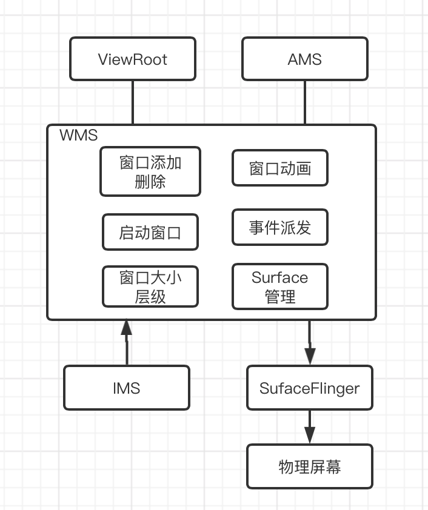
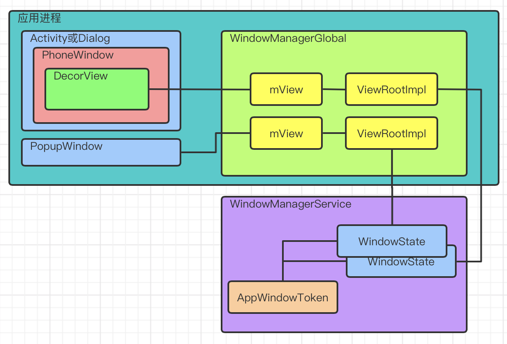

## WMS的角色
为了显示UI界面这个目标的比喻：
* SurfaceFlinger：作为摄像机，负责捕获画面呈现出来
* WMS：作为导演，安排各个演员前后占位等
* ViewRoot：作为演员，表现各自的画面

并且需要与其他服务合作：
* AMS：AMS管理Activity，而每个Activity都需要窗口来显示界面
* InputManagerService：IMS收到按键或者触摸事件，将寻找合适的Window来处理消息，而WMS作为Window的管理者，当时需要承担这一任务

## WMS的启动
WMS是在SystemServer的startOtherServices方法中启动的：
```
//会传入IMS、ATMS等
wm = WindowManagerService.main(context, inputManager, !mFirstBoot, mOnlyCore,
                    new PhoneWindowManager(), mActivityManagerService.mActivityTaskManager);
ServiceManager.addService(Context.WINDOW_SERVICE, wm, /* allowIsolated= */ false,
                    DUMP_FLAG_PRIORITY_CRITICAL | DUMP_FLAG_PROTO);
...
//并且会传给AMS
mActivityManagerService.setWindowManager(wm);
...
//也会对IMS设置回调
inputManager.setWindowManagerCallbacks(wm.getInputManagerCallback());
```

调用WMS的静态方法main来得到WMS的实例，其中会持有IMS、DisplayManager、PowerManager，AMS和ATMS的Binder引用等等。

## WMS的基础功能
WMS使用AIDL来描述它的接口
```
/frameworks/base/core/java/android/view/IWindowManager.aidl

interface IWindowManager{
    ...
    //与WMS建立Session连接
    IWindowSession openSession(in IWindowSessionCallback callback);
    ...
    //以下几个和Display有关
    @UnsupportedAppUsage
    void getInitialDisplaySize(int displayId, out Point size);
    @UnsupportedAppUsage
    void getBaseDisplaySize(int displayId, out Point size);
    void setForcedDisplaySize(int displayId, int width, int height);
    ...
    // These can only be called when holding the MANAGE_APP_TOKENS permission.
    void setEventDispatching(boolean enabled);
    void addWindowToken(IBinder token, int type, int displayId);
    void removeWindowToken(IBinder token, int displayId);
    void prepareAppTransition(int transit, boolean alwaysKeepCurrent);//窗口动画相关
    ...
    //和屏幕旋转相关接口
    void updateRotation(boolean alwaysSendConfiguration, boolean forceRelayout);
    int getDefaultDisplayRotation();
    int watchRotation(IRotationWatcher watcher, int displayId);
    @UnsupportedAppUsage
    void removeRotationWatcher(IRotationWatcher watcher);
    ...
```


## WMS的工作方式
WMS内部有一个内部Handler子类H，WMS处理事件，有的是直接调用处理，有的是通过Handler投递事件排队处理：
```
//直接调用方式
public boolean isKeyguardLocked() {
    return WindowManagerService.this.isKeyguardLocked();
}
```

```
//事件投递方式
public void showStrictModeViolation(boolean on) {
    final int pid = Binder.getCallingPid();
    if (on) {
        // Show the visualization, and enqueue a second message to tear it
        // down if we don't hear back from the app.
        mH.sendMessage(mH.obtainMessage(H.SHOW_STRICT_MODE_VIOLATION, 1, pid));
        mH.sendMessageDelayed(mH.obtainMessage(H.SHOW_STRICT_MODE_VIOLATION, 0, pid),
                DateUtils.SECOND_IN_MILLIS);
    } else {
        mH.sendMessage(mH.obtainMessage(H.SHOW_STRICT_MODE_VIOLATION, 0, pid));
    }
}
```

## WMS的整体工作结构


#### 以Activity为例
Activity在`attach`中创建PhoneWindow，在`onCreate`中调用setContentView就会让PhoneWindow初始化内部的DecorView，然后在`onResume`后，会调用WindowManager的addView，最终调用到ViewRootImpl的setView方法，然后会跨进程调用WMS的addWindow。

1. Activity的onAttach中创建了PhoneWindow，window会持有Activity对应的mToken，并创建了WindowManager：
```
// Window#setWindowManager

mAppToken = appToken;//Window持有Activity的mToken
mAppName = appName;
mHardwareAccelerated = hardwareAccelerated;
if (wm == null) {
    //原本注册了获取实例的方式于SystemServiceRegistry的static块，现在从中获取，即创建持有当前Context
    //也就是对应此Activity的WindowManagerImpl实例，并且会缓存
    wm = (WindowManager)mContext.getSystemService(Context.WINDOW_SERVICE);
}
//这里则是根据wm新创建的新实例，this为PhoneWindow
mWindowManager = ((WindowManagerImpl)wm).createLocalWindowManager(this);
```
这个mWindowManager会持有Activity类型的Context，并且以PhoneWindow为mParentWindow。

2. makeVisible
ActivityThread中的`handleResumeActivity`中会调用Activity的`makeVisible`方法：
```
void makeVisible() {
    if (!mWindowAdded) {
        ViewManager wm = getWindowManager();
        wm.addView(mDecor, getWindow().getAttributes());
        mWindowAdded = true;
    }
    mDecor.setVisibility(View.VISIBLE);
}
```
调用WindowManagerImpl的addView方法：
```
public void addView(@NonNull View view, @NonNull ViewGroup.LayoutParams params) {
    applyDefaultToken(params);
    //mParentWindow就是onAttch中传入的Activity的PhoneWindow
    mGlobal.addView(view, params, mContext.getDisplay(), mParentWindow);
}
```

然后调用到WindowManagerGlobal：
```
public void addView(View view, ViewGroup.LayoutParams params,
        Display display, Window parentWindow) {
    ...
    final WindowManager.LayoutParams wparams = (WindowManager.LayoutParams) params;
    if (parentWindow != null) {
        //内部会根据当前type，如果是应用窗口，wparams的token就会赋值为Activity的attach传给PhoneWindow的mToken
        parentWindow.adjustLayoutParamsForSubWindow(wparams);
    } else {
        ...
    }

    ViewRootImpl root;
    View panelParentView = null;
    synchronized (mLock) {
        ...
        root = new ViewRootImpl(view.getContext(), display);
        view.setLayoutParams(wparams);
        mViews.add(view);
        mRoots.add(root);
        mParams.add(wparams);
        // do this last because it fires off messages to start doing things
        try {
            root.setView(view, wparams, panelParentView);
        } catch (RuntimeException e) {
            // BadTokenException or InvalidDisplayException, clean up.
            if (index >= 0) {
                removeViewLocked(index, true);
            }
            throw e;
        }
    }
}
```
创建了ViewRootImpl，ViewRootImpl的构造函数中会初始化IWindowSession：
```
mWindowSession = WindowManagerGlobal.getWindowSession();
```

WindowManagerGlobal.getWindowSession如下：
```
public static IWindowSession getWindowSession() {
    synchronized (WindowManagerGlobal.class) {
        if (sWindowSession == null) {
            try {
                InputMethodManager.ensureDefaultInstanceForDefaultDisplayIfNecessary();
                IWindowManager windowManager = getWindowManagerService();
                sWindowSession = windowManager.openSession(
                        new IWindowSessionCallback.Stub() {
                            @Override
                            public void onAnimatorScaleChanged(float scale) {
                                ValueAnimator.setDurationScale(scale);
                            }
                        });
            } catch (RemoteException e) {
                throw e.rethrowFromSystemServer();
            }
        }
        return sWindowSession;
    }
}
```
这里会跨进程调用WMS的openSession方法，得到mWindowSession为IWindowSession，在WMS中对应Session，然后在ViewRootImpl中就可以通过mWindowSession来调用WMS。


然后调用其setView：
```
public void setView(View view, WindowManager.LayoutParams attrs, View panelParentView) {
    synchronized (this) {
        if (mView == null) {
            mView = view;
            ...
            requestLayout();//测量、布局、绘制流程
            ...
            try {
                ...
                res = mWindowSession.addToDisplay(mWindow, mSeq, mWindowAttributes,
                        getHostVisibility(), mDisplay.getDisplayId(), mTmpFrame,
                        mAttachInfo.mContentInsets, mAttachInfo.mStableInsets,
                        mAttachInfo.mOutsets, mAttachInfo.mDisplayCutout, mInputChannel,
                        mTempInsets);
                setFrame(mTmpFrame);
            } catch (RemoteException e) {
                ...
            } finally {
                if (restore) {
                    attrs.restore();
                }
            }
            ...
        }
    }
}
```
虽然requestLayout在前面，但是其内部是注册绘制任务在下一个垂直同步信号时执行，所以先执行mWindowSession.addToDisplay，内部会调用WMS的addWindow：
```
...
final WindowState win = new WindowState(this, session, client, token, parentWindow,
        appOp[0], seq, attrs, viewVisibility, session.mUid,
        session.mCanAddInternalSystemWindow);
...
win.attach();
mWindowMap.put(client.asBinder(), win);
...
```
WindowState的attach方法，会调用session的windowAddedLocked：
```
//session内部初始化mSurfaceSession，实际就是和Native层的SurfaceFlinger建立会话
mSurfaceSession = new SurfaceSession();
```


再回头来看requestLayout，它会执行到performTraversals --> relayoutWindow：
```
private int relayoutWindow(WindowManager.LayoutParams params, int viewVisibility,
            boolean insetsPending) throws RemoteException {
    ...
    int relayoutResult = mWindowSession.relayout(mWindow, mSeq, params,
            (int) (mView.getMeasuredWidth() * appScale + 0.5f),
            (int) (mView.getMeasuredHeight() * appScale + 0.5f), viewVisibility,
            insetsPending ? WindowManagerGlobal.RELAYOUT_INSETS_PENDING : 0, frameNumber,
            mTmpFrame, mPendingOverscanInsets, mPendingContentInsets, mPendingVisibleInsets,
            mPendingStableInsets, mPendingOutsets, mPendingBackDropFrame, mPendingDisplayCutout,
            mPendingMergedConfiguration, mSurfaceControl, mTempInsets);
    if (mSurfaceControl.isValid()) {
        mSurface.copyFrom(mSurfaceControl);
    } else {
        destroySurface();
    }
    ...
}
```
这里会调用mWindowSession.relayout，将ViewRootImpl的mSurfaceControl传入，这里的mSurfaceControl是一个空壳子。mWindowSession.relayout会调用到WMS的relayoutWindow，WMS中会调用到JNI层得到SurfaceControl（在WindowSurfaceController持有），SurfaceControl就是WMS中控制Native中的Surface的对应类，
然后调用：
```
void getSurfaceControl(SurfaceControl outSurfaceControl) {
    outSurfaceControl.copyFrom(mSurfaceControl);//会经过Native层调用
}
```
把数据填充到了应用进程ViewRootImpl中的mSurfaceControl和mSurface，然后才会调用测量布局绘制的流程。


#### 总结：相关数据结构的概念
* Window：应用进程中的Window（子类PhoneWindow）实际只是一个抽象的概念，界面上并没有真实的Window，它的很多工作都是在代理其内部的DecorView，或者管理WindowManager.LayoutParams等。
* windowManager.addView：添加的View只是放在ViewRootImpl中，WMS与ViewRootImpl通信来控制View
* WindowToken和AppWindowToken：AppWindowToken是WindowToken子类。ActivityStack#startActivityLocked会调用ActivityRecord的`createAppWindowToken()`方法，创建AppWindowToken并持有Activityecord.appToken，最终通过WindowToken的onDisplayChanged方法调用DisplayContent的reParentWindowToken方法，将Activityecord.appToken和AppWindowToken添加到WMS中DisplayContent的map数据中，WMS的addWindow
* IWindow.Stub的子类ViewRootImpl.W：也就是IWindow在应用进程中的实现
* WindowState：WMS中的窗口，在WMS的addWindow中创建，并与IWindow存到map，WindowState中会持有Session、IWindow、WindowToken等

#### Dialog
也属于应用窗口类型，它用的token和所属的activity用的一样，因为在show的时候，使用的windowManager就是显示Activity窗口时创建并缓存的，所以其中已经设置了mParentWindow为Activity的窗口，在WMG的addView中，调用parentWindow.adjustLayoutParamsForSubWindow，就会把Activity的Window的token设置给WindowManager.LayoutParams，用于传入WMS。在WMS和Activity共用AppWindowToken。使用非activity的context无法显示dialog，就是因为其他context得到的WindowManagerImpl中没有mParentWindow，也就无法设置token

#### PopupWindow
属于子窗口类型，也是使用缓存的WindowManager，parentWindow和dialog一样都是Activity的PhoneWindow。它对应的WindowManager.LayoutParams的token用的是View的mAttachInfo.mWindowToken，这个值为创建ViewRootImpl时创建的IWindow.asBinder()，因为Activity在WMS的addWindow中已经把IWindow和WindowState存到map，所以现在PopupWindow添加时可以通过IWindow这个token找到所属的activity的WindowState，把自己的WindowState也加入到AppWindowToken中，即和Activity共用AppWindowToken。

> PopupWindow和Dialog的配置方法大都是public，所以自定义PopupWindow和Dialog既可以在子类的构造方法或者onCreate等中调用setContentView()等配置方法，也可以直接构造PopupWindow和Dialog实例，再用实例调用配置方法。

#### 相互联系
