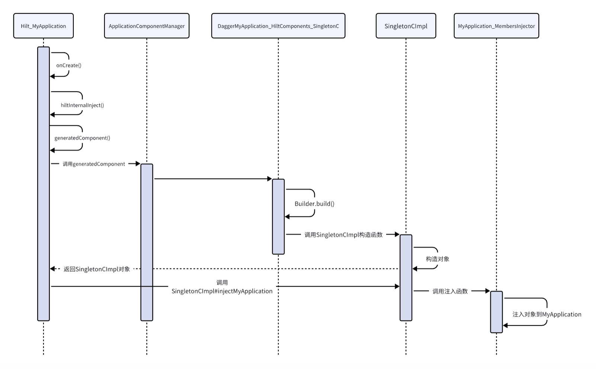
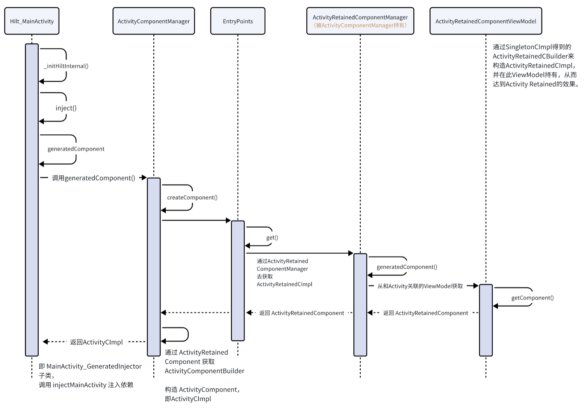

Hilt源码：https://github.com/google/dagger/tree/master/java/dagger/hilt，包括plugin的源码

# Hilt源码分析

## 1. @HiltAndroidApp
使用Hilt首先要对Application类加上`@HiltAndroidApp`注解
```
@HiltAndroidApp
class MyApplication : Application() {
    @Inject
    lateinit var car: Car // 注入car，用于验证生成代码的情况

    override fun onCreate() {
        super.onCreate()
        car.start()
    }
}

// Car类
class Car @Inject constructor() {

    fun start() {
        Log.e("test", "car start")
    }
}
```

执行构建流程后，会在`build/intermediates`目录中会生成hilt目录，其中有几个文件：
* Hilt_MyApplication
* DaggerMyApplication_HiltComponents_SingletonC
* MyApplication_GeneratedInjector
* MyApplication_HiltComponents
* MyApplication_ComponentTreeDeps

首先看`Hilt_MyApplication`：
```
public abstract class Hilt_MyApplication extends Application implements GeneratedComponentManagerHolder {
    private boolean injected = false;
    private final ApplicationComponentManager componentManager = new ApplicationComponentManager(new ComponentSupplier() {
        public Object get() {
            return DaggerMyApplication_HiltComponents_SingletonC.builder().applicationContextModule(new ApplicationContextModule(Hilt_MyApplication.this)).build();
        }
    });

    public Hilt_MyApplication() {
    }

    public final ApplicationComponentManager componentManager() {
        return this.componentManager;
    }

    public final Object generatedComponent() {
        return this.componentManager().generatedComponent();
    }

    @CallSuper
    public void onCreate() {
        this.hiltInternalInject();
        super.onCreate();
    }

    protected void hiltInternalInject() {
        if (!this.injected) {
            this.injected = true;
            ((MyApplication_GeneratedInjector)this.generatedComponent()).injectMyApplication((MyApplication)UnsafeCasts.unsafeCast(this));
        }
    }
}
```

Hilt插件会修改MyApplication的字节码，使它继承生成的`Hilt_MyApplication`类：
```
@HiltAndroidApp
public final class MyApplication extends Hilt_MyApplication {
    @Override // com.example.myapplication.Hilt_MyApplication, android.app.Application
    public void onCreate() {
        super.onCreate();
    }
}
```

然后重点看`Hilt_MyApplication`的onCreate方法中执行的`hiltInternalInject`方法：
```
protected void hiltInternalInject() {
    if (!this.injected) {
        // 如果还没有注入，则执行注入
        this.injected = true;
        ((MyApplication_GeneratedInjector)this.generatedComponent()) // 返回的是SingletonCImpl
            .injectMyApplication((MyApplication)UnsafeCasts.unsafeCast(this));
    }
}
```
`generatedComponent()`调用的是`componentManager.generatedComponent()`，`componentManager`也就是`Hilt_MyApplication`中的字段，调用它的`generatedComponent()`就会调用匿名内部类`ApplicationComponentManager`的`get()`方法。

`get()`方法会用到`DaggerMyApplication_HiltComponents_SingletonC`，下面来看`DaggerMyApplication_HiltComponents_SingletonC`：
```
@DaggerGenerated
public final class DaggerMyApplication_HiltComponents_SingletonC {
    private DaggerMyApplication_HiltComponents_SingletonC() {
    }

    public static Builder builder() {
        return new Builder();
    }

    public static MyApplication_HiltComponents.SingletonC create() {
        return (new Builder()).build();
    }

    public static final class Builder {
        private Builder() {
        }

        /** @deprecated */
        @Deprecated
        public Builder applicationContextModule(ApplicationContextModule applicationContextModule) {
            Preconditions.checkNotNull(applicationContextModule);
            return this;
        }

        /** @deprecated */
        @Deprecated
        public Builder hiltWrapper_FragmentGetContextFix_FragmentGetContextFixModule(HiltWrapper_FragmentGetContextFix_FragmentGetContextFixModule hiltWrapper_FragmentGetContextFix_FragmentGetContextFixModule) {
            Preconditions.checkNotNull(hiltWrapper_FragmentGetContextFix_FragmentGetContextFixModule);
            return this;
        }

        public MyApplication_HiltComponents.SingletonC build() {
            return new SingletonCImpl();
        }
    }

    private static final class SingletonCImpl extends MyApplication_HiltComponents.SingletonC {
        private final SingletonCImpl singletonCImpl = this;

        private SingletonCImpl() {
        }

        // 注入对象到MyApplication
        public void injectMyApplication(MyApplication myApplication) {
            this.injectMyApplication2(myApplication);
        }

        public Set<Boolean> getDisableFragmentGetContextFix() {
            return Collections.emptySet();
        }

        public ActivityRetainedComponentBuilder retainedComponentBuilder() {
            return new ActivityRetainedCBuilder(this.singletonCImpl);
        }

        public ServiceComponentBuilder serviceComponentBuilder() {
            return new ServiceCBuilder(this.singletonCImpl);
        }

        // 实际注入，MyApplication_MembersInjector是Dagger生成的类，内部会给MyApplication赋值car
        @CanIgnoreReturnValue
        private MyApplication injectMyApplication2(MyApplication instance) {
            MyApplication_MembersInjector.injectCar(instance, new Car());
            return instance;
        }
    }

    private static final class ServiceCImpl extends MyApplication_HiltComponents.ServiceC {
        // ......
    }

    private static final class ActivityRetainedCImpl extends MyApplication_HiltComponents.ActivityRetainedC {
        // ......
    }

    private static final class ViewModelCImpl extends MyApplication_HiltComponents.ViewModelC {
        // ......
    }

    private static final class ActivityCImpl extends MyApplication_HiltComponents.ActivityC {
        // ......
    }

    private static final class ViewCImpl extends MyApplication_HiltComponents.ViewC {
        // ......
    }

    private static final class FragmentCImpl extends MyApplication_HiltComponents.FragmentC {
        // ......
    }

    private static final class ViewWithFragmentCImpl extends MyApplication_HiltComponents.ViewWithFragmentC {
        // ......
    }

    private static final class ServiceCBuilder implements MyApplication_HiltComponents.ServiceC.Builder {
        // ......
    }

    private static final class ViewModelCBuilder implements MyApplication_HiltComponents.ViewModelC.Builder {
        // ......
    }

    private static final class ViewCBuilder implements MyApplication_HiltComponents.ViewC.Builder {
        // ......
    }

    private static final class ViewWithFragmentCBuilder implements MyApplication_HiltComponents.ViewWithFragmentC.Builder {
        // ......
    }

    private static final class FragmentCBuilder implements MyApplication_HiltComponents.FragmentC.Builder {
        // ......
    }

    private static final class ActivityCBuilder implements MyApplication_HiltComponents.ActivityC.Builder {
        // ......
    }

    private static final class ActivityRetainedCBuilder implements MyApplication_HiltComponents.ActivityRetainedC.Builder {
        // ......
    }
}
```
`DaggerMyApplication_HiltComponents_SingletonC`类包含了全部的依赖容器，比如`SingletonCImpl`、`ActivityRetainedCImpl`等嵌套类。

Hilt_MyApplication调用`generatedComponent()`实际就是调用`DaggerMyApplication_HiltComponents_SingletonC.builder().applicationContextModule(new ApplicationContextModule(Hilt_MyApplication.this)).build()`。看起来`applicationContextModule`被废弃，并且方法内部没有作用，那么最终调用`build()`就是返回`SingletonCImpl`对象。（`SingletonCImpl`就类似于使用Dagger2时生成的Component的作用）

生成的`HiltAndroidApp`在`onCreate()`中调用`hiltInternalInject()`时，调用的`injectMyApplication`就是调用的这个`SingletonCImpl`的方法，从而完成注入对象到`HiltAndroidApp`中。**`ApplicationComponentManager`的作用就是提供所谓的Application Component，即`SingletonCImpl`。**



---

核心就是`SingletonCImpl`，它是生成的`MyApplication_GeneratedInjector`的实现类，内部会使用`MyApplication_MembersInjector`来注入依赖。如果只是使用Dagger2，生成的`MyApplication_MembersInjector`将在生成的`DaggerComponent`中使用。对应来看，Hilt实质就是把使用Dagger2时手动调用DaggerComponent注入的工作自动完成了，`SingletonCImpl`相当于`DaggerComponent`。

所有`@InstallIn(SingletonComponent::class)`的Module都会放到`SingletonCImpl`内，需要注入这些对象就会从`SingletonCImpl`中获取Module来得到依赖。

`SingletonCImpl`在Application onCreate时才构造，并且只构造一次，所以生命周期就是Application级别的。

> MyApplication_MembersInjector 在`./build/generated/source/kapt`目录中生成（如果使用KSP，则在`./build/generated/ksp`目录），这里还看到很多例如`ActivityCImpl`、`ViewModelCImpl`的类，将用于Activity、ViewModel的情况。

## 2. @AndroidEntryPoint

### 2.1 Activity
```
@AndroidEntryPoint
class MainActivity : AppCompatActivity() {

    @Inject
    lateinit var car: Car

    override fun onCreate(savedInstanceState: Bundle?) {
        super.onCreate(savedInstanceState)
        car.start()
    }
}

// 生成的代码，
public final class MainActivity extends Hilt_MainActivity {
    // ......
}
```

`Hilt_MainActivity`在 build/generated/sources/kapt 中，
```
@Generated("dagger.hilt.android.processor.internal.androidentrypoint.ActivityGenerator")
public abstract class Hilt_MainActivity extends AppCompatActivity implements GeneratedComponentManagerHolder {
  private volatile ActivityComponentManager componentManager;

  private final Object componentManagerLock = new Object();

  private boolean injected = false;

  Hilt_MainActivity() {
    super();
    _initHiltInternal();
  }

  Hilt_MainActivity(int contentLayoutId) {
    super(contentLayoutId);
    _initHiltInternal();
  }

  // 构造时都会调用 _initHiltInternal()
  private void _initHiltInternal() {
    addOnContextAvailableListener(new OnContextAvailableListener() {
      @Override
      public void onContextAvailable(Context context) {
        // 执行注入（这个回调实际就是在onCreate时）
        inject();
      }
    });
  }

  @Override
  public final Object generatedComponent() {
    return this.componentManager().generatedComponent();
  }

  protected ActivityComponentManager createComponentManager() {
    return new ActivityComponentManager(this);
  }

  @Override
  public final ActivityComponentManager componentManager() {
    if (componentManager == null) {
      synchronized (componentManagerLock) {
        if (componentManager == null) {
          componentManager = createComponentManager();
        }
      }
    }
    return componentManager;
  }

  protected void inject() {
    if (!injected) {
      injected = true;
      ((MainActivity_GeneratedInjector) this.generatedComponent()).injectMainActivity(UnsafeCasts.<MainActivity>unsafeCast(this));
    }
  }

  // 重写了默认的ViewModelProviderFactory，用于支持@HiltViewModel
  @Override
  public ViewModelProvider.Factory getDefaultViewModelProviderFactory() {
    return DefaultViewModelFactories.getActivityFactory(this, super.getDefaultViewModelProviderFactory());
  }
}
```
`inject()`方法会从`ActivityComponentManager`中获取`ActivityComponent`，实际得到`ActivityCImpl`对象（是`MainActivity_GeneratedInjector`和`ActivityComponent`的实现类）。调用`ActivityCImpl`的injectMainActivity方法完成注入。

`inject()`方法中`generatedComponent()`会调用`ActivityComponentManager`的`createComponent()`方法：
```
public class ActivityComponentManager implements GeneratedComponentManager<Object> {
  /** Entrypoint for {@link ActivityComponentBuilder}. */
  @EntryPoint
  @InstallIn(ActivityRetainedComponent.class)
  public interface ActivityComponentBuilderEntryPoint {
    ActivityComponentBuilder activityComponentBuilder();
  }

  private volatile Object component;
  private final Object componentLock = new Object();

  protected final Activity activity;

  private final GeneratedComponentManager<ActivityRetainedComponent>
      activityRetainedComponentManager;

  public ActivityComponentManager(Activity activity) {
    this.activity = activity;
    this.activityRetainedComponentManager =
        new ActivityRetainedComponentManager((ComponentActivity) activity);
  }

  @Override
  public Object generatedComponent() {
    if (component == null) {
      synchronized (componentLock) {
        if (component == null) {
          component = createComponent();
        }
      }
    }
    return component;
  }

  protected Object createComponent() {
    if (!(activity.getApplication() instanceof GeneratedComponentManager)) {
      // ...... 异常情况
    }

    // 返回 ActivityComponent
    return EntryPoints.get(
            activityRetainedComponentManager, ActivityComponentBuilderEntryPoint.class)
        .activityComponentBuilder()
        .activity(activity)
        .build();
  }
}
```
`ActivityRetainedCImpl`就是`ActivityComponentBuilderEntryPoint`的实现类，这里获取到`ActivityRetainedCImpl`并调用`activityComponentBuilder()`来构造`ActivityComponent`。所以`ActivityComponentManager`就是用来提供`ActivityComponent`，`Hilt_MainActivity`把`ActivityComponent`强制转换为`MainActivity_GeneratedInjector`，然后调用`injectMainActivity`完成注入。

返回的`ActivityComponent`从`EntryPoints`中获取：
```
public final class EntryPoints {
  private static final String EARLY_ENTRY_POINT = "dagger.hilt.android.EarlyEntryPoint";

  @Nonnull
  public static <T> T get(Object component, Class<T> entryPoint) {
    if (component instanceof GeneratedComponent) {
      if (component instanceof TestSingletonComponent) {
        // 测试场景
      }
      // Unsafe cast. There is no way for this method to know that the correct component was used.
      return entryPoint.cast(component);
    } else if (component instanceof GeneratedComponentManager) {
      
      return get(((GeneratedComponentManager<?>) component).generatedComponent(), entryPoint);
    } else {
      throw new IllegalStateException(
          String.format(
              "Given component holder %s does not implement %s or %s",
              component.getClass(), GeneratedComponent.class, GeneratedComponentManager.class));
    }
  }

  //......
}
```
**EntryPoints的作用就是从传入的component中获取想要的entryPoint类型，如果component是GeneratedComponentManager类型，则调用它的generatedComponent()方法获取，否则直接转换类型，并且是递归调用。**

`ActivityRetainedComponentManager`就是`GeneratedComponentManager`类型，所以会调用它的`generatedComponent()`方法。


`ActivityRetainedComponentManager`类代码如下：
```
final class ActivityRetainedComponentManager
    implements GeneratedComponentManager<ActivityRetainedComponent> {

  //......

    private ViewModelProvider getViewModelProvider(
      ViewModelStoreOwner owner, Context context) {
        return new ViewModelProvider(
            owner,
            new ViewModelProvider.Factory() {
              @NonNull
              @Override
              @SuppressWarnings("unchecked")
              public <T extends ViewModel> T create(@NonNull Class<T> aClass) {
                ActivityRetainedComponent component =
                    EntryPointAccessors.fromApplication(
                        context, ActivityRetainedComponentBuilderEntryPoint.class)
                        .retainedComponentBuilder()
                        .build();
                return (T) new ActivityRetainedComponentViewModel(component);
              }
            });
    }

  @Override
  public ActivityRetainedComponent generatedComponent() {
    if (component == null) {
      synchronized (componentLock) {
        if (component == null) {
          component = createComponent();
        }
      }
    }
    return component;
  }

  private ActivityRetainedComponent createComponent() {
    return viewModelProvider.get(ActivityRetainedComponentViewModel.class).getComponent();
  }

  // ......
}
```
`ActivityComponentManager`会到`ActivityRetainedComponentManager`中去查找`ActivityComponentBuilderEntryPoint`，也就是子类`ActivityRetainedC`的实现类`ActivityRetainedCImpl`。

`ActivityRetainedComponentManager`使用`ViewModel`来获取`ActivityRetainedComponent`，`getViewModelProvider`中设置的Factory，就可以看到`ActivityRetainedComponentViewModel`的创建方式，会使用`EntryPointAccessors.fromApplication()`，传入context就会使用application，也就是继承了Hilt_MyApplication的，而Hilt_MyApplication继承了GeneratedComponentManager，`SingletonCImpl`是GeneratedComponent，所以`EntryPoints.get`递归就会拿到`SingletonCImpl` 对象（是`ActivityRetainedComponentBuilderEntryPoint`的子类），通过`SingletonCImpl.retainedComponentBuilder().build()`，得到新的`ActivityRetainedCImpl`实例，放到`ActivityRetainedComponentViewModel`中。

通过ViewModel的方式，达到ActivityRetained生命周期的目的。通过`SingletonCImpl`构造`ActivityRetainedCImpl`实例（是`ActivityRetainedComponent`实现类）。

获取到`ActivityRetainedCImpl`，它也是`ActivityComponentBuilderEntryPoint`实现类，所以调用了`activityComponentBuilder()`和对应的build()，构造了`ActivityCImpl`。


所以，从`Hilt_MainActivity`中`inject`开始，持有的`ActivityComponentManager`执行`generatedComponent()`--`createComponent()`，现在就会执行`EntryPoints.get(activityRetainedComponentManager,ActivityComponentBuilderEntryPoint.class)`，最终得到`ActivityRetainedCImpl`，然后调用`ActivityRetainedCImpl`的`activityComponentBuilder().activity(activity).build()` 得到`ActivityCImpl`（也在 DaggerMyApplication_HiltComponents_SingletonC 文件中），调用`injectMainActivity`即可注入。



**`ActivityCImpl`持有了`SingletonCImpl`、`ActivityRetainedCImpl`，所以也可以注入这些生命周期更长的依赖，比如`@InstallIn(ActivityRetainedComponent::class)`的Module就是使用`ActivityCImpl`调用自己持有的`ActivityRetainedCImpl`来间接注入**

```
private static final class ActivityCImpl extends MyApplication_HiltComponents.ActivityC {
        private final HhhhModule hhhhModule;
        private final SingletonCImpl singletonCImpl;
        private final ActivityRetainedCImpl activityRetainedCImpl;
        private final ActivityCImpl activityCImpl = this;

        private ActivityCImpl(SingletonCImpl singletonCImpl, ActivityRetainedCImpl activityRetainedCImpl, HhhhModule hhhhModuleParam, Activity activityParam) {
            this.singletonCImpl = singletonCImpl;
            this.activityRetainedCImpl = activityRetainedCImpl;
            this.hhhhModule = hhhhModuleParam;
        }

        public void injectBlankActivity(BlankActivity arg0) {
            this.injectBlankActivity2(arg0);
        }

        public void injectMainActivity(MainActivity arg0) {
            this.injectMainActivity2(arg0);
        }

        // ......

        @CanIgnoreReturnValue
        private BlankActivity injectBlankActivity2(BlankActivity instance) {
            BlankActivity_MembersInjector.injectModuleData(instance, HhhhModule_ProvideModuleDataFactory.provideModuleData(this.hhhhModule));
            return instance;
        }

        @CanIgnoreReturnValue
        private MainActivity injectMainActivity2(MainActivity instance) {
            MainActivity_MembersInjector.injectActivityData(instance, new ActivityData());
            MainActivity_MembersInjector.injectModuleData(instance, HhhhModule_ProvideModuleDataFactory.provideModuleData(this.hhhhModule));
            MainActivity_MembersInjector.injectRetainedModuleData(instance, (RetainedModuleData)this.activityRetainedCImpl.provideRetainedModuleDataProvider.get());
            return instance;
        }
    }
```
**所有Activity注入依赖使用的是同一个`ActivityRetainedCImpl`和`ActivityCImpl`类，只是调用的方法不同**

> 如果有使用`@ApplicationContext`，则生成的`SingletonCImpl`中会持有`ApplicationContextModule`；如果有使用`@ActivityContext`，则生成的`ActivityCImpl`中会持有`Activity`。

### 2.2 Fragment
流程和Activity类似，所以直接列出核心流程：

Fragment -- FragmentComponentManager -- 得到ActivityCImpl -- 通过FragmentComponentBuilder构造`FragmentCImpl` -- 通过`FragmentCImpl`完成注入

ActivityCImpl是FragmentComponentBuilderEntryPoint的子类
```
private static final class ActivityCImpl extends MyApplication_HiltComponents.ActivityC {
    // .....

    public FragmentComponentBuilder fragmentComponentBuilder() {
        return new FragmentCBuilder(this.singletonCImpl, this.activityRetainedCImpl, this.activityCImpl);
    }

    // ......
}

private static final class FragmentCBuilder implements MyApplication_HiltComponents.FragmentC.Builder {
    private final SingletonCImpl singletonCImpl;
    private final ActivityRetainedCImpl activityRetainedCImpl;
    private final ActivityCImpl activityCImpl;
    private Fragment fragment;

    private FragmentCBuilder(SingletonCImpl singletonCImpl, ActivityRetainedCImpl activityRetainedCImpl, ActivityCImpl activityCImpl) {
        this.singletonCImpl = singletonCImpl;
        this.activityRetainedCImpl = activityRetainedCImpl;
        this.activityCImpl = activityCImpl;
    }

    public FragmentCBuilder fragment(Fragment fragment) {
        this.fragment = (Fragment)Preconditions.checkNotNull(fragment);
        return this;
    }

    public MyApplication_HiltComponents.FragmentC build() {
        Preconditions.checkBuilderRequirement(this.fragment, Fragment.class);
        return new FragmentCImpl(this.singletonCImpl, this.activityRetainedCImpl, this.activityCImpl, this.fragment);
    }
}
```


### 2.3 ViewModel
前面看到，Activity的默认`ViewModelProviderFactory`如下：
```
@Generated("dagger.hilt.android.processor.internal.androidentrypoint.ActivityGenerator")
public abstract class Hilt_MainActivity extends AppCompatActivity implements GeneratedComponentManagerHolder {
  // ......

  // 重写了默认的ViewModelProviderFactory，用于支持@HiltViewModel
  @Override
  public ViewModelProvider.Factory getDefaultViewModelProviderFactory() {
    return DefaultViewModelFactories.getActivityFactory(this, super.getDefaultViewModelProviderFactory());
  }
}
```
最终会从`ActivityCImpl`中得到`InternalFactoryFactory`：

```
private static final class ActivityCImpl extends MyApplication_HiltComponents.ActivityC {
    // ......

    public DefaultViewModelFactories.InternalFactoryFactory getHiltInternalFactoryFactory() {

        return DefaultViewModelFactories_InternalFactoryFactory_Factory.newInstance(this.getViewModelKeys(), new ViewModelCBuilder(this.singletonCImpl, this.activityRetainedCImpl));
    }
}
```

并调用`fromActivity`（如果是Fragment中就是调用`fromFragment`）
```
public static final class InternalFactoryFactory {

    private final Set<String> keySet;
    private final ViewModelComponentBuilder viewModelComponentBuilder;

    @Inject
    InternalFactoryFactory(
        @HiltViewModelMap.KeySet Set<String> keySet,
        ViewModelComponentBuilder viewModelComponentBuilder) {
      this.keySet = keySet;
      this.viewModelComponentBuilder = viewModelComponentBuilder;
    }

    ViewModelProvider.Factory fromActivity(
        ComponentActivity activity, ViewModelProvider.Factory delegateFactory) {
      return getHiltViewModelFactory(
          activity,
          activity.getIntent() != null ? activity.getIntent().getExtras() : null,
          delegateFactory);
    }

    ViewModelProvider.Factory fromFragment(
        Fragment fragment, ViewModelProvider.Factory delegateFactory) {
      return getHiltViewModelFactory(fragment, fragment.getArguments(), delegateFactory);
    }

    private ViewModelProvider.Factory getHiltViewModelFactory(
        SavedStateRegistryOwner owner,
        @Nullable Bundle defaultArgs,
        ViewModelProvider.Factory delegate) {
      return new HiltViewModelFactory(
          owner, defaultArgs, keySet, checkNotNull(delegate), viewModelComponentBuilder);
    }
  }
```
最终得到`HiltViewModelFactory`，它内部会持有AbstractSavedStateViewModelFactory的实现类，它构造ViewModel会使用`ViewModelCImpl`。

**总结：使用`DefaultViewModelFactories` -- 获取`InternalFactoryFactory` -- 得到`HiltViewModelFactory` -- 通过`ViewModelCImpl`获取ViewModel，`ViewModelCImpl`会持有`SingletonCImpl`、`ActivityRetainedCImpl`，所以可以从这两个容器中获取依赖。**

#### @HiltViewModel的作用
调用`getHiltInternalFactoryFactory()`构造`InternalFactoryFactory`时，调用了`getViewModelKeys()`方法。使用`@HiltViewModel`标记的ViewModel会生成一些类，`getViewModelKeys()`方法中就通过相关类获取了ViewModel的key（也就是ViewModel的全名称）。在`HiltViewModelFactory`构造ViewModel时就会通过key判断，存在就会通过`ViewModelCImpl`调用创建`@HiltViewModel`生成的ViewModelFactory来创建对应的ViewModel。

总结：使用了`@HiltViewModel`的ViewModel会通过`ViewModelCImpl`构造，也就是可以使用Hitl的依赖注入，没有使用`@HiltViewModel`的ViewModel则会使用原本默认的ViewModelProvider.Factory来构造。


### 2.4 View、ViewWithFragment
使用了`@AndroidEntryPoint`标记的View会生成代码，并且会继承此类：
```
@Generated("dagger.hilt.android.processor.internal.androidentrypoint.ViewGenerator")
public abstract class Hilt_MyView extends View implements GeneratedComponentManagerHolder {
  private ViewComponentManager componentManager;

  private boolean injected;

  Hilt_MyView(Context context) {
    super(context);
    inject();
  }

  // 其他构造函数类型，都会调用 inject()

  @Override
  public final Object generatedComponent() {
    return this.componentManager().generatedComponent();
  }

  protected ViewComponentManager createComponentManager() {
    // hasFragmentBindings 参数根据是否使用 @WithFragmentBindings 注解决定
    return new ViewComponentManager(this, false /* hasFragmentBindings */);
  }

  @Override
  public final ViewComponentManager componentManager() {
    if (componentManager == null) {
      componentManager = createComponentManager();
    }
    return componentManager;
  }

  protected void inject() {
    if (!injected) {
      injected = true;
      ((MyView_GeneratedInjector) this.generatedComponent()).injectMyView(UnsafeCasts.<MyView>unsafeCast(this));
    }
  }
}
```

流程：使用`ViewComponentManager` -- 得到`ActivityCImpl` -- 构造`ViewCImpl` -- 注入依赖

`ViewCImpl`内持有`SingletonCImpl`、`ActivityRetainedCImpl`、`ActivityCImpl`和使用`@InstallIn(ViewComponent::class)`的Module对象。从而可以注入在这些容器内的依赖。


如果View在Fragment中使用，并且想要可以注入FragmentComponent容器内的依赖，则需要再给View标记`@WithFragmentBindings`注解，可以使用`@InstallIn(ViewWithFragmentComponent::class)`的Module提供的依赖，**但不能使用ViewComponent的依赖**，因为Hilt的设计中，ViewWithFragmentComponent没有依赖ViewComponent。

此时流程：使用`ViewComponentManager` -- 得到`FragmentCImpl` -- 构造`ViewWithFragmentCImpl` -- 注入依赖


* `ViewCImpl`中持有SingletonCImpl、ActivityRetainedCImpl、ActivityCImpl、ViewComponent相关Module
* `ViewWithFragmentCImpl`中持有SingletonCImpl、ActivityRetainedCImpl、ActivityCImpl、FragmentCImpl、ViewWithFragmentComponent相关Module

# EntryPoint的使用
## 官方的EntryPoint
源码中都是通过`EntryPoint`去找到实际的Component来注入依赖，例如ActivityCImpl，可以看出来并不能通过`EntryPoint`来获取我们想要的对象，而是只能用它注入到Activity，因为官方的EntryPoint生成的代码都只会生成`injectXXX`这种注入方法，而Dagger自定义Component时可以定义返回对象的方法在Hilt中的官方`EntryPoint`生成的Component中并没有，所以我们拿到生成的Component也不能用来获取实例。

## 自定义EntryPoint
定义EntryPoint：
```
@EntryPoint
@InstallIn(ActivityComponent::class)
interface MyEntryPoint {
    fun testData(): MyEntryPointData
}

// 定义一个类用来验证
class MyEntryPointData @Inject constructor() {
    fun test() {
        Log.e("hhhhhh", "test: my entry point")
    }
}
```

使用方式：
```
// EntryPointAccessors 内部就是使用 EntryPoints.get()，所以也可以直接调用 EntryPoints
EntryPointAccessors.fromActivity<MyEntryPoint>(this).testData().test()
```

**自定义EntryPoint标记的是`@InstallIn(ActivityComponent::class)`，那么Hilt会让生成的`ActivityCImpl`实现该接口，所以我们通过EntryPoints找到的`ActivityCImpl`就可以调用`MyEntryPoint`接口的方法，从而得到我们想要的对象。**


定义EntryPoint时，也可以使用`SingletonComponent`、`FragmentComponent`等1个或多个组件：
```
@EntryPoint
@InstallIn(SingletonComponent::class, ActivityComponent::class)
interface MyEntryPoint {
    // ......
}

EntryPoints.get(activity, )
```
此时生成的`SingletonCImpl`和`ActivityCImpl`都会实现`MyEntryPoint`接口，所以此时通过application或者activity都可以获取到依赖的对象。

**当然，例如依赖的对象是`ActivityScope`作用域，而自定义的`EntryPoint`用在`SingletonComponent`，则会报错**
```
// 错误例子：
@EntryPoint
@InstallIn(SingletonComponent::class)
interface MyEntryPoint {
    fun testData(): MyEntryPointData
}

@ActivityScoped
class MyEntryPointData @Inject constructor() {
    fun test() {
        Log.e("hhhhhh", "test: my entry point")
    }
}
```

> `EntryPoint`内定义的方法，如果是有参数的，则只能返回该类型，生成的代码实际就是直接返回该传入的参数。

## @EarlyEntryPoint`
测试场景可能使用

# 自定义Component
Hilt Android库定义了自带的Component，例如ActivityComponent的代码：
```
// dagger.hilt.android.components包
@ActivityScoped
@DefineComponent(parent = ActivityRetainedComponent.class)
public interface ActivityComponent {}

// dagger.hilt.android.internal.builders  包
@DefineComponent.Builder
public interface ActivityComponentBuilder {
  ActivityComponentBuilder activity(@BindsInstance Activity activity);

  ActivityComponent build();
}
```

我们也可以使用`@DefineComponent`自定义Component。
```
// 定义作用域（可选）
@Scope
annotation class UserScope

// 定义Component
@DefineComponent(parent = SingletonComponent::class)
@UserScope
interface UserComponent

// 定义一个类用来测试
class User(val id: String)

// 不能像Dagger一样在Component接口中定义方法，需要在自定义EntryPoint中定义
@EntryPoint
@InstallIn(UserComponent::class)
interface UserEntryPoint {
    fun testUser(): User
}

// 定义一个Builder用于构造Component（不像Dagger2可以自动生成默认的Builder）
@DefineComponent.Builder
interface UserComponentBuilder {
    fun feedData(@BindsInstance user: User): UserComponentBuilder
    
    // 必须有一个无参并且返回对应Component类型的函数
    fun build(): UserComponent
}
```

使用方式：
```
@AndroidEntryPoint
class MainActivity : AppCompatActivity() {

    // Component Builder只能通过注入的方式拿到，因为生成的Builder实现类是private
    @Inject
    lateinit var componentBuilder: UserComponentBuilder

    override fun onCreate(savedInstanceState: Bundle?) {
        super.onCreate(savedInstanceState)
        // 构造得到UserComponent（实际场景需要自行维护此对象，比如在登录后构造并持有，退出登录时赋值为null或default值）
        val userComponent = componentBuilder.feedData(User("测试ID")).build()

        // 从userComponent中得到user信息
        val id = EntryPoints.get(userComponent, UserEntryPoint::class.java).testUser().id
    }

}
```
> 也可以像Hilt源码一样，使用一个UserComponentManager类（可以参考ActivityComponentManager）来维护userComponent对象。

* `@DefineComponent`只能用于接口，不能用于类
* `@DefineComponent`不能有非静态方法，也就是不能像Dagger2那样定义成员方法，需要配合@EntryPoint来定义方法

> 自定义的Component因为要给外部通过 @InstallIn 使用，所以它一般都是public，而Builder不一定，所以可以将Builder作为单独的类，而不是Component的嵌套类，可以避免传递依赖。

现在来查看自定义Component生成的源码情况，以便了解它的实现方式：
```
public final class MyApplication_HiltComponents {

    // UserComponent 和对应的 UserEntryPoint，生成了 UserC
    @Subcomponent
    @UserScope
    public abstract static class UserC implements UserComponent, UserEntryPoint, GeneratedComponent {
        public UserC() {
        }

        // UserComponentBuilder生成了 UserC.Builder
        @dagger.Subcomponent.Builder
        interface Builder extends UserComponentBuilder {
        }
    }
  // ......其他自带的Component和自定义component
}
```

上面源码生成了对应的接口，而实现类在`DaggerMyApplication_HiltComponents_SingletonC`中生成：
```
public final class DaggerMyApplication_HiltComponents_SingletonC {

    // UserCImpl 即 UserComponent 和 UserEntryPoin 的实际实现类
    private static final class UserCImpl extends MyApplication_HiltComponents.UserC {
        private final User feedData;
        private final SingletonCImpl singletonCImpl;
        private final UserCImpl userCImpl = this;

        private UserCImpl(SingletonCImpl singletonCImpl, User feedDataParam) {
            this.singletonCImpl = singletonCImpl;
            this.feedData = feedDataParam;
        }

        public User testUser() {
            return this.feedData;
        }
    }

    // UserCBuilder 则为 UserComponentBuilder 的实际实现类
    private static final class UserCBuilder implements MyApplication_HiltComponents.UserC.Builder {
        private final SingletonCImpl singletonCImpl;
        private User feedData;

        private UserCBuilder(SingletonCImpl singletonCImpl) {
            this.singletonCImpl = singletonCImpl;
        }

        public UserCBuilder feedData(User user) {
            this.feedData = (User)Preconditions.checkNotNull(user);
            return this;
        }

        public MyApplication_HiltComponents.UserC build() {
            Preconditions.checkBuilderRequirement(this.feedData, User.class);
            return new UserCImpl(this.singletonCImpl, this.feedData);
        }
    }

    //......其他CImpl和Builder类
}
```

# ContentProvider
ContentProvider生命周期是比较特殊的，它在Application的onCreate()方法之前就能得到执行，因此很多人会利用这个特性去进行提前初始化，而Hilt的工作原理是从Application的onCreate()方法中开始的，也就是说在这个方法执行之前，Hilt的所有功能都还无法正常工作。也正是因为这个原因，Hilt才没有将ContentProvider纳入到支持的入口点当中。

# @GeneratesRootInput、@OriginatingElement
https://juejin.cn/post/7020667181386399752
https://juejin.cn/post/7019139098069696549
