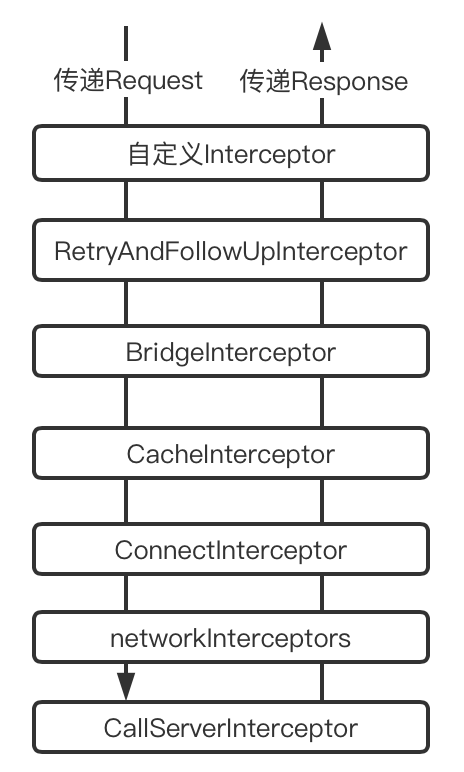

 从OkHttp的3.13.0版本开始，需要开启Java 8（可在`https://square.github.io/okhttp/changelog_3x/`中查看），retrofit从2.7.0开始就捆绑使用OkHttp的3.14.4版本，如果不启用Java 8，就要使用更低的OkHttp和retrofit版本

post 常见请求Content-Type
* application/x-www-form-urlencoded  提交表单，对应普通键值对
* application/json  json数据
* multipart/form-data  提交表单，包含多种类型，比如图片、文件

[HTTP协议的缓存控制](https://imweb.io/topic/5795dcb6fb312541492eda8c)

## OkHttpClient
以OkHttp版本4.7.2分析：

OkHttpClient是http请求的发起者，它创建Call实例，然后Call实例会发起http请求和读取响应。OkHttpClient一般来说可以作为单例，因为每个client持有并复用它自己的连接池和线程池。一般通过Builder创建client，并且可以对client自定义各种配置，下面展示这些配置的默认情况：
```
class Builder constructor() {
    internal var dispatcher: Dispatcher = Dispatcher()
    internal var connectionPool: ConnectionPool = ConnectionPool()
    internal val interceptors: MutableList<Interceptor> = mutableListOf()
    internal val networkInterceptors: MutableList<Interceptor> = mutableListOf()
    internal var eventListenerFactory: EventListener.Factory = EventListener.NONE.asFactory()
    internal var retryOnConnectionFailure = true
    internal var authenticator: Authenticator = Authenticator.NONE
    internal var followRedirects = true
    internal var followSslRedirects = true
    internal var cookieJar: CookieJar = CookieJar.NO_COOKIES
    internal var cache: Cache? = null
    internal var dns: Dns = Dns.SYSTEM
    internal var proxy: Proxy? = null
    internal var proxySelector: ProxySelector? = null
    internal var proxyAuthenticator: Authenticator = Authenticator.NONE
    internal var socketFactory: SocketFactory = SocketFactory.getDefault()
    internal var sslSocketFactoryOrNull: SSLSocketFactory? = null
    internal var x509TrustManagerOrNull: X509TrustManager? = null
    internal var connectionSpecs: List<ConnectionSpec> = DEFAULT_CONNECTION_SPECS
    internal var protocols: List<Protocol> = DEFAULT_PROTOCOLS
    internal var hostnameVerifier: HostnameVerifier = OkHostnameVerifier
    internal var certificatePinner: CertificatePinner = CertificatePinner.DEFAULT
    internal var certificateChainCleaner: CertificateChainCleaner? = null
    internal var callTimeout = 0
    internal var connectTimeout = 10_000
    internal var readTimeout = 10_000
    internal var writeTimeout = 10_000
    internal var pingInterval = 0
    internal var minWebSocketMessageToCompress = RealWebSocket.DEFAULT_MINIMUM_DEFLATE_SIZE
    internal var routeDatabase: RouteDatabase? = null
```
* dispatch：任务调度器，内部包含线程池、执行中的同步和异步任务队列、待执行的异步任务队列。此类无法重写，可以创建对象并设置最大请求数等信息，一般使用默认实例。
* connectionPool：复用HTTP和HTTP/2的连接，可减少网络延迟。共享相同地址的HTTP请求会共享连接。此类实现了保持打开以备后续复用连接的策略。
* interceptors：在RetryAndFollowUpInterceptor之前，所以一个请求在RetryAndFollowUpInterceptor内部重试或重定向多次，interceptors也只执行一次。
* networkInterceptors：在RetryAndFollowUpInterceptor之后，所以重试或重定向多次，networkInterceptors也会执行多次。
* eventListenerFactory：添加网络请求事件监听器，比如监听socket连接和完成。eventListener在网络请求过程中会传给例如RealCall或其他对象，从而在过程中回调。
* retryOnConnectionFailure：配置client遇到连接问题时是否重试，默认在某些情况会重试。

## 发起请求
通过client的 `newCall(request)` 得到Call的子类RealCall实例，然后使用RealCall来开始请求流程。

### 同步执行
```
override fun execute(): Response {
  synchronized(this) {
    check(!executed) { "Already Executed" }
    executed = true
  }
  timeout.enter()
  callStart()
  try {
    client.dispatcher.executed(this) //把call放到runningSyncCalls队列中
    return getResponseWithInterceptorChain()
  } finally {
    client.dispatcher.finished(this) //执行完毕，把call从runningSyncCalls中移除
  }
}
```
RealCall的execute()函数关键在于执行`dispatcher.executed()`和`getResponseWithInterceptorChain()`，`dispatcher.executed()`只是把Call放到`runningSyncCalls`队列中作为一个记录，`getResponseWithInterceptorChain()`中通过拦截器模式完成整个网络请求和响应流程。

### 异步执行
RealCall的`enqueue(callback)`函数会执行`dispatcher.enqueue(AsyncCall)`：
```
internal fun enqueue(call: AsyncCall) {
  synchronized(this) {
    readyAsyncCalls.add(call) //添加call到readyAsyncCalls准备异步执行的队列中
    // Mutate the AsyncCall so that it shares the AtomicInteger of an existing running call to
    // the same host.
    if (!call.call.forWebSocket) {
      val existingCall = findExistingCallWithHost(call.host)
      if (existingCall != null) call.reuseCallsPerHostFrom(existingCall)
    }
  }
  promoteAndExecute() //推动执行
}
```
将call放到readyAsyncCalls队列，然后调用promoteAndExecute()推动执行：
```
private fun promoteAndExecute(): Boolean {
  this.assertThreadDoesntHoldLock()
  val executableCalls = mutableListOf<AsyncCall>()
  val isRunning: Boolean
  synchronized(this) {
    val i = readyAsyncCalls.iterator()
    while (i.hasNext()) {
      val asyncCall = i.next()
      if (runningAsyncCalls.size >= this.maxRequests) break // Max capacity.
      if (asyncCall.callsPerHost.get() >= this.maxRequestsPerHost) continue // Host max capacity.
      i.remove()
      asyncCall.callsPerHost.incrementAndGet()
      executableCalls.add(asyncCall)
      runningAsyncCalls.add(asyncCall)
    }
    isRunning = runningCallsCount() > 0
  }

  for (i in 0 until executableCalls.size) {
    val asyncCall = executableCalls[i]
    asyncCall.executeOn(executorService)
  }
  return isRunning
}
```
如果没有超过最大请求数量，就从readyAsyncCalls中移除call，然后添加到runningAsyncCalls队列中，然后执行asyncCall于executorService线程池。

AsyncCall是RealCall的内部类，它被放在线程池中执行，它的run方法中仍然是调用`getResponseWithInterceptorChain()`，然后会回调callback。

## 拦截器
OkHttp使用拦截器模式完成网络请求和响应流程，各个拦截器负责不同的职责。RealCall的`getResponseWithInterceptorChain()`如下：
```
  @Throws(IOException::class)
  internal fun getResponseWithInterceptorChain(): Response {
    // 构建完整的拦截器列表
    val interceptors = mutableListOf<Interceptor>()
    interceptors += client.interceptors
    interceptors += RetryAndFollowUpInterceptor(client)
    interceptors += BridgeInterceptor(client.cookieJar)
    interceptors += CacheInterceptor(client.cache)
    interceptors += ConnectInterceptor
    if (!forWebSocket) {
      interceptors += client.networkInterceptors
    }
    interceptors += CallServerInterceptor(forWebSocket)

    val chain = RealInterceptorChain(
        call = this,
        interceptors = interceptors,
        index = 0,
        exchange = null,
        request = originalRequest,
        connectTimeoutMillis = client.connectTimeoutMillis,
        readTimeoutMillis = client.readTimeoutMillis,
        writeTimeoutMillis = client.writeTimeoutMillis
    )

    var calledNoMoreExchanges = false
    try {
      val response = chain.proceed(originalRequest)
      ...
      return response
    } ...
  }
```
将拦截器列表、call和request等数据都传给RealInterceptorChain，index为0表示从第一个拦截器开始执行。调用chain的proceed(request)函数：
```
  @Throws(IOException::class)
  override fun proceed(request: Request): Response {
    check(index < interceptors.size)

    calls++
    ...

    // Call the next interceptor in the chain.
    val next = copy(index = index + 1, request = request) //更新index和request
    val interceptor = interceptors[index]

    @Suppress("USELESS_ELVIS")
    val response = interceptor.intercept(next) ?: throw NullPointerException(
        "interceptor $interceptor returned null")
    ...
    return response
  }
```
整体流程：初始index为0，从第一个拦截器开始，它的intercept(chain)函数中会继续调用chian的proceed(request)函数，每次调用chian的proceed(request)，传给下一个拦截器的chain都是当前chain复制而来，但index增加1，并且request也是上一个拦截器的intercept(chain)函数返回的。直到最后一个拦截器才不会继续调用chian的proceed(request)函数，此时结束传递request的递归流程，并返回response，然后开始从最后到第一个拦截器递归返回response的流程。



### RetryAndFollowUpInterceptor
失败重试和重定向拦截器：
```
@Throws(IOException::class)
override fun intercept(chain: Interceptor.Chain): Response {
  val realChain = chain as RealInterceptorChain
  var request = chain.request
  val call = realChain.call
  var followUpCount = 0
  var priorResponse: Response? = null
  var newExchangeFinder = true
  var recoveredFailures = listOf<IOException>()
  // 循环是为了重试和重定向
  while (true) {
    // 创建ExchangeFinder，用于重试时判断是否有可选路由，和在ConnectInterceptor中用于连接管理
    call.enterNetworkInterceptorExchange(request, newExchangeFinder)
    var response: Response
    var closeActiveExchange = true
    try {
      if (call.isCanceled()) {
        throw IOException("Canceled")
      }
      try {
        // 先交给后续拦截器处理。因为重试和重定向一般是在收到response后处理
        response = realChain.proceed(request)
        newExchangeFinder = true
      } catch (e: RouteException) {
        // 判断是否可以重试
        if (!recover(e.lastConnectException, call, request, requestSendStarted = false)) {
          throw e.firstConnectException.withSuppressed(recoveredFailures)
        } else {
          recoveredFailures += e.firstConnectException
        }
        newExchangeFinder = false
        // 可以重试，继续循环
        continue
      } catch (e: IOException) {
        // 判断是否可以重试
        if (!recover(e, call, request, requestSendStarted = e !is ConnectionShutdownException)) {
          throw e.withSuppressed(recoveredFailures)
        } else {
          recoveredFailures += e
        }
        newExchangeFinder = false
        // 可以重试，继续循环
        continue
      }
      // 执行后续代码，表示没有异常，要么返回response，要么需要重定向

      // 如果存在priorResponse，就设置到当前resposne
      if (priorResponse != null) {
        response = response.newBuilder()
            .priorResponse(priorResponse.newBuilder()
                .body(null)
                .build())
            .build()
      }
      val exchange = call.interceptorScopedExchange
      // 根据response创建需要重定向或者认证、授权等新request
      val followUp = followUpRequest(response, exchange)
      // 如果是null，即不需要再发起请求，则直接返回response
      if (followUp == null) {
        if (exchange != null && exchange.isDuplex) {
          call.timeoutEarlyExit()
        }
        closeActiveExchange = false
        return response
      }
      // 如果request不是null，但设置了RequestBody只能请求一次，也直接返回response
      val followUpBody = followUp.body
      if (followUpBody != null && followUpBody.isOneShot()) {
        closeActiveExchange = false
        return response
      }
      // 如果不是null，就关闭response的body内的流
      response.body?.closeQuietly()
      //如果重定向超过20次，就抛出异常
      if (++followUpCount > MAX_FOLLOW_UPS) {
        throw ProtocolException("Too many follow-up requests: $followUpCount")
      }
      // 使用重定向的request，继续循环请求
      request = followUp
      // 记录当前的response为下一次得到的response的priorResponse
      priorResponse = response
    } finally {
      call.exitNetworkInterceptorExchange(closeActiveExchange)
    }
  }
}
```

### BridgeInterceptor
封装request和response的拦截器，为request设置Header数据，为response视情况调整数据，这部分流程简单，不具体介绍。

### CacheInterceptor
缓存拦截器，验证过程中主要通过Cache-Control中的属性判断缓存是否可用，如果可用则直接返回缓存，否则向服务端继续发送请求判断缓存是否过期。

```
@Throws(IOException::class)
override fun intercept(chain: Interceptor.Chain): Response {
  val call = chain.call()
  // cache为OkHttpClient中设置，默认为null。从cache中获取缓存的response
  val cacheCandidate = cache?.get(chain.request())
  val now = System.currentTimeMillis()
  // 根据时间、request、缓存response得到缓存策略，缓存策略会使用例如CacheControl中的noCache等信息，对应HTTP协议的CacheControl
  val strategy = CacheStrategy.Factory(now, chain.request(), cacheCandidate).compute()
  // 如果策略中的networkRequest为null，则表示不能使用网络，强制使用缓存
  val networkRequest = strategy.networkRequest
  // 缓存的response，如果为null，则表示不使用缓存，比如没有缓存或者禁止使用缓存
  val cacheResponse = strategy.cacheResponse
  // cache中计算使用网络的请求数量和命中缓存的请求数量
  cache?.trackResponse(strategy)
  val listener = (call as? RealCall)?.eventListener ?: EventListener.NONE
  if (cacheCandidate != null && cacheResponse == null) {
    // 如果 cacheCandidate 不为空，但是计算的 cacheResponse 为空，说明缓存不可用
    cacheCandidate.body?.closeQuietly()
  }
  // 如果禁止使用网络，且缓存为空，则返回失败的Response，返回码为504
  if (networkRequest == null && cacheResponse == null) {
    return Response.Builder()
        .request(chain.request())
        .protocol(Protocol.HTTP_1_1)
        .code(HTTP_GATEWAY_TIMEOUT)
        .message("Unsatisfiable Request (only-if-cached)")
        .body(EMPTY_RESPONSE)
        .sentRequestAtMillis(-1L)
        .receivedResponseAtMillis(System.currentTimeMillis())
        .build().also {
          listener.satisfactionFailure(call, it)
        }
  }
  // 不使用网络，但是有缓存，则返回缓存
  if (networkRequest == null) {
    return cacheResponse!!.newBuilder()
        .cacheResponse(stripBody(cacheResponse))
        .build().also {
          listener.cacheHit(call, it)
        }
  }
  // 回调事件监听器
  if (cacheResponse != null) {
    listener.cacheConditionalHit(call, cacheResponse)
  } else if (cache != null) {
    listener.cacheMiss(call)
  }
  // 可以使用网络，则交给下一个拦截器处理
  var networkResponse: Response? = null
  try {
    networkResponse = chain.proceed(networkRequest)
  } finally {
    // networkResponse为null表示发生了I/O或其他异常，此时要关闭cache body
    if (networkResponse == null && cacheCandidate != null) {
      cacheCandidate.body?.closeQuietly()
    }
  }
  // 如果存在缓存
  if (cacheResponse != null) {
    // 服务器的响应码304告诉我们请求资源没有修改，所以我们可以使用缓存
    if (networkResponse?.code == HTTP_NOT_MODIFIED) {
      val response = cacheResponse.newBuilder()
          .headers(combine(cacheResponse.headers, networkResponse.headers))
          .sentRequestAtMillis(networkResponse.sentRequestAtMillis)
          .receivedResponseAtMillis(networkResponse.receivedResponseAtMillis)
          .cacheResponse(stripBody(cacheResponse))
          .networkResponse(stripBody(networkResponse))
          .build()
      networkResponse.body!!.close()
      // Update the cache after combining headers but before stripping the
      // Content-Encoding header (as performed by initContentStream()).
      cache!!.trackConditionalCacheHit()
      cache.update(cacheResponse, response)
      return response.also {
        listener.cacheHit(call, it)
      }
    } else {
      cacheResponse.body?.closeQuietly()
    }
  }
  // 服务器响应码不是304，那么就使用这个response
  val response = networkResponse!!.newBuilder()
      .cacheResponse(stripBody(cacheResponse))
      .networkResponse(stripBody(networkResponse))
      .build()
  // 如果OkHttpClient中设置了cache
  if (cache != null) {
    if (response.promisesBody() && CacheStrategy.isCacheable(response, networkRequest)) {
      // 可以缓存，则返回一个在读取时会写入缓存的response
      val cacheRequest = cache.put(response)
      return cacheWritingResponse(cacheRequest, response).also {
        if (cacheResponse != null) {
          // This will log a conditional cache miss only.
          listener.cacheMiss(call)
        }
      }
    }
    // 如果请求方法是 POST、PATCH、PUT、DELETE、MOVE，则清楚networkRequest对应的缓存
    if (HttpMethod.invalidatesCache(networkRequest.method)) {
      try {
        cache.remove(networkRequest)
      } catch (_: IOException) {
        // The cache cannot be written.
      }
    }
  }
  return response
}
```

### ConnectInterceptor
连接拦截器的作用就是和服务器建立连接，包括DNS解析、Socket连接等
```
@Throws(IOException::class)
override fun intercept(chain: Interceptor.Chain): Response {
  val realChain = chain as RealInterceptorChain
  
  val exchange = realChain.call.initExchange(chain)
  val connectedChain = realChain.copy(exchange = exchange)
  return connectedChain.proceed(realChain.request)
}
```
连接拦截器本身的代码较简单，它的关键在于`realChain.call.initExchange(chain)`：
```
internal fun initExchange(chain: RealInterceptorChain): Exchange {
  synchronized(connectionPool) {
    check(!noMoreExchanges) { "released" }
    check(exchange == null)
  }
  // ExchangeFinder对象是前面RetryAndFollowUpInterceptor中就已经初始化，该对象用来从连接池中获取可复用的连接；
  // find函数得到一个包装connection（Socket）的ExchangeCodec实例，用于编码request和解码response，可以认为就是读写Socket
  val codec = exchangeFinder!!.find(client, chain)
  // 再包装为Exchange
  val result = Exchange(this, eventListener, exchangeFinder!!, codec)
  // 后续都是给Call中的字段赋值，用于后续拦截器使用
  this.interceptorScopedExchange = result
  synchronized(connectionPool) {
    this.exchange = result
    this.exchangeRequestDone = false
    this.exchangeResponseDone = false
    return result
  }
}
```

### CallServerInterceptor
拦截拦截器已经完成了socket连接和tls连接，CallServerInterceptor的作用就是传输HTTP协议的起始行（RequestLine）、头部和body数据，核心功能都是由Exchange内部的ExchangeCodec完成，实质又是更内部的Okio和Socket。

https://juejin.im/post/6844904191194824718#heading-18
https://blog.csdn.net/xx326664162/article/details/107206670
https://www.cnblogs.com/webor2006/p/10362197.html
https://juejin.im/post/6844904102669844493#heading-6


## 建立连接的具体分析
https://blog.csdn.net/chunqiuwei/article/details/73350657
https://blog.csdn.net/chunqiuwei/article/details/74936885
https://blog.csdn.net/chunqiuwei/article/details/76098827

### Http 2.0 简要说明
https://juejin.im/post/6844903667569541133#heading-6
https://halfrost.com/http2-http-frames-definitions/

* 使用数据帧的形式，帧有不同的类型，起始行和头部为HEADER类型的帧，Body为DATA类型的帧，还有其他多种类型的帧。Frame Payload部分的格式由具体帧的类型决定。
+-----------------------------------------------+
|                 Length (24)                   |
+---------------+---------------+---------------+
|   Type (8)    |   Flags (8)   |
+-+-------------+---------------+-------------------------------+
|R|                 Stream Identifier (31)                      |
+=+=============================================================+
|                   Frame Payload (0...)                      ...
+---------------------------------------------------------------+
* 多路复用
* header压缩
* 其他特点

### HTTPS
OkHttp中也是使用Java的SSLSocket来完成HTTPS通信。

### 番外
HTTP是基于Socket的协议，所以通信的方式就是客户端和服务器建立通道来通信，也就是流的方式，客户端一边写入，服务端一边读取。所以okhttp返回response中，其中的header是已经通过socket的流读取了header部分的内容，但拿到的responseBody是需要我们通过流的方式来读取的。因为这个流已经读取了起始行和头部数据，当前读取位置已经是body部分，所以通过responseBody开始读取就是header之后的body数据。