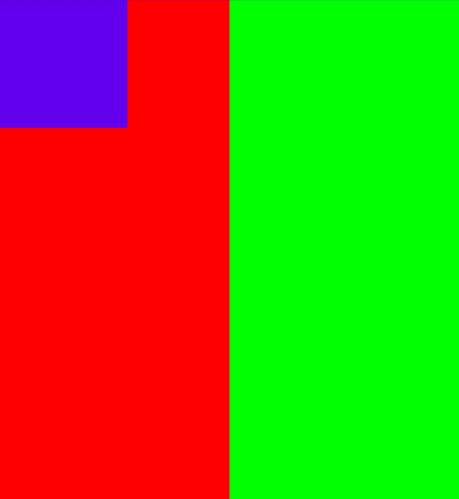

简单的在触摸事件中去改变view的位置的做法，这里就略过了。

## startDrag
API 24开始可以使用startDragAndDrop，旧的方法startDrag也是调用startDragAndDrop。

先来看一个使用示例，紫色为我们要拖拽的view，红色和绿色分别为一个普通view。

```
// 紫色的拖拽view，设置长按时调用startDrag
dragView.setOnLongClickListener {
    // 参数的具体含义在下面介绍
    dragView.startDrag(null, View.DragShadowBuilder(it), null, 0)
    true
}

// 左边的红色view，设置收到其他view拖拽的回调
leftView.setOnDragListener { v, event ->
    when (event.action) {
        DragEvent.ACTION_DRAG_STARTED -> {
            Log.e("drag", "left : ACTION_DRAG_STARTED ${event.x}  ${event.y}")
        }
        DragEvent.ACTION_DRAG_ENTERED -> {
            Log.e("drag", "left : ACTION_DRAG_ENTERED ${event.x}  ${event.y}")
        }
        DragEvent.ACTION_DRAG_LOCATION -> {
            Log.e("drag", "left : ACTION_DRAG_LOCATION ${event.x}  ${event.y}")
        }
        DragEvent.ACTION_DROP -> {
            Log.e("drag", "left : ACTION_DROP ${event.x}  ${event.y}")
        }
        DragEvent.ACTION_DRAG_EXITED -> {
            Log.e("drag", "left : ACTION_DRAG_EXITED ${event.x}  ${event.y}")
        }
        DragEvent.ACTION_DRAG_ENDED -> {
            Log.e("drag", "left : ACTION_DRAG_ENDED ${event.x}  ${event.y}")
        }
    }
    true
}
// 右边的的绿色view，设置收到其他view拖拽的回调
rightView.setOnDragListener { v, event ->
    // ... 类似，省略
    true
}
```
### 操作分析
情况1：长按紫色view，手指触摸点仅在红色view内，然后释放：
```
left : ACTION_DRAG_STARTED 185.0  267.0
right : ACTION_DRAG_STARTED -355.0  267.0
left : ACTION_DRAG_ENTERED 0.0  0.0
left : ACTION_DRAG_LOCATION 185.0  267.0
left : ACTION_DRAG_LOCATION ......（LOCATION事件会收到多个，这里省略）
left : ACTION_DROP 180.61523  265.9453
right : ACTION_DRAG_ENDED 0.0  0.0
left : ACTION_DRAG_ENDED 0.0  0.0
```

情况2：长按紫色view，从红色view拖拽到绿色view内释放
```
left : ACTION_DRAG_STARTED 238.0  194.0
right : ACTION_DRAG_STARTED -302.0  194.0
left : ACTION_DRAG_ENTERED 0.0  0.0
left : ACTION_DRAG_LOCATION 238.0  194.0
left : ACTION_DRAG_LOCATION ..... (省略）
left : ACTION_DRAG_EXITED 0.0  0.0
right : ACTION_DRAG_ENTERED 0.0  0.0
right : ACTION_DRAG_LOCATION 6.591797  312.8203
right : ACTION_DRAG_LOCATION ...... (省略)
right : ACTION_DROP 170.5957  367.3125
right : ACTION_DRAG_ENDED 0.0  0.0
left : ACTION_DRAG_ENDED 0.0  0.0
```

从两种操作情况分析可知如下结论：
* `ACTION_DRAG_STARTED`：表示拖拽开始，所有设置了listener的view都会收到
* `ACTION_DRAG_ENTERED`：表示拖拽的手指触摸点进入当前view坐标范围内
* `ACTION_DRAG_LOCATION`只要拖拽手指在当前view坐标范围内，就会不断收到`LOCATION`事件
* `ACTION_DRAG_EXITED`：表示拖拽的手指触摸点离开当前view坐标范围内
* `ACTION_DROP`：拖拽操作释放的位置处于某个view范围，该view才会收到这个事件
* `ACTION_DRAG_ENDED`：释放后，所有设置了listener的view都会收到
* 坐标位置在`ACTION_DRAG_ENDED`时不会再收到

> 如果拖拽触摸点位置的z轴层级有多个view，则以最上面的view作为拖拽进入的view。

### 源码分析
先来看startDragAndDrop方法的参数内容
```
boolean startDragAndDrop(ClipData data, DragShadowBuilder shadowBuilder, Object myLocalState, int flags)
```
* data：可以跨进程传递的数据，在DragEvent的`ACTION_DROP`事件时可以获取到。意味着在多窗口的时候也可以使用。
* shadowBuilder：绘制拖拽过程中的视觉效果，默认就是绘制一个半透明的被拖拽的view，可以继承DragShadowBuilder类来自定义效果。但本来的拖拽view还是在原地，这只是另外绘制一个视觉效果。有些情况则需要自己去隐藏原本的拖拽view。
* myLocalState：仅可在同一个Activity中传递的数据，在收到DragEvent后都可以获取到。
* flags：均在API 24添加。`DRAG_FLAG_OPAQUE`可设置拖拽绘制的视觉view不透明，默认是半透明。`DRAG_FLAG_GLOBAL`可以设置跨窗口传递ClipData数据，单独设置的情况下，支持ClipData中的text和intent，其他的还需要配合`DRAG_FLAG_GLOBAL_*`使用。
* 返回值：`ACTION_DRAG_STARTED`事件回调返回true，才可以接收后续事件。

`startDragAndDrop`的源码，主要是通过申请一个surface来绘制拖拽中的view的视觉效果，并且通过`mAttachInfo.mSession.performDrag`来跨进程传递这些信息，这部分源码不展开了解。

我们来看设置了`OnDragListener`后，接收DragEvent的流程，由于源码较简单，就仅以文字介绍。
1. 在ViewRootImpl中收到DragEvent后，会调用DecorView也就是ViewGroup的`dispatchDragEvent`方法
2. ViewGroup的`dispatchDragEvent`方法中，`ACTION_DRAG_STARTED`事件会对自己和所有子view递归传递，并且会以该view调整DragEvent中的坐标，回调返回true或false会被记录，如果是false，其他事件就不会再回调给这个view了；`ACTION_DRAG_ENDED`所有在`ACTION_DRAG_STARTED`事件时回调返回true的view都会收到；`ACTION_DRAG_LOCATION`和`ACTION_DROP`仅传递给`ACTION_DRAG_STARTED`事件时回调返回true、坐标范围内的最上层view，并且在符合条件的view变化后，比如手指移动到另一个view的范围，会传递`ACTION_DRAG_EXITED`和`ACTION_DRAG_ENTERED`。也就是说，`ACTION_DRAG_EXITED`和`ACTION_DRAG_ENTERED`是ViewGroup自己设置的，ViewRootImpl传递的只有其他四个事件。

总结：startDrag这个方式，设计思路就是给整个view体系添加了拖拽的事件传递逻辑，并且支持数据跨Activity、跨进程。