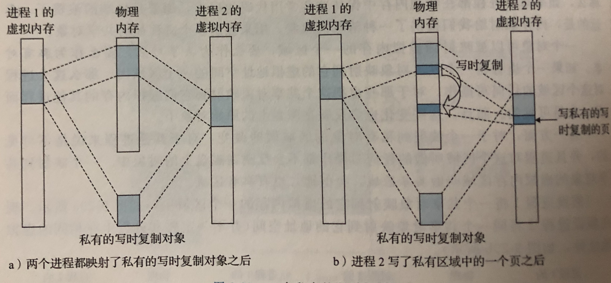

## Linux进程的虚拟内存
虚拟内存是计算机系统内存管理的一种技术。它使得应用程序认为它拥有连续的可用的内存（一个连续完整的地址空间），而实际上，它通常是被分隔成多个物理内存碎片，还有部分暂时存储在外部磁盘存储器上，在需要时进行数据交换。


虚拟内存系统需要硬件和内核软件的紧密协作，Linux为每个进程维护了一个单独的虚拟地址空间。内核虚拟内存的某些区域被映射到所有进程共享的物理页面，例如，每个进程共享内核的代码和全局数据结构。内核虚拟内存的其他区域包含每个进程都不相同的数据，比如，页表、task和mm结构、内核栈。


进程的task_struct结构中又一个条目指向mm_struct，它描述了虚拟内存的当前状态。

## 内存映射
Linux通过将一个虚拟内存区域与一个磁盘上的对象（object）关联起来，以初始化这个虚拟内存区域的内容，这个过程成为**内存映射**（memory mapping）。每个对象都有一个唯一的文件名，虚拟内存可以映  
射到两种类型的对象中的一种：
1. Linux文件系统中的普通文件。例如一个可执行文件。**因为按需进行页面调度，所以这些虚拟页面并没有实际交换进物理内存，直到CPU第一次引用到页面。**
2. 匿名文件。匿名文件由内核创建，包含的全是二进制零。磁盘和内存之间并没有实际的数据传输
> 这里的对象，可以看作文件。可看出，普通文件的内存映射实质是在虚拟内存和磁盘间建立关联，但要CPU用到页面时才真正放入物理内存。

## 共享对象
&emsp;&emsp;内存映射的概念来源于一个聪明的发现：如果虚拟内存系统可以集成到传统的文件系统中，那么就能提供一种简单而高效的把程序和数据加载到内存中的方法。  
&emsp;&emsp;进程这一抽象能为每个进程提供自己私有的虚拟地址空间，可以免受其他进程的错误读写。但是许多进程有同样的只读代码区域。例如每个C程序都有来自标准C库的如printf这样的函数。
&emsp;&emsp;为避免浪费空间，一个对象可以被映射到虚拟内存的一个区域，要么作为`共享对象`，要么作为`私有对象`。一个进程对共享对象对应虚拟内存区域的任何写操作，对其他共享此对象的进程是可见的。  
而私有对象在进程间是不可见的。一个映射到共享对象的虚拟内存区域叫做`共享区域`，类似地，也有`私有区域`。


## 私有对象
&emsp;&emsp;私有对象使用`写时复制`映射到虚拟内存中。私有对开始生命周期的方基本上与共享对象的一样，在物理内存中只保存有私有对象的一份副本。两个进程将一个私有对象映射到它们虚拟内存的不同区域，  
但是都共享这个对象同一个物理副本。对于每个映射私有对象的进程，相应私有区域的页表条目都被标记为只读，并且区域结构被标记为`私有的写时复制`。只要没有进程试图写它自己的私有区域，它们就可以继续共享  
物理内存中对象的一个单独副本。然而，只要有一个进程试图写私有区域内的某个页面，那么这个写操作就会触发一个保护屏障。  
&emsp;&emsp;当故障处理程序注意到保护异常是由于进程试图写私有的写时复制区域中的一个页面而引起的，它就会在物理内存中创建这个页面的一个新副本，更新页表条目指向这个新的副本，然后恢复这个页面的可  
写权限。当故障处理程序返回时，CPU重新执行这个写操作，现在在新创建的页面上这个写操作就可以正常执行了。


通过延迟私有对象中的副本直到最后可能的时刻，写时复制最充分地使用了稀有的物理内存。

## fork函数
&emsp;&emsp;了解了虚拟内存和内存映射，就可以清晰地知道fork函数是如何创建一个带有自己独立虚拟地址空间的新进程。  
&emsp;&emsp;当fork函数被当前进程调用时，内核为新进程创建各种数据结构，并分配给它一个唯一的PID。为了给这个新进程创建虚拟内存，它创建了当前进程的mm_struct、区域结构和页表的原样副本。它将两个  
进程中的每个页面都标记为只读，并将两个进程中的每个区域结构都标记为私有的写时复制。  
&emsp;&emsp;当fork在新进程中返回时，新进程现在的虚拟内存刚好和调用fork时存在的虚拟内存相同。当这两个进程中的任一个后来进行写操作时，写时复制机制就会创建新页面。因此，也就为每个进程保持了私有  
地址空间的抽象概念。

## execve函数
//待记录

## 使用mmap函数的用户级内存映射
&emsp;&emsp;Linux进程可以使用mmap函数来创建新的虚拟内存区域，并将对象映射到这些区域中。
```
#include <unistd.h>
#include <sys/mman.h>

void * mmap(void *start, size_t length, int port, int flags, int fd, off_t offset);

//返回：成功时为指向映射区域的指针，出错为MAP_FAILED(-1)
```
* void *start：映射区首地址，一般传NULL，代表让系统自动选定地址，映射成功后返回该地址。
* size_t length：映射区的大小，代表将文件中多大的部分映射到内存。
* int port：新映射的虚拟内存区域的访问权限位。可以为以下几种方式的组合：
  1. PROT_EXEC 这个区域的页面由可以被CPU执行的指令组成
  2. PROT_READ 这个区域的页面可读
  3. PROT_WRITE 这个区域的页面可写
  4. PROT_NONE 这个区域的页面不能被访问
* flags：描述被映射的`对象`类型。
   1. MAP_ANON 表示被映射的对象是匿名对象，相应的虚拟页面是请求二进制零的
   2. MAP_PRIVATE 表示被映射对象是一个私有的、写时复制的对象
   3. MAP_SHARED 表示是一个共享对象

&emsp;&emsp;mmap函数要求内核创建一个新的虚拟内存区域，最好是从 start 开始，并将文件描述符 fd 指定的对象的一个连续的片（chunk）映射到这个新的区域。连续的对象片大小为 length 字节，  
从距文件开始位置偏移量为 offset 字节的地方开始。start 仅仅是一个暗示，通常被定义为NULL。


munmap函数删除从虚拟地址start开始的，由接下来length字节组成的区域，接下来对已删除区域的引用会导致段错误。

## 动态内存分配
&emsp;&emsp;虽然可以使用低级的mmap和munmap函数来创建和删除虚拟内存的区域，但是C程序员还是会觉得当运行时需要额外虚拟内存时，用*动态内存分配器*更方便，也有更好的移植性。
&emsp;&emsp;动态内存分配器维护着一个进程的部分虚拟内存区域，成为堆（heap）。假设堆是一个请求二进制零的区域，它紧接着在未初始化的数据区域之后开始，并向上生长（相更高的地址）。对于每个进程，  
内核维护着一个变量brk，它指向堆的顶部。
&emsp;&emsp;分配器将堆视为一组不同大小的块（block）的集合来维护，每个块就是一个连续的虚拟内存片（chunk），要么是*已分配的*，要么是*空闲的*。已分配的块显式地保留为供应用程序使用。空闲块可用来分配。  
空闲块保持空闲，直到它显式地被应用所分配。一个已分配的块保持已分配状态，直到它被释放，这种释放要么是应用程序显式执行，要么是内存分配器自身隐式执行。  
&emsp;&emsp;分配器有两种基本风格，两种风格都要求应用显式地分配块，不同之处在于由哪个实体来负责释放已分配的块。
* 显式分配器：要求应用显式地释放任何已分配的块。如C语言通过malloc函数分配一个块，通过free函数释放一个块。
* 隐式分配器：要求分配器检测一个已分配块何时不再被程序所使用，那么就释放这个块。隐式分配器也叫做垃圾收集器，自动释放未使用的已分配块的过程叫做垃圾收集（garbage collection）。例如Java。

#### malloc和free函数
