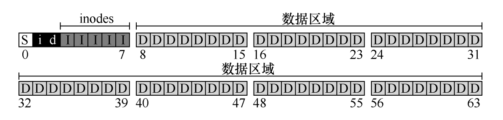

本笔记为阅读《操作系统导论》的关键信息记录。操作系统的设计，主要分为虚拟化、并发、持久化三个方面。
## 虚拟化

### CPU/进程/上下文切换
操作系统将物理（physical）资源（如处理器、内存或磁盘）转换为更通用、更强大且更易于使用的虚拟形式。为了让用户可以告诉操作系统做什么，从而利用虚拟机的功能（如运行程序、分配内存或访问文件），操作系统提供了一些接口（API）。实际上，典型的操作系统会提供几百个系统调用（system call），让应用程序调用。

操作系统相当偏执，它希望确保控制机器。虽然它希望程序能够尽可能高效地运行，但操作系统也希望能够对错误或恶意的程序说“啊！别那么快，我的朋友”。偏执狂全天控制，并且确保操作系统控制机器。也许这就是我们将操作系统视为资源管理器的原因。

一个进程必须能够执行 I/O 和其他一些受限制的操作，但又不能让进程完全控制系统。操作系统和硬件如何协作实现这一点？硬件通过提供不同的执行模式来协助操作系统。在用户模式（user mode）下，应用程序不能完全访问硬件资源。在内核模式（kernel mode）下，操作系统可以访问机器的全部资源.


当一个进程停止时，它的寄存器将被保存到内存中。通过恢复这些寄存器（将它们的值放回实际的物理寄存器中），操作系统可以恢复运行该进程。上下文切换在概念上很简单：操作系统要做的就是为当前正在执行的进程保存一些寄存器的值（例如，到该进程的内存内核栈），并为即将执行的进程恢复一些寄存器的值（从它的内核栈）。这样一来，操作系统就可以确保最后执行从陷阱返回指令时，不是返回到之前运行的进程，而是继续执行另一个进程。为了保存当前正在运行的进程的上下文，操作系统会执行一些底层汇编代码，来保存通用寄存器、程序计数器，以及当前正在运行的进程的内核栈指针，然后恢复寄存器、程序计数器，并切换内核栈，供即将运行的进程使用。通过切换栈，内核在进入切换代码调用时，是一个进程（被中断的进程）的上下文，在返回时，是另一进程（即将执行的进程）的上下文。当操作系统最终执行从陷阱返回指令时，即将执行的进程变成了当前运行的进程。至此上下文切换完成。

### 虚拟内存
一个进程的地址空间包含运行的程序的所有内存状态。比如：程序的代码（code，指令）必须在内存中，因此它们在地址空间里。当程序在运行的时候，利用栈（stack）来保存当前的函数调用信息，分配空间给局部变量，传递参数和函数返回值。最后，堆（heap）用于管理动态分配的、用户管理的内存。

虚拟内存（VM）系统的一个主要目标是透明（transparency）。操作系统实现虚拟内存的方式，应该让运行的程序看不见。因此，程序不应该感知到内存被虚拟化的事实，相反，程序的行为就好像它拥有自己的私有物理内存。在幕后，操作系统（和硬件）完成了所有的工作，让不同的工作复用内存，从而实现这个假象。虚拟内存的另一个目标是效率（efficiency）、第三个目标是保护（protection）不会受其他进程影响，操作系统本身也不会受进程影响。

假设将所有进程的地址空间完整地加载到内存中，利用基址和界限寄存器，操作系统很容易将不同进程重定位到不同的物理内存区域。但是，对于这些内存区域，你可能已经注意到一件有趣的事：栈和堆之间，有一大块“空闲”空间。如果我们将整个地址空间放入物理内存，那么栈和堆之间的空间并没有被进程使用，却依然占用了实际的物理内存。因此，简单的通过基址寄存器和界限寄存器实现的虚拟内存很浪费。另外，如果剩余物理内存无法提供连续区域来放置完整的地址空间，进程便无法运行。

为了解决这个问题，**分段**（segmentation）的概念应运而生。这个想法很简单，在 MMU 中引入不止一个基址和界限寄存器对，而是给地址空间内的每个逻辑段（segment）一对。一个段只是地址空间里的一个连续定长的区域，在典型的地址空间里有 3 个逻辑不同的段：代码、栈和堆。分段的机制使得操作系统能够将不同的段放到不同的物理内存区域，从而避免了虚拟地址空间中的未使用部分占用物理内存。具体来说，栈和堆之间没有使用的区域就不需要再分配物理内存，让我们能将更多地址空间放进物理内存。

段表记录每个段的基址和界限。

分段，段之间有内存碎片化问题，此时就需要使用内存交换，也就是将某些段写入磁盘，再读回内存的其他位置，整理碎片，但内存交换效率低，因为段比较大。


**分页**的基本方法是，将地址空间分成许多的页。每页的大小由CPU决定，然后由操作系统选择页的大小。目前Inter系列的CPU支持4KB或4MB的页大小，而PC上目前都选择使用4KB。按这种选择，4GB虚拟地址空间共可以分成1048576个页，512M的物理内存可以分为131072个页。显然虚拟空间的页数要比物理空间的页数多得多。

在分段的方法中，每次程序运行时总是把程序全部装入内存，而分页的方法则有所不同。分页的思想是程序运行时用到哪页就为哪页分配内存，没用到的页暂时保留在硬盘上。当用到这些页时再在物理地址空间中为这些页分配内存，然后建立虚拟地址空间中的页和刚分配的物理内存页间的映射。

分页最小单位，所以可能浪费少量空间。分页使用页表。

段页也可以组合使用，而Linux采用分页的方式，但进程的内存布局仍然被逻辑上划分为不同的段，如代码段、数据段、堆段和栈段等。进程控制块（`PCB，逻辑概念，实际就是 task_struct 数据结构`）：每个进程都有一个进程控制块，包含进程的基本信息和内存管理信息。内存区域描述符（vm_area_struct）：每个内存区域（如代码段、数据段、堆段、栈段）都有一个内存区域描述符，记录该区域的起始地址、结束地址、权限等信息。

操作系统也可以使用多级页表，可以减少内存占用，在另一个笔记中有介绍 [Linux虚拟内存系统](./Linux虚拟内存系统)。

swap交换空间，可以在内存不足时，把暂时不使用内存数据放到硬盘中（速度自然比内存慢），对于进程来说也是无感的。

进程的虚拟地址空间可以比物理内存大很多，比如64位系统的虚拟地址空间理论上可以达到16EB（2^64字节），实际上限Linux一般设置用户和内核均为128T（实际能否申请这么多还是要看不同版本内核的算法策略），Linux 提供了一系列的机制，应对内存不足的问题，比如缓存的回收、交换分区 Swap 以及 OOM 等。进程可以通过系统调用向操作系统申请虚拟内存。常见的内存分配系统调用包括 malloc、mmap、brk 等。进程申请的虚拟内存可能会映射到物理内存，也可能只是预留地址空间，直到实际使用时才分配物理内存。进程申请内存是申请虚拟内存，没有读写这块虚拟内存，操作系统就不会分配实际的物理内存。

```
https://github.com/torvalds/linux/blob/master/include/linux/mm_types.h

task_struct 中的 mm_struct 数据结构用于虚拟内存管理，vm_area_struct 就在 mm_struct 中
```

> top命令查看的virt数据就是进程使用的虚拟内存大小，它包括所有使用的内存（无论是否实际加载到物理内存中）

在32位/64位操作系统环境下，申请的虚拟内存超过物理内存后会怎么样？
* 32位操作系统，进程最多只能申请3GB的虚拟内存，如果直接申请8G内存，会申请失败。
* 64位操作系统，进程最多只能申请128TB的虚拟内存，即使物理内存只有4GB，也可以申请8G内存，因为申请的内存只是虚拟内存。虚拟内存被使用前，不会占用物理内存。当访问这块虚拟内存后，操作系统才会进行物理内存分配。
* 如果申请的物理内存大小超过了空闲物理内存大小，就取决于操作系统有没有开启 Swap 机制：
	* 如果没有开启 Swap 机制，程序就会直接 OOM
	* 如果有开启 Swap 机制，程序可以正常运行

## 并发
与进程相比，线程之间的上下文切换有一点主要区别：地址空间保持不变（即不需要切换当前使用的页表），每个线程都有一个栈。

如何实现锁？最早提供的互斥解决方案之一，就是在临界区关闭中断。这个解决方案是为单处理器系统开发的。假设我们运行在这样一个单处理器系统上。通过在进入临界区之前关闭中断（使用特殊的硬件指令），可以保证临界区的代码不会被中断，从而原子地执行。结束之后，我们重新打开中断（同样通过硬件指令），程序正常运行。这里，麻烦表现为多种形式：第一，一个贪婪的程序可能在它开始时就调用 lock()，从而独占处理器。更糟的情况是，恶意程序调用 lock()后，一直死循环。后一种情况，系统无法重新获得控制，只能重启系统。关闭中断对应用要求太多，不太适合作为通用的同步解决方案。第二，这种方案不支持多处理器。如果多个线程运行在不同的 CPU 上，每个线程都试图进入同一个临界区，关闭中断也没有作用。线程可以运行在其他处理器上，因此能够进入临界区。多处理器已经很普遍了，我们的通用解决方案需要更好一些。第三，关闭中断导致中断丢失，可能会导致严重的系统问题。假如磁盘设备完成了读取请求，但 CPU 错失了这一事实，那么，操作系统如何知道去唤醒等待读取的进程？最后一个不太重要的原因就是效率低。与正常指令执行相比，现代 CPU 对于关闭和打开中断的代码执行得较慢。

因为关闭中断的方法无法工作在多处理器上，所以系统设计者开始让硬件支持锁，比如CAS指令。

## 持久化
https://docs.kernel.org/filesystems/ext4/overview.html


操作系统究竟如何与设备进行通信：第一种办法相对老一些（在 IBM 主机中使用了多年），就是用明确的 I/O 指令。这些指令规定了操作系统将数据发送到特定设备寄存器的方法，从而允许构造上文提到的协议。例如在 x86 上，in 和 out 指令可以用来与设备进行交互。当需要发送数据给设备时，调用者指定一个存入数据的特定寄存器及一个代表设备的特定端口。执行这个指令就可以实现期望的行为。

第二种方法是内存映射 I/O（memory- mapped I/O）

应用程序 --（POSIX API 例如open read write）-- 文件系统（VFS和具体实现） -- Page Cache -- 通用块设备层 -- 设备驱动程序

Page Cache会执行预读和回写，预读就是利用局部性原理，将读取数据之后的数据提前读取到内存中，这样就可以减少磁盘IO次数，提高性能。回写则是暂时将写入的数据放到内存，然后统一异步写入磁盘（和后文的fsync相关）。

在更新磁盘时，`驱动器制造商唯一保证的是写入一个扇区是原子的`（atomic，即它将完整地完成或者根本不会完成），因为硬件不能同时从同一块读取和写入。此外，它们按扇区存储校验和，因此任何不完整的写入都将作为读取错误被丢弃。因此，如果写入的数据跨越多个扇区，则写入操作可能不是原子操作。部分扇区可能会成功写入，而其他扇区可能会失败。

随着时间的推移，存储虚拟化形成了两个关键的抽象。第一个是`文件`（file）。文件就是一个线性字节数组，每个字节都可以读取或写入。每个文件都有某种低级名称（low-level name），通常是某种数字。用户通常不知道这个名字。由于历史原因，文件的低级名称通常称为 inode 号（inode number）。我们将在以后的章节中学习更多关于inode 的知识。现在，只要假设每个文件都有一个与其关联的 inode 号。

第二个抽象是`目录`（directory）一个目录，像一个文件一样，也有一个低级名字（即inode 号），但是它的内容非常具体：它包含一个（用户可读名字，低级名字）对的列表

文件存储在硬盘上，硬盘的最小存储单位为`扇区`，操作系统读取硬盘时，不会单独读取一个扇区，而是为了效率会一次性连续读取多个`扇区`，即一次性读取一个`数据块`，数据块就是文件系统读写的最小单位，数据块常见大小为4KB，即8个扇区（扇区为512字节的情况下）。

每个Block内最多只能够放置一个文件的数据，如果文件大于Block的大小，则一个文件会占用多个Block；如果文件小于Block，则该Block的剩余容量就不能够再被使用了，即磁盘空间会浪费。

大多数情况下，当程序调用 write()时，它只是告诉文件系统：请在将来的某个时刻，将此数据写入持久存储。出于性能的原因，文件系统会将这些写入在内存中缓冲（buffer）一段时间（例如 5s 或 30s）。在稍后的时间点，写入将实际发送到存储设备。从调用应用程序的角度来看，写入似乎很快完成，并且只有在极少数情况下（例如，在 write()调用之后但写入磁盘之前，机器崩溃）数据会丢失。

但是，有些应用程序需要的不只是这种保证。例如，在数据库管理系统（DBMS）中，开发正确的恢复协议要求能够经常强制写入磁盘。为了支持这些类型的应用程序，大多数文件系统都提供了一些额外的控制 API。在 UNIX中，提供给应用程序的接口被称为 `fsync(int fd)`。当进程针对特定文件描述符调用 fsync()时，文件系统通过强制将所有脏（dirty）数据（即尚未写入的）写入磁盘来响应，针对指定文件描述符引用的文件。一旦所有这些写入完成，fsync()例程就会返回。

在某些情况下，还需要 fsync()包含 foo 文件的目录。添加此步骤不仅可以确保文件本身位于磁盘上，而且可以确保文件（如果新创建）也是目录的一部分。毫不奇怪，这种细节往往被忽略，导致许多应用程序级别的错误。

`rename()`调用提供了一个有趣的保证：它（通常）是一个`原子`（atomic）调用，不论系统是否崩溃。如果系统在重命名期间崩溃，文件将被命名为旧名称或新名称，不会出现奇怪的中间状态。因此，对于支持某些需要对文件状态进行原子更新的应用程序，rename()非常重要。将文件的新版本写入临时名称（foot.txt.tmp），使用 fsync()将其强制写入磁盘。然后，当应用程序确定新文件的元数据和内容在磁盘上，
就将临时文件重命名为原有文件的名称。最后一步自动将新文件交换到位，同时删除旧版本的文件，从而实现`原子文件更新`。


创建一个文件时，实际上做了两件事。首先，要构建一个结构（inode），它将跟踪几乎所有关于文件的信息，包括其大小、文件块在磁盘上的位置等等。其次，将人类可读的名称链接到该文件，并将该链接放入目录中。在创建文件的硬链接之后，在文件系统中，原有文件名（file）和新创建的文件名（file2）之间没有区别。实际上，它们都只是指向文件底层元数据的链接。

因此，为了从文件系统中删除一个文件，我们调用 unlink()。调用 unlink()时，会删除人类可读的名称（正在删除的文件）与给定
inode 号之间的“链接”，并减少引用计数。只有当引用计数达到零时，文件系统才会释放inode 和相关数据块，从而真正“删除”该文件。


事实表明，硬链接有点局限：你不能创建目录的硬链接（因为担心会在目录树中创建一个环）。你不能硬链接到其他磁盘分区中的文件（因为 inode 号在特定文件系统中是唯一的，而不是跨文件系统），等等。因此，人们创建了一种称为符号链接的新型链接，除了表面相似之外，符号链接实际上与硬链接完全不同。第一个区别是符号链接本身实际上是一个不同类型的文件。我们已经讨论过常规文件和目录。符号链接是文件系统知道的第三种类型。

### 文件系统
文件系统是纯软件。文件系统有了数据块（D）和 inode（I），但还缺一些东西，用于记录 inode 或数据块是空闲还是已分配。

超级块包含关于该特定文件系统的信息，包括例如文件系统中有多少个 inode 和数据块、inode 表的开始位置等等。它可能还包括一些魔数，来标识文件系统类型。一个简单的文件系统例子，总共有64个块，每个块4K：


#### inode
文件系统最重要的磁盘结构之一是 inode，几乎所有的文件系统都有类似的结构。名称 inode 是 index node（索引节点）的缩写，用于描述保存给定文件的元数据的结构，例如其长度、权限以及其组成块的位置。

在每个 inode 中，实际上是所有关于文件的信息：文件类型（例如，常规文件、目录等）、大小、分配给它的块数、保护信息（如谁拥有该文件以及谁可以访问它）、一些时间信息（包括文件创建、修改或上次访问的时间文件下），以及有关其数据块驻留在磁盘上的位置的信息（如某种类型的指针）。我们将所有关于文件的信息称为元数据（metadata）。实际上，文件系统中除了纯粹的用户数据外，其他任何信息通常都称为元数据。

设计 inode 时，最重要的决定之一是它如何引用数据块的位置。一种简单的方法是在inode 中有一个或多个直接指针（磁盘地址）。每个指针指向属于该文件的一个磁盘块。这种方法有局限：例如，如果你想要一个非常大的文件，为了支持更大的文件，文件系统设计者必须在 inode 中引入不同的结构。一个常见的思路是有一个称为间接指针（indirect pointer）的特殊指针。它不是指向包含用户数据的块，而是指向包含更多指针的块，每个指针指向用户数据。因此，inode 可以有一些固定数量（例如 12 个）的直接指针和一个间接指针。如果文件变得足够大，则会分配一个间接块（来自磁盘的数据块区域），并将 inode 的间接指针设置为指向它。假设一个块是 4KB，磁盘地址是 4 字节，那就增加了 1024 个指针。文件可以增长到（12 + 1024）×4KB，即 4144KB。在这种方法中，你可能希望支持更大的文件。为此，只需添加另一个指向inode 的指针：双重间接指针（double indirect pointer）。该指针指的是一个包含间接块指针的块，每个间接块都包含指向数据块的指针。因此，双重间接块提供了可能性，允许使用额外的1024×1024 个 4KB 块来增长文件，换言之，支持超过 4GB 大小的文件。不过，你可能想要更多，我们打赌你知道怎么办：三重间接指针（triple indirect pointer）。

许多文件系统一样，目录的组织很简单。一个目录基本上只包含一个二元组（条目名称，inode 号）的列表。对于给定目录中的每个文件或目录，目录的数据块中都有一个字符串和一个数字。

文件系统必须记录哪些 inode 和数据块是空闲的，哪些不是，这样在分配新文件或目录时，就可以为它找到空间。因此，空闲空间管理（free space management）对于所有文件系统都很重要。例如，我们可以用一个空闲列表（free list），指向第一个空闲块，然后它又指向下一个空闲块，依此类推。我们选择一种简单而流行的结构，称为位图（bitmap），一种用于数据区域（数据位图，data bitmap），另一种用于 inode 表（inode 位图，inode bitmap）。位图是一种简单的结构：每个位用于指示相应的对象/块是空闲（0）还是正在使用（1）。

#### 读写
当你发出一个 open("/foo/bar", O_RDONLY)调用时，文件系统首先需要找到文件 bar 的inode，从而获取关于该文件的一些基本信息（权限信息、文件大小等等）。文件系统必须遍历（traverse）路径名，从而找到所需的 inode。所有遍历都从文件系统的根开始，即根目录（root directory），它就记为/。因此，文件系统的第一次磁盘读取是根目录的 inode。但是这个 inode 在哪里？要找到 inode，我们必须知道它的 i-number。

通常，我们在其父目录中找到文件或目录的 i-number。根没有父目录（根据定义）。因此，根的 inode 号必须是“众所周知的”。在挂载文件系统时，文件系统必须知道它是什么。在大多数 UNIX 文件系统中，根的 inode 号为 2。因此，要开始该过程，文件系统会读入 inode 号 2 的块（第一个 inode 块）。

一旦 inode 被读入，文件系统可以在其中查找指向数据块的指针，数据块包含根目录的内容。因此，文件系统将使用这些磁盘上的指针来读取目录，在这个例子中，寻找 foo 的条目。通过读入一个或多个目录数据块，它将找到 foo 的条目。一旦找到，文件系统也会找到下一个需要的 foo 的 inode 号（假定是 44）。

下一步是递归遍历路径名，直到找到所需的 inode。文件系统读取包含foo 的 inode 及其目录数据的块，最后找到 bar 的 inode 号。open()的最后一步是将 bar 的 inode读入内存。然后文件系统进行最后的权限检查，在每个进程的打开文件表中，为此进程分配一个文件描述符，并将它返回给用户。

打开后，程序可以发出 read()系统调用，从文件中读取。第一次读取（除非 lseek()已被调用，则在偏移量 0 处）将在文件的第一个块中读取，查阅 inode 以查找这个块的位置。它也会用新的最后访问时间更新 inode。读取将进一步更新此文件描述符在内存中的打开文件表，更新文件偏移量，以便下一次读取会读取第二个文件块，等等。

打开文件导致了多次读取，以便最终找到文件的 inode。之后，读取每个块需要文件系统首先查询 inode，然后读取该块，再使用写入更新 inode 的最后访问时间字段。

写入文件是一个类似的过程。首先，文件必须打开（如上所述）。其次，应用程序可以发出 write()调用以用新内容更新文件。最后，关闭该文件。

与读取不同，写入文件也可能会分配（allocate）一个块（除非块被覆写）。当写入一个新文件时，每次写入操作不仅需要将数据写入磁盘，还必须首先决定将哪个块分配给文件，从而相应地更新磁盘的其他结构（例如数据位图和 inode）。因此，每次写入文件在逻辑上会导致 5 个 I/O：一个读取数据位图（然后更新以标记新分配的块被使用），一个写入位图（将它的新状态存入磁盘），再是两次读取，然后写入 inode（用新块的位置更新），最后一次写入真正的数据块本身。

要创建一个文件，文件系统不仅要分配一个 inode，还要在包含新文件的目录中分配空间。

读取和写入文件可能是昂贵的，会导致（慢速）磁盘的许多 I/O。这显然是一个巨大的性能问题，为了弥补，大多数文件系统积极使用系统内存（DRAM）来缓存重要的块。没有缓存，每个打开的文件都需要对目录层次结构中的每个级别至少进行两次读取（一次读取相关目录的 inode，并且至少有一次读取其数据）。使用长路径名（例如，/1/2/3/…/100/file.txt），文件系统只是为了打开文件，就要执行数百次读取！

现代系统采用动态划分（dynamic partitioning）方法。具体来说，许多现代操作系统将虚拟内存页面和文件系统页面集成到统一页面缓存中（unified page cache）。通过这种方式，可以在虚拟内存和文件系统之间更灵活地分配内存，具体取决于在给定时间哪种内存需要更多的内存。现在想象一下有缓存的文件打开的例子。第一次打开可能会产生很多 I/O 流量，来读取目录的 inode 和数据，但是随后文件打开的同一文件（或同一目录中的文件），大部分会命中缓存，因此不需要 I/O。

大多数现代文件系统将写入在内存中缓冲 5～30s，这代表了另一种折中：如果系统在更新传递到磁盘之前崩溃，更新就会丢失。但是，将内存写入时间延长，则可以通过批处理、调度甚至避免写入，提高性能。某些应用程序（如数据库）不喜欢这种折中。因此，为了避免由于写入缓冲导致的意外数据丢失，它们就强制写入磁盘，通过调用 fsync()，使用绕过缓存的直接 I/O接口

#### 相关数据结构
Linux内核维护了3个数据结构：

1. 进程级的文件描述符表
2. 系统级的打开文件描述符表
3. 文件系统的i-node表

每个进程在Linux内核中都有一个`task_struct`结构体来维护进程相关的信息，称为进程描述符(Process Descriptor)，而在操作系统理论中称为进程控制块 (PCB,Process Control Block)。task_struct中有一个指针(`struct files_struct *files`)指向`files_struct`结构体，称为文件描述符表，其中每个表项包含一个指向已打开的文件的指针。

`task_struct`数据结构：
```
struct task_struct {
        ....
    /* 文件系统信息: */
    struct fs_struct        *fs;
    /* 打开的文件信息: */
    struct files_struct        *files;
    /* 命名空间: */
    struct nsproxy            *nsproxy;
        ....
};
```

`files_struct`数据结构
```
// include/linux/fdtable.h
struct files_struct {
  /*
   * read mostly part
   */
	atomic_t count; /* 引用此 files_struct 的进程数 */
	bool resize_in_progress; /* 指示文件描述符表是否正在调整大小。当文件描述符表需要扩展或收缩时，这个标志会被设置为 true。 */
	wait_queue_head_t resize_wait; /* 等待队列头，用于在文件描述符表调整大小时，阻塞其他进程的操作。其他进程会在这个队列上等待，直到调整完成。 */

	struct fdtable __rcu *fdt; /* 指向当前文件描述符表的指针。fdtable 结构体包含了文件描述符数组和相关的位图。使用 RCU（Read-Copy Update）机制进行访问，以提高并发性能。 */

	struct fdtable fdtab; /* 内联的文件描述符表，用于存储默认数量的文件描述符。这个字段在文件描述符数量较少时使用，避免了动态分配内存的开销。 */
  /*
   * written part on a separate cache line in SMP
   */
	spinlock_t file_lock ____cacheline_aligned_in_smp; /* 自旋锁，用于保护文件描述符表的并发访问。____cacheline_aligned_in_smp 确保在多处理器系统中，这个锁位于单独的缓存行中，以减少缓存争用。*/
	unsigned int next_fd; /* 下一个可用的文件描述符索引。用于快速分配新的文件描述符。 */
	unsigned long close_on_exec_init[1]; /* 初始的 close_on_exec 位图，用于标记哪些文件描述符在执行 exec 系统调用时应该被关闭。这个数组的大小为 1，表示默认情况下只存储少量文件描述符的信息。 */
	unsigned long open_fds_init[1]; 
	unsigned long full_fds_bits_init[1];
	struct file __rcu * fd_array[NR_OPEN_DEFAULT];
};
```

`文件描述符表`数据结构：
```
struct fdtable {
	unsigned int max_fds;
	struct file __rcu **fd;      /* 当前的fd数组 */
	unsigned long *close_on_exec;
	unsigned long *open_fds;
	unsigned long *full_fds_bits;
	struct rcu_head rcu;
};
```
文件描述符实际就是一个非负整数，指向fdtable中的某个位置，该位置的file就对应打开文件表中的一项

`已打开的文件在内核中用 file 结构体表示，文件描述符表中的指针指向 file 结构体`。在 file 结构体中维护 File Status Flag(file 结构体的成员f_flags)和当前读写位置(file 结构体 的成员f_pos )。

已打开文件结构file
```
// https://github.com/torvalds/linux/blob/master/include/linux/fs.h

struct file {
	file_ref_t			f_ref; /* 引用次数，老版本叫f_count，在Linux 6.13改为f_ref https://github.com/torvalds/linux/commit/90ee6ed776c06435a3fe79c7f5344761f52e1760  */
	spinlock_t			f_lock;
	fmode_t				f_mode; /* 文件访问模式，如 FMODE_READ、FMODE_WRITE 等 */
	const struct file_operations	*f_op;
	struct address_space		*f_mapping;
	void				*private_data;
	struct inode			*f_inode; /* 指向文件对应的 inode */
	unsigned int			f_flags;
	unsigned int			f_iocb_flags;
	const struct cred		*f_cred;
	/* --- cacheline 1 boundary (64 bytes) --- */
	struct path			f_path;
	union {
		/* regular files (with FMODE_ATOMIC_POS) and directories */
		struct mutex		f_pos_lock;
		/* pipes */
		u64			f_pipe;
	};
	loff_t				f_pos; /* 文件位置指针，表示当前文件读写的位置。 */
#ifdef CONFIG_SECURITY
	void				*f_security;
#endif
	/* --- cacheline 2 boundary (128 bytes) --- */
	struct fown_struct		*f_owner;
	errseq_t			f_wb_err;
	errseq_t			f_sb_err;
#ifdef CONFIG_EPOLL
	struct hlist_head		*f_ep;
#endif
	union {
		struct callback_head	f_task_work;
		struct llist_node	f_llist;
		struct file_ra_state	f_ra;
		freeptr_t		f_freeptr;
	};
	/* --- cacheline 3 boundary (192 bytes) --- */
}
```

进程1和进程2都打开同一文件，但是对应不同的 file 结构体，因此才能有不同的File Status Flag和读写位置。如dup、fork 等系统调用会导致多个文件描述符指向同一个 file 结构体,例如有fd1 和fd2 都引用同一个file 结构体，那么它的引用计数就是2, 当close(fd1) 时并不会释放file 结构体，而只是把引用计数减到1，如果再close(fd2)，引用计数就会减到0同时释放 file 结构体，此时才真正关闭了文件。

每个 file 结构体都指向一个 file_operations 结构体，这个结构体的成员都是函数指针，指向实现各种文件操作的内核函数。比如在用户程序中read 一个文件描述符,read 通过系统调用进入内核, 然后找到这个文件描述符所指向的 file 结构体，找到 file 结构体所指向的file_operations 结构体，调用它的 read 成员所指向的内核函数(如内核代码中实现函数可能为sys_read())以完成用户请求。在用户程序中调用lseek、read、write、ioctl、open 等函数，最终都由内核调用file_operations的各成员所指向的内核函数完成用户请求。file_operations 结构体中的release成员用于完成用户程序的 close 请求，之所以叫release而不叫close 是因为它不一定真的关闭文件，而是减少引用计数,只有引用计数减到0才关闭文件。对于同一个文件系统上打开的常规文件来说，read、write 等文件操作的步骤和方法应该是一样的，调用的函数应该是相同的，所以多个打开文件的 file 结构体指向同一个 file_operations 结构体。如果打开一个字符设备文件，那么它的read，write 操作和常规文件不一样，不是读写磁盘的数据块而是读写硬件设备，所以file 结构体应该指向不同的file_operations 结构体，其中的各种文件操作函数由该设备的驱动程序实现。

**在 struct file 结构体中，f_inode 和 f_path.dentry 是两个不同的字段，它们在文件系统中扮演着不同的角色。f_inode 指向文件的 struct inode 结构体，主要用于存储文件的元数据和管理文件操作；f_path.dentry 指向文件的 struct dentry 结构体，主要用于路径名到 inode 的映射和目录树结构的管理。通过理解这两个字段的区别，可以更好地理解 Linux 文件系统的内部工作原理。**

每个file 结构体都有一个指向dentry结构体的指针（在`f_path`中），“dentry”是directory entry(目录项)的缩写。我们传给open、stat等函数的参数的是一个路径，如/home/akaedu/a，需要根据路径找到文件的inode。为了减少读盘次数，内核缓存了目录的树状结构，称为dentry cache,其中每个节点是一个dentry结构体,只要沿着路径各部分的dentry搜索即可，从根目录/找到home目录，然后找到akaedu目录，然后找到文件a。dentry cache只保存最近访问过的目录项，如果要找的目录项在cache中没有，就要从磁盘读到内存中。 

每个dentry结构体都有一个指针指向 inode 结构体。inode 结构体保存着从磁盘inode读上来的信息。假如有两个dentry，分别表示/home/akaedu/a 和/home/akaedu/b ，它们都指向同一个inode，说明这两个文件互为硬链接。inode 结构体中保存着从磁盘分区的inode读上来信息，例如所有者、文件大小、文件类型和权限位等。每个inode 结构体都有一个指向inode_operations结构体的指针，后者也是一组函数指针指向一些完成文件目录操作的内核函数。 

和file_operations 不同，inode_operations所指向的不是针对某一个文件进行操作的函数,而是影响文件和目录布局的函数，例如添加删除文件和目录、跟踪符号链接等等，属于同一文件系统的各inode结构体可以指向同一个inode_operations结构体。inode 结构体有一个指向super_block结构体的指针。super_block结构体保存着从磁盘分区的超级块 读上来的信息，例如文件系统类型、块大小等。super_block结构体的s_root成员是一个指  向dentry的指针，表示这个文件系统的根目录被mount 到哪里，比如某个分区可以被 mount 到 /home 目录下。 

file、dentry、inode、super_block 这几个结构体组成了VFS的核心概念。对于ext2文件系统来说，在磁盘存储布局上也有inode和超级块的概念，所以很容易和VFS中的概念建立对应关系。而另外一些文件系统格式来自非UNIX系统(例如Windows的FAT32、NTFS)，可能没有inode或超级块这样的概念，但为了能 mount 到Linux系统，也只好在驱动程序中硬凑一下，在Linux下看FAT32和NTFS分区会发现权限位是错的，所有文件都是rwxrwxrwx，因为它们本来就没有inode和权限位的概念，只能硬凑出来。

需要说明的是，当一个进程终止时，内核会对该进程所有尚未关闭的文件描述符调用close 关闭，所以即使用户程序不调用close，在终止时内核也会自动关闭它打开的所有文件。但是对于一个长年累月运行的程序(比如网络服务器)，打开的文件描述符一定要记得关闭，否则随着打开的文件越来越多，会占用大量文件描述符和系统资源。

传统的Unix既有v节点（vnode）也有i节点（inode），vnode的数据结构中包含了inode信息。但在Linux中没有使用vnode，而使用了通用inode。“实现虽不同，但在概念上是一样的。vnode (“virtual node”)仅在文件打开的时候才出现；而inode定位文件在磁盘的位置，它的信息本身是存储在磁盘等上的，当打开文件的时候从磁盘上读入内存。

对于 BSD 衍生内核和 UNIX 内核，v-node 指向文件系统特有的 i-node 结构，以及一些其他信息，包括指向操作文件的函数的指针和 inode 中未包含的元数据。主要区别在于 inode 是文件系统，而 vnode 不是。（在 Linux 中，既有独立于系统的 inode，也有依赖于文件系统的 inode）

### 崩溃
文件系统面临的一个主要挑战在于，如何在出现断电（power loss）或系统崩溃（system crash）的情况下，更新持久数据结构。

一次写入也是多个步骤，比如修改inode、修改数据块、修改位图

早期的文件系统采用了一种简单的方法来处理崩溃一致性。基本上，它们决定让不一致的事情发生，然后再修复它们（重启时）。这种偷懒方法的典型例子可以在一个工具中找到：fsck。fsck 是一个 UNIX 工具，用于查找这些不一致并修复它们。在不同的系统上，存在检查和修复磁盘分区的类似工具。请注意，这种方法无法解决所有问题。例如，考虑上面的情况，文件系统看起来是一致的，但是 inode 指向垃圾数据。唯一真正的目标，是确保文件系统元数据内部一致。

对于一致更新问题，最流行的解决方案可能是从数据库管理系统的世界中借鉴的一个想法。这种名为预写日志（write-ahead logging）的想法，是为了解决这类问题而发明的。在文件系统中，出于历史原因，我们通常将预写日志称为日志（journaling）。第一个实现它的文件系统是 Cedar，但许多现代文件系统都使用这个想法，包括 Linux ext3 和 ext4、reiserfs、IBM 的 JFS、SGI 的 XFS 和 Windows NTFS。

基本思路如下。更新磁盘时，在覆写结构之前，首先写下一点小注记（在磁盘上的其他地方，在一个众所周知的位置），描述你将要做的事情。写下这个注记就是“预写”部分，我们把它写入一个结构，并组织成“日志”。因此，就有了预写日志。通过将注释写入磁盘，可以保证在更新（覆写）正在更新的结构期间发生崩溃时，能够返回并查看你所做的注记，然后重试。因此，你会在崩溃后准确知道要修复的内容（以及如何修复它），而不必扫描整个磁盘。因此，通过设计，日志功能在更新期间增加了一些工作量，从而大大减少了恢复期间所需的工作量。

数据日志作为 Linux ext3 文件系统的一种模式提供，本讨论的大部分内容都来自于此。假设再次进行标准的更新，我们再次希望将 inode（I[v2]）、位图（B[v2]）和数据块（Db）写入磁盘。在将它们写入最终磁盘位置之前，现在先将它们写入日志。

事实证明，磁盘保证任何 512 字节
写入都会发生或不发生（永远不会半写）。因此，为了确保 TxE（transaction end，事务结束）日志的写入是原子的，应该使它成为一个 512 字节的块，并且写入日志时需要确保扇区对齐。因此，我们当前更新文件系统的协议分为如下3个阶段：
1．日志写入：将事务的内容（包括 TxB（transaction begin，事务开始）、元数据和数据）写入日志，等待这些写入完成。标上了名称。
2．日志提交：将事务提交块（包括 TxE）写入日志，等待写完成，事务被认为已提交（committed）。
3．加检查点：将更新内容（元数据和数据）写入其最终的磁盘位置。

> 日志是文件系统内部的概念，而文件是文件系统提供给上层的概念，所以日志本身不是“文件”，只是磁盘上的一块读写区域。

现在来了解文件系统如何利用日志内容从崩溃中恢复（recover）。在这个更新序列期间，任何时候都可能发生崩溃。如果崩溃发生在事务被安全地写入日志之前（在上面的步骤 2完成之前），那么我们的工作很简单：简单地跳过待执行的更新。如果在事务已提交到日志之后但在加检查点完成之前发生崩溃，则文件系统可以按如下方式恢复（recover）更新。系统引导时，文件系统恢复过程将扫描日志，并查找已提交到磁盘的事务。然后，这些事务被重放（replayed，按顺序），文件系统再次尝试将事务中的块写入它们最终的磁盘位置。这种形式的日志是最简单的形式之一，称为重做日志（redo logging）。通过在日志中恢复已提交的事务，文件系统确保磁盘上的结构是一致的，因此可以继续工作，挂载文件系统并为新请求做好准备。

一些文件系统不会一次一个地向磁盘提交每个更新（例如，Linux ext3）。与此不同，可以将所有更新缓冲到全局事务中。在上面的示例中，当创建两个文件时，文件系统只将内存中的 inode 位图、文件的 inode、目录数据和目录 inode 标记为脏，并将它们添加到块列表中，形成当前的事务。当最后应将这些块写入磁盘时（例如，在超时 5s 之后），会提交包含上述所有更新的单个全局事务。因此，通过缓冲更新，文件系统在许多情况下可以避免对磁盘的过多的写入流量。

日志空间需要回收，所以还会有第4个阶段：
4．释放：一段时间后，通过更新日志超级块，在日志中标记该事务为空闲。

在大多数系统中，元数据日志（类似于 ext3 的有序日志）比完整数据日志更受欢迎。例如，Windows NTFS 和 SGI 的 XFS 都使用无序的元数据日志。Linux ext3 为你提供了选择数据、有序或无序模式的选项（在无序模式下，可以随时写入数据）。所有这些模式都保持元数据一致，它们的数据语义各不相同。

### 文件系统总结
Linux文件系统分为两层：
上层是虚拟文件系统（Vitual Filesystem Switch），它是具体文件系统和上层应用之间的接口层，将各种不同文件系统的操作和管理纳入一个统一的框架，使得用户不必关心不同的文件系统实现细节。严格来说，虚拟文件系统并不是一种实际的文件系统，它只存在于内存中，不存在于任何外存空间，VFS在系统启动时建立，在系统关闭时消亡，VFS由超级块、inode、dentry、vfsmount等信息组成。

下层是具体的文件系统实现，例如minix（Linux最早的文件系统）、ext2/3/4，具体文件系统实现代码组织成模块形式，向Linux VFS注册回调函数，处理和具体文件系统密切相关的细节操作。

Linux文件系统对象包含文件系统类型、超级块、inode、dentry和vfsmount，
* 文件系统类型  
* 超级块反映文件系统整体的控制信息，对于基于磁盘的文件系统，超级块以特定格式存在于磁盘的特定区域，在文件系统被装载时，其内容被读入内存，构造内存中的超级块。其中某些信息为各种类型的文件系统共有，被提炼为VFS的超级块结构。如果某些文件系统不具有磁盘上的超级块和内存中的超级块形式，则它们必须负责从零构造出VFS的超级块。
* inode反映了文件系统对象的一般元信息。dentry反映了文件系统对象在文件系统树中的位置。和超级块一样，inode和dentry也有磁盘、内存、VFS三种形式，其中VFS inode和VFS dentry是被提炼出来为各种类型文件系统共有，而磁盘、内存中的inode和dentry则为具体文件系统特有，根据实际情况，也可能根本不需要。