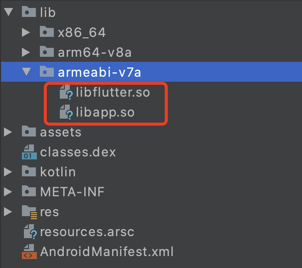
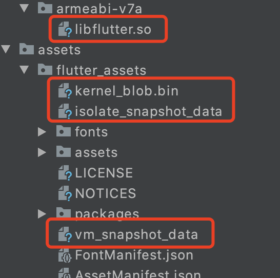

## 前言
分析源码为`Flutter 1.22.4`版本，以Android为例，先了解一下生成的apk内包含的flutter相关的文件。

1. release包

* `libflutter.so`：Flutter 的运行环境
* `libapp.so`：dart 代码编译后的机器码

2. debug包


debug 模式的 dart 使用 JIT（即时编译），不会被提前编译成机器码，所以没有生成`libapp.so`，而是在`assets/flutter_assets/`内生成如下文件：
* kerne_blob.bin
* vm_snapshot_data
* isolate_snapshot_data


任何版本的apk都会包含`flutter.jar`，`flutter.jar`会和其他的Java代码编译的字节码文件一起生成dex文件。

下面通过flutter项目生成的Android项目，来了解Flutter引擎的启动流程：

----------
## FlutterApplication
```
//FlutterApplication#onCreate
FlutterInjector.instance().flutterLoader().startInitialization(this);
```

```
public void startInitialization(@NonNull Context applicationContext) {
    this.startInitialization(applicationContext, new FlutterLoader.Settings());
}

    public void startInitialization(@NonNull Context applicationContext, @NonNull FlutterLoader.Settings settings) {
        // this.settings在后面会被赋值为当前传入的settings，判空可以保证startInitialization方法内部只执行一次
        if (this.settings == null) {
            if (Looper.myLooper() != Looper.getMainLooper()) {
                throw new IllegalStateException("startInitialization must be called on the main thread");
            } else {
                final Context appContext = applicationContext.getApplicationContext();
                // 赋值给this.settings
                this.settings = settings;
                this.initStartTimestampMillis = SystemClock.uptimeMillis();
                // 1
                this.flutterApplicationInfo = ApplicationInfoLoader.load(appContext);
                // 2 初始化VsyncWaiter
                VsyncWaiter.getInstance((WindowManager)appContext.getSystemService("window")).init();
                Callable<FlutterLoader.InitResult> initTask = new Callable<FlutterLoader.InitResult>() {
                    public FlutterLoader.InitResult call() {
                        // 3 
                        ResourceExtractor resourceExtractor = FlutterLoader.this.initResources(appContext);
                        if (FlutterInjector.instance().shouldLoadNative()) {
                            // 4 加载libflutter.so，也就是flutter engine
                            System.loadLibrary("flutter");
                        }

                        Executors.newSingleThreadExecutor().execute(new Runnable() {
                            public void run() {
                                // 5 初始化字体管理器
                                FlutterJNI.nativePrefetchDefaultFontManager();
                            }
                        });
                        if (resourceExtractor != null) {
                            resourceExtractor.waitForCompletion();
                        }
                        // 6 获取app的相关目录
                        return new FlutterLoader.InitResult(PathUtils.getFilesDir(appContext), PathUtils.getCacheDirectory(appContext), PathUtils.getDataDirectory(appContext));
                    }
                };
                this.initResultFuture = Executors.newSingleThreadExecutor().submit(initTask);
            }
        }
    }
```
这里的主要内容是：
1. 获取AndroidManifest文件中有没有在meta-data配置`libapp.so`、`vm_snapshot_data`等文件名，否则用默认的
2. 初始化VsyncWaiter
3. debug模式会在assets内产生dart相关`vm_snapshot_data`文件，这里会把它们复制到/data/data/com.xx.xx/app_flutter/内，没有文件（比如releas）就跳过。app_flutter目录是由其中的`PathUtils.getDataDirectory`得到
4. 加载`libflutter.so`
5. 初始化字体管理器
6. 获取app的相关目录

以上几步除了`加载libflutter.so`，都比较明确，下面进一步看一下关于`加载libflutter.so`这一步的具体内容。在Java中使用`System.loadLibrary`加载动态链接库，库加载的时候会调用其中的`JNI_OnLoad`函数：
```
// https://github.com/flutter/engine/blob/master/shell/platform/android/library_loader.cc

JNIEXPORT jint JNI_OnLoad(JavaVM* vm, void* reserved) {
  // 1 初始化Java虚拟机，Java虚拟机已经由Android进程创建，这里只是把vm引用的实例保存下来
  fml::jni::InitJavaVM(vm);
  // 2 调用`AttachCurrentThread`，当前线程才可以得到`JNIEnv`指针，用于后续使用
  JNIEnv* env = fml::jni::AttachCurrentThread();
  bool result = false;

  // 3 注册 FlutterMain
  result = flutter::FlutterMain::Register(env);
  FML_CHECK(result);

  // 4 注册 PlatformView
  result = flutter::PlatformViewAndroid::Register(env);
  FML_CHECK(result);

  // 5 注册 VSyncWaiter.
  result = flutter::VsyncWaiterAndroid::Register(env);
  FML_CHECK(result);

  return JNI_VERSION_1_4;
}
```
第1步，实质就是把`JavaVM`指针保存下来：
```
// https://github.com/flutter/engine/blob/master/fml/platform/android/jni_util.cc

void InitJavaVM(JavaVM* vm) {
  FML_DCHECK(g_jvm == nullptr);
  g_jvm = vm;
}
```
第2步调用`AttachCurrentThread`，得到`JNIEnv`指针。平时在C/C++中写好了Java中native方法对应的函数，从Java调用，那么执行到C/C++中的该方法也是和Java中调用者在同一线程，因为Java的线程本就是JVM对Native线程的包装。而当前情况并不是从我们的Java代码调用C/C++中的对应函数，而是JVM加载动态链接库的回调。所以需要自己通过`JavaVM`指针attch当前线程，得到`JNIEnv`指针。

第3步，注册FlutterMain：
```
// https://github.com/flutter/engine/blob/master/shell/platform/android/flutter_main.cc

bool FlutterMain::Register(JNIEnv* env) {
  static const JNINativeMethod methods[] = {
      // C++结构体赋值，指定赋值语法
      {
          .name = "nativeInit",
          .signature = "(Landroid/content/Context;[Ljava/lang/String;Ljava/"
                       "lang/String;Ljava/lang/String;Ljava/lang/String;J)V",
          .fnPtr = reinterpret_cast<void*>(&Init),
      },
      {
          .name = "nativePrefetchDefaultFontManager",
          .signature = "()V",
          .fnPtr = reinterpret_cast<void*>(&PrefetchDefaultFontManager),
      },
  };

  jclass clazz = env->FindClass("io/flutter/embedding/engine/FlutterJNI");

  if (clazz == nullptr) {
    return false;
  }

  return env->RegisterNatives(clazz, methods, fml::size(methods)) == 0;
}
```
第3步就是动态注册了`nativeInit`和`nativePrefetchDefaultFontManager`两个JNI函数

第4步，注册 PlatformView：
```
// https://github.com/flutter/engine/blob/master/shell/platform/android/platform_view_android_jni_impl.cc

bool PlatformViewAndroid::Register(JNIEnv* env) {
    // 省略内容
}
```
这一步的内容较多，但基本是相似的。通过`FindClass`来获取Java中的类 `ScopedJavaGlobalRef`和`GetMethodID`获取Java中的方法，用于c++调用java。通过`RegisterApi`注册native方法，用于java调用c++。内容和SurfaceTexture相关。

第5步，注册 VSyncWaiter.
```
// https://github.com/flutter/engine/blob/master/shell/platform/android/vsync_waiter_android.cc

bool VsyncWaiterAndroid::Register(JNIEnv* env) {
  static const JNINativeMethod methods[] = {{
      .name = "nativeOnVsync",
      .signature = "(JJJ)V",
      .fnPtr = reinterpret_cast<void*>(&OnNativeVsync),
  }};

  jclass clazz = env->FindClass("io/flutter/embedding/engine/FlutterJNI");

  if (clazz == nullptr) {
    return false;
  }

  g_vsync_waiter_class = new fml::jni::ScopedJavaGlobalRef<jclass>(env, clazz);

  FML_CHECK(!g_vsync_waiter_class->is_null());

  g_async_wait_for_vsync_method_ = env->GetStaticMethodID(
      g_vsync_waiter_class->obj(), "asyncWaitForVsync", "(J)V");

  FML_CHECK(g_async_wait_for_vsync_method_ != nullptr);

  return env->RegisterNatives(clazz, methods, fml::size(methods)) == 0;
}
```
在`startInitialization`中，初始化了`VSyncWaiter`，这里注册相关的方法用于Java和C++层的互相调用

## FlutterActivity
FlutterApplication的部分看完后，下面执行到FlutterActivity的启动过程，首先是onCreate：
```
// FlutterActivity#onCreate

protected void onCreate(@Nullable Bundle savedInstanceState) {
    this.switchLaunchThemeForNormalTheme();
    super.onCreate(savedInstanceState);
    this.lifecycle.handleLifecycleEvent(Event.ON_CREATE);
    // 创建delegate
    this.delegate = new FlutterActivityAndFragmentDelegate(this);
    this.delegate.onAttach(this);// 1
    this.delegate.onActivityCreated(savedInstanceState);// 2
    this.configureWindowForTransparency();
    this.setContentView(this.createFlutterView());// 3
    this.configureStatusBarForFullscreenFlutterExperience();
}
```
先看第一步，`delegate.onAttach`：
```
void onAttach(@NonNull Context context) {
    this.ensureAlive();
    if (this.flutterEngine == null) {
        // 设置Flutter Engine
        this.setupFlutterEngine();
    }
    // 创建 platformPlugin
    this.platformPlugin = this.host.providePlatformPlugin(this.host.getActivity(), this.flutterEngine);
    // 关联Engine和容器Activity
    if (this.host.shouldAttachEngineToActivity()) {
        Log.v("FlutterActivityAndFragmentDelegate", "Attaching FlutterEngine to the Activity that owns this Fragment.");
        this.flutterEngine.getActivityControlSurface().attachToActivity(this.host.getActivity(), this.host.getLifecycle());
    }
    // 调用io.flutter.plugins.GeneratedPluginRegistrant#registerWith方法，这是自动生成的类，
    // Flutter老版本需要自行调用，现在的版本已经由Flutter自行调用，和Dart插件有关
    this.host.configureFlutterEngine(this.flutterEngine);
}
```

重点看一下创建flutter engine：
```
void setupFlutterEngine() {
    String cachedEngineId = this.host.getCachedEngineId();
    // 如果flutterEngine有缓存，就从缓存中取
    if (cachedEngineId != null) {
        this.flutterEngine = FlutterEngineCache.getInstance().get(cachedEngineId);
        this.isFlutterEngineFromHost = true;
        if (this.flutterEngine == null) {
            throw new IllegalStateException("The requested cached FlutterEngine did not exist in the FlutterEngineCache: '" +cachedEngineId + "'");
        }
    } else {
        // 否则调用host，这里就是FlutterActivity的provideFlutterEngine来获取，默认是null
        this.flutterEngine = this.host.provideFlutterEngine(this.host.getContext());
        if (this.flutterEngine != null) {
            this.isFlutterEngineFromHost = true;
        } else {
            // 一般情况，就是执行这里新建FlutterEngine实例
            this.flutterEngine = new FlutterEngine(this.host.getContext(), this.host.getFlutterShellArgs().toArray(), false, thishost.shouldRestoreAndSaveState());
            this.isFlutterEngineFromHost = false;
        }
    }
}
```
默认情况，就是上面最后的分支，新建`FlutterEngine`实例，内部会创建Dart执行环境，各种Channel，例如PlatformChannel。然后执行`flutterLoader.ensureInitializationComplete`，其中会执行`FlutterJNI.nativeInit`，暂不继续分析内部功能。

然后看`delegate.onActivityCreated`:
```
void onActivityCreated(@Nullable Bundle bundle) {
    Log.v("FlutterActivityAndFragmentDelegate", "onActivityCreated. Giving framework and plugins an opportunity to restore state");
    this.ensureAlive();
    Bundle pluginState = null;
    byte[] frameworkState = null;
    if (bundle != null) {
        pluginState = bundle.getBundle("plugins");
        frameworkState = bundle.getByteArray("framework");
    }
    if (this.host.shouldRestoreAndSaveState()) {
        this.flutterEngine.getRestorationChannel().setRestorationData(frameworkState);
    }
    if (this.host.shouldAttachEngineToActivity()) {
        this.flutterEngine.getActivityControlSurface().onRestoreInstanceState(pluginState);
    }
}
```
这里的主要功能就是通过bundle恢复一些状态

最后看到`setContentView`中传入的View是通过FlutterActivity的`createFlutterView()`创建，然后调用`delegate.onCreateView`：
```
@NonNull
View onCreateView(LayoutInflater inflater, @Nullable ViewGroup container, @Nullable Bundle savedInstanceState) {
    Log.v("FlutterActivityAndFragmentDelegate", "Creating FlutterView.");
    this.ensureAlive();
    // 创建FlutterView
    if (this.host.getRenderMode() == RenderMode.surface) {
        FlutterSurfaceView flutterSurfaceView = new FlutterSurfaceView(this.host.getActivity(), this.host.getTransparencyMode()== TransparencyMode.transparent);
        this.host.onFlutterSurfaceViewCreated(flutterSurfaceView);
        this.flutterView = new FlutterView(this.host.getActivity(), flutterSurfaceView);
    } else {
        FlutterTextureView flutterTextureView = new FlutterTextureView(this.host.getActivity());
        this.host.onFlutterTextureViewCreated(flutterTextureView);
        this.flutterView = new FlutterView(this.host.getActivity(), flutterTextureView);
    }
    this.flutterView.addOnFirstFrameRenderedListener(this.flutterUiDisplayListener);
    // 创建FlutterSplashView
    this.flutterSplashView = new FlutterSplashView(this.host.getContext());
    if (VERSION.SDK_INT >= 17) {
        this.flutterSplashView.setId(View.generateViewId());
    } else {
        this.flutterSplashView.setId(486947586);
    }
    // 用FlutterSplashView包装FlutterView和SplashScreen
    this.flutterSplashView.displayFlutterViewWithSplash(this.flutterView, this.host.provideSplashScreen());
    Log.v("FlutterActivityAndFragmentDelegate", "Attaching FlutterEngine to FlutterView.");
    // 关联FlutterView和Flutter Engine
    this.flutterView.attachToFlutterEngine(this.flutterEngine);
    return this.flutterSplashView;
}
```
1. 创建`FlutterView`
2. 把`FlutterView`和`SplashScreen`包装于`FlutterSplashView`
3. 关联`FlutterView`和FlutterEngine
4. 返回`FlutterSplashView`

`FlutterSplashView`在`FlutterView`首帧绘制前，会先显示`SplashScreen`，`SplashScreen`在`FlutterActivity`的`provideSplashScreen`方法中提供，默认使用`AndroidManifest`文件中的配置，也可以重写方法自定义。

然后分析`FlutterActivity`的`onStart`，它会调用`delegate.onStart`：
```
void onStart() {
    Log.v("FlutterActivityAndFragmentDelegate", "onStart()");
    this.ensureAlive();
    this.doInitialFlutterViewRun();
}
```

继续执行`doInitialFlutterViewRun`，首次开始在FlutterView中运行Dart：
```
private void doInitialFlutterViewRun() {
    if (this.host.getCachedEngineId() == null) {
        if (!this.flutterEngine.getDartExecutor().isExecutingDart()) {
            Log.v("FlutterActivityAndFragmentDelegate", "Executing Dart entrypoint: " + this.host.getDartEntrypointFunctionName()+ ", and sending initial route: " + this.host.getInitialRoute());
            if (this.host.getInitialRoute() != null) {
                // 1 初始化路由
                this.flutterEngine.getNavigationChannel().setInitialRoute(this.host.getInitialRoute());
            }
            // 2 配置Dart的入口代码，并执行
            String appBundlePathOverride = this.host.getAppBundlePath();
            if (appBundlePathOverride == null || appBundlePathOverride.isEmpty()) {
                appBundlePathOverride = FlutterInjector.instance().flutterLoader().findAppBundlePath();
            }
            DartEntrypoint entrypoint = new DartEntrypoint(appBundlePathOverride, this.host.getDartEntrypointFunctionName());
            this.flutterEngine.getDartExecutor().executeDartEntrypoint(entrypoint);
        }
    }
}
```
1. 初始化路由，可查看`FlutterActivity`的`getInitialRoute`方法，默认是"/"，可以自行配置
2. 配置Dart的入口代码，并执行。入口方法由`FlutterActivity`的`getDartEntrypointFunctionName`方法返回，默认为`main`，也可以自行配置

后续内容会执行到C++，不再继续阅读。