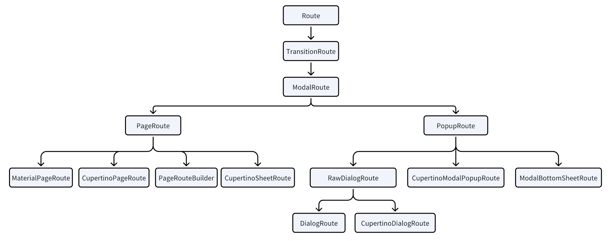

Flutter 3.29.2 源码

## 路由概述
`MaterialApp`构造有`普通构造`和`MaterialApp.router(...)`两种方式，它们的路由逻辑处理方式不同。普通构造方式就是最常见的移动端**命令式**风格的方式来管理**路由栈**，而为了处理桌面端和Web端，Flutter设计了**响应式**风格的路由方式，也就是`MaterialApp.router(...)`中用到的`Router`、`RouterConfig`等类来管理**路由树**。

## MaterialApp 普通构造方式 -- 命令式风格
查看 `MaterialApp` 的文档说明，路由相关参数，总结如下：

0. `initialRoute`参数 可以设置默认初始路由，默认为 "/"
1. 对于 "/" 路由，`home`参数不是 null 则会被使用，作为初始路由页面
2. 否则，`routes` 不为空则会处理路由，对应命名路由的场景
3. 否则，`onGenerateRoute` 被调用，处理没有被 `home` 和 `routes` 处理的路由
4. 最后，`onUnknownRoute` 兜底处理

`home`、`routes`、`onGenerateRoute` 或者 `builder` 至少一个不为null，前3个是路由相关，而`builder`是直接创建Widget。如果 `home`、`routes`、`onGenerateRoute` 和 `onUnknownRoute` 都是null，并且 `builder` 不是 null，则 `Navigator` 不会创建，因为不需要路由。

如果只有 `routes`，则至少需要包含 "/" 路由（或者是`initialRoute`设置的初始路由字符串）。

`onGenerateInitialRoutes`用于在应用启动时一次性生成多个页面形成初始导航栈，比如用于从外部URL直接打开到多层页面。

`MaterialApp` 内部会创建 `WidgetsApp`，它对应的`_WidgetsAppState`的 `build` 函数中判断设置了 `home` 或 `routes` 或 `onGenerateRoute` 或 `onUnknownRoute` 时，就会创建 `Navigator`。

### 普通路由
`Route`表示一个路由，比如它的子类`MaterialPageRoute`可以构造一个页面，使用`Navigator`就可以导航到该页面：
```dart
Navigator.push(
  context,
  MaterialPageRoute(builder: (context) => const MyHomePage(title: "标题")),
);
```



#### `Route<T>` 路由基类
`Route<T>`是所有路由的基类，它是一个抽象类，定义了路由的核心接口和行为。

关键方法：
* `buildPage()`：构建页面内容
* `install()`, `dispose()`：生命周期

#### `TransitionRoute<T>` 带过渡动画的路由
为路由添加进入/退出动画（如淡入淡出、滑动）

#### `ModalRoute<T>` 模态路由基类
实现模态覆盖行为，例如背景变暗（`barrierColor`）、阻止与背景交互（`barrierDismissible`）、按返回键关闭

#### `PageRoute<T>` 全屏页面路由基类
为全屏页面切换设计，默认 `opaque = true`（完全覆盖），通常从右侧滑入（`Material`）或底部滑入（`Cupertino`）

##### `MaterialPageRoute<T>` 
Android风格的页面路由

##### `CupertinoPageRoute<T>`
iOS 风格页面路由

##### `CupertinoSheetRoute`
iOS 底部表单路由

##### `PageRouteBuilder<T>`
快速创建带自定义转场动画的全屏路由

#### `PopupRoute<T>` 弹出层路由基类
为非全屏弹出内容设计，默认 `opaque = false`（背景可见）

##### `RawDialogRoute<T>`
无默认样式的对话框路由，需要完全自定义 Dialog 外观

* `DialogRoute<T>`：Material 风格淡入 + 缩放
* `CupertinoDialogRoute<T>`：iOS 风格淡入

#### `ModalBottomSheetRoute<T>`
底部弹出面板路由，可拖拽调整高度

#### `CupertinoModalPopupRoute<T>`
iOS 风格底部弹出菜单

### 命名路由
```dart
// 1. 在 MaterialApp 使用 routes 参数配置路由

// 2. 调用 pushNamed 方法
Navigator.pushNamed(context, '/path');
```

### Navigator源码分析

#### `WidgetsApp`结构和 Navigator 构建
我们使用`Navigator`的静态方法API时，就是从组件树的上级找到它对应的`NavigatorState`执行相关操作，但我们自己没有显式创建它，那么必然有一个地方帮我们创建了它。对于我们使用`MaterialApp`的情况，它内部使用了`WidgetsApp`，其中就会创建`Navigator`：
```dart
  @override
  Widget build(BuildContext context) {
    Widget? routing;
    // 使用 routerDelegate 参数的情况，不会使用 Navigator
    if (_usesRouterWithDelegates) {
      routing = Router<Object>(
        restorationScopeId: 'router',
        routeInformationProvider: _effectiveRouteInformationProvider,
        routeInformationParser: widget.routeInformationParser,
        routerDelegate: widget.routerDelegate!,
        backButtonDispatcher: _effectiveBackButtonDispatcher,
      );
    } else if (_usesNavigator) {
      // 使用 home、routes、onGenerateRoute、onUnknownRoute的情况，会使用 Navigator
      routing = FocusScope(
        debugLabel: 'Navigator Scope',
        autofocus: true,
        child: Navigator(
          clipBehavior: Clip.none,
          restorationScopeId: 'nav',
          key: _navigator,
          initialRoute: _initialRouteName, // 初始路由，一般是 '/'
          onGenerateRoute: _onGenerateRoute,
          onGenerateInitialRoutes:
              widget.onGenerateInitialRoutes == null
                  ? Navigator.defaultGenerateInitialRoutes
                  : (NavigatorState navigator, String initialRouteName) {
                    return widget.onGenerateInitialRoutes!(initialRouteName);
                  },
          onUnknownRoute: _onUnknownRoute,
          observers: widget.navigatorObservers!,
          routeTraversalEdgeBehavior:
              kIsWeb ? TraversalEdgeBehavior.leaveFlutterView : TraversalEdgeBehavior.parentScope,
          reportsRouteUpdateToEngine: true,
        ),
      );
    } else if (_usesRouterWithConfig) {
      // 使用 routerConfig 的情况，对应声明式API的情况
      routing = Router<Object>.withConfig(
        restorationScopeId: 'router',
        config: widget.routerConfig!,
      );
    }

    Widget result;
    // 如果 MaterialApp 使用了 builder 参数，我们可以用来包裹 MaterialApp 的默认内容，比如我们想插入一个Widget用于下级共享数据
    if (widget.builder != null) {
      result = Builder(
        builder: (BuildContext context) {
          return widget.builder!(context, routing);
        },
      );
    } else {
      result = routing!;
    }

    // ......

    return RootRestorationScope( // 用于支持 App 被系统杀手后重启恢复状态。需要恢复状态的Widget需要使用 RestorationMixin
      restorationId: widget.restorationScopeId,
      child: SharedAppData( // 提供全局共享的数据存储机制，使用 SharedAppData.setValue/getValue 读写
        child: NotificationListener<NavigationNotification>( // 监听导航相关通知
          onNotification: widget.onNavigationNotification ?? _defaultOnNavigationNotification,
          child: Shortcuts( // 将键盘按键组合映射到对应的 Intent，如将 Enter 键映射到 ActivateIntent
            debugLabel: '<Default WidgetsApp Shortcuts>',
            shortcuts: widget.shortcuts ?? WidgetsApp.defaultShortcuts,
                  // 处理文本输入相关的标准快捷键（如复制、粘贴、撤销等），嵌套在 Shortcuts 内以支持快捷键优先级
            child: DefaultTextEditingShortcuts(
              child: Actions( // 将快捷键触发的 Intent 绑定到实际执行的Action，如将 ScrollIntent 绑定到滚动操作
                actions: /*...省略快捷键行为配置 */ ,
                child: FocusTraversalGroup( // 控制用户通过键盘（如 Tab 键）在界面元素间导航的顺序，默认使用阅读顺序策略
                  policy: ReadingOrderTraversalPolicy(),
                  // 用于支持 TapRegion 点击区域检测。比如点击到当前 popup 之外不穿透事件，并且关闭当前popup
                  child: TapRegionSurface(
                    // 持有一个 ShortcutRegistry，允许它的后代节点通过 ShortcutRegistry.of(context) 来注册/注销/替换 键盘快捷键（Shortcuts）。
                    child: ShortcutRegistrar(
                      // 让所有后代 widget 都可以通过 Localizations.of<T>(context) 获取当前语言对应的字符串、日期格式、数字格式等。
                      child: Localizations(
                        locale: appLocale,
                        delegates: _localizationsDelegates.toList(),
                        child: title ?? result,
                      ),
                    ),
                  ),
                ),
              ),
            ),
          ),
        ),
      ),
    );
  }
```
* `TapRegionSurface`：`TapRegion`组件可以用于检测widget点击在内部还是外部，实现方式就是`TapRegion`对应的`RenderTapRegion`会找到父级中的`TapRegionSurface`中的`TapRegionRegistry`，向它注册。有注册的情况下，`TapRegionSurface`就会在收到事件时，从`BoxHitTestResult`中拿到`hitTest`为true的子级（对应`onTapOutside`情况），注册的子级中排除这些剩下的就是`onTapInside`的情况
* `ShortcutRegistrar`：`Shortcuts`+`Actions`是静态的快捷键配置，而`ShortcutRegistrar`可以用于动态、临时的快捷键需求，比如希望希望 Esc 只在弹窗存在时关闭弹窗，弹窗关闭后 Esc 恢复原来的行为（比如关闭侧边栏、返回上一页等），**`ShortcutRegistrar`内部也会构造一个`Shortcuts`**

#### Navigator 内部的结构
前面通过`MaterialApp`得知`Navigator`会包含在众多的预置组件内，这里我们开始分析`Navigator`本身的结构。

以`Navigator.push`为例，实际是获取组件树上级节点中的`NavigatorState`，通过它来执行：
```dart
static Future<T?> push<T extends Object?>(BuildContext context, Route<T> route) {
  return Navigator.of(context).push(route);
}
```

所以下面我们就来看`Navigator`和它对应的`NavigatorState`。先来看 `Navigator` 构造函数：
```dart
class Navigator extends StatefulWidget {
  const Navigator({
    super.key,
    this.pages = const <Page<dynamic>>[], // 如果设置了pages，会被转换为[Route]堆栈，pages的变化会触发[Route]堆栈的更新
    this.initialRoute,
    this.onGenerateInitialRoutes = Navigator.defaultGenerateInitialRoutes,
    this.onGenerateRoute,
    this.onUnknownRoute,
    this.transitionDelegate = const DefaultTransitionDelegate<dynamic>(), // 路由过渡动画的委托，决定路由如何进出屏幕
    this.reportsRouteUpdateToEngine = false, // 是否向引擎报告路由更新（主要用于Web平台，用于更新浏览器URL栏）
    this.clipBehavior = Clip.hardEdge, // 定义导航器内容的裁剪行为，默认为Clip.hardEdge（硬边缘裁剪），在路由切换动画过程中，新路由可能暂时超出Navigator的边界区域，裁剪确保路由内容在Navigator容器边界内显示，避免转场动画中内容溢出父容器的视觉边界
    this.observers = const <NavigatorObserver>[], // 导航器观察者列表，用于监听导航事件（如路由push/pop）
    this.requestFocus = true, // 新路由推入时是否自动请求焦点
    this.restorationScopeId, // 状态恢复ID，用于保存/恢复导航器状态（包括路由历史）
    this.routeTraversalEdgeBehavior = kDefaultRouteTraversalEdgeBehavior, // 控制焦点遍历行为，决定当焦点到达路由边界时如何处理，例如 parentScope (默认值)：焦点会移出Flutter应用边界到父级环境（如浏览器UI）
    this.onDidRemovePage, // 当路由被移除时的回调（替代已废弃的onPopPage）
  });

  // ...

  @override
  NavigatorState createState() => NavigatorState();
}
```
这里的pages参数，就是声明式路由的场景使用，`Router`就会使用这个参数，而`MaterialApp`普通构造方式使用的是`onGenerateRoute`等参数。例如在`MaterialApp`普通构造方式中，传给`Navigator`的`onGenerateRoute`参数就是`_onGenerateRoute`函数，该函数内会先根据`routes`获取路由，如果没有就通过`onGenerateRoute`参数获取。


`Navigator` 对应的 `NavigatorState` 的 `build` 函数如下：
```dart
  Widget build(BuildContext context) {
    return HeroControllerScope.none( // 控制 hero 动画
      child: NotificationListener<NavigationNotification>( // 导航通知
        onNotification: (NavigationNotification notification) {
          // ...
        },
        child: Listener(
          onPointerDown: _handlePointerDown,
          onPointerUp: _handlePointerUpOrCancel,
          onPointerCancel: _handlePointerUpOrCancel,
          child: AbsorbPointer( // 用于阻止事件传递，
            absorbing: false, // _cancelActivePointers 方法会修改这个值，控制是否阻止事件传递
            child: FocusTraversalGroup(
              policy: FocusTraversalGroup.maybeOf(context),
              child: Focus(
                focusNode: focusNode,
                autofocus: true,
                skipTraversal: true, // 避免Focus自身成为焦点遍历的目标，确保焦点直接作用于路由内容（而非Navigator容器）
                includeSemantics: false,
                child: UnmanagedRestorationScope(
                  bucket: bucket,
                  child: Overlay( // 核心 ！！！
                    key: _overlayKey,
                    clipBehavior: widget.clipBehavior,
                    initialEntries:
                        overlay == null
                            ? _allRouteOverlayEntries.toList(growable: false)
                            : const <OverlayEntry>[],
                  ),
                ),
              ),
            ),
          ),
        ),
      ),
    );
  }
```
* `HeroControllerScope`：用于管理 `HeroController` 作用域的组件，其核心原理是通过 `InheritedWidget` 机制为子树提供共享的 `HeroController` 实例，同时确保不同导航层级（如嵌套 Navigator）的 Hero 动画能够正确隔离和协同工作。`HeroController`利用`Navigator`的`Overlay`创建临时动画层，在导航过渡期间渲染共享元素动画。
* `AbsorbPointer`：用于页面切换过程中，阻止事件传递，避免过渡状态下处理触摸事件
* `FocusTraversalGroup`：用于限定焦点遍历的作用域，确保键盘导航（如Tab键切换焦点）仅在当前激活的路由内生效，避免焦点泄露到后台路由。它内部使用`_FocusTraversalGroupNode`，遍历焦点时会识别这种特殊的`FocusNode`，
* `UnmanagedRestorationScope`：不同于普通`RestorationScope`，它不会自动关联到父级RestorationBucket，而是由NavigatorState手动控制（通过bucket属性），用于Navigator在路由切换、应用重启时精确控制状态的保存和恢复时机。

#### Overlay
`Navigator`中的核心是 `Overlay`，本质上是一个**栈式容器**，包含多个 `OverlayEntry`，按照添加顺序控制它们的显示层级。

`Overlay`的构造方法如下，主要是设置初始的 `OverlayEntry` 列表：
```dart
class Overlay extends StatefulWidget {

  const Overlay({
    super.key,
    this.initialEntries = const <OverlayEntry>[],
    this.clipBehavior = Clip.hardEdge,
  });
}
```

##### Overlay 的初始 OverlayEntry 列表
`Navigator`在构造`Overlay`时会传入`initialEntries`参数， `NavigatorState` 的 `restoreState` 方法中会构造初始路由，传入到这里，**一般就是`home`或者 `"/"`对应的路由。**
```dart
// 1. 构造初始 Route，添加到 _history 中
NavigatorState.restoreState
    ↓
Navigator.onGenerateInitialRoutes // 使用路由 "/"（一般情况）
    ↓
Navigator.defaultGenerateInitialRoutes 
    ↓
NavigatorState._routeNamed
    ↓
Navigator.onGenerateRoute
    ↓
_WidgetsAppState._onGenerateRoute // 从 "home" 参数或者 "routes" 参数中获取 Route


// 2. restoreState() 中会将 Route 转换为 _RouteEntry，放到 _history 中

// _history 包含 List<_RouteEntry>


// 3. 更新 _history 后，调用 NavigatorState._flushHistoryUpdates()
```

##### NavigatorState._flushHistoryUpdates 流程
设置初始路由后，调用了`_flushHistoryUpdates()`方法，例如`push`、`replace`等方法也会调用它。

以初始情况为例，`_RouteEntry`初始状态为`_RouteLifecycle.add`：
```dart
void _flushHistoryUpdates({bool rearrangeOverlay = true}) {
    _flushingHistory = true;
    // 初始情况，一般 _history 的长度为1，就是 home 或者 "/" 对应的 _RouteEntry
    int index = _history.length - 1;
    _RouteEntry? next;
    _RouteEntry? entry = _history[index];
    _RouteEntry? previous = index > 0 ? _history[index - 1] : null;
    bool canRemoveOrAdd = false;
    Route<dynamic>?
    poppedRoute;
    bool seenTopActiveRoute = false;
    final List<_RouteEntry> toBeDisposed = <_RouteEntry>[];
    while (index >= 0) {
      switch (entry!.currentState) {
        case _RouteLifecycle.add:
          // handleAdd 方法会将 _RouteEntry 的状态改为 adding
          entry.handleAdd(
            navigator: this,
            previousPresent: _getRouteBefore(index - 1, _RouteEntry.isPresentPredicate)?.route,
          );
          assert(entry.currentState == _RouteLifecycle.adding);
          // 然后再次循环，执行到 adding case
          continue;
        case _RouteLifecycle.adding:
          if (canRemoveOrAdd || next == null) {
            // 
            entry.didAdd(navigator: this, isNewFirst: next == null);
            assert(entry.currentState == _RouteLifecycle.idle);
            // 再次循环，执行到 idle case
            continue;
          }
        case _RouteLifecycle.push:
        case _RouteLifecycle.pushReplace:
        case _RouteLifecycle.replace:
          // ...
        case _RouteLifecycle.pushing:
          // ...
        case _RouteLifecycle.idle:
          if (!seenTopActiveRoute && poppedRoute != null) {
            entry.handleDidPopNext(poppedRoute);
          }
          seenTopActiveRoute = true;
          // This route is idle, so we are allowed to remove subsequent (earlier)
          // routes that are waiting to be removed silently:
          canRemoveOrAdd = true;
        case _RouteLifecycle.pop:
          // ...
        case _RouteLifecycle.popping:
          // Will exit this state when animation completes.
          break;
        case _RouteLifecycle.complete:
          entry.handleComplete();
          assert(entry.currentState == _RouteLifecycle.remove);
          continue;
        case _RouteLifecycle.remove:
          // ...
          assert(entry.currentState == _RouteLifecycle.removing);
          continue;
        case _RouteLifecycle.removing:
          // ...
          continue;
        case _RouteLifecycle.dispose:
          // Delay disposal until didChangeNext/didChangePrevious have been sent.
          toBeDisposed.add(_history.removeAt(index));
          entry = next;
        case _RouteLifecycle.disposing:
        case _RouteLifecycle.disposed:
        case _RouteLifecycle.staging:
          assert(false);
      }
      index -= 1;
      next = entry;
      entry = previous;
      previous = index > 0 ? _history[index - 1] : null;
    }
    // 通知 navigator observers 路由变化，即调用 RouteAware 相关方法
    _flushObserverNotifications();
    // 发送路由前后关系变更通知
    _flushRouteAnnouncement();

    // 检测并通知顶层路由变化
    final _RouteEntry? lastEntry = _lastRouteEntryWhereOrNull(_RouteEntry.isPresentPredicate);
    if (lastEntry != null && _lastTopmostRoute != lastEntry) {
      for (final NavigatorObserver observer in _effectiveObservers) {
        observer.didChangeTop(lastEntry.route, _lastTopmostRoute?.route);
      }
    }
    _lastTopmostRoute = lastEntry;
    
    // ...

    // 清理 dipose 状态的路由资源
    for (final _RouteEntry entry in toBeDisposed) {
      _disposeRouteEntry(entry, graceful: true);
    }
    // 根据当前路由状态控制 Overlay 重新排列所有 overlayEntry
    if (rearrangeOverlay) {
      overlay?.rearrange(_allRouteOverlayEntries);
    }
    // 当存在 bucket 时，更新路由历史的序列化数据用于应用状态恢复功能，确保重启后能恢复导航状态
    if (bucket != null) {
      _serializableHistory.update(_history);
    }
    _flushingHistory = false;
  }
```
核心流程总结如下：
1. 执行`_RouteEntry.handleAdd`，**状态变为`adding`**
2. 执行`_RouteEntry.didAdd`，调用`Route.install()`，以`OverlayRoute`为例，会创建`List<OverlayEntry>`放到`_overlayEntries`中，**状态变为`idle`**。(创建的`OverlayEntry`就是包含实际 widget UI 的对象)

那么现在的重点就是了解`OverlayEntry`如何用于构建UI，下面继续分析

##### Overlay 内部结构
`Navigator`中初始化或者执行`push`等操作，`_history`发生变化都会调用`_flushHistoryUpdates()`方法，将最新的`_history`中的`_RouteEntry.route`的`List<OverlayEntry>`（执行`install()`后就会创建）传给`Overlay`。

`Overlay` 对应的 `OverlayState` 源码如下：
```dart
class OverlayState extends State<Overlay> with TickerProviderStateMixin {
  final List<OverlayEntry> _entries = <OverlayEntry>[];

  // 重新排列 List<OverlayEntry>
  void rearrange(Iterable<OverlayEntry> newEntries, {OverlayEntry? below, OverlayEntry? above}) {
    final List<OverlayEntry> newEntriesList =
        newEntries is List<OverlayEntry> ? newEntries : newEntries.toList(growable: false);
    if (newEntriesList.isEmpty) {
      return;
    }
    if (listEquals(_entries, newEntriesList)) {
      return;
    }
    final LinkedHashSet<OverlayEntry> old = LinkedHashSet<OverlayEntry>.of(_entries);
    for (final OverlayEntry entry in newEntriesList) {
      // 让每个 OverlayEntry 的 _overlay 属性都赋值为当前 Overlay
      entry._overlay ??= this;
    }
    // 执行 rebuild
    setState(() {
      // 将新的 List<OverlayEntry> 赋值给 _entries
      _entries.clear();
      _entries.addAll(newEntriesList);
      old.removeAll(newEntriesList);
      _entries.insertAll(_insertionIndex(below, above), old);
    });
  }

  Widget build(BuildContext context) {
    final List<_OverlayEntryWidget> children = <_OverlayEntryWidget>[];
    bool onstage = true;
    int onstageCount = 0;
    for (final OverlayEntry entry in _entries.reversed) {
      if (onstage) {
        onstageCount += 1;
        children.add(_OverlayEntryWidget(key: entry._key, overlayState: this, entry: entry));
        if (entry.opaque) {
          // 如果有一个 OverlayEntry 是 opaque = true，则设置标记，之后的 OverlayEntry 不用再添加，因为不需要绘制
          onstage = false;
        }
      } else if (entry.maintainState) {
        // 不需要绘制，但是需要保持状态，也要添加进来。否则不参与build，对应的 element 就会被销毁
        children.add(
          _OverlayEntryWidget(
            key: entry._key,
            overlayState: this,
            entry: entry,
            tickerEnabled: false,
          ),
        );
      }
    }
    // 将需要绘制和需要保持状态的 OverlayEntry 包装为 _OverlayEntryWidget 传给 _Theater
    return _Theater(
      skipCount: children.length - onstageCount,
      clipBehavior: widget.clipBehavior,
      children: children.reversed.toList(growable: false),
    );
  }
```

#### _Theater
`_Theater` 意思是剧院，它是 `MultiChildRenderObjectWidget` 的子类，可以看作一个特别版本的 `Stack`。`_Theater`专为`Overlay`场景设计，会根据 `OverlayEntry` 的 `opaque` 和 `maintainState` 属性决定是否渲染下层组件。

* `opaque`：是否是全屏不透明的，当一个组件`opaque == true`时，那么可以认为它之下的组件都不需要再绘制了
* `maintainState`：一个已经不可见(被上面的盖住完全看不到)的组件，是否还需要保存状态。当`maintainState == true`时，会让这个组件继续活着，但不会再进行绘制操作。

#### OverlayRoute.install()
经过前面的分析，已经知道在`adding`状态下，`Route.install()`创建`List<OverlayEntry>`，以`OverlayRoute`和它的子类`ModalRoute`为例：
```dart
abstract class OverlayRoute<T> extends Route<T> {
  // 子类实现这个方法，提供 OverlayEntry 集合
  @factory
  Iterable<OverlayEntry> createOverlayEntries();

  @override
  List<OverlayEntry> get overlayEntries => _overlayEntries;
  final List<OverlayEntry> _overlayEntries = <OverlayEntry>[];

  @override
  void install() {
    _overlayEntries.addAll(createOverlayEntries());
    super.install();
  }
}

// ModalRoute 实现 createOverlayEntries()
abstract class ModalRoute<T> extends TransitionRoute<T> with LocalHistoryRoute<T> {

  @override
  Iterable<OverlayEntry> createOverlayEntries() {
    // 这里核心就是创建包含两个 OverlayEntry 的集合
    return <OverlayEntry>[
      _modalBarrier = OverlayEntry(builder: _buildModalBarrier),
      _modalScope = OverlayEntry(
        builder: _buildModalScope,
        maintainState: maintainState,
        canSizeOverlay: opaque,
      ),
    ];
  }
}
```
* `_modalBarrier`：模态遮罩层，作为模态路由的背景遮罩，主要功能是阻止用户与底层路由交互，并提供视觉上的隔离（如半透明黑色背景）。 可以通过 `barrierDismissible` 属性支持点击关闭。
* `_modalScope`：模态内容容器，承载模态路由的核心内容（如对话框UI、页面内容），并处理路由的过渡动画、焦点管理、状态维护等逻辑。

#### 总结
根据上面的分析，目前可以知道`Overlay`内的几个核心对象的作用：

* `_RouteEntry`：`Navigator`的`_history`属性包含`List<_RouteEntry>`，每个`_RouteEntry`都持有一个`Route`和相关状态`_RouteLifecycle`等

* `Route`：表示一个页面路由配置，子类 `OverlayRoute` 持有 `List<OverlayEntry>`，它的`install()`方法调用时会构造这个List

* `OverlayEntry`：包含`widget`和`opaque`、`maintainState`等配置

那么整体描述一下：
```dart
MaterialApp
    ↓
WidgetsApp
    ↓
Navigator
  1. 通过路由配置构造 List<_RouteEntry> 放到 _history 属性中，_RouteEntry 包含了 Route 信息 
  2. 执行 _flushHistoryUpdates()，处理每个 _RouteEntry 的状态变化，调用 Route.install() 构造 List<OverlayEntry>
  3. 调用 Overlay.rearrange 处理最新的 List<OverlayEntry>
    ↓
Overlay 
  1. 根据每个 OverlayEntry 的 opaque 、maintainState 属性，选择性添加，并包装为 _OverlayEntryWidget ，放到 _Theater 中绘制
```

### push 流程为例
```dart
static Future<T?> push<T extends Object?>(BuildContext context, Route<T> route) {
    return Navigator.of(context).push(route);
}

Future<T?> push<T extends Object?>(Route<T> route) {
    _pushEntry(_RouteEntry(route, pageBased: false, initialState: _RouteLifecycle.push));
    return route.popped;
}

void _pushEntry(_RouteEntry entry) {
    _history.add(entry); // 将新路由条目添加到历史记录
    _flushHistoryUpdates(); // 刷新历史记录更新
    _afterNavigation(entry.route); // 导航完成后处理（会取消事件，确保新页面不会接收到这些残留的交互事件，并阻止事件传递）
}
```

在 
```dart
void _flushHistoryUpdates({bool rearrangeOverlay = true}) {
  // ...
  while (index >= 0) {
    // ... 
    case _RouteLifecycle.push:
    case _RouteLifecycle.pushReplace:
    case _RouteLifecycle.replace:
      // 1. push 情况，调用 _RouteEntry.handlePush
      entry.handlePush(
        navigator: this,
        previous: previous?.route,
        previousPresent: _getRouteBefore(index - 1, _RouteEntry.isPresentPredicate)?.route,
        isNewFirst: next == null,
      );
      // ... push 情况，currentState 会变为 pushing
      if (entry.currentState == _RouteLifecycle.idle) {
        continue;
      }
      // 没有 break，所以会继续往 pushing case 执行
    case _RouteLifecycle.pushing:
      // 2. 执行 handlePush 后，立即走到 pushing 状态
      if (!seenTopActiveRoute && poppedRoute != null) {
        entry.handleDidPopNext(poppedRoute);
      }
      seenTopActiveRoute = true;
    case _RouteLifecycle.idle:
      // push 流程动画完成后，状态变为 idle
      if (!seenTopActiveRoute && poppedRoute != null) {
        entry.handleDidPopNext(poppedRoute);
      }
      seenTopActiveRoute = true;
      canRemoveOrAdd = true;
  }


  // _RouteEntry handlePush 方法
  void handlePush({
    required NavigatorState navigator,
    required bool isNewFirst,
    required Route<dynamic>? previous,
    required Route<dynamic>? previousPresent,
  }) {
    final _RouteLifecycle previousState = currentState;
    route._navigator = navigator;
    // push 也会调用 Route.install() 方法
    route.install();
    if (currentState == _RouteLifecycle.push || currentState == _RouteLifecycle.pushReplace) {
      final TickerFuture routeFuture = route.didPush();
      // 状态改为 pushing
      currentState = _RouteLifecycle.pushing;
      routeFuture.whenCompleteOrCancel(() {
        if (currentState == _RouteLifecycle.pushing) {
          // 等待 TickerFuture 动画完成，再修改状态为 idle
          currentState = _RouteLifecycle.idle;
          // 刷新 Navigator、Overlay 的 OverlayEntry 列表
          navigator._flushHistoryUpdates();
        }
      });
    } else {
      // ...
    }
    if (isNewFirst) {
      route.didChangeNext(null);
    }

    // 回调 didPush 方法，代码省略
  }


abstract class TransitionRoute<T> extends OverlayRoute<T> implements PredictiveBackRoute {

  // didPush() 方法返回动画的 Future
  @override
  TickerFuture didPush() {
    super.didPush();
    _simulation = _createSimulationAndVerify(forward: true);
    if (_simulation == null) {
      return _controller!.forward();
    } else {
      return _controller!.animateWith(_simulation!);
    }
  }
}

```
总结 push 流程：
1. 执行 `_RouteEntry.handlePush`，状态变为`pushing`，等待动画完成
2. 执行`pushing`状态代码，没什么实际工作，只是改一下`seenTopActiveRoute`
3. 动画完成后，执行`idle`状态代码，也只是改一下状态

**pop、replace等流程也是大同小异，不再具体分析**

### 动画
比如`push`流程，会执行动画，我们来了解一下动画怎么执行的。

`_RouteEntry.handlePush`会调用`route.install()`，那么我们看`TransitionRoute`的实现：
```dart
  @override
  void install() {
    // 创建 AnimationController
    _controller = createAnimationController();
    // 监听动画状态，过渡动画过程中（如页面滑入/滑出），当前路由通常是半透明的（例如渐变、缩放等效果），需要显示下方的路由内容。此时设opaque: false，允许Flutter绘制下方路由，保证视觉上的过渡连贯性。动画完成后，再改为opaque: true
    _animation = createAnimation()..addStatusListener(_handleStatusChanged);
    super.install();
    if (_animation!.isCompleted && overlayEntries.isNotEmpty) {
      // 兜底，如果动画同步完成，则直接修改 opaque
      overlayEntries.first.opaque = opaque;
    }
  }
```

然后在`push`流程分析中知道，`TransitionRoute.didPush()`会开始执行动画，那么而监听动画执行过渡效果的代码在哪呢？前面我们知道模态页面内容放在`_ModalScope`中显示，`_ModalScopeState`中会监听动画，并执行以下代码：
* `route._buildFlexibleTransitions`：会调用 `route.buildTransitions`，将实际的页面包装在执行动画的组件中，比如 iOS 就会使用`CupertinoPageTransition` widget 来包装页面
* `route.buildPage`：构造实际页面。这里传入 animation 一般没什么用，目前看到只有在`_SearchPageRoute`场景监听动画完成获取后请求输入框焦点。

`buildTransitions`等方法中都涉及到`animation`和`secondaryAnimation`，`animation`对应新的栈顶页面进入的动画，`secondaryAnimation`对应原本的栈顶页面离场动画。

以 iOS 页面 push 切换为例，新的栈顶页面会调用`didPush()`方法，开始执行`animation`动画。并且 route 的下一个路由发生变化时会被调用`didChangeNext`，`nextRoute` 参数表示新的下一个路由，如果为 `null` 表示当前路由成为了栈顶路由（没有下一个路由了）：
```dart
  @override
  void didChangeNext(Route<dynamic>? nextRoute) {
    _updateSecondaryAnimation(nextRoute);
    super.didChangeNext(nextRoute);
  }
```
此时会调用`_updateSecondaryAnimation(nextRoute)`方法：
1. 新的栈顶页面，设置`secondaryAnimation`为无效动画，因为只需要执行进场动画
2. 原本的栈顶页面，设置`secondaryAnimation`的 parent 为新栈顶 route 持有的 AnimationController，也就是新页面执行进场动画，当前页面同步执行退出动画。并且没有调用`didPush()`、`didPop()`，所以原栈顶页面不会执行进场`animation`动画。

> 以上就解释了`animation`和`secondaryAnimation`是如何在进场和退场页面对应执行的。

## MaterialApp.router 构造方式 -- 响应式风格
`MaterialApp.router` 构造函数情况，不会直接使用 Navigator，而是使用 `Router`（但内部 `RouterDelegate`还是会使用`Navigator`）。

`MaterialApp.router`的核心参数是`routerConfig`，它由以下参数组成：
1. `RouteInformationProvider`：提供路由信息，包括初始路由、监听路由变化
2. `RouteInformationParser`：解析路由信息，在平台路由信息和应用路由状态之间进行转换
3. `RouterDelegate`：路由委托，管理路由状态，根据状态构建UI

> RouterConfig 是在 Flutter 3.0 中引入的简化 API，它是对 RouterDelegate + RouteInformationParser + RouteInformationProvider 组合的封装。但考虑兼容还保留直接在`MaterialApp.router`中使用传递它们的方式

参数规则：
* 只要使用了 `routerDelegate` 或者 `routerConfig`，则会使用 `WidgetsApp.router` 构造方式。
* 如果使用了 `routerConfig`，则 [routeInformationParser], [routeInformationProvider], [routerDelegate], 和 [backButtonDispatcher], 必须为null。
* [routeInformationProvider] 和 [routeInformationParser] 必须同时提供或者同时不提供

也就是说 `MaterialApp()`和`MaterialApp.router()`走的两条路线，而`MaterialApp.router()`内部也分为`routerDelegate`和`routerConfig`两条路线

### Router
`Router` 是一个用于管理应用程序页面打开和关闭的调度器。它监听来自操作系统的路由信息（如应用启动时的初始路由、接收意图时的新路由、或用户点击系统返回按钮的通知），将路由信息解析为类型 T 的数据，然后转换为 Page 对象传递给 Navigator。

## GoRouter
`GoRouter` 基于`Router`，`GoRouter`实现了 MaterialApp.router 中的 `RouterConfig` 类型，push等操作会通过 `RouteInformationProvider` 来更新路由信息，`MaterialApp.router`中会监听 `RouteInformationProvider`，从而完成跳转。

具体来说，比如 push 情况，会通过 `_RouterState` 的 `_processParsedRouteInformation`方法中的 `_rebuild()` 触发 `NavigatorState._updatePages()`处理，进而执行 `_flushHistoryUpdates`、`_RouterEntry.handlePush`。这些就是前面分析`Overlay`熟悉的部分了。

**注意点1⚠️：由于GoRouter可以设置 redirect 重定向，并且重定向方法可以异步，这会导致页面跳转异步，从而导致快速点击多次跳转。应该尽量避免在重定向流程异步**

**注意点2⚠️使用 Navigator.push，执行跳转过程中，会调用 _cancelActivePointers 取消事件，并且使用`AbsorbPointer`阻止响应事件。但GoRouter不会调用 _cancelActivePointers，并且 GoRouter `_processRouteInformation` 等内部流程是异步的，也没有使用`AbsorbPointer`阻止响应事件，所以GoRouter会存在快速点击跳转问题**
