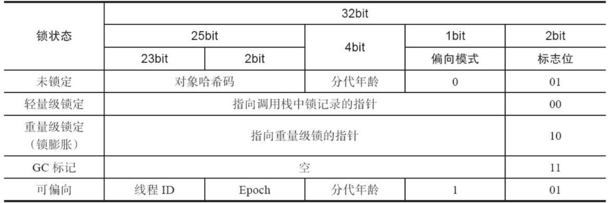

## 线程
* yield方法：当前线程让出CPU执行权，让CPU去执行其他线程，但放弃和重占CPU的时机是不确定的。
* daemon线程：守护线程在所有用户线程结束后，就自动结束

线程状态：
1. NEW：新建状态，还未调用start()开始执行
2. RUNNABLE：Java把Ready（就绪）和Running（执行）两种状态合并为一种
3. BLOCKED：阻塞状态，例如等待锁、IO阻塞
4. WAITING：无限期等待，例如调用join()、wait()、LockSupport.park()
5. TIMED_WAITING：限时等待，例如调用sleep(time)、wait(time)、LockSupport.parkNanos(time)等
6. TERMINATED：终止状态，线程执行结束或者没有处理异常

## 线程池
线程池的关键类是ThreadPoolExecutor

* int corePoolSize：核心线程数量，当前线程数量小于corePoolSize时，无论是否有空闲线程，都会创建一个新的核心线程处理提交的任务
* int maximumPoolSize：当前线程数量大于等于corePoolSize时，且队列已满，将创建新线程来处理任务，如果线程数量等于maximumPoolSize，将拒绝处理任务
* long keepAliveTime：当线程空闲时间达到keepAliveTime时，线程会结束，直到线程数量等于corePoolSize。可以通过allowCoreThreadTimeout设置允许核心线程也在空闲超时后结束
* TimeUnit unit：keepAliveTime的时间单位
* BlockingQueue<Runnable> workQueue：当前线程数量大于等于核心线程数量时，提交任务会先考虑放到队列中等待执行
* ThreadFactory threadFactory：创建线程的工厂
* RejectedExecutionHandler handler：线程数量等于maximumPoolSize时，拒绝处理任务，并由handler确定处理方式，默认抛出异常

workQueue有几个常用类型，例如Executors.newCachedThreadPool使用的SynchronousQueue：
```
public static ExecutorService newCachedThreadPool() {
    return new ThreadPoolExecutor(0, Integer.MAX_VALUE,
                                  60L, TimeUnit.SECONDS,
                                  new SynchronousQueue<Runnable>());
}
```
SynchronousQueue是一个没有容器的队列，每个put必须等待一个take，一对一的完成读写。对于非阻塞的offer，只没有空闲线程在等待获取，那么就会返回false，从而创建新线程。这就是CachedThreadPool的目的，没有空闲线程就创建新的线程

线程复用的关键就是，一个线程循环从BlockingQueue取runnable去调用run执行，即一个线程对应多个runnable

### 线程池状态
```java
// ctl包含线程池状态和线程数量，默认为RUNNING状态
private final AtomicInteger ctl = new AtomicInteger(ctlOf(RUNNING, 0));
// 32 - 3 = 29
// 因为ctl高三位表示线程池当前的状态，低29位表示线程池当前的工作线程（核心和非核心都包含）数量
private static final int COUNT_BITS = Integer.SIZE - 3;
// 工作线程的最大容量，二进制为 00011111 11111111 11111111 11111111
private static final int CAPACITY   = (1 << COUNT_BITS) - 1;

// 高三位表示线程池的5种状态
// 11100000 00000000 00000000 00000000。正常接收和处理任务
private static final int RUNNING    = -1 << COUNT_BITS;
// 00000000 00000000 00000000 00000000。调用shutdown后，进入SHUTDOWN状态，不接受新任务，interrupt空闲线程，继续处理队列中和正在执行的任务，执行完后状态走到TIDYING再到TERMINATED
private static final int SHUTDOWN   =  0 << COUNT_BITS;
// 00100000 00000000 00000000 00000000。调用shutdownNow后，进入STOP状态，不接受新任务，interrupt所有线程，移除队列的任务，然后到TIDYING再到TERMINATED
private static final int STOP       =  1 << COUNT_BITS;
// 01000000 00000000 00000000 00000000。SHUTDOWN或者STOP状态后，都会进入TIDYING这个过渡状态
private static final int TIDYING    =  2 << COUNT_BITS;
// 01100000 00000000 00000000 00000000。TIDYING后，
private static final int TERMINATED =  3 << COUNT_BITS;
```

### execute方法
```java
public void execute(Runnable command) {
    if (command == null)
        throw new NullPointerException();

    int c = ctl.get();
    //1.线程池的线程数小于corePoolSize核心线程数，则开启新核心线程
    if (workerCountOf(c) < corePoolSize) {
        if (addWorker(command, true))//添加新核心线程
            return;
        // 添加核心线程失败，重新获取ctl
        c = ctl.get();
    }

    // 2.当前大于等于corePoolSize核心线程数，或者添加新核心线程失败，则将任务放入工作队列中，待某个线程去执行
    if (isRunning(c) && workQueue.offer(command)) {
        // 重新检查当前线程池状态
        int recheck = ctl.get();
        // 如果线程池不是RUNNING，就移除该任务
        if (! isRunning(recheck) && remove(command))
            reject(command); // 执行拒绝策略
        else if (workerCountOf(recheck) == 0)
            // 如果工作线程数为0，但是工作队列中有任务排队，添加一个非核心线程的空任务，去处理排队中的任务
            addWorker(null, false);
    }
    //任务队列已满，开启非核心线程执行任务
    else if (!addWorker(command, false))
        reject(command); // 添加非核心线程失败，执行拒绝策略
}
```

addWorker是关键的代码：
```java
private boolean addWorker(Runnable firstTask, boolean core) {
    // 1. 先判断线程池的状态和线程数量
    retry:
    for (;;) {
        // 先判断线程池状态
        int c = ctl.get();
        // 获取线程池状态
        int rs = runStateOf(c);
        // RUNNING为0，其他状态都>=SHUTDOWN，所以就不是RUNNING
        if (rs >= SHUTDOWN &&
            // 如果不是RUNNING，继续判断 SHUTDOWN并且传来的task为null并且工作队列不为空
            // 同时满足这三个条件的话，就需要去处理队列中的任务
            ! (rs == SHUTDOWN &&
               firstTask == null &&
               ! workQueue.isEmpty()))
            // 所以总体就是：
            // 1. 不是RUNNING就不会处理新任务，返回false
            // 2. 如果是SHUTDOWN，那么addWorker传null并且队列不为空，就去执行队列中排队的任务，否则也返回false
            return false;

        // 判断线程池数量
        for (;;) {
            int wc = workerCountOf(c);
            if (wc >= CAPACITY ||
                wc >= (core ? corePoolSize : maximumPoolSize))
                // 如果线程数达到最大值，或者达到核心/非核心线程数，都不能添加任务
                return false;
            // CAS对ctl中的线程数+1，如果增加成功，就跳出外层循环
            if (compareAndIncrementWorkerCount(c))
                break retry;
            // 否则发生了并发操作，所以再次获取ctl
            c = ctl.get();
            // 如果当前线程池状态发生变化（并发操作），再次走外部循环
            // 没有发生变化，再次走内部循环，重新判断线程数量
            if (runStateOf(c) != rs)
                continue retry;
        }
    }

    // 正常增加了ctl中的线程数量

    // 2. 添加和启动线程

    // 工作线程是否启动了
    boolean workerStarted = false;
    // 工作线程是否添加了
    boolean workerAdded = false;
    Worker w = null;
    try {
        // 创建一个工作线程，包含传来的runnable
        w = new Worker(firstTask);
        // Worker构造函数会创建一个thread，拿到它
        final Thread t = w.thread;
        if (t != null) {
            // 线程池的锁。比如shutdown也会加锁，需要避免并发错误
            final ReentrantLock mainLock = this.mainLock;
            mainLock.lock();
            try {
                // 进入锁之前，重新获取状态
                int rs = runStateOf(ctl.get());
                // 如果状态为RUNNING
                if (rs < SHUTDOWN ||
                    // 或者状态为SHUTDOWN，并且传入runnable为null
                    (rs == SHUTDOWN && firstTask == null)) {
                    // 两种情况都要添加工作线程

                    if (t.isAlive()) // 如果worker的线程已经在执行，抛出异常（健壮性判断）
                        throw new IllegalThreadStateException();
                    // 把worker添加到workers，一个hashSet
                    workers.add(w);
                    int s = workers.size();
                    // 记录一下历史最大的线程数，暴露给外部看看需不需要使用，可能用于一些性能判断
                    if (s > largestPoolSize)
                        largestPoolSize = s;
                    // 任务已添加
                    workerAdded = true;
                }
            } finally {
                mainLock.unlock();
            }
            // 如果任务已添加
            if (workerAdded) {
                // 启动线程
                t.start();
                // 任务已启动
                workerStarted = true;
            }
        }
    } finally {
        if (! workerStarted)
            // 如果启动线程失败
            addWorkerFailed(w);
    }
    return workerStarted;
}

// 启动工作线程失败的话
private void addWorkerFailed(Worker w) {
    final ReentrantLock mainLock = this.mainLock;
    mainLock.lock();
    try {
        if (w != null)
            // workers移除它，
            workers.remove(w);
        // 工作线程数量-1
        decrementWorkerCount();
        // 尝试终止线程池（只有在必要时才会终止，比如当前是RUNNING就并不会终止）
        tryTerminate();
    } finally {
        mainLock.unlock();
    }
}

// 很多地方都会调用tryTerminate()，比如shutdown，或者工作线程需要被回收，等等
final void tryTerminate() {
    for (;;) {
        int c = ctl.get();
        // 如果是RUNNING状态
        if (isRunning(c) ||
            // 或者已经至少是TIDYING状态
            runStateAtLeast(c, TIDYING) ||
            // 或者是SHUTDOWN，并且队列还有任务需要处理
            (runStateOf(c) == SHUTDOWN && ! workQueue.isEmpty()))
            // 就直接结束，不做任何操作
            return;
        // SHUTDOWN但是队列没有任务了，或者STOP状态，会执行到这里
        // 此时还有工作线程存在
        if (workerCountOf(c) != 0) {
            // 那么就给一个空闲线程发送中断信号，如果该空闲线程被中断了，就会去调用processWorkerExit，再次tryTerminate，继续中断其他空闲线程
            interruptIdleWorkers(ONLY_ONE);
            return;
        }

        final ReentrantLock mainLock = this.mainLock;
        mainLock.lock();
        try {
            // 已经回收了全部工作线程，状态改为TIDYING
            if (ctl.compareAndSet(c, ctlOf(TIDYING, 0))) {
                try {
                    terminated(); // 钩子函数
                } finally {
                    // 最后状态改为TERMINATED
                    ctl.set(ctlOf(TERMINATED, 0));
                    termination.signalAll();
                }
                return;
            }
        } finally {
            mainLock.unlock();
        }
        // else retry on failed CAS
    }
}
```

看看Worker类
```java
private final class Worker
    // 继承了AQS，是考虑处理interrupt
    extends AbstractQueuedSynchronizer
    implements Runnable
{
    // 构造Worker时，将构造thread
    final Thread thread;

    // thread执行的任务
    Runnable firstTask;
    /** Per-thread task counter */
    volatile long completedTasks;
    
    Worker(Runnable firstTask) {
        // 初始为-1，interruptIfStarted中会判断 >= 0 才能interrupt
        setState(-1);
        this.firstTask = firstTask;
        // 线程传入runnable为this，所以会执行worker的run方法
        this.thread = getThreadFactory().newThread(this);
    }

    // 线程启动将执行runWorker
    public void run() {
        runWorker(this);
    }
    
    // 0表示未锁，1表示已锁
    protected boolean isHeldExclusively() {
        return getState() != 0;
    }

    // 不支持重入（可以对比ReentrantLock）
    protected boolean tryAcquire(int unused) {
        if (compareAndSetState(0, 1)) {
            setExclusiveOwnerThread(Thread.currentThread());
            return true;
        }
        return false;
    }

    // 把状态设置为0，允许中断
    protected boolean tryRelease(int unused) {
        setExclusiveOwnerThread(null);
        setState(0);
        return true;
    }
    public void lock()        { acquire(1); }
    public boolean tryLock()  { return tryAcquire(1); }
    public void unlock()      { release(1); }
    public boolean isLocked() { return isHeldExclusively(); }
    void interruptIfStarted() {
        Thread t;
        if (getState() >= 0 && (t = thread) != null && !t.isInterrupted()) {
            try {
                t.interrupt();
            } catch (SecurityException ignore) {
            }
        }
    }
}

// 执行任务
final void runWorker(Worker w) {
    Thread wt = Thread.currentThread();
    // 拿到worker中的任务
    Runnable task = w.firstTask;
    w.firstTask = null;
    // 会让worker中的state设置为0，可以interrupt
    w.unlock();
    boolean completedAbruptly = true;
    try {
        // 1. task != null：也就是execute/submit传入的任务不为空，就直接处理
        // 2. getTask() 从工作队列中拿出任务来执行
        while (task != null || (task = getTask()) != null) {
            // lock会把state从0改为1
            // 要注意和线程池的mainLock区分，这里已经是在单独的thread中执行了
            // 比如shutdown方法会使用mainLock，和worker的lock没关系，但shutdown中调用interruptIdleWorkers()，
            // 会调用worker的tryLock，但worker不支持重入，所以worker在执行任务的过程中，shutdown不会导致中断它
            w.lock();
            // 因为shutdownNow（会设置状态为STOP）中，并且中断执行的任务，可能想要中断的时候，这个worker还没开始执行
            // 所以开始执行的时候，还要再次确保STOP状态后，要中断当前线程
            if ((runStateAtLeast(ctl.get(), STOP) ||
                 (Thread.interrupted() &&
                  runStateAtLeast(ctl.get(), STOP))) &&
                !wt.isInterrupted())
                wt.interrupt();
            try {
                beforeExecute(wt, task); // 钩子函数
                Throwable thrown = null;
                try {
                    // 执行task
                    task.run();
                } catch (RuntimeException x) {
                    thrown = x; throw x;
                } catch (Error x) {
                    thrown = x; throw x;
                } catch (Throwable x) {
                    thrown = x; throw new Error(x);
                } finally {
                    afterExecute(task, thrown); // 钩子函数
                }
            } finally {
                task = null;
                w.completedTasks++;
                // worker状态设置为0
                w.unlock();
            }
        }
        completedAbruptly = false; // 正常执行完任务，没有抛出异常，就会设置为false
    } finally {
        processWorkerExit(w, completedAbruptly);
    }
}

// 从队列中获取任务
private Runnable getTask() {
    // 是否超时
    boolean timedOut = false;
    
    for (;;) {
        int c = ctl.get();
        // 获取线程池状态
        int rs = runStateOf(c);
        // 如果已经SHUTDOWN并且队列为空，或者已经STOP，都返回null，不执行任务
        if (rs >= SHUTDOWN && (rs >= STOP || workQueue.isEmpty())) {
            // 移除任务（workers中的移除会在processWorkerExit中完成）
            decrementWorkerCount();
            return null;
        }

        // 获得工作线程数
        int wc = workerCountOf(c);
        // allowCoreThreadTimeOut默认为false，核心线程会一直存在，如果为true，超时就会结束线程
        // 如果允许核心线程超时，或者大于核心线程数，也就是非核心线程数，也是要考虑超时
        boolean timed = allowCoreThreadTimeOut || wc > corePoolSize;
        // 如果超过最大线程数，或者等待队列中的任务直到超时了（也就是空闲线程）
        if ((wc > maximumPoolSize || (timed && timedOut))
            // 并且工作线程数 > 1 或者队列为空
            // 也就是说，超过最大线程数或者超时的情况下，工作线程数至少为2，就不执行任务，队列为空也不执行任务
            // 举例：比如非核心线程等待队列的任务，超时了并且队列为空，那就要结束这个非核心线程
            // 为什么要判断wc > 1，因为如果队列中还有任务的话，需要保留至少一个线程去处理，虽然超时是因为没有拿到任务，但是再次循环走到这里，可能并发操作队列不为空了，还需要线程去处理
            && (wc > 1 || workQueue.isEmpty())) {
            // 对工作线程数 -1
            if (compareAndDecrementWorkerCount(c))
                // -1 成功就返回null，不执行任务，会去执行processWorkerExit
                return null;
            // cas失败就再次循环
            continue;
        }

        // 从队列中拿任务
        try {
            Runnable r = timed ?
                // 允许超时，比如非核心线程，就阻塞一定时间从队列中拿任务
                workQueue.poll(keepAliveTime, TimeUnit.NANOSECONDS) :
                // 不支持超时，比如核心线程的默认情况，会一直阻塞等待队列的任务
                workQueue.take();
            if (r != null)
                return r;
            // 阻塞后还是没有拿到任务，说明超时了，也就是达到了线程的最大生存时间，需要结束它了
            timedOut = true;
        } catch (InterruptedException retry) {
            // 如果被中断了，就再次循环。
            // 比如空闲线程在等待队列填充任务，但是调用shutdown了，就会发送中断信号，这里就会再次循环判断状态，返回null从而调用processWorkerExit回收线程
            timedOut = false;
        }
    }
}
线程复用的核心就在于，runWorker中的while循环，比如核心线程，执行完当前任务后再次循环会调用getTask，从队列中拿任务，而如果没有任务会阻塞等待，拿到任务处理完后再次循环拿任务处理。又例如非核心线程，也会不断拿任务处理，直到拿任务超时了，才会结束循环，去执行processWorkerExit结束线程。

// worker执行完，或者线程需要被回收了，都要执行这里
private void processWorkerExit(Worker w, boolean completedAbruptly) {
    if (completedAbruptly)
        // 如果工作线程执行过程中发生异常，就需要减去工作线程数量
        decrementWorkerCount();
    final ReentrantLock mainLock = this.mainLock;
    // 锁
    mainLock.lock();
    try {
        // 记录总共处理的任务数量
        completedTaskCount += w.completedTasks;
        // 记录完后，从workers移除当前worker
        workers.remove(w);
    } finally {
        mainLock.unlock();
    }
    // 判断状态，必要的话关闭线程池
    tryTerminate();
    int c = ctl.get();
    // 如果当前状态小于STOP，也就是RUNNING或者SHUTDOWN
    if (runStateLessThan(c, STOP)) {
        // 如果正常执行完任务的情况
        if (!completedAbruptly) {
            int min = allowCoreThreadTimeOut ? 0 : corePoolSize;
            if (min == 0 && ! workQueue.isEmpty())
                min = 1;
            // 当前线程数大于需要的最小数量，比如大于核心线程数，就可以结束线程
            if (workerCountOf(c) >= min)
                return; // replacement not needed
        }
        // completedAbruptly为true即线程执行任务有异常，
        // 或者线程数量<=核心线程数，需要维持
        addWorker(null, false);
    }
}
```

## 同步机制
### 1. volatile
* 可见性：读数据时从主内存读取，写值时刷新到主内存
* 禁止指令重排序


虚拟机实现：JVM加屏障
1. LoadLoad：两个读操作不能换顺序
2. StoreStore：两个写操作不能换顺序
3. LoadStore：读和写不能换顺序
4. StoreLoad：写

汇编级别的实现：lock; addl $0,0(%%esp)  内存屏障

> cache line 64个字节，也就是8个long。局部性原理，读主存会读一个cache line，而不仅仅一个volatile变量。有个优化方式就是避免两个变量在一个cache line，在volatile变量前后各加7个不使用的volatile变量，防止这个volatile变量和其他需要使用的变量在一个cache line，从而避免每次修改一个数据，都要影响另一个数据也缓存失效，jdk8有注解的方式。当然，正常情况，肯定是希望变量在一个 cache line，从而提高读取速度，只是这个场景是需要避免影响其他变量，所以不希望在一个缓存行。

### 2. synchronized
经过编译后，会在同步块前后分别形成monitorenter和monitorexit字节码指令，这两个字节码都需要一个引用类型的参数来指明要锁定和解锁的对象。执行monitorenter指令时，首先会尝试获取对象的锁，将锁的计数器加1，相应的，执行monitorexit指令时会将锁计数器减1，计数器为0时锁就会被释放。如果获取对象锁失败，当前线程就会阻塞等待，直到对象锁被另外一个线程释放。

Java的线程是映射到操作系统的原生线程之上的，如果要阻塞或唤醒一个线程，都需要操作系统来帮忙完成，这就需要从用户态转换到核心态，因此状态转换需要耗费很多的处理器时间。对于synchronized修饰的同步块，状态转换消耗的时间可能比用户代码执行的时间还要长。所以synchronized是Java中的一个重量级操作。但虚拟机本身也会做一些优化，比如在通知操作系统阻塞线程之前加入一段自旋等待过程，避免频繁切入到核心态。

* 可重入：是通过记录锁的持有线程和持有数量来实现的
* 可见性：synchronized可以保证可见性

### 3. Lock接口
Lock接口是API层面的互斥锁，相比synchronized，增加了一些高级功能，例如等待可中断，可实现公平锁，锁可以绑定多个条件。

https://www.cnblogs.com/fsmly/p/11274572.html  
https://www.cnblogs.com/waterystone/p/4920797.html

### 4. 非阻塞同步
互斥同步的最大问题就是线程阻塞和唤醒所带来的性能问题，因此这种同步也称阻塞同步。随着硬件指令集的发展，可以使用基于冲突检测的乐观并发策略，通俗地说，就是现进行操作，如果没有其它线程争用共享数据，就操作成功；如果共享数据有争用，就再采取其他的补偿措施（最常见的就是循环重试），这种乐观并发策略不需要把线程挂起，因此这种同步操作成为非阻塞同步。

乐观并发策略需要硬件指令集的发展，是因为我们需要操作和冲突检测这两个步骤具备原子性，如果再使用同步互斥就没有意义了，所以只能靠硬件保证一个从语义上看起来需要多次操作的行为只通过一条处理器指令就能完成，例如：
* 测试并设置（test and set）
* 获取并增加（fetch and increment）
* 交换（swap）
* 比较并交换（compare and swap，CAS）
* 加载链接/条件存储（load linked/store conditional）

前三条指令是20世纪就已经存在，后面两条指令是现代处理器新增的。CAS指令需要三个操作数，分别是内存位置、旧的预期值和新值。CAS指令执行时，当且仅当内存中的值符合旧预期值时，处理器就用新值更新内存中的值，否则就不执行更新，这个过程是原子操作。

> 汇编指令：lock cmpxchg（多核处理器会有lock，lock的作用是执行cmpxchg的时候，不允许其他cpu打断）

在JDK 1.5之后，Java程序中才可以使用CAS操作，该操作由sun.misc.Unsafe类提供，虚拟机在内部对这些方法做了特殊处理，即时编译出来的结果就是一条平台相关的处理器CAS指令，没有方法调用的过程，或者可以认为是内联进去了。例如AtomicInteger的incrementAndGet()方法就会在无限循环中尝试将比自己大1的新值赋值给自己，失败就再次循环尝试，直到成功。

> CAS的使用方式通常为死循环compare and set，如果成功则执行成功逻辑，成功后其他线程无法成功，则执行失败逻辑

### 5. 无同步方案
使用可重入代码（不依赖共享数据）、线程本地存储等。

## synchronized锁优化
synchronized会调用monitorenter和monitorexit字节码指令。想要获取锁的线程先进入[entry set]，可以认为是等待锁的队列，线程会进入阻塞状态，然后请求进入monitor，进入后线程变为活跃状态，线程执行中调用wait，则进入[wait set]，此时[entry set]中的线程可以进入monitor，并可以调用notify让[wait set]中的线程重新进入[entry set]，从而可以再次进入monitor。

monitor依赖操作系统的mutex lock实现，需要切换到内核态，是比较重量级的操作，所以synchronized有一系列的优化。

> synchronized底层汇编也会用到lock comxchg

### Mark Word
HotSpot虚拟机的对象头分为两部分信息，第一部分用于存储对象自身的运行时数据，如哈希码、GC分代年龄等，官方称这部分数据为”Mark Word“。另一部分用于存储指向方法区对象类型数据的指针，如果是数组对象的话， 还会有一个额外的部分用于存储数组长度。

32位虚拟机


### 优化的几种手段
#### 1. 适应性自旋
为了让线程等待，只需让线程执行一个忙循环（自旋），这项技术就是自旋锁。自选锁虽然避免了线程切换的开销，但它要占用处理器时间，因此，如果锁被占用的时间很短，自旋等待的效果就会非常好，反之，自旋的线程会白白消耗处理器资源。因此，自旋的时间必须有限度，默认循环10次。

JDK 1.6中引入的自适应自旋锁，意味着自旋的时间不再固定，而是由前一次在同一个锁上的自旋时间及锁的拥有者的状态来决定的。如果在同一个锁对象上，自旋等待刚刚成功获得过的锁，并且持有锁的线程正在运行，那么虚拟机就会认为这次自旋很有可能成功，进而它将允许自旋等待持续更长的时间，比如100个循环。反之，可能自旋时间变短，甚至省略。随着程序运行和性能监控信息的不断完善，虚拟机对程序锁的状况预测就会越来越准确。

#### 2. 锁消除
锁消除是指虚拟机即时编译器在运行时，对一些代码上要求同步，但是被检测到不可能存在共享数据竞争的锁进行消除。

#### 3. 锁粗化
原则上，推荐将同步块的作用范围限制得尽量小，只在共享数据的实际作用域中才进行同步，这样是为了使需要同步的操作数量变小，如果存在锁竞争，等待锁的线程才能尽快拿到锁。但是如果一系列的连续操作都对同一个对象反复加锁和解锁，甚至加锁操作都是出现在循环体中，那么即使没有线程竞争，频繁地互斥同步操作也会导致不必要的性能损耗。

如果虚拟机探测到有一串零碎的操作都对同一个对象加锁，将会把加锁同步的范围扩展（粗化）到整个操作序列的外部，这样就只需要加锁一次。

### 当前synchronized的流程
synchronized的并发过程：无锁 -> 偏向锁 -> 轻量级锁 -> 重量级锁
#### 1. 偏向锁
偏向锁也是JDK 1.6引入的一项锁优化。

当锁对象第一次被线程获取的时候，虚拟机将会把对象头中的标志位设为01，即偏向模式。把锁对象的markword的信息拷贝到自己线程栈中存起来，同时使用CAS操作把获取到这个锁的线程指针记录在对象的Mark Word中，如果CAS操作成功，持有偏向锁的线程以后每次进入这个锁相关的同步块时，虚拟机都可以不再进行任何同步操作。
1. 如果没有其他线程来竞争锁，当前线程就释放了锁，mark word的内容不会修改，还是保持偏向锁标志位和线程指针，因为如果之后还是这个线程获取锁，就可以直接执行。可以认为，偏向锁没有明确释放的操作。
2. 当有另外一个线程取尝试获取这个锁时，偏向模式就结束了，升级为轻量级锁

偏向锁可以提高无竞争情况的性能，避免申请操作系统的重锁，而竞争多的情况下偏向锁就是多余的

#### 2. 轻量级锁
轻量级锁是JDK 1.6加入的新型锁机制。

当有其他线程想抢占锁，发现已经有偏向锁状态，就会取消偏向锁状态，升级为轻量级锁。各线程会在自己的线程栈中生成Lock Record数据，然后通过自旋CAS将mark word中特定位置设置为指向该线程栈Lock Record的指针。当自旋次数超过jvm预期上限，就会影响性能，所以竞争的线程就会把锁的对象mark指向重锁，然后所有的竞争线程放弃自旋，进入阻塞状态。

当成功获取锁的线程执行完毕，尝试通过cas释放锁时，因为mark已经指向重锁，也会解锁失败，这时线程就会知道锁已经升级为重量级锁， 它不仅要释放当前锁，还要唤醒其他阻塞的线程。

轻量级锁能提升程序同步性能的依据是“对于绝大部分的锁，在整个同步周期内都是不存在竞争的”，如果没有竞争，轻量级锁使用CAS操作避免了使用互斥量的开销，但如果存在锁竞争，除了互斥量的开销外，还额外发生CAS操作，因此在有竞争的情况下，轻量级锁比传统的重量级锁更慢。

#### 3. 重量级锁
需要到操作系统内核去申请锁，申请不到就挂起等待

## 可见性与有序性
为了解决内存的可见性问题，CPU主要提供了两种解决办法：总线锁和缓存锁。

在多CPU的系统中，当其中一个CPU要对共享主存进行操作时，在总线上发出一个LOCK#信号，这个信号使得其他CPU无法通过总线来访问共享主存中的数据，总线锁把CPU和主存之间的通信锁住了，这使得锁定期间，其他CPU不能操作其他主存地址的数据，总线锁的开销比较大，这种机制显然是不合适的。

相比总线锁，缓存锁降低了锁的粒度。为了达到数据访问的一致，需要各个CPU在访问高速缓存时遵循一些协议，在存取数据时根据协议来操作，常见的协议有MSI、MESI、MOSI等。最常见的就是MESI协议。

缓存一致性机制就是当某CPU对高速缓存中的数据进行操作之后，通知其他CPU放弃存储在它们内部的缓存数据，或者从主存中重新读取。

在正常情况下，系统操作并不会校验共享变量的缓存一致性，当共享变量用volatile关键字修饰了，该变量所在的缓存行才被要求进行缓存一致性的校验。


JMM（Java内存模型）定义了一套happens before原则（保证可见性和有序性）：
happens-before 8大原则（happens-before可以理解为，A发生于B前，那么B是可以感知A的所有操作修改）
1. 程序次序规则：同一线程按顺序执行
2. volatile变量规则：读取volatile变量前，可以感知任意线程此前对它的修改
3. 传递性规则
4. 锁规则：同一个锁，前一个线程的解锁操作对于后一个线程的加锁操作是可见的。为什么使用锁时的临界区代码具有可见性，因为根据顺序性规则，临界区的修改发生于解锁前，再根据传递性规则，也就发生于另一个线程的加锁前
5. 线程启动规则：A线程调用B线程的start，在B的start前，A的所有操作，B线程都可见
6. 线程join：A线程调用B线程的join，那么B线程的所有操作，在join返回后，A线程都可见
7. 线程中断：调用interrupt，发生在isInterrupted()检测到true之前
8. 对象终结规则：对象的初始化发生在finalize() 方法之前

> 例：如果线程1写入了volatile变量v，接着线程2读取了v，那么线程1写入v及之前的写操作都对线程2可见。也就是说，如果你感知到了volatile变量v的变化，那么在v之前的所有写操作你都可以感知的到。
> 在没 volatile 修饰时，jvm也会尽量保证可见性。​有 volatile 修饰的时候，一定保证可见性

除了long、double，其他基本类型和引用的赋值都是原子的，带volatile的long、double也是原子的。

Lock API的可见性是aqs的volatile修饰的state带来的

JAVA内存模型规定，lock一个变量时需要清空工作内存的缓存，unlock一个变量时需要将工作内存同步回主内存中，synchronzied会遵守这个规定

公平锁在释放锁的最后写volatile变量state，在获取锁时首先读这个volatile变量。根据volatile的happens-before规则，释放锁的线程在写volatile变量之前可见的共享变量，在获取锁的线程读取同一个volatile变量后将立即变得对获取锁的线程可见。从而保证了代码段中变量（变量主要是指共享变量，存在竞争问题的变量）的可见性。


原子性（互斥）还是要锁来保证

System.out.print内部用了锁，会导致测试不出可见性问题，需要注意


AQS锁，使用LockSupport.park来等待，LockSupport.unpark来唤醒

CAS 不需要操作系统的mutex，而是直接CPU硬件，Java的unsafe包，比如x86会调用C++的cmpxchg，继续调汇编指令
ThreadLocal

LongAdder
LockSupport

## java.util.concurrent（JUC）
包内有Java提供的各种并发编程类

### AbstractQueuedSynchronizer（AQS）
常用ReentrantLock、CountDownLatch、Semaphore等都会用到AQS，它使用了一个int成员变量来表示同步状态，通过内置的FIFO队列，来完成资源获取线程的排队工作。

先分析一下AQS的源码：
```
// 头节点，表示当前持有锁的线程
private transient volatile Node head;

// 等待锁的队列的尾节点，当前获取不到锁的线程需要放到链表后面排队
private transient volatile Node tail;

// 同步状态，0表示
private volatile int state;
```

当线程获取同步状态失败时，同步器会将当前线程以及等待状态构造成为一个节点（Node），将其加入到队列，同时阻塞当前线程，当同步状态释放时，会把首节点中的线程唤醒，使其再次尝试获取锁同步状态。
```java
static final class Node {
    // 用于表示一个Node在共享模式waiting
    static final Node SHARED = new Node();
    /** Marker to indicate a node is waiting in exclusive mode */
    // 用于表示一个Node在独占模式waiting
    static final Node EXCLUSIVE = null;
    // 已取消：在队列中等待的线程超时或者被中断，节点不会持续留在此状态，一旦达到此状态将从CHL队列中移除。
    static final int CANCELLED =  1;
    // 当前Node后面的Node对应的线程需要unparking（被唤醒），也就是在同步队列中等待获取锁，这个状态是针对后继节点的
    static final int SIGNAL    = -1;
    // 节点在等待condition，需要其他线程调用condition的signal后，才可以尝试获取锁
    static final int CONDITION = -2;
    // 共享模式下使用，前继结点不仅会唤醒其后继结点，同时也可能会唤醒后继的后继结点。
    static final int PROPAGATE = -3;

    // 状态，初始为0，可能被设置为上面这几个状态
    volatile int waitStatus;

    // 前一个节点
    volatile Node prev;

    // 后一个节点
    volatile Node next;

    // 当前node对应的线程
    volatile Thread thread;

    // 指向下一个处于 CONDITION 的节点，在使用condition.await()的时候排队使用
    Node nextWaiter;
```
核心就是waitStatus、prev、next、thread、nextWaiter这几个字段

### 以公平锁为例分析源码
这里以典型的重入锁的使用流程为切入点，分析源码流程
```java
val lock = ReentrantLock(true)
lock.lock()
try {
    // .......
} finally {
    lock.unlock()
}

public ReentrantLock(boolean fair) {
    sync = fair ? new FairSync() : new NonfairSync();
}

static final class FairSync extends Sync {
    // ......
}

abstract static class Sync extends AbstractQueuedSynchronizer {
    // ......
}
```

以ReentrantLock的FairSync为例，公平锁调用acquire传参为1
```java
final void lock() {
    acquire(1);
}

public final void acquire(int arg) {
    // 先尝试获取锁
    if (!tryAcquire(arg) &&
        // 获取锁失败，挂起当前线程，请求排队等待锁
        acquireQueued(addWaiter(Node.EXCLUSIVE), arg))

        // 如果尝试锁失败，并且当前线程调用interrupt()
        selfInterrupt();
}
```

返回true：1.没有线程在等待锁；2.重入锁，线程本来就持有锁，也就可以理所当然可以直接获取
```java
protected final boolean tryAcquire(int acquires) {
    final Thread current = Thread.currentThread();
    int c = getState();
    // AQS的状态为0，表示没有线程持有锁
    if (c == 0) {

        // 如果没有线程在排队等待，就CAS尝试修改，成功就是获取到锁，失败就是有其他线程抢到了锁
        if (!hasQueuedPredecessors() &&
            compareAndSetState(0, acquires)) {
            // 当前线程抢到了锁，记录当前线程
            setExclusiveOwnerThread(current);
            return true;
        }
    }
    // 如果状态不为0，并且获取锁的线程是当前线程，那就是重入
    else if (current == getExclusiveOwnerThread()) {
        // state会加上acquires
        int nextc = c + acquires;
        if (nextc < 0)
            throw new Error("Maximum lock count exceeded");
        // 修改当前状态的值
        setState(nextc);
        return true;
    }
    // 否则获取不到锁，需要排队
    return false;
}
```

将当前线程封装为Node，加入等待队列，并返回这个node
```java
// 参数mode此时是Node.EXCLUSIVE（就是null），表示独占模式
private Node addWaiter(Node mode) {

    // 调用的是这个构造函数：Node(Node nextWaiter)，所以nextWaiter为null，独占锁的nextWaiter就是null
    Node node = new Node(mode);
    // 循环CAS
    for (;;) {
        Node oldTail = tail;
        if (oldTail != null) {
            // 将新建的Node的prev设置为tail，也就是把node放到最后
            U.putObject(node, Node.PREV, oldTail);
            // 使用CAS把AQS中的tail设置为新建的node
            if (compareAndSetTail(oldTail, node)) {
                // 设置成功，就把原本tail的next指向新的node
                oldTail.next = node;
                return node;
            }
        } else {
            // 如果tail为null，则需要初始化，然后再次循环
            initializeSyncQueue();
        }
    }
}

// 构造函数，Node的thread为当前线程
Node(Node nextWaiter) {
    this.nextWaiter = nextWaiter;
    U.putObject(this, THREAD, Thread.currentThread());
}

// 初始化同步队列，把head指向一个新Node，并且tail也指向它
private final void initializeSyncQueue() {
    Node h;
    if (U.compareAndSwapObject(this, HEAD, null, (h = new Node())))
        tail = h;
}
```

// 参数为加入同步队列后的node，arg为1
```java
final boolean acquireQueued(final Node node, int arg) {
    try {
        boolean interrupted = false;
        for (;;) {
            // 获取当前node的前一个节点
            final Node p = node.predecessor();
            // 如果前一个节点就是head，说明当前node是刚加入了同步队列，而这个head就是initializeSyncQueue()中新建的一个无意义的Node，
            // 或者有线程释放锁，唤醒了当前线程，再次循环执行到这里，尝试获取锁
            if (p == head && tryAcquire(arg)) {
                // 如果尝试成功，就把head指向当前node，也就是当前线程占有了锁
                setHead(node);
                p.next = null; // help GC
                return interrupted;
            }
            // 如果当前node前一个节点不是head或者获取锁失败
            if (shouldParkAfterFailedAcquire(p, node) &&
                parkAndCheckInterrupt())
                interrupted = true;
        }
    } catch (Throwable t) {
        cancelAcquire(node);
        throw t;
    }
}

// setHead就是让head指向当前Node，并且让thread为null，当前Node成为head，也就是得到锁的线程，也就会成为一个无意义节点
private void setHead(Node node) {
    head = node;
    node.thread = null;
    node.prev = null;
}
```

走到这里，就是没有acquireQueued内部没有获取到锁，这里会判断是否需要挂起当前线程
```java
private static boolean shouldParkAfterFailedAcquire(Node pred, Node node) {
    int ws = pred.waitStatus;
    if (ws == Node.SIGNAL)
        // 前面的节点处于等待唤醒的状态，那么当前线程需要被挂起，等待LockSupport.unpark，所以返回true后先调用LockSupport.park挂起
        return true;

    // 前面的节点状态大于0，也就是Node.CANCELLED，
    if (ws > 0) {
        // 将当前节点的prev指向waitStatus<=0的节点，进入同步队列排队的线程会被挂起，而唤醒的操作是由前驱节点完成的。
        // 也就是说如果前驱节点取消了排队，就需要找前驱节点的前驱节点（循环遍历）作为自己的前驱节点
        do {
            node.prev = pred = pred.prev;
        } while (pred.waitStatus > 0);
        pred.next = node;
    } else {
        // 到这里，只能是0，-2，-3，但前面并没有看到有设置waitStatus，所以这里应该是0，将pred设置为signal也就是-1，再次循环时就会走本方法内第一个if
        pred.compareAndSetWaitStatus(ws, Node.SIGNAL);
    }
    // 如果不能被挂起，acquireQueued中就还会继续循环
    return false;
}
```

如果shouldParkAfterFailedAcquire(...)返回true，表示需要挂起，就还会执行parkAndCheckInterrupt()：
```java
// 这里就是挂起线程，需要等到其他线程唤醒当前线程时，才会返回当前线程是否被中断
private final boolean parkAndCheckInterrupt() {
    LockSupport.park(this);
    return Thread.interrupted();
}
```

释放锁的流程：
```java
public void unlock() {
    sync.release(1);
}

public final boolean release(int arg) {
    if (tryRelease(arg)) {
        // 如果释放了锁，就去唤醒排队的线程
        Node h = head;
        // head不为null，并且head的waitStatus不是初始化状态
        if (h != null && h.waitStatus != 0)
            unparkSuccessor(h);
        return true;
    }
    return false;
}

// 返回true表示释放了锁
protected final boolean tryRelease(int releases) {
    int c = getState() - releases;
    // 必然是当前占有锁的线程来释放，所以后面的代码也不用考虑线程同步问题
    if (Thread.currentThread() != getExclusiveOwnerThread())
        throw new IllegalMonitorStateException();
    // 因为支持重入锁，所以这里会看释放锁之后，state为0就完全释放锁，否则还是继续持有锁
    boolean free = false;
    if (c == 0) {
        free = true;
        setExclusiveOwnerThread(null);
    }
    setState(c);
    return free;
}
```

唤醒后面的节点，这里node参数就是head：
```java
private void unparkSuccessor(Node node) {
    int ws = node.waitStatus;
    // 如果head节点的waitStatus<0, 就设置为0
    if (ws < 0)
        node.compareAndSetWaitStatus(ws, 0);
    Node s = node.next;
    // 如果当前节点的后继节点为null，或者取消了（CANCELLED为1），就从尾节点往前找，找到最靠前的waitStatus<=0（也就是非CANCELLED）的节点
    if (s == null || s.waitStatus > 0) {
        s = null;
        for (Node p = tail; p != node && p != null; p = p.prev)
            if (p.waitStatus <= 0)
                s = p;
    }
    // 唤醒该节点
    if (s != null)
        LockSupport.unpark(s.thread);
}
```

线程A获得锁成功，只是更新了state，没有做其他操作，线程B获得锁失败，线程B会创建一个Node作为head节点，此时head==tail，waitStatus==0，然后线程B再创建一个Node对应当前线程，作为tail，也就是head的next，并且把head的waitStatus改为SIGNAL（-1），线程B的Node的waitStatus还是0。如果现在还有线程C，也会走类似的流程，此时会把线程B的Node的waitStatus也改为-1。
1. 线程A获得锁成功：没有Node
2. 线程B获得锁失败，等待锁：head(-1) -> nodeB(0)
3. 线程C获得锁失败，等待锁：head(-1) -> nodeB(-1) -> nodeC(0)
4. 线程A释放锁，会唤醒head的后继节点，也就是nodeB对应的线程，此时会在acquireQueued内再次循环，这次就是把head设置为nodeB：nodeB(-1) -> nodeC(0)

### 非公平锁
```java
static final class NonfairSync extends Sync {
    
    // 非公平锁的lock，会先CAS修改状态为1，成功就是直接占有了锁，而不用再去排队
    final void lock() {
        if (compareAndSetState(0, 1))
            setExclusiveOwnerThread(Thread.currentThread());
        else
            acquire(1);
    }

    protected final boolean tryAcquire(int acquires) {
        return nonfairTryAcquire(acquires);
    }
}
```

而如果CAS没有成功，会执行acquire(1)，也就会先执行tryAcquire，从而执行到这里：
```java
final boolean nonfairTryAcquire(int acquires) {
    final Thread current = Thread.currentThread();
    int c = getState();
    if (c == 0) {
        // 对比公平锁，这里也没有排队
        if (compareAndSetState(0, acquires)) {
            setExclusiveOwnerThread(current);
            return true;
        }
    }
    else if (current == getExclusiveOwnerThread()) {
        int nextc = c + acquires;
        if (nextc < 0) // overflow
            throw new Error("Maximum lock count exceeded");
        setState(nextc);
        return true;
    }
    return false;
}
```
所以公平锁和非公平锁的核心差异就是，公平锁都会去排队，非公平锁就是CAS抢占到锁就直接占有

### Condition
```java
public interface Condition {
    // 当前线程进入阻塞状态，直到其他线程调用signal或者被中断
    void await() throws InterruptedException;

    // 当前线程进入阻塞状态，直到其他线程调用signal，不会受中断影响
    void awaitUninterruptibly();

    // 当前线程进入阻塞状态，直到其他线程调用signal、或者被中断、或者达到设定的时间
    long awaitNanos(long nanosTimeout) throws InterruptedException;

    // 同上
    boolean await(long time, TimeUnit unit) throws InterruptedException;

    // 同上
    boolean awaitUntil(Date deadline) throws InterruptedException;

    // 唤醒某一个Condition await的线程。需要重新抢占到锁后，await方法才会返回
    void signal();

    // 唤醒所有Condition await的线程，它们需要重新抢占锁，抢占到锁的线程await才会返回
    void signalAll();
}
```

Condition是通过Lock的newCondition()方法获得：
```java
public Condition newCondition() {
    return sync.newCondition();
}

final ConditionObject newCondition() {
    return new ConditionObject();
}
```

ConditionObject的字段如下：
```java
public class ConditionObject implements Condition, java.io.Serializable {
    
    // condition队列中的第一个节点
    private transient Node firstWaiter;
    
    // condition队列中的最后一个节点
    private transient Node lastWaiter;
```
在前面看AQS的时候，也有类似的head和tail，AQS中维护的是等待锁的队列，而ConditionObject中维护的是等待Condition的队列

```java
public final void await() throws InterruptedException {
    // 如果线程已中的，抛出异常
    if (Thread.interrupted())
        throw new InterruptedException();
    // 添加一个节点到条件队列中
    Node node = addConditionWaiter();
    // 释放锁，返回释放之前AQS的state值
    int savedState = fullyRelease(node);
    int interruptMode = 0;
    
    // 如果node不在同步队列中，就挂起线程
    // 挂起结束后，也就是被signal，
    while (!isOnSyncQueue(node)) {
        // 挂起当前线程
        LockSupport.park(this);
        if ((interruptMode = checkInterruptWhileWaiting(node)) != 0)
            break;
    }
    // 如果拿到了锁，LockSupport.park(this)语句返回，再次循环，判断node已经在同步队列中，就会结束循环
    // 或者被中断唤醒，也会结束循环

    // 重新排队，并且使用savedState，恢复到之前重入的state值，因为已经在同步队列中，所以这里实际是设置一下状态值
    // acquireQueued返回值是中断状态，如果中断了，并且interruptMode != THROW_IE，说明已经执行了signal
    if (acquireQueued(node, savedState) && interruptMode != THROW_IE)
        // 重新到同步队列排队，被唤醒后，判断不需要抛中断异常，就设置为再次进入中断的模式
        interruptMode = REINTERRUPT;
    // 如果 signal 之前就中断，也需要将节点进行转移到阻塞队列，这种情况，没有设置 node.nextWaiter = null，所以需要断开连接
    if (node.nextWaiter != null) // clean up if cancelled
        // 移除状态不是Condition的节点
        unlinkCancelledWaiters();
    if (interruptMode != 0)
        // 如果是THROW_IE就抛出异常，如果是REINTERRUPT就再次调用中断
        reportInterruptAfterWait(interruptMode);
}
```
> 注意：interrupted() 和 isInterrupted() 不一样，interrupted()会清空中断状态


在ConditionObject中添加一个节点到条件队列中
```java
private Node addConditionWaiter() {
    Node t = lastWaiter;
    // If lastWaiter is cancelled, clean out.
    if (t != null && t.waitStatus != Node.CONDITION) {
        // 把取消的node从条件队列中移除
        unlinkCancelledWaiters();
        t = lastWaiter;
    }
    
    // 新建一个状态为CONDITION的节点
    Node node = new Node(Node.CONDITION);
    
    if (t == null)
        // 条件队列为空，新建的node就作为头节点
        firstWaiter = node;
    else
        // 否则放到队列最后
        t.nextWaiter = node;
    lastWaiter = node;
    return node;
}

// 完全释放锁
final int fullyRelease(Node node) {
    try {
        // 因为锁是可重入的，这里release会传入完整的state值，达到完全释放的目的
        int savedState = getState();
        // 释放锁
        if (release(savedState))
            return savedState;
        throw new IllegalMonitorStateException();
    } catch (Throwable t) {
        // 失败就把node状态改为CANCELLED
        node.waitStatus = Node.CANCELLED;
        throw t;
    }
}
```

判断node是否在同步队列
```java
final boolean isOnSyncQueue(Node node) {
    if (node.waitStatus == Node.CONDITION || node.prev == null)
        return false;
    if (node.next != null) // If has successor, it must be on queue
        return true;
    return findNodeFromTail(node);
}

private boolean findNodeFromTail(Node node) {
    for (Node p = tail;;) {
        if (p == node)
            return true;
        if (p == null)
            return false;
        p = p.prev;
    }
}
```

await()中在挂起结束后，会调用此方法
```java
// THROW_IE：表示需要抛出 InterruptedException 异常
// REINTERRUPT：表示需要再次设置INTERRUPT
private int checkInterruptWhileWaiting(Node node) {
    return Thread.interrupted() ?
        (transferAfterCancelledWait(node) ? THROW_IE : REINTERRUPT) :
        0;
}

// LockSupport.park 可能被unpark或者interrupt唤醒，中断的情况下，调用这里：
// 返回true：还没有signal就中断了
final boolean transferAfterCancelledWait(Node node) {
    // 因为signal会把waitStatus改为0，如果这里CAS成功，说明之前还没有执行signal
    if (node.compareAndSetWaitStatus(Node.CONDITION, 0)) {
        // 那么如果修改成功，说明是因为中断而唤醒，那么还是把节点放到同步队列中，所以即使中断，还是会转移到同步队列中
        enq(node);
        return true;
    }
    // 如果前面CAS失败，说明已经signal了后才中断，signal会把node放到同步队列中，但可能还没有完成，所以自旋等待
    while (!isOnSyncQueue(node))
        Thread.yield();
    return false;
}
```


然后看signal()方法：
```java
public final void signal() {
    // 如果当前线程没有占有锁，会抛出异常
    if (!isHeldExclusively())
        throw new IllegalMonitorStateException();
    Node first = firstWaiter;
    if (first != null)
        doSignal(first);
}

private void doSignal(Node first) {
    do {
        // 将 firstWaiter 执行 first 的下一个节点，如果后面没有节点，就把 lastWaiter 也设为null
        if ( (firstWaiter = first.nextWaiter) == null)
            lastWaiter = null;
        // 因为first将被移动到同步队列，所以这里断开链表的连接
        first.nextWaiter = null;
    } while (!transferForSignal(first) &&
             (first = firstWaiter) != null);
             // while循环：如果转移node到同步队列失败了，就尝试转移下一个节点
}


final boolean transferForSignal(Node node) {
    
    // 将node的状态改为0，如果失败，说明状态已经不是condition，比如已经被取消，就返回false继续判断是否再次循环
    if (!node.compareAndSetWaitStatus(Node.CONDITION, 0))
        return false;
    // 将node放到同步队列的最后，返回的是node的前驱节点
    Node p = enq(node);
    int ws = p.waitStatus;
    // 如果前驱节点的状态 > 0 表示被取消了，如果 ws <= 0，就要把ws改为SIGNAL
    // 正常流程就是修改成功，返回true，signal方法流程就结束了，作用就是把condition队列的节点移到了同步队列，这样就可以在当前线程释放锁的时候，该节点的线程去尝试获取锁
    if (ws > 0 || !p.compareAndSetWaitStatus(ws, Node.SIGNAL))
        // 前驱节点被取消，或者修改失败，都会唤醒 node对应的线程
        LockSupport.unpark(node.thread);
    return true;
}

// 将node放到同步队列的最后
private Node enq(Node node) {
    for (;;) {
        Node oldTail = tail;
        if (oldTail != null) {
            U.putObject(node, Node.PREV, oldTail);
            if (compareAndSetTail(oldTail, node)) {
                oldTail.next = node;
                return oldTail;
            }
        } else {
            initializeSyncQueue();
        }
    }
}
```
signal的核心就是把condition队列的一个node移到同步队列中去等待锁，现在再回看 await() 方法中，LockSupport.park(this)之后的代码

### 共享锁
Semaphore、CountDownLatch都用到了共享锁

读写锁的读锁也是共享锁，它和写锁互斥，可以多个线程都申请到读锁，读锁之间不互斥。
```java
public static class ReadLock implements Lock, Serializable {
    
    public void lock() {
        this.sync.acquireShared(1);
    }

    public void unlock() {
        this.sync.releaseShared(1);
    }
}
```
读锁的lock方法会调用acquireShared：
```java
public final void acquireShared(int arg) {
    if (tryAcquireShared(arg) < 0)
        doAcquireShared(arg);
}
```

//拿到写锁的数量。一个state是32位，高16位记录的是读锁，低16位记录的是写锁

首先调用tryAcquireShared：
```java
// 这里unused参数会传1，在读写锁中没用
protected final int tryAcquireShared(int unused) {
    Thread current = Thread.currentThread();
    int c = getState();
    // 拿到独占锁（写锁）的数量（因为可重入）。一个state是32位，高16位记录的是共享锁（读锁），低16位记录的是独占锁（写锁）
    if (exclusiveCount(c) != 0 &&
        getExclusiveOwnerThread() != current)
        // 写锁已被持有，并且不是当前线程，就返回-1表示获取共享锁失败
        return -1;
    // 写锁没有被持有，就获取持有读锁的线程数量
    int r = sharedCount(c);

    // 如果读不用阻塞，并且读锁数量小于最大值，并且CAS设置加上1次读锁的数量（在高16位+1）
    if (!readerShouldBlock() &&
        r < MAX_COUNT &&
        compareAndSetState(c, c + SHARED_UNIT)) {
        // 如果开始读锁数量为0，也就是当前是第一个获取读锁的线程
        if (r == 0) {
            // 记录第一个读线程
            firstReader = current;
            firstReaderHoldCount = 1;
        } else if (firstReader == current) {
            // 第一个线程读锁重入
            firstReaderHoldCount++;
        } else { // 如果不是第一个获取读锁的线程，也不是重入，就是另外的线程获取读锁

            // cachedHoldCounter记录最后一个获取读锁的线程的HoldCounter
            HoldCounter rh = cachedHoldCounter;
            // rh为null，说明之前只有firstReader对应的线程获取了读锁
            // rh不为null，但线程不同，说明之前还有其他线程获取了读锁，当前至少也是第三个线程
            if (rh == null || rh.tid != getThreadId(current))
                // 更新cachedHoldCounter为当前线程的HoldCounter
                cachedHoldCounter = rh = readHolds.get();
            // 如果rh不为null，并且线程相同，要么是重入，要么是当前线程释放了读锁又申请读锁，之间没有其他线程申请读锁修改cachedHoldCounter
            else if (rh.count == 0) // 但count为0，说明不是重入，而是释放又申请
                // 那这个rh可以复用，记录当前线程的HoldCounter到ThreadLocal中
                readHolds.set(rh);
            // 当前线程的HoldCounter数量加1
            rh.count++;
        }
        // 获得读锁成功
        return 1;
    }
    return fullTryAcquireShared(current);
}
```
独占锁，只需要state的值记录重入次数，但是共享锁需要记录不同线程的状态，所以另外用HoldCounter来记录当前线程的重入数量，state用于记录有多少个线程持有锁


以读写锁内部的公平锁为例：
```java
static final class FairSync extends Sync {
    // 同步队列中有正常排队等待锁的节点，就应该阻塞写
    final boolean writerShouldBlock() {
        return hasQueuedPredecessors();
    }

    // 同步队列中有正常排队等待锁的节点，就应该阻塞读
    final boolean readerShouldBlock() {
        return hasQueuedPredecessors();
    }
}
```

如果需要阻塞读，或者共享线程数量达到上限，或者CAS失败（可能和获取读锁竞争，也可能和获取写锁竞争），就要执行fullTryAcquireShared：
```java
final int fullTryAcquireShared(Thread current) {
    
    HoldCounter rh = null;

    // 循环
    for (;;) {
        int c = getState();
        // 其他线程已经持有写锁，那就失败了
        if (exclusiveCount(c) != 0) {
            if (getExclusiveOwnerThread() != current)
                return -1;
        } else if (readerShouldBlock()) { // 如果读操作需要阻塞
            if (firstReader == current) { // 第一个申请读锁的线程重入，走到下面CAS
                // assert firstReaderHoldCount > 0;
            } else { // 不是第一个线程重入
                if (rh == null) {
                    rh = cachedHoldCounter;
                    if (rh == null || rh.tid != getThreadId(current)) {
                        // 获取当前线程的HoldCounter（ThreadLocalHoldCounter重写了initialValue，初始就有默认的HoldCounter实例）
                        rh = readHolds.get();
                        // 如果count为0，说明HoldCounter是刚初始化的，不是重入
                        if (rh.count == 0)
                            // 删除当前线程的HoldCounter，减少内存占用
                            readHolds.remove();
                    }
                }
                // 尝试获取共享读锁失败（因为处于读操作需要阻塞的判定中，所以不是重入就要去排队，否则继续去重试CAS）
                if (rh.count == 0)
                    return -1;
            }
        }
        if (sharedCount(c) == MAX_COUNT)
            throw new Error("Maximum lock count exceeded");
        
        // 如果CAS修改state成功，也就是获取读锁成功
        if (compareAndSetState(c, c + SHARED_UNIT)) {
            if (sharedCount(c) == 0) { // 第一个获取读锁的线程
                firstReader = current;
                firstReaderHoldCount = 1;
            } else if (firstReader == current) {
                // 重入的情况
                firstReaderHoldCount++;
            } else {
                // 另外的线程，获取读锁
                // 当前线程的HoldCounter的count+1，然后将cachedHoldCounter设置为当前线程的HoldCounter
                if (rh == null)
                    rh = cachedHoldCounter;
                if (rh == null || rh.tid != getThreadId(current))
                    rh = readHolds.get();
                else if (rh.count == 0)
                    readHolds.set(rh);
                rh.count++;
                cachedHoldCounter = rh; // cache for release
            }
            return 1;
        }
    }
}
```

如果尝试获取读锁失败，就要执行 doAcquireShared，这里就可能进入挂起状态
```java
private void doAcquireShared(int arg) {
    // 添加一个nextWaiter为SHARED的Node，表示这个线程处于等待共享锁的情况
    final Node node = addWaiter(Node.SHARED);
    try {
        boolean interrupted = false;
        // CAS自旋循环
        for (;;) {
            final Node p = node.predecessor();
            // 如果开始不满足条件前驱节点是head，被唤醒后再次循环，这里可能就满足了
            if (p == head) {
                // 如果head就是当前node的前驱节点，就尝试获取共享锁
                int r = tryAcquireShared(arg);
                if (r >= 0) {
                    // 获取共享锁成功，设置head，并且唤醒后继的共享模式node
                    setHeadAndPropagate(node, r);
                    p.next = null; // help GC
                    if (interrupted)
                        selfInterrupt();
                    return;
                }
            }
            // node的前驱节点不是head，或者tryAcquireShared失败，说明node还需要到同步队列中排队
            // 将前驱节点状态改为SIGNAL，然后挂起当前线程
            if (shouldParkAfterFailedAcquire(p, node) &&
                parkAndCheckInterrupt())
                interrupted = true;
        }
    } catch (Throwable t) {
        cancelAcquire(node);
        throw t;
    }
}

// 排队被唤醒后，再次循环，如果获取共享锁成功，会执行 setHeadAndPropagate
// 因为共享锁是可以多个线程同时获取，所以这里会通知后继的共享模式node
private void setHeadAndPropagate(Node node, int propagate) {
    Node h = head;
    // 设置node为head
    setHead(node);
    
    // ReentrantReadWriteLock的情况，propagate肯定>0 （Semaphore的情况不一样）
    // 如果waitStatus为Node.PROPAGATE，也是小于0
    if (propagate > 0 || h == null || h.waitStatus < 0 ||
        (h = head) == null || h.waitStatus < 0) {
        // 如果下一个节点也是共享模式，就唤醒它
        Node s = node.next;
        if (s == null || s.isShared())
            doReleaseShared();
    }
}


// 释放读锁的线程、和唤醒的线程都可能会执行doReleaseShared()，都会唤醒后继线程，如果后继线程是写线程，那就只能唤醒它一个，如果后继线程也是读线程，
// 后继线程被唤醒后，会尝试获取共享锁，如果成功，又会调用setHeadAndPropagate，那么这个读线程还会引发doReleaseShared()调用，从而继续唤醒所有的读线程
private void doReleaseShared() {
    // CAS重试循环
    for (;;) {
        Node h = head;
        // 至少有两个节点
        if (h != null && h != tail) {
            int ws = h.waitStatus;
            // 如果head的waitStatus为SIGNAL，就可以唤醒下一个节点对应的线程
            if (ws == Node.SIGNAL) {
                // CAS设置状态为0，设置失败就再次循环
                if (!h.compareAndSetWaitStatus(Node.SIGNAL, 0))
                    continue;
                // CAS设置成功，唤醒h的next节点
                unparkSuccessor(h);
            }
            // 如果node状态为0，就修改为PROPAGATE（-3），表示共享
            else if (ws == 0 &&
                     !h.compareAndSetWaitStatus(0, Node.PROPAGATE))
                continue;                // loop on failed CAS
        }
        // head没有发生变化（其他线程的并发操作），就结束循环
        // 如果其他线程并发修改了head，那就继续循环
        if (h == head)                   // loop if head changed
            break;
    }
}
```

读锁的释放：
```java
public void unlock() {
    sync.releaseShared(1);
}

public final boolean releaseShared(int arg) {
    if (tryReleaseShared(arg)) {
        // 唤醒后面的共享模式节点
        doReleaseShared();
        return true;
    }
    return false;
}

protected final boolean tryReleaseShared(int unused) {
    Thread current = Thread.currentThread();

    // 如果当前是第一个获取读锁的线程要释放锁
    if (firstReader == current) {
        // assert firstReaderHoldCount > 0;
        if (firstReaderHoldCount == 1)
            firstReader = null;
        else
            firstReaderHoldCount--;
    } else {
        // 其他线程就HoldCounter的count-1
        HoldCounter rh = cachedHoldCounter;
        if (rh == null || rh.tid != getThreadId(current))
            rh = readHolds.get();
        int count = rh.count;
        if (count <= 1) {
            // <=1说明是最后一个重入锁，完全释放，就移除当前线程的HoldCounter
            readHolds.remove();
            if (count <= 0)
                throw unmatchedUnlockException();
        }
        --rh.count;
    }
    // 循环CAS重试
    for (;;) {
        int c = getState();
        int nextc = c - SHARED_UNIT;
        // 修改状态
        if (compareAndSetState(c, nextc))
            // 如果为0，说明已经完全释放了这把读锁
            return nextc == 0;
    }
}
```
读写锁中的读锁就是共享锁

> PROPAGATE的作用可以参考这篇文章的解释：https://yangsanity.me/2022/06/11/AQS-PROPAGATE/

## ConcurrentHashMap
总结一下设计思路，不贴源码
1. HashTable：基本就是对HashMap的put、get等方法加上synchronized锁
2. ConcurrentHashMap Java 7：维护一个Segment数组，每个Segment对应Entry数组，每个Entry数组就类似于普通的HashMap的数组、链表结构。对key做hash映射到某个Segment，再次hash映射到Entry数组的某个位置，锁只针对一个Segment对应的Entry数组，而不影响其他Segment对应的Entry数组，也就是分段锁。并且，对一个Segment内也不是直接加锁，而是先tryLock，获取到锁就插入数据，获取失败就先循环尝试，要么达到尝试次数上限直接lock，要么尝试成功插入数据。可以看scanAndLockForPut方法
3. ConcurrentHashMap Java 8：和普通的HashMap结构类似；如果hash对应位置数据为null，就使用CAS放进去，否则锁住首节点，操作链表或者红黑树，所以只会锁住数组中的当前操作位置，不影响其他位置。扩容支持并发。


https://juejin.cn/post/6969408505694388237
https://www.kotlincn.net/docs/reference/coroutines/shared-mutable-state-and-concurrency.html
http://www.blogjava.net/xylz/archive/2010/07/08/325587.html