内容概要：
1. 介绍元编程
2. 开发一个基本的KSP
3. 介绍KSP的一些重要的使用细节和工作方式

# 基本介绍
## 元编程
在我们编写代码的时候，如果该场景存在大量的模板、重复代码，我们会希望可以自动生成这些模板代码，而不是手动编写，其实这样的概念就可以称为“元编程”（Metaprogramming）。查阅“元编程”的定义，可以看到这样的描述：**元编程是指某类计算机程序的编写，这类计算机程序编写或者操纵其他程序（或者自身）作为它们的数据，或者在运行时完成部分本应在编译时完成的工作**。这是一段比较拗口的定义，用我自己的话来通俗、不严谨地描述“元编程”，**元编程就是使用编写的程序来编写程序**。

元编程根据执行的时机可以分为两类：
1. 运行时元编程：例如各个编程语言的反射、Java的动态代理、Groovy invokeMissingMethod
2. 编译时元编程：例如C语言的宏、C++模板、Java APT（Annotation Process Tool）

运行时编程可以在运行时解析程序自身信息并根据这些信息修改程序行为，编译时元编程则可以在编译时生成或修改代码。广义地看，手动拼接代码、使用模板引擎生成代码等方式都可以认为是元编程。

元编程除了可以减少模板代码、重复代码，还可以利用元编程提供注解语法糖、屏蔽具体实现，比如Retorfit、Kotlin Compose。

Android场景的元编程
APT和KAPT
在我们主要使用的Android平台，如果是Java语言，运行时元编程可以使用Java的反射，编译时可以使用Java的APT生成代码。（如果没有开发过Java APT也没有关系，KSP的用法和Java APT类似，学会KSP开发也可以快速上手开发APT）

如果使用Kotlin语言，运行时Kotlin也可以使用反射，而在编译时元编程场景下，因为Java APT是Java语言自己的工具，并不能处理Kotlin代码，所以Kotlin官方另外做了kapt来支持Kotlin间接使用Java APT：
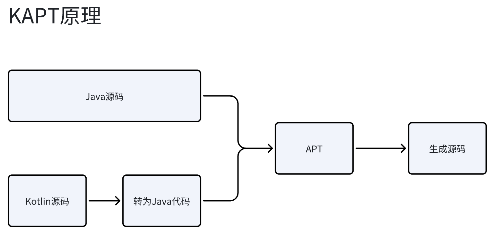
kapt会把Kotlin源码转为Java代码，从而复用Java的APT机制。

kapt会把kotlin源码对应生成的Java源码放到每个模块的 build/tmp/kapt3/stubs 目录中，因为APT并不会解析表达式语句级别的代码，所以只需要生成空方法、空属性即可。

## KSP
由于kapt只是Java apt的兼容过渡做法，所以会存在以下主要问题：
- 执行效率低：先把Kotlin转为Java代码，导致执行速度慢
- 对Kotlin语法特性的支持不友好：Java APT作为Java语言自己的工具，对Kotlin语言特性并没有专门的支持，所以例如Kotlin的data class、扩展函数、var、val这些语法特性都不便解析。（Kotlin使用@MetaData注解结合kapt_metadata文件的方式实现了在Java代码中保留Kotlin语法信息，可以使用Kotlin的metadata库来解析）

Google开发了KSP（Kotlin Symbol Processing）用于替代kapt。KSP作为Kotlin自己的编译时元编程工具，可以更好地支持Kotlin语法特性，执行效率更高。

KSP可以用于在编译时解析现有的Kotlin/Java源码信息并生成新的代码，例如Moshi就用它来生成JsonAdapter模版代码，从而减少反射，提升执行效率。

KSP的设计原则：
- 支持Kotlin语法特性
- 支持JVM/Android、JS、Native多平台
- 支持增量编译
- 支持Java

KSP不支持的方面：
- 不能修改原有的代码
- 没有语句级别内省，不能解析语句、表达式信息。简单地说，就是我们只能通过KSP知道某个类有一个方法，但不能知道该方法内的代码块信息。
APT/KAPT也不支持这些

KSP官方文档：https://kotlinlang.org/docs/ksp-overview.html
Kotlin官方介绍：https://www.youtube.com/watch?v=Si0r2_N0J88，https://www.youtube.com/watch?v=bv-VyGM3HCY&pp=ygUKa290bGluIGtzcA%3D%3D

# KSP开发流程Demo
前面简单介绍了KSP，我们现在来开发一个自己的KSP处理器Demo，理解KSP的开发方式。

以一个简单的Domo为例，我们想给类加上特定的注解，就可以生成对应的工厂类代码。这个Demo没什么实际意义，只是用一个非常简单的例子来展示如何上手。达到的效果如下：
```
// 原本的代码
@TestFactory
class Foo {}


// 生成的代码
class FooFactory {
    fun createFoo(): Foo {
        return Foo()
    }
}
```

## 1. 创建Gradle模块
// Gradle项目文件目录结构
```
|-- ......  // 其他模块和文件
|-- lib-compiler  // ksp模块，用于生成代码
|         |-- ......
|         |-- build.gradle  // ksp模块的build.gradle文件
|-- lib-annotations // 注解模块，提供@TestFactory注解
|-- build.gradle  // root project的build.gradle文件
```
因为注解要在KSP模块中使用，也要在依赖KSP模块的上层模块中使用，所以把注解模块设置为单独的模块。


在Gradle root project 的 build.gradle 配置：
```
plugins {
    // 实际就是 org.jetbrains.kotlin.jvm 插件
    kotlin("jvm") version "1.9.0" apply false
}

buildscript {
    dependencies {
        // 即 org.jetbrains.kotlin:kotlin-gradle-plugin，
        // 如果我们在安卓项目中，实际可以不用加上这个依赖，因为安卓
        // 使用的org.jetbrains.kotlin.android插件已经包含了此插件。
        // 如果是独立项目，则必须使用此插件
        classpath(kotlin("gradle-plugin", version = "1.9.0"))
    }
}
```
lib-annotations模块中提供注解：
```
@Target(AnnotationTarget.CLASS)
@Retention(AnnotationRetention.SOURCE)
annotation class TestFactory
```

然后在编写ksp的lib-compiler模块中使用插件和相关依赖
```
plugins {
    kotlin("jvm")
}

// 现在一般在settings.gradle就会配置，这样的话就可以不用在模块的build.gradle中配置repositories
repositories {
    mavenCentral()
}

dependencies {
    // 依赖ksp库，才可以编写ksp代码，版本根据实际情况选择
    implementation("com.google.devtools.ksp:symbol-processing-api:1.9.21-1.0.15")
}
```

> 注意：ksp模块 不能是android模块，build会报错，只能是一个Jvm模块（如果支持多平台可能需要另外配置）

## 2. 编写KSP处理器代码
依赖了`com.google.devtools.ksp:symbol-processing-api`库后，就可以使用KSP提供的api来编写KSP处理器代码。

### KSP处理器入口
SymbolProcessorProvider是KSP提供的接口，每个使用KSP的模块都会在执行KSP任务时，先到配置文件中找到我们编写的SymbolProcessorProvider实现类，然后构造实例并调用它的create函数，得到我们编写的SymbolProcessor实现类对象，然后调用SymbolProcessor执行核心逻辑。

KSP会作为Gradle的一个任务来执行，执行大致流程如图：
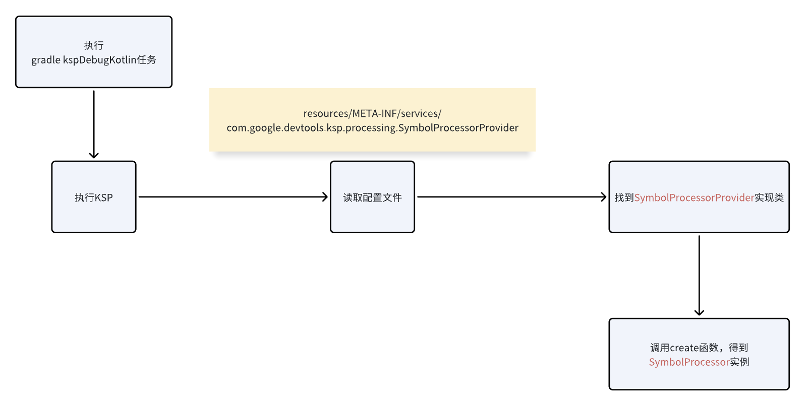

#### 实现 SymbolProcessorProvider 和 SymbolProcessor
那么首先编写SymbolProcessorProvider和SymbolProcessor的实现类：
```
// demo代码

class MySymbolProcessorProvider : SymbolProcessorProvider {
    override fun create(environment: SymbolProcessorEnvironment): SymbolProcessor {
        // 返回 SymbolProcessor 实现类实例
        return MySymbolProcessor(
            environment.codeGenerator,
            environment.logger
        )
    }
}

// SymbolProcessor 实现类
class MySymbolProcessor(
    private val codeGenerator: CodeGenerator,
    private val kspLogger: KSPLogger,
) : SymbolProcessor {
    override fun process(resolver: Resolver): List<KSAnnotated> {
        // 这里是KSP处理器的核心逻辑编写位置
        TODO("Not yet implemented")
    }

    override fun finish() {
        // 执行结束时回调，不需要则可以不重写
    }

    override fun onError() {
        // 在ksp process流程异常时回调，比如抛出了异常
        // 或者使用了kspLogger.error和exception，不需要则可以不重写
    }
}
```
在create函数中可以通过SymbolProcessorEnvironment参数得到环境相关信息，比如kotlin版本、目标平台（KSP支持jvm、js、native多平台）等信息，根据实际情况选择其中需要的来使用，并返回我们编写的SymbolProcessor实现类实例。

我们的Demo中只需要使用CodeGenerator和KSPLogger，所以这里只把SymbolProcessorEnvironment的这两个对象传给了MySymbolProcessor构造函数，我们的实际开发中则根据具体需求选择。


---

CodeGenerator可以用于生成代码，将在SymbolProcessor的process方法中使用。
KSPLogger可以用于在KSP执行期间打印日志（ksp中android.util.Log无法使用，也不能使用断点）
```
interface KSPLogger {

    fun logging(message: String, symbol: KSNode? = null)
    fun info(message: String, symbol: KSNode? = null)
    fun warn(message: String, symbol: KSNode? = null)
    fun error(message: String, symbol: KSNode? = null)
    fun exception(e: Throwable)
}
```
注意：实际验证logging和info都没有效果，只能使用warn、error和exception，从KSPLogger实现类源码中可见，设置了日志等级为Warn，所以只能使用warn及以上级别的日志


---
#### 配置 resources/META-INF/services
KSP会使用ServiceLoader来查找SymbolProcessorProvider，所以我们需要在resources/META-INF/services/目录中配置com.google.devtools.ksp.processing.SymbolProcessorProvider文件，在该文件中写上MySymbolProcessorProvider的全限定名称：
```
// Demo 中的全限定名称如下：
com.example.lib.ksp.MySymbolProcessorProvider
```

### 执行KSP处理器
#### 通过Resolver获取源码结构信息
KSP获取到我们的SymbolProcessor后，将会调用它的process方法。
```
class MySymbolProcessor(
    private val codeGenerator: CodeGenerator,
    private val kspLogger: KSPLogger,
) : SymbolProcessor {
    override fun process(resolver: Resolver): List<KSAnnotated> {
        // TODO
    }
}
```
KSP对Kotlin/Java源码生成了对应的模型，我们可以通过process方法的Resolver参数获取到源码文件对应的结构信息，比如KSFile表示一个Kotlin/Java文件，KSClassDeclaration表示一个Kotlin/Java类，Resolver可以给我们提供这些信息：
```
KSFile
  packageName: KSName
  fileName: String
  annotations: List<KSAnnotation>  (File annotations)
  declarations: List<KSDeclaration>
    KSClassDeclaration // class, interface, object
      simpleName: KSName
      qualifiedName: KSName
      containingFile: String
      typeParameters: KSTypeParameter
      parentDeclaration: KSDeclaration
      classKind: ClassKind
      primaryConstructor: KSFunctionDeclaration
      superTypes: List<KSTypeReference>
      // contains inner classes, member functions, properties, etc.
      declarations: List<KSDeclaration>
    KSFunctionDeclaration // top level function
      simpleName: KSName
      qualifiedName: KSName
      containingFile: String
      typeParameters: KSTypeParameter
      parentDeclaration: KSDeclaration
      functionKind: FunctionKind
      extensionReceiver: KSTypeReference?
      returnType: KSTypeReference
      parameters: List<KSValueParameter>
      // contains local classes, local functions, local variables, etc.
      declarations: List<KSDeclaration>
    KSPropertyDeclaration // global variable
      simpleName: KSName
      qualifiedName: KSName
      containingFile: String
      typeParameters: KSTypeParameter
      parentDeclaration: KSDeclaration
      extensionReceiver: KSTypeReference?
      type: KSTypeReference
      getter: KSPropertyGetter
        returnType: KSTypeReference
      setter: KSPropertySetter
        parameter: KSValueParameter
```
这个结构描述可以在[KSP角度的源码结构官方文档](https://kotlinlang.org/docs/ksp-overview.html#how-ksp-looks-at-source-files)中查看，并不需要记住，使用的时候查看API即可。

#### 使用CodeGenerator生成代码
我们在process方法中通过Resolver找到所有使用了 @TestFactory 注解的类，为它们生成工厂类文件：
```
class MySymbolProcessor(
    private val codeGenerator: CodeGenerator,
    private val kspLogger: KSPLogger,
) : SymbolProcessor {
    override fun process(resolver: Resolver): List<KSAnnotated> {
        // getSymbolsWithAnnotation方法可以获取标注了某个注解的Symbol
        val symbols = resolver.getSymbolsWithAnnotation(TestFactory::class.qualifiedName!!)
        symbols
            // 过滤其中的 KSClassDeclaration。定义TestFactory注解时，就设置了只能用于类，
            // 所以这里过滤只是更保险一点。
            .filter { it is KSClassDeclaration && it.validate() }
            // 转为 KSClassDeclaration 类型
            .map { it as KSClassDeclaration }
            .forEach {
                // 获取包名
                val packageName = it.packageName.asString()
                // 使用了 @TestFactory 注解的类名
                val originClassName = it.simpleName.asString()
                // 设置生成的文件名，比如Foo就会生成FooFactory
                val fileName = "${originClassName}Factory"
                
                // 创建该文件
                val file = codeGenerator.createNewFile(
                    Dependencies(false, it.containingFile!!), // 这个后面会具体介绍，这里先随便写
                    packageName,
                    fileName
                )
                
                // 文件的内容，也就是Kotlin代码
                val code = """
                    package $packageName
                    class ${originClassName}Factory {
                        fun create${originClassName}(): ${originClassName} {
                            return ${originClassName}()
                        }
                    }
                """.trimIndent()
                // 写入生成的文件
                file.write(code.toByteArray())
                file.close()
            }
        return emptyList()
    }
}
```
> Demo中省略了错误检测，比如使用@TestFactory注解的类没有公开的无参构造函数，就会发生错误，在实际开发中需要考虑完善。

## 3. 使用编写的KSP
比如我们要在 app 模块中使用前面编写的KSP：
```
plugins {
    // ...... 其他插件
    
    // 需要KSP插件，才能在当前模块依赖和执行KSP
    id("com.google.devtools.ksp") version "1.9.21-1.0.15"
}

dependencies {
    // 依赖KSP模块
    ksp(project(":lib-compiler"))
    // 依赖注解
    implementation(project(":lib-annotations"))
    // ......
}
```
生成代码会放在 build/generated/ksp/ 目录中

**自 KSP 1.8.0-1.0.9 起，生成的源文件会自动注册，如果版本偏低，则还需要手动配置感知KSP生成的文件**


---
到这里已经开发了一个简单的KSP，总结一下开发流程：
1. 配置插件和依赖
2. 编写SymbolProcessorProvider，并配置到resrouces/META-INF/services
3. 编写SymbolProcessor，在process使用Resovler获取源码信息，使用CodeGenerator生成代码
## 4. 结合常用工具
前面用非常简单的例子，展示了开发一个KSP的流程，在实际的开发中，还有一些常用的工具用来更方便地编写KSP。
4.1 使用 AutoService
前面说到KSP使用ServiceProvider的方式，需要在 resources/META-INF/serivces 目录中写上对应的文件和类信息。对于这种场景，Google开发的AutoService库可以自动生成对应的配置文件，编写Java APT的项目很多都使用了它。
https://github.com/google/auto/tree/main/service

但AutoService本身也是使用了Java APT来实现的，并不支持Kotlin，所以我们可以使用另一个KSP版本，https://github.com/ZacSweers/auto-service-ksp，我们使用的Json序列化库Moshi也使用了它。
```
plugins {
    // .......
    
    // 因为要用到的 auto-service-ksp 本身也是使用KSP实现，所以我们开发的KSP模块也要使用KSP插件
    id("com.google.devtools.ksp") version "1.9.21-1.0.15"
}

dependencies {
    // ......
    
    implementation("com.google.auto.service:auto-service-annotations")
    ksp("dev.zacsweers.autoservice:auto-service-ksp")
}
```
```
package com.example

import com.google.auto.service.AutoService
import com.google.devtools.ksp.processing.SymbolProcessorProvider

@AutoService(SymbolProcessorProvider::class)
class TestSymbolProcessorProvider : SymbolProcessorProvider {
    override fun create(environment: SymbolProcessorEnvironment): SymbolProcessor {
        // ......
    }
}
```
resources/META-INF/services/com.google.devtools.ksp.processing.SymbolProcessorProvider文件将自动生成，内容如下：
```
// 根据实际类的全限定名称而定
com.example.MySymbolProcessorProvider
```

### 4.2 使用 KotlinPoet
Demo中生成代码使用的是手写拼接的方式，如果生成代码的场景较复杂，可以考虑使用KotlinPoet来生成Kotlin代码。（使用Java APT的时候有对应的JavaPoet）
https://square.github.io/kotlinpoet/
https://square.github.io/kotlinpoet/interop-ksp/
kotlinpoet-ksp 库可以为KotlinPoet在KSP场景提供更多方便的API，可以一起使用。

这里我们用KotlinPoet来重写生成代码的流程：
```
class MySymbolProcessor(
    private val codeGenerator: CodeGenerator,
    private val kspLogger: KSPLogger,
) : SymbolProcessor {
    override fun process(resolver: Resolver): List<KSAnnotated> {
        // getSymbolsWithAnnotation方法可以获取标注了某个注解的Symbol
        val symbols = resolver.getSymbolsWithAnnotation(TestFactory::class.qualifiedName!!)
        symbols
            .filter { it is KSClassDeclaration }
            .map { it as KSClassDeclaration }
            .forEach {
            
                // 获取包名
                val packageName = it.packageName.asString()
                // 设置生成的文件名，比如Foo就会生成FooFactory
                val fileName = "${it.simpleName.asString()}Factory"
                
                val funSpec = FunSpec.builder("create${it.simpleName.asString()}")
                    .returns(it.asType(emptyList()).toClassName())
                    .addStatement("return %T()", it.toClassName())
                    .build()

                val typeSpec = TypeSpec.classBuilder(fileName)
                    .addFunction(funSpec)
                    .build()

                val fileSpec = FileSpec.builder(packageName, fileName)
                    .addType(typeSpec)
                    .build()
                fileSpec.writeTo(codeGenerator, Dependencies.ALL_FILES)
            }
        return emptyList()
    }
}
```
使用KotlinPoet相比硬编码拼接的方式，可读性、可维护性更高，在复杂场景更加明显，并且还有自动import等优点。
这里只是介绍了部分用法，KotlinPoet更详细的功能可以阅读官方文档，比较简单易懂。

# KSP开发深入
前文介绍了基本的KSP处理器开发过程，但忽略了一些使用上的细节问题，在这里将介绍它们，利于我们写出更好的KSP工具。
## 1. process多轮执行和返回值
### 多轮执行
一个模块执行 KSP 任务，SymbolProcessor的process方法可能会多次执行，被执行几次，取决于我们是否生成了新的文件。因为新生成的文件可能也是需要处理的，所以KSP的设计是多轮执行（Java APT也是这样）。
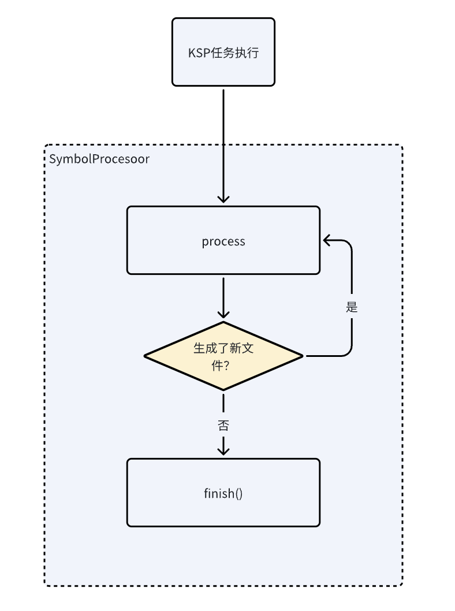
- 首次执行process，没有使用CodeGenerator生成新的文件（生成代码文件或者resources/META-INF/services这种配置文件都可以），那么本模块的KSP任务将执行结束，process方法不再被调用。
- 首次执行process，使用CodeGenerator生成了新的文件，process方法将会再被次执行，因为产生的新文件可能也需要用于解析处理，再次执行的process如果也生成了新文件，那么又会再次调用process，直到没有新的文件生成，才会不再调用process。

### process方法返回值
process方法的返回值为List<KSAnnotated>类型，表示本轮无法处理的Symbol，在下一轮process执行时通过getSymbolsWithAnnotation可以获取到它们。但是要注意的是，如果本轮process没有生成新的代码，就不会执行下一轮，那么返回的list即使不是空列表也没有作用了。

一般情况下都是会在本轮process处理完，所以返回emptyList就行，除非在某些情况，本轮process不便处理，需要在下一轮process再处理，那就可以把该Symbol放到返回的List中。
例如：生成某个代码时，需要依赖其他生成的代码，就可以在本轮process时先生成其他代码，把暂不处理的Symbol放到List中返回，在下一轮process时已经有了之前生成的其他代码，此时就可以处理这个Symbol。

> 可以在介绍Resolver的getSymbolsWithAnnotation方法时，一起在demo代码中验证

## 2. Resolver
了解了process方法的执行流程后，继续了解process方法提供的Resolver的用法。

Resolver可以提供Kotlin/Java源码和它们解析后的模型信息，用途就是让我们可以通过分析源码信息，生成我们自己需要的文件。我们来看一下Resovler的各个方法的用途。
### 核心方法
Resovler有3个最常使用的方法，可以获取
#### 2.1.1 getNewFiles(): Sequence<KSFile>
getNewFiles()方法可以获取当前编译模块中本轮process的新源码文件。如果是第一轮process执行，则实际和getAllFiles()一样返回当前模块的全部源码文件，因为第一轮执行时全部代码文件都相当于是新的；如果生成了新的源码文件，将第二次执行process，第二次执行process时getNewFiles()返回的就是上一次生成的新源码文件。
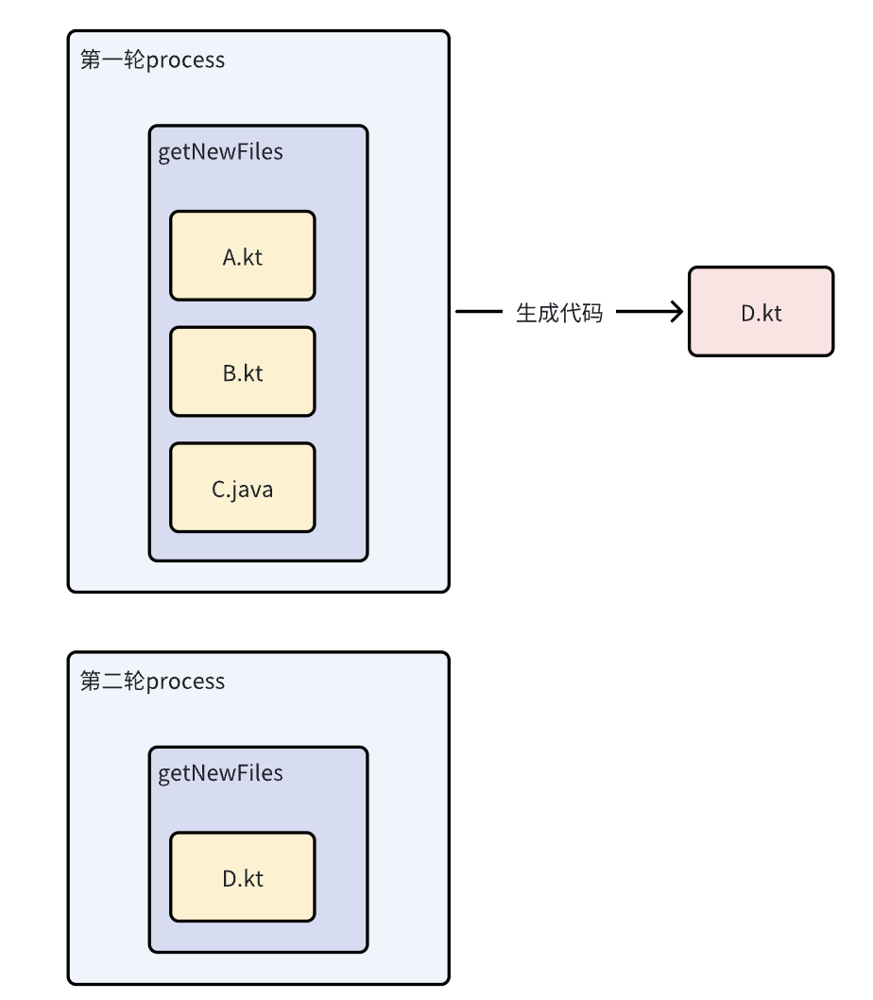
如果只关心每一轮process新产生的文件，就可以使用getNewFiles()。

#### 2.1.2 getSymbolsWithAnnotation
在前面的Demo中，我们已经用过了这个方法，通过它可以得到使用了指定注解的全部Symbols（比如类、方法、属性等）。
```
fun getSymbolsWithAnnotation(
    annotationName: String,
    inDepth: Boolean = false
): Sequence<KSAnnotated>
```
getSymbolsWithAnnotation的使用比较简单，但有两个方面需要了解一下，注解的搜索范围和inDepth参数的作用。
- 搜索范围
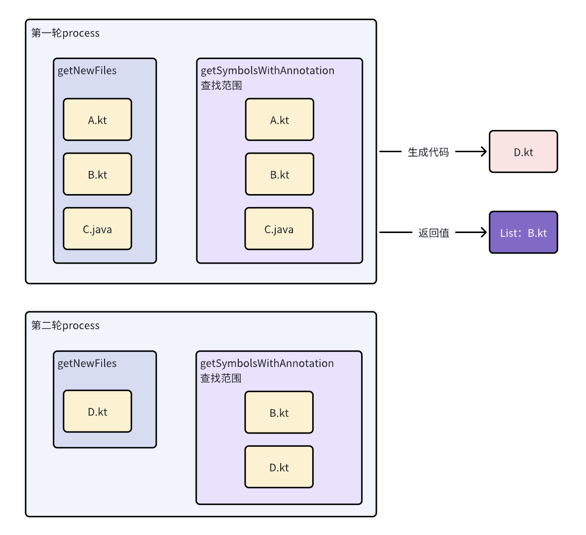
每一轮process执行时，getSymbolsWithAnnotation会从getNewFiles()的全部源码文件和上一轮process返回的List<KSAnnotated>中查找使用了指定注解的Symbols。

也就是说，如果是第一轮process，会从getNewFiles()中查找使用了指定注解的Symbols。如果生成了新文件，并且process返回值的List中包含了一些Symbols，那么第二次执行process时，getSymbolsWithAnnotation的注解搜索范围就是第二次process的getNewFiles()+第一次process的返回List。如果还有下一次process，以此类推。

总结就是：**搜索范围为本次process的getNewFiles() + 前一次process的返回List<KSAnnotated>，大多数情况下process返回为空，那么搜索范围就是 getNewFiles()。**

还有一个搜索方式的问题需要注意，例如有以下文件A.kt：
```
class A {
    @TestFun
    fun test() {}
}
```
在第一次process时，A.kt作为新文件，getSymbolsWithAnnotation(TestFun::class.qualifiedName)可以获取到 test 方法对应的 KSFunctionDeclaration。
如果本次process不想处理这个 KSFunctionDeclaration，可以把它放到process返回值的List中。下一次process再次使用getSymbolsWithAnnotation可以获取到这个 KSFunctionDeclaration。
但如果放到process返回值的List中的是A.kt对应的KSFile或者A类对应的KSClassDeclaration，在下一次process时调用getSymbolsWithAnnotation将无法获取到使用@TestFun注解的test方法对应的 KSFunctionDeclaration。

因为搜索注解时，如果来源是 getNewFiles()，会遍历它的内部结构，包含类、方法、属性等；但如果来源是上一轮的返回值List<KSAnnotated>时，只会直接搜索它本身，不会搜素它的包含的内部结构。所以如果返回值List包含的是KSClassDeclaration，它内部的KSFunctionDeclaration有指定的注解也会被忽略。
这个情况在API文档中没有说清楚，在源码中可以看出来。
https://github.com/google/ksp/blob/main/compiler-plugin/src/main/kotlin/com/google/devtools/ksp/processing/impl/ResolverImpl.kt#L321

- inDepth 参数
```
fun getSymbolsWithAnnotation(
    annotationName: String,
    inDepth: Boolean = false
): Sequence<KSAnnotated>
```
这个参数我们一般不怎么使用，它的作用是获取局部声明的Symbol，比如Function、getter、setter中的局部声明。
例如以下情况，如果inDepth为false，则 getSymbolsWithAnnotation(TestFun::class.qualifiedName!!) 返回的全部Symbol中不会包含这个局部函数。设置为true则可以获取到。
```
fun test() {
    @TestFun
    val a = fun() {}
}
```
源码可见此处：https://github.com/google/ksp/blob/main/common-util/src/main/kotlin/com/google/devtools/ksp/common/visitor/CollectAnnotatedSymbolsVisitor.kt#L33

#### 2.1.3 getAllFiles(): Sequence<KSFile>
getAllFiles()会返回当前编译模块的全部源码文件，如果新生成了源码文件，则在下一轮process时，会获取到原本的源码文件和新增的源码文件。
.png)

### 其他方法
前面介绍了3个最常使用的方法，而Resovler还有一些方法使用场景偏少一点，可以作为了解。

- getClassDeclarationByName(name: KSName): KSClassDeclaration?
查找编译classpath中，指定全限定名称对应的类的KSClassDeclaration。重要的是，它查找的范围不限于当前模块，也不限于源码，比如app模块依赖lib模块，在app模块执行ksp任务时，通过getClassDeclarationByName可以查找到lib模块内的代码（但lib模块不能查找到app模块的类，由依赖关系决定），并且可以查找到class文件，比如可以找到class文件android.app.Activity。

在需要支持跨模块或者支持查找Jar、aar中的二进制代码时，可以考虑使用此方法。而getNewFiles()、getAllFiles()和getSymbolsWithAnnotation只能获取当前编译模块的源码文件。

- getFunctionDeclarationsByName、getPropertyDeclarationByName 
和getClassDeclarationByName类似，只是获取的是方法和属性。

- 剩余的方法都是一些特定场景的工具方法，在使用时查看Resolver API即可。

## 3. 增量处理
官方文档：https://kotlinlang.org/docs/ksp-incremental.html
KSP默认支持增量处理，可以减少对代码文件的重复处理，提升执行效率，这对写一个好的KSP工具很重要。官方文档介绍了增量处理的使用方式，但是不够易懂和详细，所以在这里我们更详细地介绍增量处理的规则和使用方式。

增量处理的目的就是如果一个文件不需要再次处理就不再处理，所以需要判断哪些文件需要处理，哪些文件不需要处理。比如编译代码时，如果一个代码文件没有发生变化，那么就不用再次编译。

在KSP的情况中，会使用CodeGenerator生成代码或其他文件，在前面demo代码中，我们忽略了Dependencies参数的具体作用，这个Dependencies会被用于增量处理的判断，影响生成的代码是否需要重新生成。
```
fun createNewFile(
    dependencies: Dependencies,
    packageName: String,
    fileName: String,
    extensionName: String = "kt"
): OutputStream


class Dependencies private constructor(
    val isAllSources: Boolean, // 是否依赖全部源码，只要任何源码发生变化，都会完全重新执行KSP
    val aggregating: Boolean, // 
    val originatingFiles: List<KSFile>
) {

    constructor(aggregating: Boolean, vararg sources: KSFile) : this(false, aggregating, sources.toList())

    companion object {
        val ALL_FILES = Dependencies(true, true, emptyList())
    }
}
```
根据Dependencies的构造函数设计，有三种构造类型：
1. ALL_FILES：也就是 Dependencies(true, true, emptyList())
2. aggregating模式：Dependencies(false, true, ...) ，aggregating参数为true
3. isolating模式：Dependencies(false, false, ...)，aggregating参数为false

下面将介绍这三种模式对增量处理的影响。
> 通过在gradle.properties文件中配置 ksp.incremental.log=true ，可以打开KSP增量处理的日志，放在目录build/kspCaches/<source set>/logs/ 中，我们可以通过日志更方便地了解KSP重新处理了哪些文件。

### 3.1 ALL_FILES
表示生成的文件依赖全部源码，所以任何源码发生变化，都需要重新生成文件，每次执行的输入都是当前模块所有源码。实际也就是关闭了增量处理，如果没有特殊需求，不建议使用。
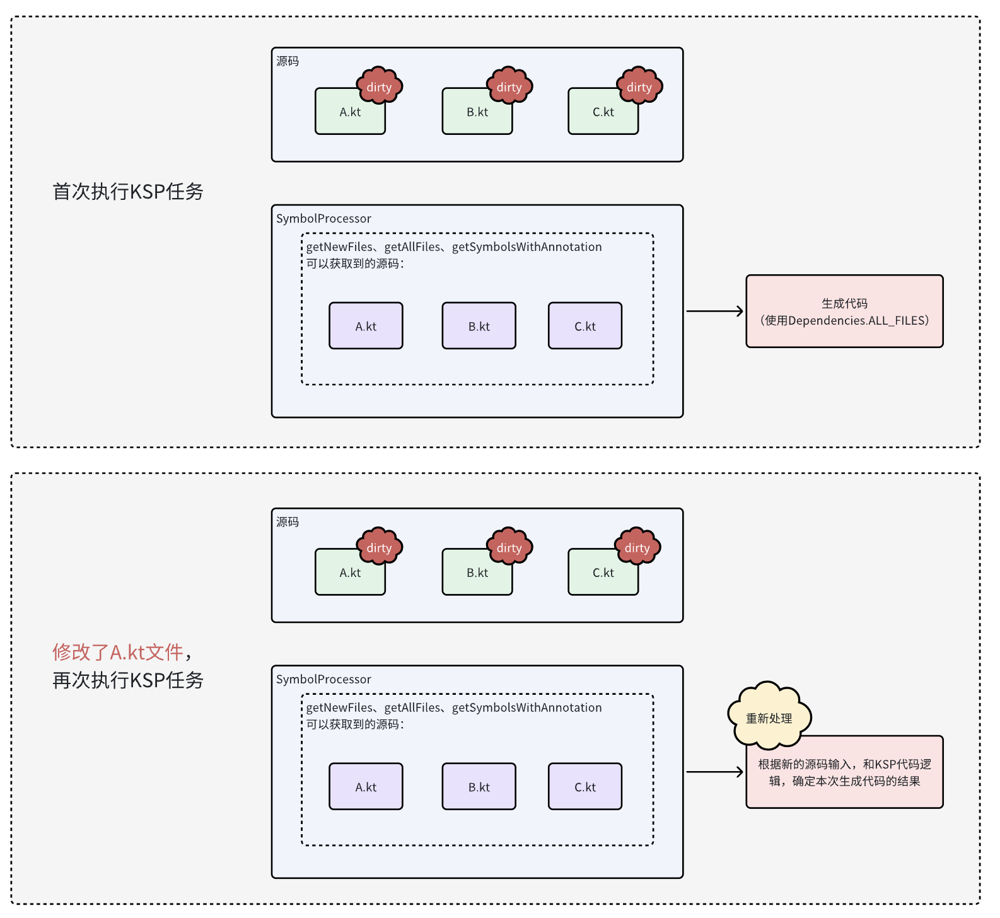
如图，首次执行KSP任务，源码A、B、C都会作为SymbolProcessor的输入，所以都会标记dirty，dirty的文件都会作为SymbolProcessor的输入，生成文件时使用了Dependencies.ALL_FILES。

修改A文件，再次执行KSP任务，A文件标记为dirty，并且因为生成的文件依赖了全部文件，所以B和C也要标记为dirty，A、B、C文件就会再次作为执行KSP任务时SymbolProcessor的输入，因为生成的文件依赖的文件发生变化，所以之前生成的文件会被删除，然后根据本次的源码输入，再次执行生成代码的流程。

> 生成的文件依赖了A，A发生修改，所以生成的文件需要重新生成，而生成的文件又依赖了B和C，重新生成文件同时需要A、B、C，所以B和C必须也标记为dirty，一起作为再次执行KSP任务的输入文件。
### 3.2 aggregating
增量处理的聚合模式，表示生成的文件关心当前模块的任何文件修改和新增。如果某些文件发生修改或者新增了文件，只有修改/新增的文件以及originatingFiles会再次作为KSP的输入。

传给Dependencies的originatingFiles参数，表示生成的文件是基于这些originatingFiles生成的。下面来看使用aggregating的具体表现。
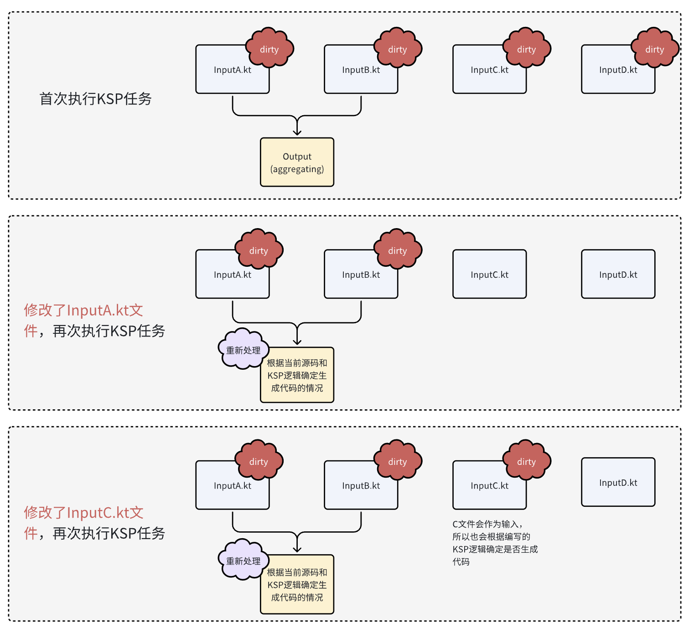

示意图说明：
- 箭头连线：表示生成Output文件时，originatingFiles为InputA.kt和InputB.kt。
- 相比ALL_FILES的示意图，省略了SymbolProcessor。只要是标记dirty的文件都是SymbolProcessor的输入。


首次执行KSP时，所有源码都标记dirty，生成代码使用 Dependencies(aggregating = true, InputA, InputB)

修改了A，再次执行KSP，A标记为dirty，因为Output文件依赖了A，所以需要重新生成Output，并且因为Output也依赖了B，所以B也需要标记为dirty。所以本次KSP任务的初始输入只有A和B，没有C、D。根据本次输入重新执行生成代码的流程。

修改了C，再次执行KSP，C标记为dirty，因为使用了aggregating模式，即使不是originatingFiles的修改，也需要重新生成Output，并且Output依赖了A和B，所以A和B也需要标记为dirty。那么本次KSP任务的初始输入为A、B、C。根据本次输入重新执行生成代码的流程。

> originatingFiles如果传空，再次执行KSP任务时，KSP会把之前生成的对应文件删掉，如果修改的文件不是实际依赖的文件，再次执行KSP的输入就只有修改的文件，而一般我们的代码逻辑都是要读取到某个文件才能生成对应的文件，这就会导致不会走生成代码的逻辑，导致错误。
originatingFiles如果乱设置实际没有依赖关系的文件，也会导致修改文件后再次执行KSP任务，依赖的文件没有作为输入，也就没有重新生成文件，导致错误。
所以务必合理设置originatingFiles。

**aggregating模式总结：修改或者新增文件，发生变化的这些文件和originatingFiles都会标记为dirty，让KSP处理。其他无关源码则不会再处理。**

### 3.3 isolating
增量模式的隔离模式，表示生成的文件只关心依赖的文件的修改。只有originatingFiles文件标记为dirty，才会重新生成文件。
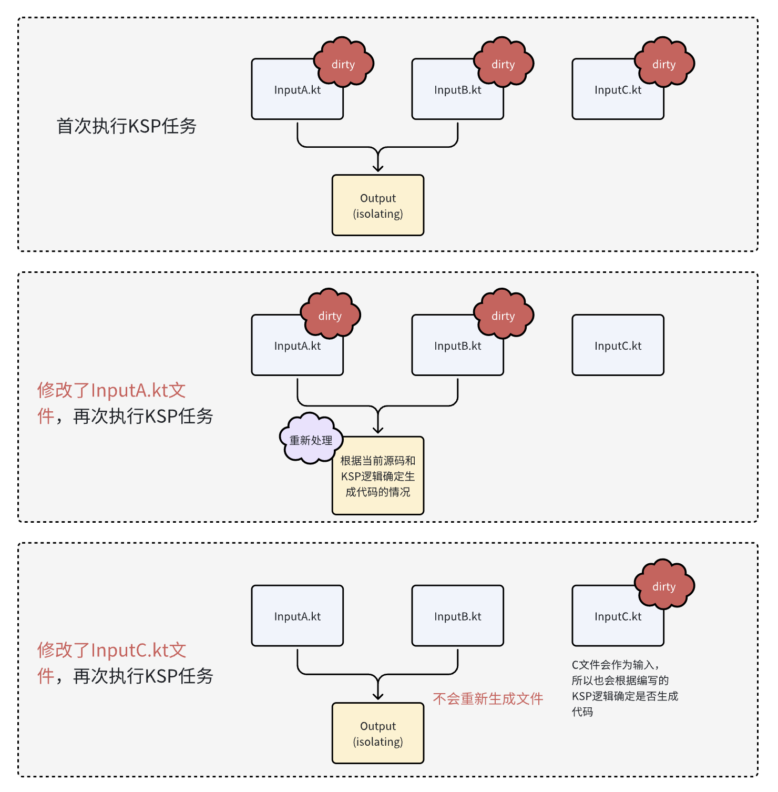
首次执行KSP时，所有源码都标记dirty，生成代码使用 Dependencies(aggregating = false, InputA, InputB)

修改了A，再次执行KSP，A标记为dirty，因为Output文件依赖了A，所以需要重新生成Output，并且因为Output也依赖了B，所以B也需要标记为dirty。所以本次KSP任务的初始输入只有A和B，没有C。

修改了C，再次执行KSP，C标记为dirty，因为使用了isolating模式，originatingFiles不包含C，所以只有C文件标记为dirty，那么本次KSP任务的初始输入就只有C文件。所以Output不会重新生成。

> 和aggregating模式一样，originatingFiles也要合理设置。

### 3.4 新增文件
新增文件必然需要处理，所以无论Dependecies怎么设置，新增的文件必然会作为KSP任务的初始输入。
换个角度来看，Dependecies是用来告诉KSP生成的文件的依赖情况，新增的文件和之前生成的文件完全没有关系，所以和Dependecies怎么设置没有关系。

### 综合场景
给生成的文件设置Dependencies，可以看出来KSP的增量处理是针对单个文件，每个生成的文件都可以设置自己的增量处理情况。它们会综合起来影响KSP任务的输入文件。

以下可以看到一些综合场景的例子：
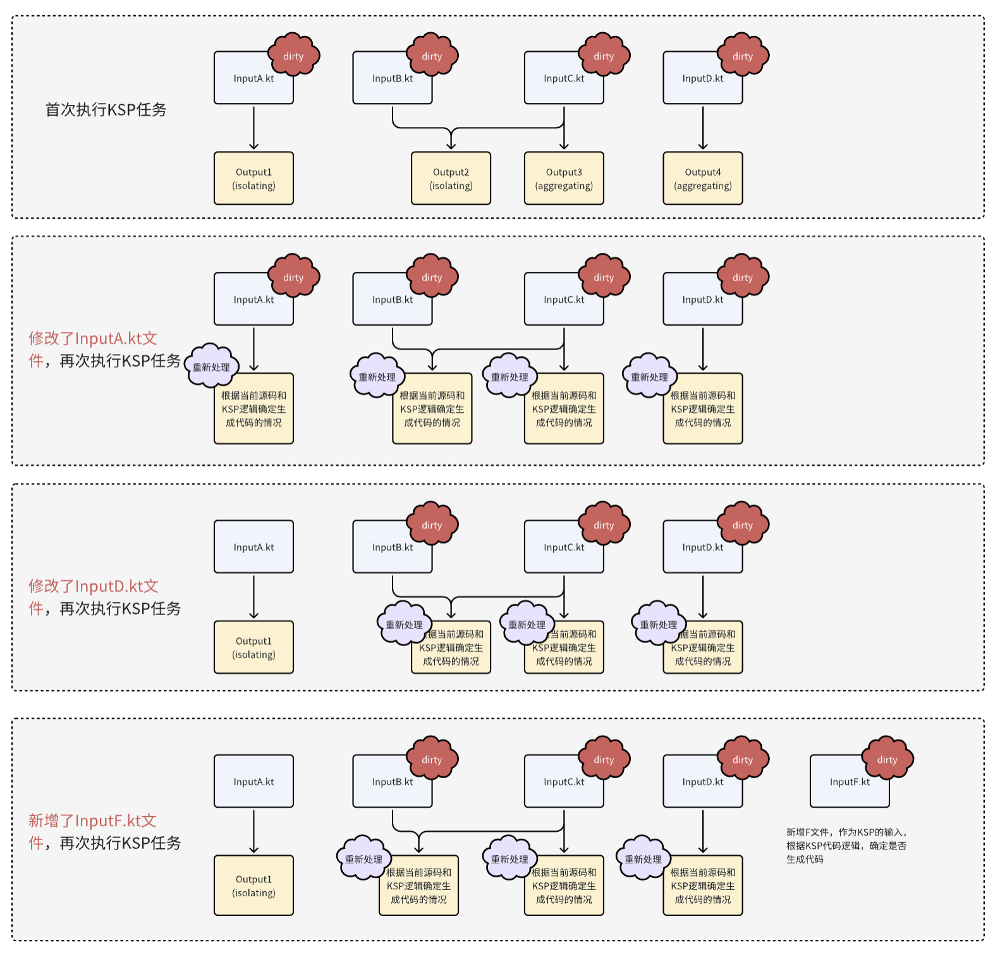

## 4. 多个Processor
每个模块都可以使用多个KSP，每次就会执行多个
```
dependencies {
    ksp("a")
    ksp("b")
    // ......
}
```
或者一个KSP模块里面配置多个SymbolProcessorProvider
```
// 文件：/resources/META-INF/services/com.google.devtools.ksp.processing.SymbolProcessorProvider

com.xxx.A
com.xxx.B
```
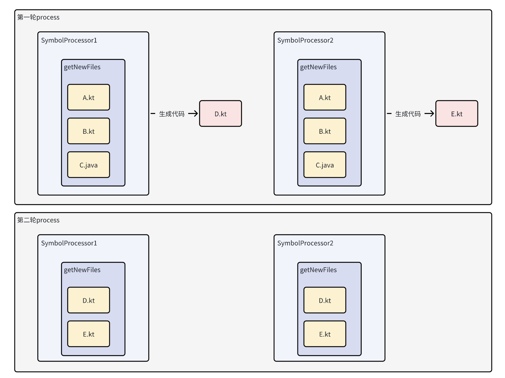
每一轮都会调用依赖的所有KSP处理器，所有处理器生成的代码，都会作为下一轮process的newFiles。

# 其他
## 1. 跨模块的限制
假如我们要开发一个启动任务调度库，在 lib1、lib2 和app模块都使用注解声明启动任务，在app模块使用KSP生成代码时，需要收集到自身和全部子模块中注解声明的启动任务，才能执行全部启动任务。
```
// InitTask库：需要声明注解 @InitTask 、提供可能需要的基础代码、提供KSP。

// lib1 模块
@InitTask
class Task1: Runnable {}

// lib2 模块
@InitTask
class Task2: Runnable  {}

// app 模块
@InitTask
class Task3: Runnable  {}

// 生成代码，在Application中调用 TaskContainer.init() 执行
objec TaskContainer {
    fun init() {
        Task1().run()
        Task2().run()
        Task3().run()
    }
}
```
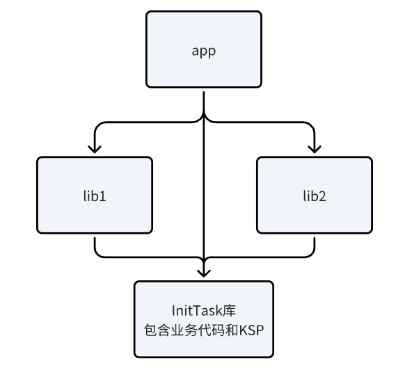
每个模块执行KSP任务时，getNewFiles 、getSymbolsWithAnnotation和getAllFiles这三个方法读取的代码都是仅获取当前模块内的源码。那么在app模块执行KSP任务时，如何收集到子模块声明的启动任务呢？

Resolver提供的getClassDeclarationByName、getDeclarationsFromPackage这类方法虽然可以获取到子模块中的代码信息，但都必须指定包名或类名，而不能像getNewFiles和getSymbolsWithAnnotation一样可以遍历搜索。

所以仅使用KSP想要做到搜索其他模块的代码文件，只能做一些额外的约束，比如约定代码都放到某个特定包名内。

### 一些跨模块案例
1. ARouter：ARouter作为一个用于组件化场景的路由库，也是需要收集各个模块的配置信息，虽然ARouter使用的APT，并不是KSP，但是做法是可以借鉴的。它的老版本做法是在App启动时使用解析Dex的方式去获取全部模块的生成类，后来的版本做了gradle插件，利用Android Gradle Plugin Transform来遍历全部class文件操作字节码。
2. EventBus：EventBus也需要收集多个模块的配置，它的做法是要求用户在每个模块手动把生成的代码注入到一个全局公共类中，也就是手动完成这个操作。

总的来说，APT、KAPT、KSP这类工具在跨模块时，都会有不便遍历其他模块的相关信息的问题，所以需要考虑通过特定的约束、手动注册、AGP Transform插件修改字节码、反射等方式来配合完成。
> Java APT只能获取当前模块的代码信息，比KSP的限制更大，所以很多同时支持APT/KAPT和KSP的库，在需要跨模块访问代码的情况都只能依靠手动注册或者AGP插件操作字节码这些方式。

## 2. 不一定要用注解
Java APT的设计是以注解为核心，它的API都是围绕注解设计的（但也可以不靠注解来生成代码）。而KSP的设计并没有太凸显注解的核心地位，只不过一般来说还是推荐使用注解。

如果不采用注解，实际可以通过比如定义一个接口，查找所有继承这个接口的子类，然后生成代码。但并没有注解方便，因为注解可以更好地脱离代码本身，独立性更强，而且注解可以配置各种参数，如果采用定义接口这类方式就不方便设置参数了。

## 3. KSP参数
使用KSP可以设置参数，通过 SymbolProcessorEnvironment.options 可以获取到它们
```
ksp {
    arg("option1", "value1")
    arg("option2", "value2")
    ...
}
```
```
class MySymbolProcessorProvider : SymbolProcessorProvider {
    override fun create(environment: SymbolProcessorEnvironment): SymbolProcessor {
        val option1 = environment.options["option1"]
        val option2 = environment.options["option2"]
        // ......
    }
}
```

## 4. 多平台
多平台暂未关注😅

## 5. API设计
开发一个KSP工具，用于生成代码，了解使用流程和相关的使用细节之后，其实是比较简单的。更重要的是如何设计API，提供一个简单优雅的使用方式，这需要更多的思考和实践验证。

## 6. 测试
可用于KSP的测试框架
https://github.com/tschuchortdev/kotlin-compile-testing

## 7. Room库开发的APT/KSP中间层
为了避免同时支持kapt、ksp要维护两套代码，room做了个中间层
androidx.room:room-compiler-processing