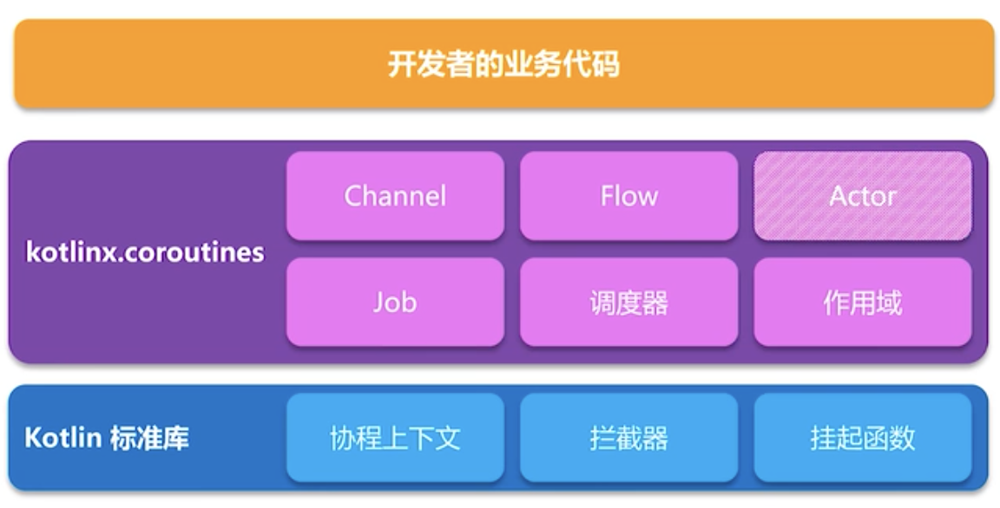

https://www.bennyhuo.com/2019/04/01/basic-coroutines/ 博客
https://github.com/enbandari/CoroutineLite 用于学习的简化版协程

https://github.com/Kotlin-zh/KEEP/blob/master/proposals/coroutines.md

谷歌开发者 微信公众号

https://proandroiddev.com/async-operations-with-kotlin-coroutines-part-1-c51cc581ad33

https://proandroiddev.com/part-2-coroutine-cancellation-and-structured-concurrency-2dbc6583c07d

https://www.youtube.com/watch?v=KWocgiYwwmM&list=PLgCYzUzKIBE_PFBRHFB_aL5stMQg3smhL&index=9

https://www.youtube.com/watch?v=Mj5P47F6nJg

https://www.youtube.com/watch?v=YrrUCSi72E8

https://www.youtube.com/watch?v=a3agLJQ6vt8&list=PLQ176FUIyIUbVvFMqDc2jhxS-t562uytr&index=41&t=0s

https://www.youtube.com/watch?v=yoLh4sd1CWI&list=PLQ176FUIyIUbVvFMqDc2jhxS-t562uytr&index=50&t=0s

https://www.youtube.com/watch?v=w0kfnydnFWI&list=PLQ176FUIyIUY6SKGl3Cj9yeYibBuRr3Hl&index=11&t=0s

https://www.youtube.com/watch?v=fZiKikaOCNU&list=PLQ176FUIyIUY6SKGl3Cj9yeYibBuRr3Hl&index=14&t=0s

https://www.youtube.com/watch?v=raWdIwsDe-g&list=PLQ176FUIyIUY6SKGl3Cj9yeYibBuRr3Hl&index=52&t=0s

https://www.youtube.com/watch?v=EMv_8dxSqdE

https://www.youtube.com/watch?v=4W3ruTWUhpw

https://www.youtube.com/watch?v=BOHK_w09pVA

https://www.youtube.com/watch?v=BXwuYykIxbk

https://www.youtube.com/watch?v=F63mhZk-1-Y&list=PLgCYzUzKIBE_PFBRHFB_aL5stMQg3smhL

https://www.youtube.com/watch?v=_hfBv0a09Jc&list=PLQ176FUIyIUY6UK1cgVsbdPYA3X5WLam5&index=4&t=0s

https://www.jianshu.com/p/2979732fb6fb

https://www.jianshu.com/p/06703abc56b1

https://www.jianshu.com/p/d23c688feae7

https://discuss.kotliner.cn/ kotlin 中文论坛

## 1. 概述
协程可以用来简化异步执行的代码，异步不一定是多线程，只要是切换了调用栈就会产生异步，比如dialog的确定和取消的点击事件回调就是切换了调用栈，但并没有多线程。

协作式多任务（对应协程）和抢占式多任务（对应多线程），都能完成异步、并发的需求，但是直接使用多线程来完成例如Android客户端的主线程和其他线程之间的通信会比较麻烦。例如启动一个线程发起网络请求获取数据后通过回调、线程同步等方式结合Handler将结果发到主线程，复杂的情况会出现多重回调缩进，或者代码分散各处，很容易使代码变得混乱。而协程可以把异步的代码写成同步的形式，从而使协作式任务的代码可以更加简洁。

协程主动让出执行权，线程基于cpu时间片抢占执行权

Kotlin协程的JVM实现从Android开发角度来看，可以认为是线程框架，但是实际还有更多的能力。在Android中使用kotlin的协程，先添加以下两个库：
```
implementation "org.jetbrains.kotlinx:kotlinx-coroutines-core:1.3.3"
implementation "org.jetbrains.kotlinx:kotlinx-coroutines-android:1.3.3"
```

默认情况，当一个父协程被取消的时候，所有它的子协程也会被递归的取消，子协程异常时，父协程将取消自己，当然，其他子协程也会被取消。如果使用SupervisorScope，则子协程异常时不会影响到父协程以及父协程中的其他子协程。

coroutineScope和supervisorScope既提供内部控制父子协程的异常传播方式，还可以用于在挂起函数中安全地创建协程（结构化并发）。它们都会继承自所在作用域创建新的子作用域，并使用自己的Job。

## 2. 启动协程
```
// 常用方式一，使用 runBlocking 顶层函数
runBlocking {
    doSomeThing()
}
​
// 常用方式二，使用 GlobalScope 单例的launch或async方法
GlobalScope.launch {
    doSomeThing()
}
​
// 常用方式三，使用 CoroutineScope 对象的launch或async方法，需传入 CoroutineContext（ GlobalScope 实际就是一个使用了 EmptyCoroutineContext 的 CoroutineScope ）
val coroutineScope = CoroutineScope(context)
coroutineScope.launch {
    doSomeThing()
}
```

协程可以看作就是这些启动方式的花括号中的代码。还有其他启动协程的不常用方式，应用中慢慢熟悉。
* runBlocking 会阻塞当前线程，协程默认在当前线程执行，但可以传参数指定调度器 Dispatchers.IO 等
* GlobalScope 的生命周期和应用程序一样，所以在Android开发中一般不使用。也可以传参指定协程执行调度器，默认调度器会在单独线程执行协程
* CoroutineScope 可以通过 context 参数来控制协程的声明周期、调度器等

官方例子：
```
GlobalScope.launch {  // 默认使用Dispatchers.DEFAULT调度器在后台启动一个新的协程并继续
    delay(1000L)      // 协程延迟1秒，也就是暂停当前协程1秒
    println("World!") // 一秒后执行
}
println("Hello,") //主线程立即执行
```

协程中的 coroutineScope 函数，待分析----------------------

suspend 挂起函数

## 3. 协程上下文和调度器
协程总是运行在一些以 CoroutineContext 类型为代表的上下文中，它们被定义在了 Kotlin 的标准库里。

协程上下文是各种不同元素的集合。其中主元素是协程中的 Job，还有调度器。协程调度器 CoroutineDispatcher 将协程限制在一个特定的线程执行，或将它分派到一个线程池，或是让它不受限地运行。

#### 调度器
所有的协程构建器诸如 launch 和 async 接收一个可选的 CoroutineContext 参数，它可以被用来显式的为一个新协程或其它上下文元素指定一个调度器。
```
GlobalScope.launch(Dispatchers.IO){...} //协程将在IO线程执行

Dispatchers.Default      //使用默认调度器，会在另外的线程执行
Dispatchers.Unconfined   //不限制，
Dispatchers.Main         //在主线程执行协程

launch(newSingleThreadContext("MyOwnThread")) { // 将使它获得一个新的线程，一般不使用
    println("newSingleThreadContext: I'm working in thread ${Thread.currentThread().name}")
}
```
当调用 launch { …… } 时不传参数，它从启动了它的 CoroutineScope 中承袭了上下文（以及调度器），而 GlobalScope.launch{...} 这个??????? Dispatchers.Default

withContext函数可以切换上下文，而调度器就属于上下文，所以可以用于切换线程：
```
GlobalScope.launch(Dispatchers.IO) {
    println(Thread.currentThread().name)     //工作线程
    withContext(Dispatchers.Main) {
        println(Thread.currentThread().name) //主线程
    }
    println(Thread.currentThread().name)     //工作线程
}
```

#### Job
协程的 Job 是上下文的一部分，并且可以使用 coroutineContext [Job] 表达式在上下文中检索它：
```
GlobalScope.launch(Dispatchers.IO) {
    println("My job is ${coroutineContext[Job]}")  //打印 My job is StandaloneCoroutine{Active}@f64e6a3 
}
```
launch函数就会返回一个Job对象，它提供了协程作业状态和cancel等函数

#### 子协程
当一个协程被其它协程在 CoroutineScope 中启动的时候， 它将通过 CoroutineScope.coroutineContext 来承袭上下文，并且这个新协程的 Job 将会成为父协程作业的 子 作业。当一个父协程被取消的时候，所有它的子协程也会被递归的取消。

然而，当使用 GlobalScope 来启动一个协程时，则新协程的作业没有父作业。因此它与外部启动的作用域无关，即调用外部的Job不会取消 GlobalScope.launch{} 启动的协程。

父协程的生命周期会包含子协程，也就是会等所有子协程执行完，父协程的状态才会为执行完成

#### 协程作用域
&emsp;&emsp;在像 Android 的 activity 这些有生命周期的对象中使用协程时，需要注意要在 activity 销毁时取消。要结合协程和 activity 的生命周期，则需要在 onDestroy 中调用 CoroutineScope 的 cancel 函数，这会调用到它对应的 Job 对象的 cancel 函数。

```
class Activity {
    private val mainScope = MainScope()  //MainScope是CoroutineScope的子类使用了 Dispatchers.Main

    fun doSomething(){
        mainScope.launch {  }
    }

    override fun onDestroy() {
        super.onDestroy()
        mainScope.cancel()
    }
```
或者
```
class Activity : CoroutineScope by CoroutineScope(Dispatchers.Default) {

    override fun onDestroy() {
        super.onDestroy()
        cancel()
    }
```

#### 线程局部数据
Kotlin协程库中扩展了ThreadLocal，添加了一个asContextElement()函数

## 4. 取消和超时
launch 函数会返回一个 Job 对象，可以调用它的 cancel 函数来取消协程，或者调用 join 函数来等待它执行完毕。

suspend挂起函数可以被取消，并在取消时抛出 CancellationException。但是普通的代码如果没有检查取消的话，是无法被取消的，比如一个循环。要使普通代码可以被取消，有两种方法：
1. 定期调用挂起函数来检查取消
2. 显式地检查取消状态

以第二种方式为例：
```
val startTime = System.currentTimeMillis()
val job = launch(Dispatchers.Default) {
    var nextPrintTime = startTime
    var i = 0
    while (isActive) { // 可以被取消的计算循环
        // 每秒打印消息两次
        if (System.currentTimeMillis() >= nextPrintTime) {
            println("job: I'm sleeping ${i++} ...")
            nextPrintTime += 500L
        }
    }
}
delay(1300L) // 等待一段时间
println("main: I'm tired of waiting!")
job.cancelAndJoin() // 取消该作业并等待它结束
println("main: Now I can quit.")
```
isActive 是CoroutineScope中的扩展属性，实际来自于 Job 对象中的 isActive

对于取消挂起函数，因为会抛出 CancellationException，所以可以在try-finally中释放资源

#### 不可取消的代码块
```
withContext(NonCancellable) {
    // this code will not be cancelled
}
```

#### 超时
可以对协程设置超时时间，执行超时将抛出 TimeoutCancellationException。
```
launch {
    try {
        withTimeout(1300) {
            repeat(1000) { i ->
                println("I'm sleeping $i ...")
                delay(500L)
            }
        }
    }catch (e: TimeoutCancellationException){
        Log.e("kotlin", "doSomething: ", e)
    }
}
```

而相应的 withTimeoutOrNull ，会在超时后返回null

## 5. 组合挂起函数
定义一个suspend挂起函数必须直接或间接地调用到Kotlin自带的挂起函数，才有真正的挂起-恢复逻辑，自带的挂起函数比如 withContext 和 delay 都是比较常用的。而一个挂起函数也必须在协程中被调用。

async 和 launch 函数都可以启动一个协程。不同之处在于 launch 返回一个 Job 并且不附带任何结果值，而 async 返回一个 Deferred —— 一个轻量级的非阻塞 future，你可以使用 .await() 在一个延期的值上得到它的最终结果，而 Deferred 实际是一个 Job 的子类，所以如果需要的话，你可以取消它。
```
val time = measureTimeMillis {
    val one = async { doSomethingUsefulOne() //挂起函数 }
    val two = async { doSomethingUsefulTwo() //挂起函数 }
    println("The answer is ${one.await() + two.await()}")
}
println("Completed in $time ms")
```
使用 async 启动两次协程，分别执行挂起函数，只要调度器为线程池，最终的执行时间大约是执行较长的那个挂起函数的耗时，也就是说达到了并发执行的目的，对于没有依赖关系的多个任务可以使用这样的方式。但是如果调度器为Main这种单个线程的，则无法同时执行，结果为两个函数耗时之和。

用 launch 启动多个协程，也可以达到并发执行的目的。

#### 结构化并发
结构化并发就是 parent 总会等待 children 完成。不会丢失正在工作的协程，不会丢失异常。

#### 惰性启动
async 和 launch 都可以设定 start=CoroutineStart.LAZY 而变为惰性的，也就是在调用 Job 的 start() 或者 join() 函数或者 Deferred 的await() 时才会执行。

## 6. 异步流
挂起函数可以异步的返回单个值，但是该如何异步返回多个计算好的值呢？这正是 Kotlin 流（Flow）的用武之地。

流或者说响应式流，跟RxJava的设计相似

## 7. 通道


## 8. 异常处理和监督
取消的协程会在挂起点上引发CancellationException，但默认的机制会忽略CancellationException，也就是说不会引发崩溃

对于根协程，使用launch中发生的异常会作为未捕获异常，也就是除了CancellationException都会引发崩溃；如果是使用 async 启动的根协程，则异常在调用await函数时才会抛出。

而如果是子协程，则未捕获的异常都会传给父协程。

## 9. 共享的可变状态与并发

## 10. Select表达式


## 源码分析

### 1. kotlin 协程的设计思想
Kotlin协程分为两层：
* 标准库的协程API
* Kotlinx中的协程上层框架



&emsp;&emsp;Kotlin 协程标准库只提供基本的协程构建方式和 `suspend` 关键字，而更方便、更强大的功能在 kotlinx 中的上层协程库提供。  
&emsp;&emsp;也就是说即使不用官方的 kotlinx 中的上层协程库，只用标准库就足够完成协程所需的功能，并且大家还可以使用标准库来开发自己的库，而不用官方 kolinx 的上层协程库。  
&emsp;&emsp;并且 Kotlin 是一个以多平台为目标的语言，它的协程需要用于各种不同的平台，所以最终 Kotlin 的协程设计会比其他语言更复杂，层次更多。

官方 kotlinx 中的上层协程库中，关键是 core，它包括了我们常用的的协程各种功能。而其他例如 android、reactive 等部分属于针对各种场景的扩展。

### 2. 通过标准库分析协程
虽然一般使用Kotlin的协程是使用的kotlinx内的上层协程库，但是由于上层协程库功能较多、封装较深，不适合分析协程原理，而协程标准库更加简单，且具备核心功能，所以在这里先通过协程标准库来分析原理。

####  createCoroutine函数

首先，看一个标准库 Continuation.kt 文件中的函数：
```
public fun <T> (suspend () -> T).createCoroutine(
    completion: Continuation<T>
): Continuation<Unit> =
    SafeContinuation(createCoroutineUnintercepted(completion).intercepted(), COROUTINE_SUSPENDED)
```
这个函数就是面向开发者的一个创建协程的基本函数，它是一个 `suspend` 修饰的函数变量的扩展函数，下面来使用它：
```
suspend { "协程结果" }.createCoroutine(object : Continuation<String> {
    override val context = EmptyCoroutineContext //这里简单使用空上下文

    override fun resumeWith(result: Result<String>) {
        print("结果为：result.getOrNull()")
    }
}).resume(Unit)
```
用 `suspend` 修饰的 lambda 表达式来调用 `createCoroutine` 函数，传入一个 `Continuation` 变量，然后对返回的 `Continuation<Unit> ` 调用 `resume` 函数，就启动了这个协程，最终可以在传入的变量的 `resumeWith` 内打印出结果为 `suspend`函数变量的返回值，这里为“协程结果”。

`suspend lambda` 用于创建协程会被编译成 `SuspendLambda` 子类，而挂起函数会被编译成增加一个 `continuation` 参数的函数，并且，如果用于启动协程，则会被包装于一个continuation中执行，如果在已有协程中被执行，则？？？。

kotlin上层框架的 CoroutineScope.launch内部实际也是对suspend lambda表达式调用`createCoroutine`或类似方法

这里我们先考虑 `suspend lambda` 的情况，它被编译为一个继承 `SuspendLambda` 的匿名内部类，而 `SuspendLambda` 就是 `Continuation` 的子类。`SuspendLambda` 有一个抽象函数 `invokeSuspend`（这个函数在它的父类 `BaseContinuationImpl` 中声明）。我们被编译生成的匿名内部类中的 `invokeSuspend` 的实现就是我们的 `suspend lambda` 表达式的内容，对于我们这里的情况，就是简单地返回字符串。

所以，我们最终可以了解到，`createCoroutine` 函数返回的 `Continuation<Unit> ` 实际就是将我们的 `suspend lambda` 内容包装多次的结果，因此调用它的 `resume` 就可以执行到我们写的协程代码。

`SafeContinuation` 是一个限制只能恢复一次的 `Continuation`，在 `createCoroutine` 中或者挂起函数调用 `suspendCoroutine` 中都会使用，因为这两个场景都只能恢复一次。而包装协程代码块的实际 `Continuation` 不是`SafeContinuation` ，因为协程本身是可以多次恢复的。不过，包装协程代码块的实际 `Continuation`会作为`SafeContinuation`内部的delagete，从而才能通过`SafeContinuation`去执行协程内的代码。

#### 其他启动协程的函数
`createCoroutine` 函数还有多一个 `receiver` 参数的版本：
```
public fun <R, T> (suspend R.() -> T).createCoroutine(
    receiver: R,
    completion: Continuation<T>
): Continuation<Unit> =
    SafeContinuation(createCoroutineUnintercepted(receiver, completion).intercepted(), COROUTINE_SUSPENDED)
```
这个版本可以在 `suspend lambda` 中访问到 `receiver` 对象，这里不再赘述。

还有 `startCoroutine` 函数，实际就是自动对 `createCoroutine` 函数调用 `resume` ,直接启动。

#### 挂起
`suspend lambda` 将被包装于 `BaseContinuationImpl` 的 `invokeSuspend` 中，被触发 `resumeWith` 时，调用 `invokeSuspend` 时，可以看到返回状态，会影响后续是否继续执行continuation还是真正挂起协程。如果没有挂起，就是 `invokeSuspend` 中直接返回了正常结果；如果挂起，返回的就是 `COROUTINE_SUSPENDED` ，`resumeWith` 将异步被调用，然后恢复协程执行。

suspendCoroutine函数是suspendCoroutineUninterceptedOrReturn函数的包装，用于在挂起函数中获取到当前挂起函数的continuation。实质上，delay、yield、withContext等官方自带的挂起函数，内部都是通过suspendCoroutineUninterceptedOrReturn来完成挂起和恢复流程，即拿到continuation在适当时机调用resume。

https://github.com/enbandari/DiveIntoKotlinCoroutines-Sources 中的 `Generator.kt` 用kotlin协程的标准库基础设施实现了简单的python的Generator风格的协程。其中关键原理 就是yield函数中，suspendCoroutine的continuation不会立即调用resume，所以会实际挂起协程，然后等到遍历流程中hasNext和next调用了continuation的resume之后，协程再恢复并继续执行。

#### Continuation-Passing-Style
状态机结合Continuation的传递。根据多个挂起点，将当前协程体分为多个状态，例如协程内部只调用了一个挂起函数，那么状态0为开始到第一个挂起函数，状态1为第一个挂起函数之后的内容。将状态机包装在Continuation的子类BaseContinuationImpl的invokeSuspend中，从状态0开始执行，把状态改为1，执行到第一个挂起函数，把this也就是当前Continuation传入挂起函数，待挂起函数执行完毕，回调Continuation的resume，就回到当前Continuation执行状态1。
```
//原有代码
```

```
//反编译代码
```

### 3. 协程上层框架
了解了作为基础设施的协程标准库后，已经可以明白Kotlin协程的核心原理和设计思想，但是标准库作为基础设施，API使用不够方便，功能也不够强大，所以还需要关注协程上层框架的设计。

#### 协程的描述
对比描述线程的Thread类，Kotlin协程的上层框架用Job来描述协程
---------------------------

#### 继承关系
协程作用域和它启动的协程，以及协程启动的子协程，上下文中除了Job都会继承，而协程作用域的Job是启动的协程的父Job，协程的Job又是子协程的父Job


#### 取消
Kotlin协程的取消：取消作用域会取消它启动的协程，取消协程Job会取消子协程Job。在协程代码中可以主动判断作用域是否被取消，从而自定义逻辑。对于挂起函数，官方提供的挂起函数都支持取消，而我们写的挂起函数要支持取消的话，则要使用suspendCancellableCoroutine。在挂起函数中，既可以主动判断是否已取消，也可以监听取消的回调。

在suspendCancellableCoroutine内监听取消，当协程取消时，就会回调suspendCancellableCoroutine对应的CancellableContinuation内的取消回调函数，然后通过resumeWithException传入CancellationException。在生成的状态机代码中，检测结果包含异常，则不会修改状态机，而会抛出异常，结束这次resume。由于CancellationException被特殊对待，所以不会引发崩溃。如果在取消后，我们并没有在挂起函数中支持取消，在取消后还是调用resume，那么依然会继续执行。

所以应该在挂起函数中监听取消或者主动判断取消，以避免取消后还调用resume。对比Retrofit的RxJavaCallAdapter，支持dispose取消的方式是自定义Observable，通过onSubscribe传给下游的Disposable的实现类的dispose方法就会取消网络请求。

#### 异常处理
协程的异常管理，结合两个方式处理。一是对每次resume的结果都检测是否包含异常，我们调用resumeWithException就对应这种情况；二是把整个invokeSuspend函数都放在try-catch中，如果有异常，同样包装在Result中，使用resume函数交给最后的Continuation，在协程扩展库中，这个最后的Continuation就是Job。

可以看出，如果我们的异常是在异步的代码中抛出，那么协程的异常管理方式是无法捕获的。即使是CancellationException，在异步代码中抛出，同样会造成进程崩溃。所以对于异步的代码，我们需要自己去使用try-catch捕获，并且使用resumeWithException传递，才能使协程的异常管理生效。

默认情况，当前协程内发生异常，将传给父级协程，也就是parentJob，父级协程取消所有子协程和自身，然后把异常传递给更上级的父协程，直到顶级作用域。如果异常所在协程的父级直到顶级作用域中任意位置设置了CoroutineExceptionHandler，那么异常会交给CoroutineExceptionHandler处理，否则将交给Thread.uncaughtExceptionHanlder处理，默认将抛出异常，造成应用崩溃。当然，默认情况，即使有异常处理器，但异常仍会引发协程链的取消。

如果希望协程发生异常，而父协程不会取消其他子协程，则可以使用SupervisorJob或者supervisorScope，当然，仍需要使用CoroutineExceptionHandler或者Thread的方式来避免崩溃，因为无论使用哪种job，没有捕获的异常都会造成崩溃。
* SupervisorJob必须用于顶级作用域中，而不能在例如launch的参数中使用，因为launch启动协程，协程会覆盖上下文的Job，传参的SupervisorJob也就无效了，async函数同理。此时CoroutineExceptionHandler可以通过launch放在父级协程中，也可以放在顶级作用域中。
* supervisorScope函数用于在协程或挂起函数中，创建一个新的作用域，它会继承所在协程的上下文，并且跟SupervisorJob的效果一样，新的作用域中的子协程发生异常，不会影响其他子协程。此时CoroutineExceptionHandler可以通过launch放在父级协程中，也可以放在顶级作用域中。

supervisorScope函数在子协程发生异常时，将判断父级也就是新建的作用域是否传递异常，当前情况就是新建作用域不会取消任何子协程，也不会继续向上传递异常；那么子协程就寻找上下文中的CoroutineExceptionHandler处理异常，如果没有，就使用Thread.uncaughtExceptionHanlder处理，默认就是崩溃。使用supervisorScope函数，CoroutineExceptionHandler可以放在supervisorScope函数的直接子协程中，或者supervisorScope函数的父级协程或者顶级作用域，因为可以通过上下文继承到supervisorScope函数新建的作用域的上下文中，supervisorScope函数子协程也可以继承，但直接子协程才满足它的父级不传递的条件，此时才会从上下文寻找CoroutineExceptionHandler等处理器，所以最低只能放在直接子协程。

对于默认情况，异常会引发协程链的取消，但只要异常所在的父级至顶级作用域中设置了异常处理器，就不会引发崩溃。也就是说，默认情况，异常会一直向上引发协程链条的取消，而异常的捕获只需要就近找到CoroutineExceptionHandler处理器即可

对挂起函数包装try-catch或者try-finally（不能同时使用try-catch-finally），catch或finally中的代码可以合理地被编译到状态机的特定位置，catch可以捕获挂起函数同步抛出或者resumeWitchException恢复携带的异常，finally也能正常在最后执行。

Continuation Passing Style  ==  Callback，将continuation传到内部，而不必返回。

标准库中的Continuation 是一个通用的回调接口


首先从启动一个协程开始
```
public fun CoroutineScope.launch(
    context: CoroutineContext = EmptyCoroutineContext, //协程上下文，例如调度器
    start: CoroutineStart = CoroutineStart.DEFAULT, //协程启动方式，立即调度或者惰性等方式
    block: suspend CoroutineScope.() -> Unit //
): Job {
    val newContext = newCoroutineContext(context)
    val coroutine = if (start.isLazy)
        LazyStandaloneCoroutine(newContext, block) else
        StandaloneCoroutine(newContext, active = true)
    coroutine.start(start, coroutine, block)
    return coroutine
}
```
### 1. 创建CoroutineContext
核心子类是CombinedContext，它是一个递归的数据结构，其中的left又是一个CoroutineContext。CoroutineScope创建时，要自行设置CoroutineContext，而在launch函数这里，如果传入一个CoroutineContext，则会覆盖原有CoroutineContext。由于CoroutineContext重载了运算符plus，所以可以对多个CoroutineContext相加，则会组合为CoroutineContext的子类CombinedContext。也重载了索引操作符[]，所以可以通过key来索引CombinedContext内的CoroutineContext，例如Job等。

### 2. 创建coroutine
区分是惰性启动还是默认启动，LazyStandaloneCoroutine是StandaloneCoroutine的子类，Lazy传的active为false，且block将在后续执行。
```
private open class StandaloneCoroutine(
    parentContext: CoroutineContext,
    active: Boolean
) : AbstractCoroutine<Unit>(parentContext, active) {
    override fun handleJobException(exception: Throwable): Boolean {
        handleCoroutineException(context, exception)
        return true
    }
}

private class LazyStandaloneCoroutine(
    parentContext: CoroutineContext,
    block: suspend CoroutineScope.() -> Unit
) : StandaloneCoroutine(parentContext, active = false) {
    private val continuation = block.createCoroutineUnintercepted(this, this)

    override fun onStart() {
        continuation.startCoroutineCancellable(this)
    }
}
```
### 3. 初始化ParentJob
执行coroutine.start就会启动一个协程：
```
coroutine.start(starßt, coroutine, block)
```
它调用到父类 `AbstractCoroutine` 的start方法：
```
public fun <R> start(start: CoroutineStart, receiver: R, block: suspend R.() -> T) {
    initParentJob()
    start(block, receiver, this)
}
```

首先看`initParentJob()`：
```
internal fun initParentJob() {
    initParentJobInternal(parentContext[Job]) //调用launch时传入的上下文
}

internal fun initParentJobInternal(parent: Job?) {
    assert { parentHandle == null } //首先断言parentHandle为空
    if (parent == null) { //调用launch时传入的上下文中没有使用+组合Job，则为null
        parentHandle = NonDisposableHandle //设置parentHandle
        return
    }
    //调用launch时传入的上下文中使用+运算符组合了Job，即存在父Job（当前AbstractCoroutine类也是Job子类）
    parent.start() // make sure the parent is started
    @Suppress("DEPRECATION")
    val handle = parent.attachChild(this)
    parentHandle = handle
    // now check our state _after_ registering (see tryFinalizeSimpleState order of actions)
    if (isCompleted) {
        handle.dispose()
        parentHandle = NonDisposableHandle // release it just in case, to aid GC
    }
}
```
如果parentJob为空，设置parentHandle后就结束了。如果parentJob不为空，那么调用parent.start确保其内部状态为Empty.isActive。然后设置了parentHandle，用于自身取消时，通知ParentJob。

### 4. 启动协程
 `AbstractCoroutine` 的start方法：
```
public fun <R> start(start: CoroutineStart, receiver: R, block: suspend R.() -> T) {
    initParentJob()
    start(block, receiver, this)
}
```
其中第二步，start是调用CoroutineStart的invoke操作符重载：
```
public operator fun <R, T> invoke(block: suspend R.() -> T, receiver: R, completion: Continuation<T>) =
    when (this) {
        CoroutineStart.DEFAULT -> block.startCoroutineCancellable(receiver, completion)
        CoroutineStart.ATOMIC -> block.startCoroutine(receiver, completion)
        CoroutineStart.UNDISPATCHED -> block.startCoroutineUndispatched(receiver, completion)
        CoroutineStart.LAZY -> Unit // will start lazily
    }
```
block为开始传入的协程代码块，receiver为StandaloneCoroutine或者LazyStandaloneCoroutine，也就是coroutine自身，completion和第二个参数的传值相同。

以DEFAULT为例，它会执行以下函数：
```
@InternalCoroutinesApi
public fun <T> (suspend () -> T).startCoroutineCancellable(completion: Continuation<T>) = runSafely(completion) {
    createCoroutineUnintercepted(completion).intercepted().resumeCancellableWith(Result.success(Unit))
}

public actual fun <T> (suspend () -> T).createCoroutineUnintercepted(
    completion: Continuation<T>
): Continuation<Unit> {
    val probeCompletion = probeCoroutineCreated(completion)
    return if (this is  )
        create(probeCompletion)
    else
        // AbstractCoroutine并非BaseContinuationImpl，所以执行这里
        createCoroutineFromSuspendFunction(probeCompletion) {
            (this as Function1<Continuation<T>, Any?>).invoke(it) //挂起函数被编译后，就会是
        }
}


```
createCoroutineUnintercepted的源码在 IntrinsicsJvm 中。调用intercepted()会调用context内的ContinuationInterceptor的interceptContinuation函数，返回后调用 `Continuation` 的 `resumeCancellableWith` 扩展函数：
```
@InternalCoroutinesApi
public fun <T> Continuation<T>.resumeCancellableWith(result: Result<T>) = when (this) {
    is DispatchedContinuation -> resumeCancellableWith(result)
    else -> resumeWith(result)
}
```
实际执行子类 `DispatchedContinuation` 的 `resumeCancellableWith` 函数：
```
inline fun resumeCancellableWith(result: Result<T>) {
    val state = result.toState()
    if (dispatcher.isDispatchNeeded(context)) {
        _state = state
        resumeMode = MODE_CANCELLABLE
        dispatcher.dispatch(context, this)
    } else {
        executeUnconfined(state, MODE_CANCELLABLE) {
            if (!resumeCancelled()) {
                resumeUndispatchedWith(result)
            }
        }
    }
}
```
一般是需要调度，所以执行if分支，这里就会使用调度器 dispatcher 来调度任务，在线程池或者使用Handler（根据具体平台情况）执行自己的run方法，继承自 DispatchedTask 类：
```
public final override fun run() {
    val taskContext = this.taskContext
    var fatalException: Throwable? = null
    try {
        val delegate = delegate as DispatchedContinuation<T>
        val continuation = delegate.continuation
        val context = continuation.context
        val state = takeState() // NOTE: Must take state in any case, even if cancelled
        withCoroutineContext(context, delegate.countOrElement) {
            val exception = getExceptionalResult(state)
            val job 
            = if (resumeMode.isCancellableMode) context[Job] else null
            /*
             * Check whether continuation was originally resumed with an exception.
             * If so, it dominates cancellation, otherwise the original exception
             * will be silently lost.
             */
            if (exception == null && job != null && !job.isActive) {
                val cause = job.getCancellationException()
                cancelResult(state, cause)
                continuation.resumeWithStackTrace(cause)
            } else {
                //异常
                if (exception != null) continuation.resumeWithException(exception)
                //正常
                else continuation.resume(getSuccessfulResult(state))
            }
        }
    } catch (e: Throwable) {
        // This instead of runCatching to have nicer stacktrace and debug experience
        fatalException = e
    } finally {
        val result = runCatching { taskContext.afterTask() }
        handleFatalException(fatalException, result.exceptionOrNull())
    }
}
```
这里关键是执行 continuation.resume，继而执行 Coroutine的resumeWith函数，我们看到 BaseContinuationImpl 类:
```
internal abstract class BaseContinuationImpl(
    public val completion: Continuation<Any?>?
) : Continuation<Any?>, CoroutineStackFrame, Serializable {
    // This implementation is final. This fact is used to unroll resumeWith recursion.
    public final override fun resumeWith(result: Result<Any?>) {
        ...
        val outcome = invokeSuspend(param) //关键是执行invokeSuspend
        ...
    }

    //这个 invokeSuspend 函数的内容由编译器生成的子类实现
    protected abstract fun invokeSuspend(result: Result<Any?>): Any?
    ...
}
```
以如下函数为例：
```
fun hhhhh(){
    val coroutineScope = CoroutineScope(Dispatchers.Default)
    coroutineScope.launch {
        println("11111")
        withContext(Dispatchers.IO) {
            println("22222")
        }
        println("33333")
    }
}
```
会编译生成如下代码：
```
public final void hhhhh() {
    CoroutineScope coroutineScope = CoroutineScopeKt.CoroutineScope((CoroutineContext) Dispatchers.getDefault());
    BuildersKt.launch$default(coroutineScope, (CoroutineContext)null, (CoroutineStart)null, (Function2)(new Function2(Continuation)null) {
        private CoroutineScope p$;
        Object L$0;
        int label;
        @Nullable
        public final Object invokeSuspend(@NotNull Object $result) {
            Object var5 = IntrinsicsKt.getCOROUTINE_SUSPENDED();
            CoroutineScope $this$launch;
            String var3;
            boolean var4;
            switch(this.label) {
                case 0:
                    ResultKt.throwOnFailure($result);
                    $this$launch = this.p$;
                    var3 = "11111";
                    var4 = false;
                    System.out.println(var3);
                    CoroutineContext var10000 = (CoroutineContext)Dispatchers.getIO();
                    Function2 var10001 = (Function2)(new Function2((Continuation)null) {
                        private CoroutineScope p$;
                        int label;
                        @Nullable
                        public final Object invokeSuspend(@NotNull Object $result) {
                            Object var5 = IntrinsicsKt.getCOROUTINE_SUSPENDED();
                            switch(this.label) {
                                case 0:
                                    ResultKt.throwOnFailure($result);
                                    CoroutineScope $this$withContext = this.p$;
                                    String var3 = "22222";
                                    boolean var4 = false;
                                    System.out.println(var3);
                                    return Unit.INSTANCE;
                                default:
                                    throw new IllegalStateException("call to 'resume' before 'invoke' with coroutine");
                            }
                        }
                        @NotNull
                        public final Continuation create(@Nullable Object value, @NotNull Continuation completion) {
                            Intrinsics.checkParameterIsNotNull(completion, "completion");
                            Function2 var3 = new <anonymous constructor>(completion);
                            var3.p$ = (CoroutineScope)value;
                            return var3;
                        }
                        public final Object invoke(Object var1, Object var2) {
                            return ((<undefinedtype>)this.create(var1, (Continuation)var2)).invokeSuspend(Unit.INSTANCE);
                        }
                    });
                    this.L$0 = $this$launch;
                    this.label = 1;
                    if (BuildersKt.withContext(var10000, var10001, this) == var5) {
                        return var5;
                    }
                    break;
                case 1:
                    $this$launch = (CoroutineScope)this.L$0;
                    ResultKt.throwOnFailure($result);
                    break;
                default:
                    throw new IllegalStateException("call to 'resume' before 'invoke' with coroutine");
            }
            var3 = "33333";
            var4 = false;
            System.out.println(var3);
            return Unit.INSTANCE;
        }
        @NotNull
        public final Continuation create(@Nullable Object value, @NotNull Continuation completion) {
            Intrinsics.checkParameterIsNotNull(completion, "completion");
            Function2 var3 = new <anonymous constructor>(completion);
            var3.p$ = (CoroutineScope)value;
            return var3;
        }
        public final Object invoke(Object var1, Object var2) {
            return ((<undefinedtype>)this.create(var1, (Continuation)var2)).invokeSuspend(Unit.INSTANCE);
        }
    }), 3, (Object)null);
}
```
生成的代码为状态机风格