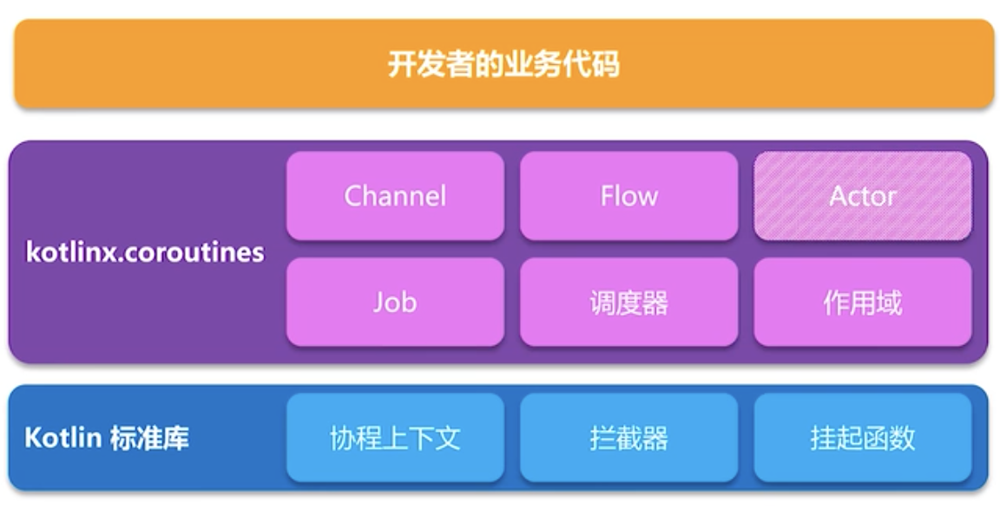

## 1. kotlin 协程的设计思想
Kotlin协程分为两层：
* 标准库的协程API
* Kotlinx中的协程上层框架



Kotlin协程标准库只提供基本的协程构建方式和 `suspend` 关键字，而更方便、更强大的功能在 kotlinx 中的上层协程库提供。也就是说即使不用官方的 kotlinx 中的上层协程库，只用标准库就足够完成协程所需的功能。并且 Kotlin 是一个以多平台为目标的语言，它的协程需要用于各种不同的平台，所以最终 Kotlin 的协程设计会比其他语言更复杂，层次更多。

官方 kotlinx 中的上层协程库中，关键是 core，它包括了我们常用的的协程各种功能，而其他例如 android、reactive 等部分属于针对各种场景的扩展。

## 2. 通过标准库分析协程
虽然一般使用Kotlin的协程是使用的kotlinx内的上层协程库，但是由于上层协程库功能较多、封装较深，不适合分析协程原理，而协程标准库更加简单，且具备核心功能，可以理解Kotlin协程的核心原理，所以在这里先通过协程标准库来分析原理。

### createCoroutine函数
首先，看一个标准库 Continuation.kt 文件中的函数：
```
public fun <T> (suspend () -> T).createCoroutine(
    completion: Continuation<T>
): Continuation<Unit> =
    SafeContinuation(createCoroutineUnintercepted(completion).intercepted(), COROUTINE_SUSPENDED)
```
这个函数就是面向开发者的一个创建协程的基本函数，它是一个 `suspend` 修饰的函数变量的扩展函数，下面来使用它：
```
suspend { "协程结果" }.createCoroutine(object : Continuation<String> {
    override val context = EmptyCoroutineContext //这里简单使用空上下文

    override fun resumeWith(result: Result<String>) {
        print("结果为：${result.getOrNull()}")
    }
}).resume(Unit)
```
用createCoroutine函数就可以创建一个协程，然后调用resume启动它，这样就会在传入的匿名Continuation子类的`resumeWith`函数中接收到协程的结果，这里我们在lambda中只写了一个字符串，所以返回值就是这个字符串。

分析包含调用挂起函数的编译源码，精简一下

用 `suspend` 修饰的 lambda 表达式来调用 `createCoroutine` 函数，传入一个 `Continuation` 变量，然后对返回的 `Continuation<Unit> ` 调用 `resume` 函数，就启动了这个协程，最终可以在传入的变量的 `resumeWith` 内打印出结果为 `suspend`函数变量的返回值，这里为“协程结果”。

`suspend lambda` 用于创建协程会被编译成 `SuspendLambda` 子类，而挂起函数会被编译成原增加一个 `continuation` 参数的函数，并且，如果用于启动协程，则会被包装于一个continuation中执行，如果在已有协程中被执行，则？？？。

kotlin上层框架的 CoroutineScope.launch内部实际也是对suspend lambda表达式调用`createCoroutine`或类似方法

这里我们先考虑 `suspend lambda` 的情况，它被编译为一个继承 `SuspendLambda` 的匿名内部类，而 `SuspendLambda` 就是 `Continuation` 的子类。`SuspendLambda` 有一个抽象函数 `invokeSuspend`（这个函数在它的父类 `BaseContinuationImpl` 中声明）。我们被编译生成的匿名内部类中的 `invokeSuspend` 的实现就是我们的 `suspend lambda` 表达式的内容，对于我们这里的情况，就是简单地返回字符串。

所以，我们最终可以了解到，`createCoroutine` 函数返回的 `Continuation<Unit> ` 实际就是将我们的 `suspend lambda` 内容包装多次的结果，因此调用它的 `resume` 就可以执行到我们写的协程代码。

`SafeContinuation` 是一个限制只能恢复一次的 `Continuation`，在 `createCoroutine` 中或者挂起函数调用 `suspendCoroutine` 中都会使用，因为这两个场景都只能恢复一次。而包装协程代码块的实际 `Continuation` 不是`SafeContinuation` ，因为协程本身是可以多次恢复的。不过，包装协程代码块的实际 `Continuation`会作为`SafeContinuation`内部的delagete，从而才能通过`SafeContinuation`去执行协程内的代码。

#### 其他启动协程的函数
`createCoroutine` 函数还有多一个 `receiver` 参数的版本：
```
public fun <R, T> (suspend R.() -> T).createCoroutine(
    receiver: R,
    completion: Continuation<T>
): Continuation<Unit> =
    SafeContinuation(createCoroutineUnintercepted(receiver, completion).intercepted(), COROUTINE_SUSPENDED)
```
这个版本可以在 `suspend lambda` 中访问到 `receiver` 对象，这里不再赘述。

还有 `startCoroutine` 函数，实际就是自动对 `createCoroutine` 函数调用 `resume` ,直接启动。

#### 挂起
`suspend lambda`的内容会被包装于 `BaseContinuationImpl`（是`Continuation`子类） 的 `invokeSuspend` 中，被触发 `resumeWith` 时，会调用 `invokeSuspend`，可以看到返回状态，会影响后续是否继续执行continuation还是真正挂起协程。如果没有挂起，就是 `invokeSuspend` 中直接返回了正常结果；如果挂起，返回的就是 `COROUTINE_SUSPENDED` （SafeContinuation的作用），`resumeWith` 将异步被调用，然后恢复协程执行。

而`invokeSuspend`的内容就是将原本的`suspend lambda`内调用的各个挂起函数，转换为状态机的形式

所谓的协程本身可以看作是`BaseContinuationImpl`，而`Job`（是`AbstractCoroutine`，也是`continuation`）就是createCoroutine或者startCoroutine函数传入的回调参数。`BaseContinuationImpl`的`resumeWith()`完成后，通知`Job`；而`BaseContinuationImpl`的`resumeWith()`内部就会调用各个挂起函数，每个挂起函数持有的continuation就是`BaseContinuationImpl`，所以每个挂起函数内resume又会调用`BaseContinuationImpl`的resumeWith，从而继续执行下一个挂起函数

suspendCoroutine函数是suspendCoroutineUninterceptedOrReturn函数的包装，用于在挂起函数中获取到当前挂起函数的continuation。实质上，delay、yield、withContext等官方自带的挂起函数，内部都是通过suspendCoroutineUninterceptedOrReturn来完成挂起和恢复流程，即拿到continuation在适当时机调用resume。

#### Continuation-Passing-Style
状态机结合Continuation的传递。根据多个挂起点，将当前协程体分为多个状态，例如协程内部只调用了一个挂起函数，那么状态0为开始到第一个挂起函数，状态1为第一个挂起函数之后的内容。将状态机包装在Continuation的子类BaseContinuationImpl的invokeSuspend中，从状态0开始执行，把状态改为1，执行到第一个挂起函数，把this也就是当前Continuation传入挂起函数，待挂起函数执行完毕，回调Continuation的resume，就回到当前Continuation执行状态1。
```
//原有代码
```

```
//反编译代码
```

## 3. 协程上层框架设计和常用函数
了解了作为基础设施的协程标准库后，已经可以明白Kotlin协程的核心原理和设计思想，但是标准库作为基础设施，API使用不够方便，功能也不够强大，所以还需要关注协程上层框架的设计。协程上层框架中，提供了协程作用域、Job、调度器、协程的父子关系（结构化并发）、取消和异常处理机制这些主要概念。

可以对照自己写的mini，不具体分析官方上层库，可以对照分析。

作用域的设计

协程就是一个挂起函数，其内部可以再调用挂起函数。由于协程或者说挂起函数最基本的启动，只需要传入一个Continuation，在Continuation中就可以得知该挂起函数的执行结果，AbstractCoroutine就是一个Continuation，并且通过可以得知执行结束的时机，设计了协程的状态，AbstractCoroutine也是一个Job，所以通过Job可以对应该协程，但它只是协程的handle，协程本身对应BaseContinuationImpl的子类。

拦截器

Continuation Passing Style  ==  Callback，将continuation传到内部，而不必返回。

CoroutineStart重写了invoke操作符，所以它本身可以调用，launch函数内部调用coroutine.start，也就会调用CoroutineStart.invoke

## withContext
拦截器（调度器）不同的话，withContext内会创建一个DispatchedCoroutine，作为Job（AbstractCoroutine）来接收协程结果，然后启动一个协程（ContinuationImpl）
```
val coroutine = DispatchedCoroutine(newContext, uCont)
```
DispatchedCoroutine包含了新的拦截器，并且持有原本的uCont。启动新协程会调用新拦截器的intercept切换线程，完成后再调用原本的uCont的拦截器将线程切换回去。这个新拦截器可能会调度多次，比如withContext传的block内的挂起函数又切了线程，那个挂起函数完毕需要调用这个调度器切回来。

## launchWhenStarted
public suspend fun <T> Lifecycle.whenStateAtLeast(
    minState: Lifecycle.State,
    block: suspend CoroutineScope.() -> T
): T = withContext(Dispatchers.Main.immediate) {
    val job = coroutineContext[Job] ?: error("when[State] methods should have a parent job")
    val dispatcher = PausingDispatcher()
    val controller =
        LifecycleController(this@whenStateAtLeast, minState, dispatcher.dispatchQueue, job)
    try {
        withContext(dispatcher, block)
    } finally {
        controller.finish() //保证即使取消，也要把已经放到队列里面的任务执行完毕。比如delay 2秒打印，1秒的时候就被取消了，那么在这里也要把它执行掉，whenStateAtLeast设计如此。
    }
}