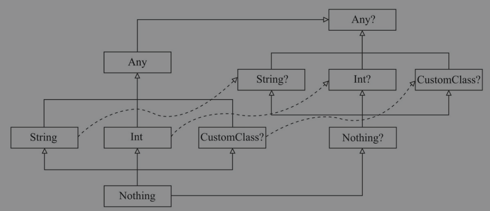

## 1. null的处理
#### 安全的调用
```
val a: String? = null
println(a?.length)
```
安全调用操作符 `?.` 表示如果a非空，就返回a.length，否则返回null

#### Elvis 操作符
```
val l = b?.length ?: -1
```
`?:` 称为Elvis 操作符，当`?:`左侧表达式非空，就返回左侧表达式，否则返回右侧表达式。当且仅当左侧为空时，才会对右侧表达式求值。

因为 throw 和 return 在 Kotlin 中都是表达式，所以它们也可以用在 elvis 操作符右侧。
```
fun foo(node: Node): String? {
    val parent = node.getParent() ?: return null
    val name = node.getName() ?: throw IllegalArgumentException("name expected")
    // ……
}
```

#### 非空断言 !!.
```
val l = b!!.length
```
非空断言运算符（!!）将任何值转换为非空类型，若该值为空则抛出异常。

#### 安全的类型转换
如果尝试转换不成功则返回 null：
```
val aInt: Int? = a as? Int
```

## 2. 类型检查
在Kotlin中，我们可以用 `is` 来判断一个类是否是另一个类的子类的一个实例。
```
if (obj is String) {
    println(obj.length)
}
if (obj !is String) {// 等同于 !(obj is String)
    println("Not a String")
} else {
    println(obj.length)
}
```
#### 类型智能转换
智能类型转换会在隐式完成类型转换,如上代码，判断了obj是字符串类型，就能直接使用它的length属性。

当且仅当Kotlin的编译器确定在类型检查后该变量不会再改变，才会产生类型智能转换。如果是var，则因为在其他线程可能被改变，所以不能编译通过。这种情况需要使用 `as` （包括空安全的 `as？`）强制转换后才能直使用其属性或方法。

## 3. 类型系统


#### 1. 平台类型
由于Kotlin可用于JVM、Web、Native等平台，所以Kotlin中的类型需要对应到对应平台的类型，比如调用Java中的方法，此时Kotlin不知道返回值类型的可空性，这种类型就称为平台类型。平台类型既可以当作可空类型，也可以当作非空类型。平台类型的引入是Kotlin兼容Java时的一种权衡设计。试想下，如果所有来自Java的值都被看成非空，那么就容易写出比较危险的代码。反之，如果Java中的值都强制当作可空，则会导致大量的null检查。综合考量，平台类型是一种折中的设计方案。

#### 2. Nothing
`Nothing` 是没有实例的类型，`Nothing` 类型的表达式不会产生任何值，`Nothing` 是任何类型的子类。`Nothing?` 只包含一个值：null

#### 3. 自动装箱和拆箱
Kotlin中并没有int、float、double、long这样的原始类型，取而代之的是它们对应的引用类型包装类Int、Float、Double、Long、Boolean、Char、String、Array。kotlin中不区分基本类型和包装类型。

* Kotlin中的Int类型等同于Java中的int
* Kotlin中Int？等同于Java中的Integer

## 3. 泛型
[Kotlin中的泛型](https://juejin.im/post/5d6c6636f265da03c8153a03)

首先看一下Java中的协变和逆变
```
class A { }

class B extends A { }

class C extends B { }

interface Source<T> {
    T nextT();

    void update(T t);
}

public class Test {
    void demo1(Source<B> s) {
        // 错误1：Source<A> src = s;
        Source<? extends A> source = s; // 这个没问题，因为 ? extends 可以协变
        // 错误2： source.update(new A()); 
        // 错误3： source.update(new B());
        // 错误4： source.update(new C());
        A a = source.nextT();
    }

    void demo2(Source<A> s) {
        Source<? super B> source = s; // 这个没问题，因为 ? super 可以逆变
        // 错误1： source.update(new A()); 
        source.update(new B());
        source.update(new C());
        // 错误2： A a = source.nextT();
        // 错误3： B b = source.nextT();
        // 错误4： C c = source.nextT();
    }
}
```
* demo1中，错误1是因为Java泛型中尽管B是A的子类，但是`Source<B>`并不是`Source<A>`的子类。而使用`Source<? extends A>`就是泛型的协变，可以认为`Source<B>`是`Source<? extends A>`的子类。
* demo1中，错误2、3、4都是因为协变时只能作为生产者，也就是只能从中获取数据，而错误2、3、4都是在传入数据。
* demo2中，`Source<? super B>`为逆变，使`Source<A>`成为了`Source<? super B>`的子类。
* demo2中，错误1，虽然`Source<? super B>`是`Source<A>`的父类，但内部存储的泛型类型父子关系限制并没有改变，还是只能传B和B的子类的实例，而不能传B的父类（这里的super容易产生误会）。
* demo2中，错误2、3、4都是因为逆变时只能作为消费者，也就是只能传入数据，这和协变相反。

Kotlin中的泛型的协变和逆变，不再使用Java中的通配符，而使用 `in` 和 `out`。所以同样的情况，Kotlin的方式如下：
```
class Test {
    fun demo1(s: Source<B>) {
        val source: Source<out A> = s
        val a: A = source.nextT()
    }

    fun demo2(s: Source<A>) {
        val source: Source<in B> = s
        source.update(B())
        source.update(C())
    }
}
```
kotlin中使用 `out` 实现了协变，使用 `in` 实现了逆变，这里属于使用时型变。

Kotlin的优势在于Java只有使用时型变，而kotlin既有使用时型变，又有声明时型变：
```
interface Source<out T> {
    fun nextT(): T

    // 声明了协变的情况下，不能声明消费型的函数
    // fun update(t: T) //error
}

fun demo(s: Source<B>) {
    val source: Source<A> = s // 这个没问题，因为声明时指定 T 是一个 out-参数
}
```

使用in的情况类似：
```
interface Source<in T> {
    // 声明了逆变的情况下，不能声明生产型的函数
    // fun nextT(): T //error

    fun update(t: T)
}

fun demo(s: Source<A>) {
    val source: Source<B> = s // 这个没问题，因为 T 是一个 in-参数
    // ……
}
```

**为什么使用了协变或者逆变，就只有生产和消费的其中一种功能呢？**，例如使用协变，`Source<out A>`可以实际是`Source<B>`类型，也可以是`Source<C>`类型，并不能确定，所以即使向其中输入A的子类，也是可能异常的。如果使用逆变，`Source<in B>`可能实际是`Source<A>`类型，可以是`Source<Any>`类型，必然是B的父类，所以向其中传入B和B的子类是没有问题的，但读取时就不确定是什么类型了，所以无法读取。

总体来说，泛型为了安全，所以让`List<Parent>`并不是`List<Sub>`的父类，但在一些场景中，我们需要更灵活得赋值和传参，此时使用协变和逆变来限制会产生异常的行为，从而提升类型转换的灵活性，当然也牺牲了`生产`或者`消费`的其中一个功能。

* Java的泛型中使用 ? super 有点容易误会它的效果，这样看来是不如kotlin的 `in` 明确
* Kotlin可以声明时和使用时型变
* Java和Kotlin声明时都可以指定上界。限制上界，和型变是两回事

#### 使用处型变 类型投影
前面的型变例子是在声明时限制，也就是说在声明时就确定了泛型只能作为生产者或者消费者。但是有些情况在声明时不能确定，比如数组类型。这种情况可以在使用时限制。
```
fun copy(from: Array<out Any>, to: Array<Any>) { …… }
```
```
fun fill(dest: Array<in String>, value: String) { …… }
```

#### 使用处型变 星投影
Java中可以使用泛型的原始类型，这种情况不会检查类型安全。Kotlin中不能使用泛型的原始类型，而是类似Java的 `<?>` ，使用 `<*>`

* 对于 `Foo <out T : TUpper>`，其中 T 是一个具有上界 TUpper 的协变类型参数，`Foo <*>` 等价于 `Foo <out TUpper>`。 这意味着当 T 未知时，你可以安全地从 `Foo <*>` 读取 TUpper 的值。
* 对于 `Foo <in T>`，其中 T 是一个逆变类型参数，Foo <*> 等价于 `Foo <in Nothing>`。 这意味着当 T 未知时，没有什么可以以安全的方式写入 `Foo <*>`。
* 对于 `Foo <T : TUpper>`，其中 T 是一个具有上界 TUpper 的不型变类型参数，`Foo<*>` 对于读取值时等价于 `Foo<out TUpper>` 而对于写值时等价于 `Foo<in Nothing>`。

多个参数时，可以单独投影

* `Function<*, String>` 表示 `Function<in Nothing, String>`
* `Function<Int, *>` 表示 `Function<Int, out Any?>`
* `Function<*, *>` 表示 `Function<in Nothing, out Any?>`

#### where
泛型限定类型上界时，可以限定同时满足多个类型。

Java中的写法如下：
```
class C<T extends A & B>
```

Kotlin的写法如下：
```
class C<T> where T : A, T : B
```
需要同时是A和B的子类。