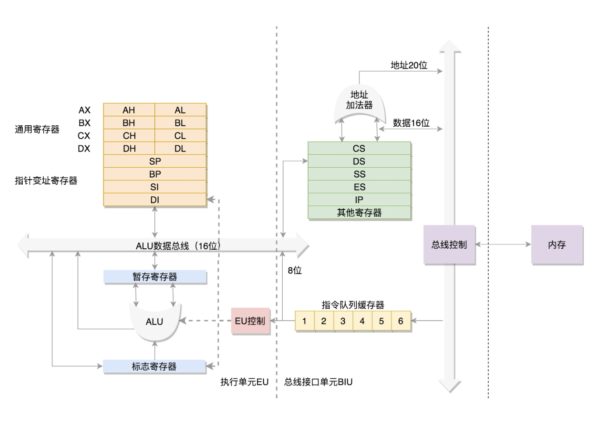
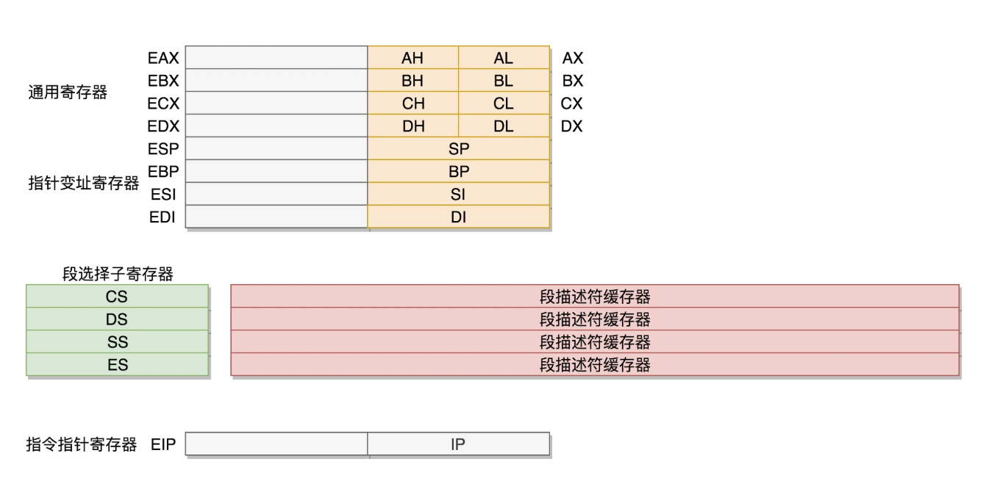

# CPU
需要注意这里描述的都是x86架构的处理器，如果是ARM架构则不一样。

## 8086 CPU
8086是由英特尔公司在1978年发布的该公司第一款16位微处理器，奠定了 x86 架构的基础，后续的32位、64位处理器均和8086处理器有很大的关联。



8086采用20位地址总线，物理寻址空间为2^20=1MB

### 寄存器
8086中有十多个16位寄存器，下面来了解它们的作用。

> 在 8086 CPU 中，只有 4 个寄存器可以以 […] 的方式使用，这四个寄存器分别是 BX，SI，DI，BP，因为它们都可以用于寻址。

#### 数据寄存器
由于在 8086 之前的 CPU 为 8 位 CPU，为了兼容以前的 8 位程序，在 8086 CPU 中，每一个数据寄存器都可以当做两个单独的 8 位寄存器来使用。

* AX：可以当作普通寄存器使用，而它也叫做累加寄存器的原因是可以用于 DIV 和 MUL 指令。

    例如 MUL 指令的使用：两个相乘的数，如果是8位，一个默认放在AL中，另一个放在8位寄存器或内存字节单元中；如果是16位，一个默认在AX中，另一个放在16位寄存器或内存字单元中。如果是8位乘法，结果放在AX中；如果是16位乘法，结果高位在DX中存放，低位在AX中存放。

* BX：可以当作普通寄存器使用，也可以用于其专属功能——物理内存地址寻址上，8086中的地址表示是 段地址:[偏移]，段地址可省略，省略时取默认情况。
    ```
    // 用作普通寄存器
    MOV BX, 1234h  ; 将16进制数1234h存储到BX寄存器中
    ADD BX, 5678h  ; 将BX寄存器中的值加上16进制数5678h

    // 用作寻址寄存器
    MOV AX, [BX]   ; 从 DS:BX 指向的内存地址读取数据到 AX 寄存器
    MOV [BX], AX   ; 将 AX 寄存器的值写入到 DS:BX 指向的内存地址
    ```

* CX：可以当作普通寄存器使用，也可以用于Loop指令
    ```
    MOV CX, 5   ; 设置循环次数为5
    START_LOOP:
        ; 循环体代码，这里可以放置需要重复执行的指令
        LOOP START_LOOP ; CX减1，并检查是否为0，如果不为0则跳转到START_LOOP
    ```

* DX：可以当作普通寄存器使用，也可以在使用 DIV 和 MUL 指令时使用

#### 指针寄存器：
BP（Base Pointer）寄存器和 SP（Stack Pointer）寄存器是两个重要的寄存器，主要用于栈操作和函数调用。它们在内存管理和数据访问中起着关键作用。

> 栈增长方向：在8086架构中，栈是向下增长的，即栈顶地址随着数据的压入而减小。

* SP（Stack Pointer）堆栈指针寄存器
SP 寄存器用于指向栈顶的地址。栈是一种后进先出（LIFO）的数据结构，主要用于函数调用、参数传递和保存寄存器状态。SP 寄存器默认与 SS（Stack Segment）段寄存器结合使用。也就是说，SS:SP 指向栈顶的地址。
```
PUSH AX         ; 将 AX 寄存器的值压入栈中，SP 减少 2
POP AX          ; 从栈中弹出值到 AX 寄存器，SP 增加 2

CALL my_function ; 调用函数，返回地址压入栈中
RET              ; 从栈中弹出返回地址并跳转
```

* BP（Base Pointer）基址指针寄存器：
BP 寄存器通常用于基址寻址，特别是在访问栈中的数据时。它在函数调用过程中用于访问函数的参数和局部变量。BP 寄存器默认与 SS（Stack Segment）段寄存器结合使用。也就是说，SS:BP 指向栈中的某个位置。
```
PUSH BP         ; 保存调用者的 BP 寄存器值
MOV BP, SP      ; 设置 BP 指向当前栈帧的顶部
SUB SP, 2       ; 为局部变量分配空间

MOV AX, [BP+4]  ; 访问参数1
MOV BX, [BP+6]  ; 访问参数2
MOV [BP-2], AX  ; 访问局部变量

MOV SP, BP      ; 恢复栈指针
POP BP          ; 恢复调用者的 BP 寄存器值
RET             ; 返回调用者
```

> `SUB SP, 2`：SP 寄存器的值减小2，这意味着栈顶向下移动了2个字节，从而为局部变量分配了2个字节的空间。

#### 变址寄存器：
SI（Source Index）寄存器和 DI（Destination Index）寄存器主要用于字符串操作和基址加变址寻址。

* SI（Source Pointer）源变址寄存器
通常用于指向源数据，特别是在字符串操作指令中。它可以与 DS（Data Segment）段寄存器结合使用，指向数据段中的某个位置。

主要用途：

字符串操作：在字符串操作指令（如 MOVS、LODS、SCAS 等）中，SI 寄存器用于指向源字符串的起始地址，SI寄存器会自动递增或递减，以指向下一个字符或字节。

基址加变址寻址：SI 寄存器可以与基址寄存器（如 BX）结合使用，形成基址加变址寻址模式。

```
; 字符串操作示例
MOV SI, OFFSET source_string  ; 将源字符串的偏移地址加载到 SI 寄存器
MOV DI, OFFSET dest_string    ; 将目标字符串的偏移地址加载到 DI 寄存器
MOV CX, length                ; 设置字符串长度

CLD                          ; 清除方向标志位，确保字符串操作从低地址到高地址
REP MOVSB                    ; 将 CX 个字节从 DS:SI 复制到 ES:DI


; 基址加变址寻址示例
MOV BX, OFFSET data_segment  ; 将数据段的偏移地址加载到 BX 寄存器
MOV SI, 10h                  ; 将变址加载到 SI 寄存器
MOV AX, [BX + SI]            ; 从 DS:BX + SI 指向的内存地址读取数据到 AX 寄存器
MOV [BX + SI], AX            ; 将 AX 寄存器的值写入到 DS:BX + SI 指向的内存地址
```

* DI（Destination Index）目的变址寄存器
通常用于指向目标数据，特别是在字符串操作指令中。它可以与 ES（Extra Segment）段寄存器结合使用，指向附加段中的某个位置。

主要用途：

字符串操作：在字符串操作指令（如 MOVS、STOS、LODS 等）中，DI 寄存器用于指向目标字符串的起始地址，DI寄存器会自动递增或递减，以指向下一个字符或字节。

基址加变址寻址：DI 寄存器可以与基址寄存器（如 BX）结合使用，形成基址加变址寻址模式。

```
; 基址加变址寻址示例
MOV BX, OFFSET data_segment  ; 将数据段的偏移地址加载到 BX 寄存器
MOV DI, 10h                  ; 将变址加载到 DI 寄存器
MOV AX, [BX + DI]            ; 从 DS:BX + DI 指向的内存地址读取数据到 AX 寄存器
MOV [BX + DI], AX            ; 将 AX 寄存器的值写入到 DS:BX + DI 指向的内存地址
```

#### 控制寄存器：
IP（Instruction Pointer）指令指针寄存器

IP 寄存器始终指向程序中即将执行的下一条指令的偏移地址，每当处理器从内存中取指并执行后，IP 会自动更新为下一条指令的地址，IP 寄存器不能像其他通用寄存器那样直接通过指令进行读写操作。它的值只能通过特定的控制流指令（如 JMP, CALL, RET, LOOP 等）间接修改。

IP 只存储偏移地址，而完整的内存地址由 CS:IP 组合而成。CS 提供段基址，IP 提供段内的偏移量。因此，实际的指令地址是通过将 CS 的值左移4位并与 IP 相加得到的。

```
; IP自动更新
MOV AX, BX       ; IP自动指向下一条指令

; 跳转指令修改IP
JMP LABEL       ; 直接修改IP值
CALL PROC       ; 保存IP并跳转
RET             ; 恢复保存的IP值
```

#### 段寄存器：
* CS（Code Segment）代码段寄存器
作用：CS寄存器用于存放当前正在执行的代码段的段基址。代码段是存放程序指令的内存区域。
寻址方式：在实模式下，CPU通过将CS寄存器的值左移4位（相当于乘以16），再加上指令指针寄存器（IP）的值，来形成物理地址，从而找到要执行的下一条指令。

在执行跳转、调用和中断等控制转移指令时，CS 寄存器的值可能会改变，以指向新的代码段。


* DS（Data Segment）数据段寄存器
作用：DS寄存器用于存放当前程序使用的数据段的段基址。数据段是存放程序中变量和数据的内存区域。
寻址方式：在访问数据段中的数据时，CPU会将DS寄存器的值左移4位，再加上偏移地址，来形成物理地址，从而找到要访问的数据。在大多数数据访问指令中，DS 是默认的段寄存器
```
MOV AX, DS      ; 将数据段寄存器的值加载到 AX 寄存器
MOV BX, OFFSET my_data ; 将数据段中数据的偏移地址加载到 BX 寄存器
MOV AX, [BX]    ; 从 DS:BX 指向的内存地址读取数据到 AX 寄存器
```

* SS（Stack Segment）堆栈段寄存器
用于存储栈段的基地址。栈段包含程序的栈，堆栈段是一种特殊的数据结构，用于存储函数调用时的返回地址、局部变量和参数等。

栈操作：SS 寄存器与 SP（Stack Pointer）寄存器结合使用，形成栈的物理地址。

函数调用和返回：在函数调用和返回过程中，SS 寄存器用于管理栈帧。

```
; SS使用示例
MOV AX, STACK_SEG
MOV SS, AX          ; 设置栈段
PUSH BX             ; 自动使用SS:SP
POP CX              ; 栈操作使用SS段
```

* ES（Extra Segment）附加段寄存器
指向额外的数据段，主要用于串操作指令（如 MOVS, STOS, CMPS, SCAS），作为目标地址段。

#### 标志寄存器（FLAG）
FLAG 寄存器用于存储溢出、进位、中断等标志信息。


## x86-32位CPU
在 32 位处理器中，有 32 根地址总线，可以访问 2^32=4G 的内存。



32 位处理器将 8 个 16 位的寄存器扩展到 8 个 32 位，为了兼容8086，保留了 16 位的和 8 位的使用方式。

改动较大的是：CS、SS、DS、ES 仍为 16 位，但不再是段的起始地址，段的起始地址放在内存的某个地方。这个地方是一个表格，表格中的每一项都是段描述符（Segment Descriptor），包含段的起始地址、段的大小等信息。而段寄存器里面保存的是在这个表格中的哪一项，称为选择子（Selector）。

因而到了 32 位的系统架构下，我们将8086从段寄存器直接拿到段起始地址的模式称为**实模式（Real Pattern）**，将 32 位处理器先通过段寄存器找到表格中的一项，再从表格中的该项中得到段起始地址的模式称为**保护模式（Protected Pattern）**。

计算机刚启动的时候，CPU 处于实模式，此时可以兼容原来的模式，当需要更多内存的时候，就可以通过一系列的操作，切换到保护模式，就能够用到 32 位 CPU 更强大的能力了。

> 计算机启动时，从实模式（Real Mode）到保护模式（Protected Mode）的转换过程通常由操作系统的引导加载程序（Bootloader）或操作系统内核负责执行。


## x86-64位CPU
x86_64 把 32 位处理器中的EAX、EBX、ECX、EDX、ESI、EDI、EBP、ESP 寄存器进一步扩展成了64位的：RAX、RBX、RCX、RDX、RSI、RDI、RBP、RSP，在64位模式下，这些寄存器的低32位部分仍然可以通过原有的32位寄存器名称访问。例如，RAX的低32位部分可以通过EAX访问。

并新增了8个64位通用寄存器（R8-R15）。之前的寄存器没有采用 R0 到 R7 的方式，主要是由于历史原因和命名惯例的不同，新增的寄存器使用了 R8 到 R15 的命名方式，这是为了避免与现有的寄存器名称冲突，同时保持命名的一致性和简洁性。

64位指针寄存器：RIP（指令指针）、RSP（栈指针）、RBP（基址指针）

在64位模式下，段寄存器的作用有所减少。虽然段寄存器（如CS、DS、ES、FS、GS、SS）仍然存在，但它们的使用方式与32位模式有所不同。64位模式下，段寄存器主要用于TLS（线程局部存储）和某些特定的系统用途，而不再用于常规的内存寻址。